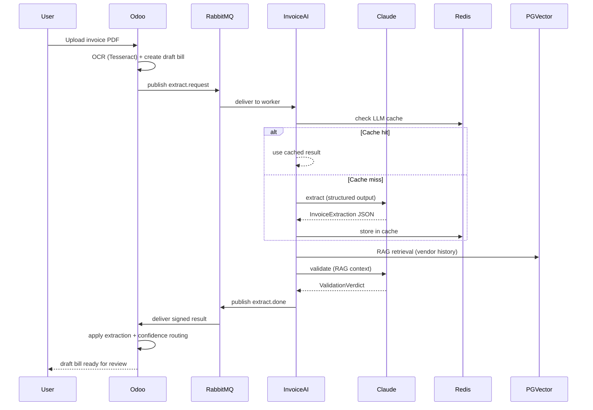

# Invoice Agent — AI-Powered Vendor Invoice Extraction

> **OCR → Claude structured extraction → RAG validation → draft `account.move`**

An Odoo 19 addon that automates vendor invoice data entry. Upload a scanned PDF and the pipeline extracts structured fields (vendor, dates, line items, amounts) using Tesseract OCR + Claude AI, validates the result against the vendor's posting history via pgvector RAG, and produces a draft bill routed by confidence score — no manual typing required.


## Architecture



### Key Design Decisions

| Decision | Rationale |
|----------|-----------|
| **Separate FastAPI service** (ADR-003) | LLM round-trips (5-20s) would pin Odoo HTTP workers — measured 33.5× degradation with workers=2 |
| **RabbitMQ + transactional outbox** (ADR-004) | Guarantees no lost jobs even if the broker restarts mid-request |
| **Claude structured output** | Schema-validated extraction eliminates JSON parsing errors |
| **RAG validation** (Phase 2) | Second Claude call with vendor history catches misclassifications before the accountant sees them |
| **Confidence-based routing** | Auto-fill (≥90%), review (≥70%), or human (<70%) — three-tier kanban |

## Quickstart

```bash
# 1. Clone and configure
git clone https://github.com/7ananSaif/odoo.git
cd odoo
cp .env.example .env   # fill in ANTHROPIC_API_KEY, JWT_SECRET

# 2. Start the stack
docker compose up -d

# 3. Open Odoo (default: admin/admin)
# http://localhost:8069 → Invoicing → Vendors → Bills → Upload

# 4. Upload a scanned invoice PDF
# Watch the extraction status: pending → processing → extracted
# Review the AI-suggested fields in the suggestion panel
```

### Services

| Service | Port | Purpose |
|---------|------|---------|
| Odoo | 8069 (loopback) | ERP + UI + outbox drain |
| invoice-ai | 8100 | FastAPI: OCR → Claude → RAG |
| worker | — | AMQP consumer (Claude calls) |
| RabbitMQ | 15672 (loopback) | Job queue + management UI |
| PostgreSQL | 5434 (loopback) | Database + pgvector |
| Redis | 6379 (loopback) | LLM cache + sessions |
| nginx | 80/443 | Reverse proxy + TLS |

## Configuration

| Variable | Default | Purpose |
|----------|---------|---------|
| `ANTHROPIC_API_KEY` | (required) | Claude API key |
| `INVOICE_AI_JWT_SECRET` | (required) | Shared JWT secret between Odoo ↔ invoice-ai |
| `REDIS_URL` | `redis://localhost:6379/0` | LLM extraction cache (7-day TTL) |
| `RABBITMQ_HOST` | `rabbitmq` | Job queue broker |
| `POSTGRES_DB` | `postgres` | Database name |
| `POSTGRES_PASSWORD` | `odoo` | Database password |
| `URL` | — | Public base URL for `web.base.url` |

## Load Testing

```bash
# Generate test invoice PDFs
pip install reportlab
python scripts/generate_test_invoices.py --count 10

# Smoke test (5 users, 2 min)
cd invoice-ai
LOCUST_JWT_SECRET=your-secret locust --headless -u 5 -r 1 --run-time 2m

# Full ramp (100 users, 30 min)
LOCUST_JWT_SECRET=your-secret locust --headless -u 100 -r 2 --run-time 30m \
    --csv=results/ramp --html=results/ramp-report.html
```

See [docs/load-test.md](docs/load-test.md) for the capacity report and cost model.

## Cost per Invoice

| Component | Cost per 1,000 invoices |
|-----------|------------------------|
| Claude API (Opus 4, cached) | $71 |
| Claude API (with RAG validation) | $109 |
| Infrastructure (prorated) | $19 |
| **Total (extraction only)** | **$90** |
| **Total (with RAG)** | **$128** |

## Project Structure

```
├── custom_addons/
│   ├── invoice_agent/       # Main Odoo addon (account.move AI fields, outbox, UI)
│   ├── s3_storage/          # S3 filestore override
│   └── session_redis/       # Redis session store
├── invoice-ai/
│   ├── app/
│   │   ├── main.py          # FastAPI service (/v1/extract, /v1/embed, /rag/vendor-context)
│   │   ├── consumer.py      # AMQP worker (Claude calls + RAG validation)
│   │   ├── claude.py        # AsyncAnthropic client with prompt caching
│   │   ├── schemas.py       # InvoiceExtraction Pydantic schema
│   │   ├── validate.py      # RAG validation (account routing + duplicate detection)
│   │   ├── retrieve.py      # Hybrid vector + ref + VAT retrieval (pgvector)
│   │   ├── embeddings.py    # Voyage-3 embedding client
│   │   └── metrics.py       # Prometheus metrics (RED method)
│   ├── locustfile.py        # Load test (Locust)
│   └── pyproject.toml       # Dependencies + tooling
├── infra/
│   ├── terraform/           # IaC: VPC, RDS, S3, Redis, security groups
│   └── observability/       # Prometheus + Grafana + Alertmanager
├── docs/
│   ├── architecture.md      # Full architecture with network topology
│   ├── load-test.md         # Capacity report
│   └── runbooks/            # Operational runbooks
└── docker-compose.yml       # Local development stack
```

## API Endpoints

| Method | Path | Auth | Rate Limit | Purpose |
|--------|------|------|------------|---------|
| `POST` | `/v1/extract` | JWT | 10/min | Extract invoice data from PDF/image |
| `POST` | `/v1/embed` | JWT | 30/min | Embed documents with Voyage-3 |
| `POST` | `/rag/vendor-context` | JWT | 20/min | Retrieve vendor history for RAG |
| `GET` | `/healthz` | None | — | Liveness probe (returns build SHA) |
| `GET` | `/metrics` | None | — | Prometheus metrics |

## Monitoring

The Grafana SLO dashboard (`infra/observability/grafana/dashboards/agent-slo.json`) shows:

- **Pipeline RED**: request rate, error rate, p95 duration
- **Worker & Queue**: job throughput, queue depth, retry rate
- **Infrastructure USE**: CPU, memory, disk, PostgreSQL connections
- **Cost tracking**: daily token consumption, estimated API spend

Key alerts: `PipelineErrorRateHigh`, `PipelineLatencyHigh`, `RDSConnectionsNearCap`, `WorkerQueueBacklog`

## Honest Limitations

- **Requires Anthropic API key** — costs ~$0.07-0.11 per invoice depending on RAG
- **Tesseract OCR accuracy** depends on scan quality — low-DPI or skewed scans degrade extraction
- **RAG needs ≥5 historical bills** per vendor before validation adds value
- **Single-tenant** — no multi-company isolation yet
- **Claude rate limits** — the RPM cap (100 on Build tier) bounds throughput at ~100 invoices/minute with full caching
- **No real-time streaming** — the extraction result arrives via RabbitMQ polling, not WebSocket

## License

[LGPL-3](LICENSE) — compatible with Odoo Community addons.

## Contributing

See [CONTRIBUTING.md](CONTRIBUTING.md) for PR workflow, code style, and testing requirements.
