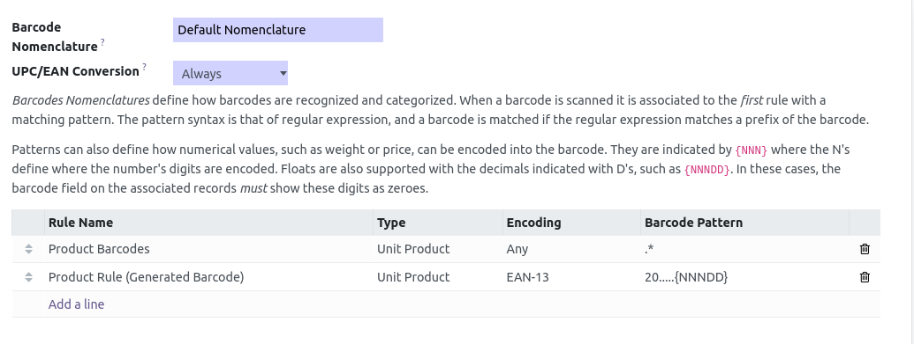
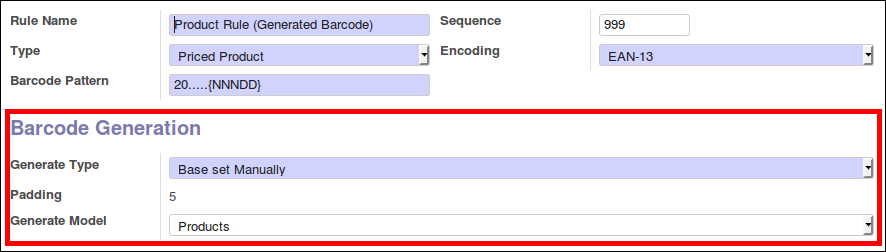
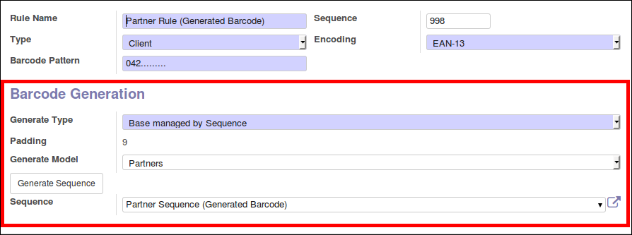

To configure this module, you need to:

* Go to Settings / Technical / Sequences & Identifiers / Barcode Nomenclatures
* Select a Nomenclature
* Create or select a rule

* For manual generation, set:
    * 'Base set Manually' in 'Generate Type'
    * Set the model

* For automatic generation, set:
    * 'Base managed by Sequence' in 'Generate Type'
    * Set the model
    * Generate a new sequence by button, or affect a existing one

In all cases, padding will be computed automaticaly, based on the number
of '.' in the Barcode Pattern field.
