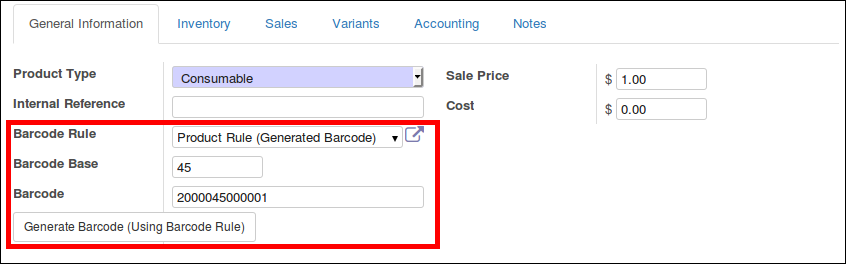

To use this module, you need to:

* Go to a Product form (or a template form):

1 for manual generation
    * Set a Barcode Rule
    * Set a Barcode Base
    * click on the button 'Generate Barcode (Using Barcode Rule)'

2 for automatic generation
    * Set a Barcode Rule
    * click on the button 'Generate Base (Using Sequence)'
    * click on the button 'Generate Barcode (Using Barcode Rule)'
