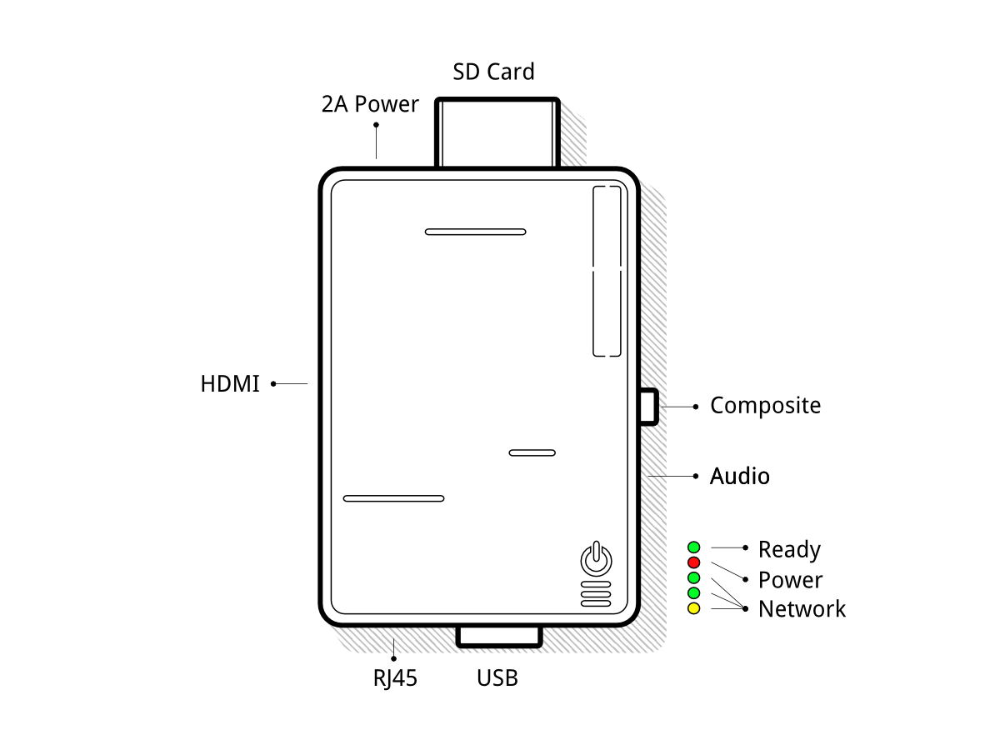

====================
PosBox Documentation
====================

Posbox Setup Guide
==================

Prerequisites
-------------

Before you start setting up your PosPox make sure you have everything.
You will need :

-  The PosBox
-  A 2A Power adapter
-  A computer or tablet with an up to date Firefox, Chrome or Safari web
   browser (we recommend Chrome)
-  A running SaaS or V8.0 OpenERP Instance with the Point of Sale
   Installed.
-  A local network set up with DHCP ( this is the default setting )
-  A RJ45 Ethrnet Cable
-  An Epson USB TM-T20 Printer or another compatible printer.
-  A Honeywell Eclipse USB Barcode Scanner or another compatible scanner.
-  An Epson compatible cash drawer.

Step By Step Setup Guide
------------------------

Power the PosBox
~~~~~~~~~~~~~~~~

Plug the PosBox to the 2A Power Adapter, a bright red status led should
light up.

Connect it to the Local Network
~~~~~~~~~~~~~~~~~~~~~~~~~~~~~~~

Connect the PosBox to the Local Network with the RJ45 Cable. Make sure
You connect the PosBox to the same Network as your POS device. Once
connected a bright yellow status led should light up, and a green status
led should flash.

Connect the USB Printer
~~~~~~~~~~~~~~~~~~~~~~~

Put a paper roll in the printer, power it up, then connect it to one of
the PosBox's USB port

Connect the cash drawer
~~~~~~~~~~~~~~~~~~~~~~~

The cash drawer should be connected to the printer with the RJ25 cable

Connect the USB Barcode Scanner
~~~~~~~~~~~~~~~~~~~~~~~~~~~~~~~

Connect the usb barcode scanner to one of the PosBox's USB port. The
Barcode Scanner should immediately light up and emit a loud beep.

Configure the USB Barcode Scanner
~~~~~~~~~~~~~~~~~~~~~~~~~~~~~~~~~

The barcode scanner should be configured in QWERTY and emit a new line /
return symbol after each scan. This is most likely the default
configuration of your barcode scanner.

Make sure the PosBox is ready
~~~~~~~~~~~~~~~~~~~~~~~~~~~~~

Once powered, The PosBox needs less than a minute to boot. Once the
PosBox is ready, it should print a status receipt with its IP Adress.
Also, the last status led, just after the red power status led, should
be permanently lit green.

Setup the Point of Sale
~~~~~~~~~~~~~~~~~~~~~~~~

Make sure to activate the 'Print via Proxy', 'Remote Scanning' or
'Cashdrawer' options in the Point of Sale configuration. If you are
using firefox, you must manually specify the PosBox's IP address which
was printed on the status receipt.

If you are running multiple Point of Sales on the same PosBox, make sure
that only one of them has Remote Scanning activated.

If you manually specify the PosBox's IP address, you must configure your
network to make sure the PosBox's IP address doesn't change. Please
refer to your Router documentation.

Launch the Point of Sale.
~~~~~~~~~~~~~~~~~~~~~~~~~

If you didn't spcecify the PosBox's IP address in the config, the POS
will need some time to perform a network scan to find the PosBox. This
is only done once.

The Point of Sale is now connected to the PosBox and your Hardware
should be ready to use.

Multi-Pos Configuration
-----------------------
The advised way to setup a multi Point-of-Sale shop is to have one PosBox
per Point-of-Sale. In this case it is mandatory to manually specify the
IP address of each PosBox in each Point of Sale. You must also configure
your network to make sure the PosBox's IP address doesn't change. Please
refer to your Router documentation.

PosBoxless Setup Guide
======================

If you are running your Point of Sale on a debian-based linux
distribution, you do not need the PosBox as you can run its software
locally. However the installation process is not foolproof. You'll need
at least to know how to install and run openerp. You may also run into
issues specific to your distribution or to your particular setup and
hardware configuration.

Prerequisites
-------------

-  A debian based linux distribution (Debian, Ubuntu, Mint, etc.)
-  A running OpenERP server (version trunk or saas-3 or 8.0 or later) 
-  You must uninstall any esc-pos printer driver as it will conflict
   with OpenERP's built-in driver.

Step By Step Setup Guide
------------------------

Extra dependencies
~~~~~~~~~~~~~~~~~~

Because Odoo is running on Python 2, you need to check which version of pip you need to use.

    $ sudo pip --version
    
If it returns something like :
   pip 1.5.6 from /usr/local/lib/python3.3/dist-packages/pip-1.5.6-py3.3.egg (python 3.3)
You need to try pip2 instead

If it returns something like :
   pip 1.4.1 from /usr/lib/python2.7/dist-packages (python 2.7)
You can use pip

The driver modules requires the installation of new python modules::

    $ sudo pip install pyserial
    $ sudo pip install --pre pyusb
    $ sudo pip install qrcode
    
Database Setup
~~~~~~~~~~~~~~

You must create a database called ``posbox`` with the modules
``hw_proxy``, ``hw_escpos``, and ``hw_scanner`` installed.

Access Rights
~~~~~~~~~~~~~

The drivers need raw access to the printer and barcode scanner devices.
Doing so requires a bit system administration. First we are going to
create a group that has haccess to usb devices::

    $ sudo groupadd usbusers

Then we add the user who will run the OpenERP server to ``usbusers``::

    $ sudo useradd -G usbusers USERNAME

Then we need to create a udev rule that will automatically allow members
of ``usbusers`` to access raw usb devices. To do so create a file called
``99-usbusers.rule`` in the ``/etc/udev/rules.d/`` directory with the
following content::

    SUBSYSTEM=="usb", GROUP="usbusers", MODE="0660"
    SUBSYSTEMS=="usb", GROUP="usbusers", MODE="0660"

Then you need to reboot your machine.

Start the local OpenERP Installl
~~~~~~~~~~~~~~~~~~~~~~~~~~~~~~~~

We must launch the OpenERP server on the port ``8069`` with the correct
database settings::

    $ ./server/openerp-server --addons-path=addons,web/addons --db-filter='^posbox$' \
            --xmlrpc-port=8069 -d posbox

Check that everything works
~~~~~~~~~~~~~~~~~~~~~~~~~~~

Plug all your hardware to your machine's USB ports, and go to
``http://localhost:8069/hw_proxy/status`` refresh the page a few times and
see if all your devices are indicated as *Connected*. Possible source of
errors are: The paths on the distribution differ from the paths expected
by the drivers, another process has grabbed exclusive access to the
devices, the udev rules do not apply or a superceeded by others.

Automatically Start OpenERP
~~~~~~~~~~~~~~~~~~~~~~~~~~~

You must now make sure that this OpenERP install is automatically
started after boot. There are various ways to do so, and how to do it
depends on your particular setup. We use *systemd* on the PosBox, but
*upstart* or *sysvinit* are other options.

Setup the Point of Sale
~~~~~~~~~~~~~~~~~~~~~~~~

The IP Adress field in the POS Config must be either ``127.0.0.1`` 
or ``localhost``. You can also leave it empty.

PosBox Technical Documentation
==============================

Technical Overview
------------------

The PosBox Hardware
~~~~~~~~~~~~~~~~~~~

The PosBox's Hardware is based on a model B Raspberry Pi, a popular
open-source micro-computer. The Raspberry Pi is powered with a 2A
micro-usb power adapter. 2A is needed to give enough power to the
barcode scanners. And we recommend Samsung power adapters for their
availability and reliability ( but beware of counterfeits ). The
Raspberry is protected by a ModMyPi Raspberry Pi Case. The Software is
installed on a 8Gb Class 10 or Higher SD Card. The SD Card's class is
important to ensure good performances. All this hardware is easily
available worldwide from independant vendors.

Compatible Peripherals
~~~~~~~~~~~~~~~~~~~~~~

-  Printers:

   -  Epson TM-T20
   -  Support for Other Esc-Pos compatible printers can be easily added
      on a case-by-case basis, please see the *Unsupported Printers*
      chapter of this manual.

-  Barcode Scannners:

   -  Metapace S61
   -  Honeywell Eclipse or Voyager 95x0 Series.
   -  Most other barcode scanners should work out of the box. Some
      barcode scanners need more power than the PosBox can provide and
      must be plugged in a self-powered USB HUB. This is the case for
      Datalogic Barcode Scanners.

-  Cash Drawers:

   -  As the cash drawers are connected to the printer, All Epson
      compatible cash drawers should work out of the Box.

The PosBox Software
~~~~~~~~~~~~~~~~~~~

The PosBox runs a Raspbian Linux distribution, a Debian derivative
optimized for the Raspberry Pi. It also runs a barebones install of
OpenERP which provides the webserver and the drivers. The printer &
scanner drivers are implemented as openerp modules. Those modules are
named ``hw_proxy``, ``hw_escpos``, ``hw_scanner`` and are the only
modules installed and running. OpenERP is only used for the framework it
provides. No business data is processed or stored on the PosBox. The
OpenERP install is a full bazaar clone of the ``trunk`` branch, and can
thus be updated trough the usual means.

We use systemd to manage the Openerp server. Systemd makes sure OpenERP
starts up at boot and is always up and running. Its systemd unit file is
called ``openerp.service``, and can be found in
``/etc/systemd/system/openerp.service``. The systemd version used is
quite old and thus ``journalctl`` is not available. All logs can be
found in instead ``/var/logs/syslog``

We removed all graphical software from the default install to reduce to
image size but nothing prevents you from reinstalling them.

Accessing the PosBox
--------------------

Local Access
~~~~~~~~~~~~

If you plug a QWERTY USB keyboard into one of the PosBox's USB ports,
and if you connect a computer monitor to the *HDMI* port of the PosBox,
you can use it as a small UNIX computer and perform various
administration tasks.

Once the PosBox is ready press ``ALT-F2`` to access the login prompt.
The login is ``pi`` and the password ``admin``. The OpenERP install is
in the ``~/openerp`` directory along with a few scripts to help with
debugging and administration.

Remote Access
~~~~~~~~~~~~~

If you have the PosBox's IP address and a SSH client you can access the
PosBox's system remotely. The login / password are ``pi``/``admin``

Getting Unsupported Printers to Work
------------------------------------

The PosBox should be able to print to any ESC-POS printer, not just the
Epson TM-T20. If You have such a printer, you can activate it with the
following steps:

-  Get local or remote access to the PosBox.
-  Plug in your printer
-  type ``lsusb`` in a prompt
-  Find your printer in the list of connected USB devices
-  Find your printer's vendor id: It consists of two hexadecimal numbers
   separated by a colon.
-  Edit ``~/openerp/addons/hw_escpos/escpos/supported_devices.py`` and
   add an entry for your printer.
-  Restart the PosBox.
-  If everything works properly you can send your printer's name and
   vendor ID to ``support@openerp.com`` and we'll add it to the list of
   supported devices.

Updating The PosBox Software
----------------------------

The best way to update the PosBox software is to download a new version
of the image and flash the SD-Card with it. This operation is described
in details on the following tutorial
``http://elinux.org/RPi_Easy_SD_Card_Setup``, just replace the standard
raspberry pi image to the latest one found at
``http://nightly.openerp.com/trunk/posbox/``

Troubleshoot
============

The POS cannot connect to the PosBox.
-------------------------------------

-  The easiest way to make sure the PosBox is properly set-up is to turn
   it on with the printer plugged in as it will print a receipt
   indicating any error if encountered or the PosBox's IP adress in case
   of success. If no receipt is printed, check the following steps:
-  Make sure the PosBox is powered on, indicated by a brightly lid red
   status LED.
-  Make sure the PosBox is ready, this is indicated by a brightly lid
   green status LED just above the red power status LED. The PosBox
   should be ready one minute after it is powered on.
-  Make sure the PosBox is connected to the Network. This is indicated
   by a brightly lid yellow status LED.
-  Make sure the PosBox is connected to the same network as your POS
   device. Both the device and the posbox should be visible in the list
   of connected devices on your network router.
-  Make sure that your LAN is set up with DHCP, and gives ip Address in
   the range 192.168.0.X, 192.168.1.X, 10.0.0.X. If you cannot setup
   your LAN that way, you must manually set up your PosBox's ip-address.
   See the relevant paragraph in the Setup chapter of this documentation
-  If you have specified the PosBox's IP address in the config, make
   sure it correspond to the printed on the PosBox's status receipt.
-  Make sure that the POS is not loaded over HTTPS.
-  A bug in Firefox's HTTP implementation prevents the autodiscovery
   from working reliably. When using Firefox you should manually set up
   the PosBox's ip address in the POS config.

The Barcode Scanner is not working
----------------------------------

-  The PosBox needs a 2A power supply to work with some barcode
   scanners. If you are not using the provided power supply, make sure
   the one you use has enough power.
-  Some barcode scanners will need more than 2A and will not work, or
   will work unreliably, even with the provided power supply. In those
   case you can plug the barcode scanner in a self-powered USB Hub.
-  Some poorly built barcode scanners do not advertise themselves as
   barcode scanners but as a usb keyboard instead, and will not be
   recognized by the PosBox.
-  The barcode scanner must be configured in US QWERTY and emit a linefeed
   after each codebar. 

The Barcode Scanner is not working reliably
-------------------------------------------

-  Make sure that no more than one device with 'Scan via Proxy' enabled
   are connected to the PosBox at the same time.

Printing the receipt takes too much time.
-----------------------------------------

-  A small delay before the first print is expected, as the PosBox will
   do some preprocessing to speed up the next printings. If you suffer
   delays afterwards it is most likely due to poor network connection
   between the POS and the PosBox.

Some characters are not correctly printed on the receipt.
---------------------------------------------------------

-  The PosBox does not support all languages and characters. It
   currently supports latin and cyrillic based scripts, with basic
   japanese support.

The Printer is Offline
----------------------

-  The PosBox only supports EPSON TM-T20 printers. Make sure the printer
   is connected, powered, has enough paper and has its lid closed, and
   does is not in an error status. If the error persists, please contact
   support.

The Cashdrawer does not open.
-----------------------------

-  The cashdrawer should be connected to the printer and should be
   activated in the POS Configuration

Credits
=======
The PosBox project was developped by Frédéric van der Essen with the 
kind help of Gary Malherbe, Fabien Meghazi, Nicolas Wisniewsky, 
Dimitri Del Marmol and Antony Lesuisse.

This development would not have been possible without the Indiegogo
campaign and those who contributed to it. Special thanks goes to the
partners who backed the campaign with founding partner bundles:

- Camptocamp 
- BHC
- openBig 
- Eeezee-IT
- Solarsis LDA
- ACSONE
- Vauxoo
- Ekomurz
- Datalp
- Dao Systems
- Eggs Solutions
- OpusVL

And also the partners who've backed the development with the Founding
PosBox Bundle: 

- Willow IT
- E\. Akhalwaya & Sons
- Multibase
- Mindesa
- bpso.biz
- Shine IT.

