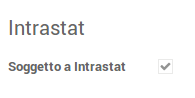
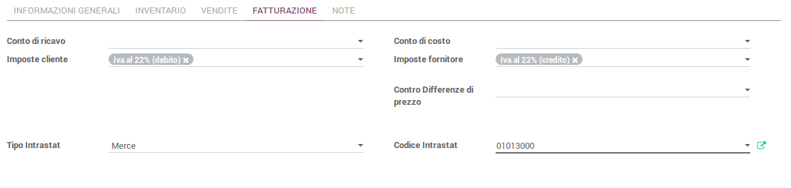
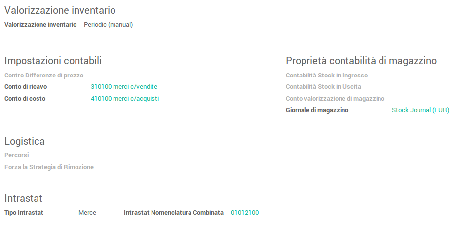
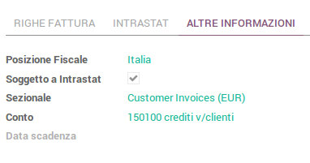
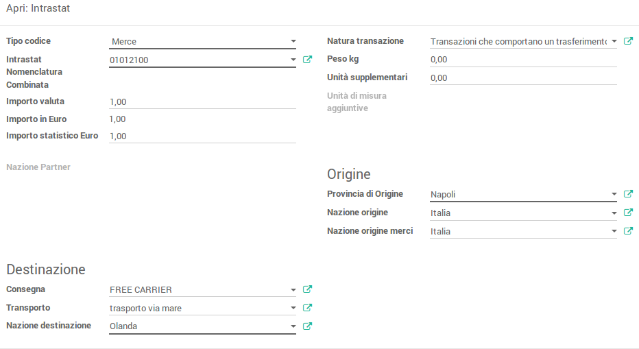
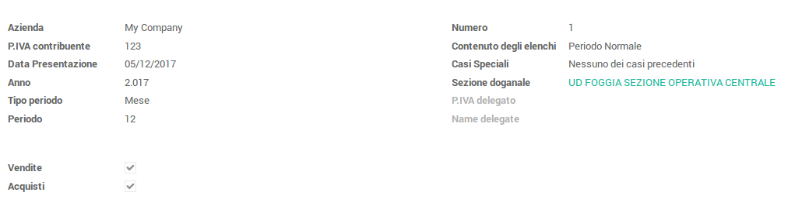
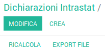

=================
Italy - Intrastat
=================

Premessa
========

Questo modulo si occupa della riclassificazione delle merci e dei servizi che sono oggetto di
transazioni comunitarie e di creare l'apposita dichiarazione intrastat da presentare all'Agenzia delle
Dogane.

Per la dichiarazione è possibile generare il file da presentare all'Agenzia delle Dogane.

Il modulo precarica anche le tabelle necessarie alla compilazione della dichiarazione:
Nomenclature combinate, Sezioni doganali, Natura transazioni, Trasporto

Configurazione
==============

In Configurazione >> Aziende >> Aziende >> <company>, impostare i parametri delle sezioni presenti nel tab Configurazione:

1. Intrastat

   a) User ID (UA Code): inserire il codice identificativo Intrastat dell’azienda (codice alfanumerico di 4 caratteri, utilizzato come user-id per l’accesso alle applicazioni delle Dogane)
   b) Unità di misura per Kg: parametro che indica l’unità di misura che viene verificata sulla riga fattura soggetta a Intrastat. Se sulla riga il peso è espresso nell’unità di misura indicata nel parametro (o in un suo multiplo), il peso che viene riportato nella corrispondente riga Intrastat è quello preso dalla riga fattura. In caso contrario, il peso viene rilevato secondo la configurazione del parametro che segue (Peso dal prodotto).
   c) Peso dal Prodotto: indica se, invece che dalla riga fattura, il peso debba essere:

      i. prelevato dalla scheda prodotto (opzioni “Peso netto” o “Peso Lordo)
      ii. impostato manualmente dall’utente (opzione “Nessuno”)

   d) Unità Aggiuntive da:

      i. peso: da peso dei prodotti sulla riga intrastat
      ii. quantità: da peso dei prodotti sulla riga intrastat
      iii. nessuno

   e) Escludi righe omaggio: Esclude dalle righe intrastata, le righe a valore 0
   f) Delegated person: il nominativo della persona delegata alla presentazione della dichiarazione Intrastat
   g) Delegated person VAT: la partita IVA della persona delegata alla presentazione della dichiarazione Intrastat
   h) Nome file per export: nome del file che può essere impostato per forzare quello di default (SCAMBI.CEE)
   i) Sezione doganale: sezione doganale di default da proporre in una nuova dichiarazione

2. Default sale values (parametri Intrastat per le fatture di vendita)

   a) Force Statistic Amount Euro: flag attualmente non gestito
   b) Transaction Nature: indica il valore di default che verrà impostato nelle righe Intrastat di una fattura per il campo di riferimento (natura della transazione)
   c) Consegna: indica il valore di default che verrà impostato nelle righe Intrastat di una fattura per il campo di riferimento (metodo di consegna)
   d) Transport: indica il valore di default che verrà impostato nelle righe Intrastat di una fattura per il campo di riferimento (metodo di trasporto delle merci)
   e) Provincia di Origine: indica il valore di default che verrà impostato nelle righe Intrastat di una fattura per il campo di riferimento (provincia di origine della spedizione di merce venduta)

3. Default purchase value (parametri Intrastat per le fatture di acquisto)

   a) Force Statistic Amount Euro: flag attualmente non gestito
   b) Transaction Nature: indica il valore di default che verrà impostato nelle righe Intrastat di una fattura per il campo di riferimento (natura della transazione)
   c) Consegna: indica il valore che verrà impostato di default nelle righe Intrastat di una fattura per il campo di riferimento (metodo di consegna)
   d) Transport: indica il valore che verrà impostato di default nelle righe Intrastat di una fattura per il campo di riferimento (metodo di trasporto delle merci)
   e) Provincia di Destinazione: indica il valore che verrà impostato di default nelle righe Intrastat di una fattura per il campo di riferimento (provincia di destinazione della spedizione di merce acquistata)

Tabelle​ di​ ​sistema
------------------

In Contabilità >> Configurazione >> Varie >> Intrastat sono presenti le funzionalità per la gestione delle tabelle di sistema.

- Sezione doganale
- Intrastat Nomenclature combinate
- Transport (modalità di trasporto)
- Transaction nature (natura della transazione)

Tali tabelle sono pre-popolate in fase di installazione del modulo, in base ai valori ammessi per le dichiarazioni Intrastat.

Posizione​ ​fiscale
-----------------

L'assoggettamento ad Intrastat può essere gestito anche a livello generale di singolo partner, associandogli una posizione fiscale che abbia un flag attivo per l'apposito campo “Soggetto a Intrastat”

Tutte le fatture create per il partner che abbia una posizione fiscale marcata come soggetta ad Intrastat avranno l’apposito campo Soggetto a Intrastat automaticamente flaggato.

Prodotti​ e categorie
--------------------

La classificazione Intrastat della merce o servizio può essere fatta sia a livello di categoria che a livello​ ​ di​ ​ prodotto.

La priorità è data al prodotto: se su un prodotto non è configurato un codice Intrastat, il sistema tenta di​ ​ ricavarlo​ ​ dalla​ ​ categoria​ ​ cui​ ​ quel​ ​ prodotto​ ​ è ​ ​ associato.

Per​ ​ il​ ​ prodotto​ ​ la​ ​ sezione​ ​ intrastat​ ​ è ​ ​ nel​ ​ tab​ ​ Contabilità,​ ​ ove​ ​ è ​ ​ necessario​ ​ inserire:

- la​ ​ tipologia​ ​ (Merce,​ ​ Servizio,​ ​ Varie,​ ​ escludi)
- il codice Intrastat, tra quelli censiti tramite l’apposita tabella di sistema Intrastat Nomenclature combinate​ ​ (il​ ​ campo​ ​ si​ ​ abilita​ ​ solo​ ​ per​ ​ le​ ​ tipologie​ ​ Merce​ ​ e ​ ​ Servizio)

Per le categorie di prodotti, le informazioni sono presenti in un’apposita area Intrastat della maschera di​ ​ dettaglio:

Fatture​ e Note​ credito​ Intrastat
================================

E' possibile indicare l’assoggettamento di una fattura ad Intrastat attraverso l'apposito campo presente​ ​ sulla​ ​ maschera​ ​ di​ ​ edit​ ​ della​ ​ fattura​ ​ stessa.

Sul​ ​ tab​ ​ Intrastat​ ​ è ​ ​ presente​ ​ un​ ​ pulsante​ ​ Ricalcola​ ​ Linee​ ​ Intrastat.​ ​ Il​ ​ pulsante​ ​ permette​ ​ al​ ​ sistema:

- di verificare se le righe prodotto presenti in fattura (tab Righe Fattura) si riferiscono a prodotti che hanno un codice intrastat assegnato, o appartengono ad una categoria che ha un codice intrastat​ ​ aggregato
- di generare per questi prodotti le corrispondenti linee intrastat: le linee accorpano prodotti omogenei per codice intrastat, indicando nel campo Peso Kg il peso totale dei prodotti presenti nelle corrispondenti righe. La riga Intrastat, ovviamente, raggruppa il valore economico​ ​ dei​ ​ prodotti
- NB: ​ se una riga presente in fattura si riferisce ad un prodotto che ha come tipologia Intrastat “Varie”, l’importo della riga verrà automaticamente suddiviso in maniera uguale sulle altre righe intrastat che si riferiscono a merci o servizi. Tale automatismo permette di gestire, in maniera conforme a quanto previsto dalla normativa, il ribaltamento proporzionale dei costi sostenuti per spese accessorie (es: spese di trasporto) sui costi sostenuti per l’acquisto vero e ​ ​ proprio ​ ​ di ​ ​ merce ​ ​ o ​ ​ servizi.

Nel tab Intrastat, il clic su una riga Intrastat permette di accedere alla maschera di dettaglio. Di seguito​ ​ un​ ​ esempio​ ​ di​ ​ una​ ​ riga​ ​ Intrastat​ ​ per​ ​ una​ ​ fattura​ ​ di​ ​ vendita

Nella​ ​ maschera:

- il campo Nazione partner viene popolato in automatico dal campo Nazione dell’indirizzo associato​ ​ al​ ​ partner
- i campi configurati in ​ Configurazione >> Aziende >> Aziende >> <company> ​ (vedi Configurazione su company​ ) vengono popolati in automatico con i valori di default impostati, in​ ​ ragione​ ​ della​ ​ tipologia​ ​ di​ ​ fattura​ ​ (vendita​ ​ o ​ ​ acquisto)
- se​ ​ fattura​ ​ di​ ​ vendita:
  1. i campi Origine >> Nazione origine e Origine >> Nazione origine merci merce vengono popolati in automatico con la nazione presente nell’indirizzo associato alla company
  2. il campo Destinazione >> Nazione destinazione viene popolato in automatico con dal campo​ ​ Nazione​ ​ dell’indirizzo​ ​ associato​ ​ al​ ​ partner
- se​ ​ fattura​ ​ di​ ​ acquisto:
  1. i campi Origine >> Nazione origine e Origine >> Nazione origine merci merce vengono popolati in automatico con la nazione presente nell’indirizzo associato al partner​ ​ (fornitore)
  2. il​ ​ campo​ ​ Destinazione​ ​ viene​ ​ preso​ ​ dalla​ ​ dai​ ​ dati​ ​ della​ ​ company
- tutti​ ​ gli​ ​ altri​ ​ campi​ ​ (importi,​ ​ pesi​ ​ ecc)​ ​ vengono​ ​ presi​ ​ dalla​ ​ riga​ ​ fattura

NB: tutti i campi possono ovviamente essere modificati, ma l’utilizzo del pulsante Ricalcola Linee Intrastat ripristinerà i valori di default, sui campi presi dalla configurazione della company o dalla riga fattura.

Note​ di​ credito
---------------

Nelle note credito, sul tab Intrastat, è presente inoltre un menù a tendina che permette di selezionare il periodo fiscale di riferimento da rettificare per la nota di credito. Tale valore sarà utilizzato automaticamente​ ​ nella​ ​ dichiarazione​ ​ (sezioni​ ​ 2 ​ ​ e ​ ​ 4 ​ ​ - ​ ​ Rettifiche).

Importante:

se si seleziona un periodo che è lo stesso della dichiarazione, la nota credito, per il suo importo, non confluirà nella sezione di rettifica, ma andrà a stornare direttamente il valore della fattura a valere sulla quale è stata emessa. La verifica sulla fattura da stornare viene fatta confrontando la coppia di valori​ ​ partner/nomenclatura​ ​ combinata.

Dichiarazione​ Intrastat
=======================

Accedere a ​ Contabilità >> Elaborazione periodica >> Fine del periodo >> Dichiarazioni Intrastat ed utilizzare​ ​ il​ ​ tasto​ ​ Crea​ ​ per​ ​ creare​ ​ una​ ​ nuova​ ​ dichiarazione:

Nella​ ​ parte​ ​ superiore​ ​ della​ ​ maschera,​ ​ inserire​ ​ i ​ ​ dati:

- Azienda:​ ​ popolato​ ​ in​ ​ automatico​ ​ con​ ​ il​ ​ nome​ ​ della​ ​ company
- VAT​ ​ taxpayer:​ ​ la​ ​ partita​ ​ IVA,​ ​ popolata​ ​ in​ ​ automatico​ ​ con​ ​ il​ ​ nome​ ​ della​ ​ company
- Data​ ​ di​ ​ presentazione:​ ​ popolata​ ​ in​ ​ automatico​ ​ con​ ​ la​ ​ data​ ​ corrente
- Year: anno di presentazione, scelta da menù a tendina che visualizza gli anni fiscali configurati​ ​ a ​ ​ sistema
- Tipo periodo: l’orizzonte temporale temporale cui fa riferimento la dichiarazione, scelta da menù​ ​ a ​ ​ tendina​ ​ con​ ​ le​ ​ voci​ ​ “Mese”​ ​ o ​ ​ “Trimestre”
- Periodo: il periodo temporale cui fa riferimento la dichiarazione. In serire il numero del mese (es. 9 per settembre, se nel campo Tipo periodo è stato selezionato “Mese”, oppure in numero del trimestre (es: 1 per il trimestre genn.-marzo), se nel campo Tipo periodo è stato selezionato​ ​ “Trimestre”
- Flag “Vendite” e “Acquisti”: da selezionare in base alla tipologia di operazioni che si vogliono inserire​ ​ nella​ ​ dichiarazione
- Numero:​ ​ progressivo​ ​ della​ ​ dichiarazione,​ ​ proposto​ ​ in​ ​ automatico​ ​ dal​ ​ sistema
- Contenuto​ ​ degli​ ​ elenchi:​ ​ selezionare​ ​ la​ ​ voce​ ​ di​ ​ competenza​ ​ dal​ ​ menù​ ​ a ​ ​ tendina
- Casi​ ​ speciali:​ ​ selezionare​ ​ la​ ​ voce​ ​ di​ ​ competenza​ ​ dal​ ​ menù​ ​ a ​ ​ tendina
- Sezione​ ​ doganale:​ ​ selezionare​ ​ la​ ​ voce​ ​ di​ ​ riferimento,​ ​ dal​ ​ menù​ ​ a ​ ​ tendina

Inseriti​ ​ e ​ ​ salvati​ ​ i ​ ​ dati,​ ​ utilizzare​ ​ il​ ​ tasto​ ​ Ricalcola​ ​ per​ ​ popolare​ ​ la​ ​ dichiarazione. Per​ ​ ciascun​ ​ tab​ ​ (”Acquisti”​ ​ e ​ ​ “Vendite”)​ ​ verranno​ ​ inserite​ ​ nelle​ ​ sezioni​ ​ di​ ​ riferimento:

- Vendita:
  - Vendita​ ​ Merci​ ​ - ​ ​ Section​ ​ 1 ​ ​ → ​ ​ fatture​ ​ di​ ​ vendita​ ​ di​ ​ merci
  - Rettifica​ ​ Merci​ ​ - ​ ​ Section​ ​ 2 ​ ​ → ​ ​ note​ ​ credito​ ​ su​ ​ vendita​ ​ merci
  - Vendita​ ​ Servizi​ ​ - ​ ​ Section​ ​ 3 ​ ​ → ​ ​ fatture​ ​ di​ ​ vendita​ ​ di​ ​ servizi
  - Rettifica​ ​ Servizi​ ​ - ​ ​ Section​ ​ 4 ​ ​ → ​ ​ note​ ​ credito​ ​ su​ ​ vendita​ ​ servizi
- Acquisto:
  - Acquisto​ ​ Merci​ ​ - ​ ​ Section​ ​ 1 ​ ​ → ​ ​ fatture​ ​ di​ ​ acquisto​ ​ di​ ​ merci
  - Rettifica​ ​ Merci​ ​ - ​ ​ Section​ ​ 2 ​ ​ → ​ ​ note​ ​ credito​ ​ su​ ​ acquisto​ ​ merci
  - Vendita​ ​ Servizi​ ​ - ​ ​ Section​ ​ 3 ​ ​ → ​ ​ fatture​ ​ di​ ​ acquisto​ ​ di​ ​ servizi
  - Rettifica​ ​ Servizi​ ​ - ​ ​ Section​ ​ 4 ​ ​ → ​ ​ note​ ​ credito​ ​ su​ ​ acquisto​ ​ servizi

I dati presi dalle fatture e dalle note credito indicate come soggette ad Intrastat, relative al periodo di riferimento.

NB: i record presenti nei tab ​ Rettifica Merci - Section 2 e ​ Rettifica Servizi - Section 4 ​ , sia per gli Acquisti ​ ​ che​ ​ per​ ​ le​ ​ Vendite ​ , ​ ​ vanno​ ​ editati​ ​ per​ ​ inserire​ ​ i ​ ​ dati​ ​ obbligatori​ ​ mancanti.

Inseriti i dati e slavata la dichiarazione, è possibile procedere all’elaborazione dei file da inviare all’Agenzia​ ​ delle​ ​ Dogane,​ ​ tramite​ ​ l’apposito​ ​ pulsante​ ​ “Export​ ​ File”

Il​ ​ pulsante​ ​ fa​ ​ partire​ ​ un​ ​ wizard,​ ​ che​ ​ permette​ ​ di​ ​ scegliere​ ​ quale​ ​ tipo​ ​ di​ ​ file​ ​ estrarre:

- file​ ​ Invio​ ​ (complessivo)
- file​ ​ acquisti.cee
- file​ ​ cessioni.cee

Il file potrà essere scaricato tramite l’apposito link mostrato nella maschera del wizard. Di seguito un esempio​ ​ per​ ​ il​ ​ download​ ​ del​ ​ file​ ​ cessioni.cee​ ​ (il​ ​ nome​ ​ del​ ​ file​ ​ da​ ​ scaricare​ ​ è ​ ​ SCAMBI.CEE)
