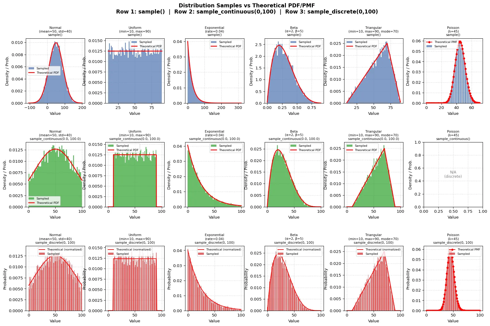

# Populate

Generate synthetic data for an Odoo database following a predefined 
**Blueprint**.

Useful for performance testing, demos, and development environments.

## Quick Start

```shell
odoo-bin populate -d <database> -b <blueprint>
```

| Option             | Description                                                  |
|--------------------|--------------------------------------------------------------|
| `-d <database>`    | Target database (required)                                   |
| `-b <blueprint>`   | Blueprint name or full xmlid (required)                      |
| `--seed <seed>`    | Seed for the random number generator (default: a random one) |
| `--scale <factor>` | Multiply all record counts by this factor (default: `1`)     |
| `-j <workers>`     | Parallel processes (`auto` = all CPU threads, default: `1`)  |
| `--resume [id]`    | Resume the last (or a specific) interrupted session          |

> **Important:** After installing a new module that ships blueprints, upgrade
> the `populate` module first:
>
> ```shell
> odoo-bin -d <database> -u populate
> ```
>
> Otherwise, the new blueprints will not be discovered or loaded into the
> database.

### Examples

```shell
# Run a blueprint at 10x scale using 4 cores
odoo-bin populate -d mydb -b project.fake_project_demo --scale 10 -j 4

# Resume the last interrupted session
odoo-bin populate -d mydb --resume
```

## Blueprints

A Blueprint is a record of `populate.blueprint` that describes **what
data to create** in a
declarative XML (or JSON) definition. Blueprints are typically shipped
inside a module's
`populate/` folder and loaded automatically when the `populate` module
is installed or upgraded.
If it's a valid python module (has an `__init__.py` defined), the 
code will be imported, allowing for custom generators, if needed.

### XML Structure

A blueprint definition is a list of `<model>` blocks, each containing
`<field>` declarations:

```xml
<model name="res.partner" count="500" id="my_partners">
    <field name="name" generator="fake.company" null_ratio="0"/>
    <field name="email" generator="fake.company_email"/>
    <field name="active" eval="True"/>
</model>
```

### JSON Structure

Blueprints can also be defined in JSON via the `definition_json` field
on `populate.blueprint`. The JSON format mirrors the XML structure 
directly:

```json
[
    {
        "name": "res.partner",
        "count": 500,
        "ref": "my_partners",
        "fields": {
            "name":   { "generator": "fake.company", "null_ratio": "0" },
            "email":  { "generator": "fake.company_email" },
            "active": { "eval": "True" }
        }
    },
    {
        "name": "res.partner",
        "type": "write",
        "ref": "my_partners",
        "fields": {
            "phone": { "generator": "fake.phone_number" }
        }
    }
]
```

The top-level array maps to the ordered list of `<model>` blocks. Each
object's `"fields"` key maps field names to their attribute
dictionaries – the same keys you would write as XML attributes 
(`generator`, `eval`, `null_ratio`, `domain`, `ref`, `virtual`, etc.).

> **Note:** If both `definition_xml` and `definition_json` are set on
> the same record, the XML definition takes precedence.

#### `<model>` Attributes

| Attribute  | Required     | Description                                                          |
|------------|--------------|----------------------------------------------------------------------|
| `name`     | yes          | Odoo model technical name (e.g. `res.partner`)                       |
| `count`    | for `create` | Number of records to create                                          |
| `id`       |              | Reference tag - lets later blocks target these records               |
| `type`     |              | `create` (default) or `write`                                        |
| `ref`      | for `write`  | Reference to a previously created batch (its `id`)                   |
| `domain`   |              | ORM domain selecting target records; not allowed on create blocks    |
| `scale`    |              | `True` (default) / `False` - whether `--scale` applies to this block |
| `parallel` |              | `True` (default) / `False` - whether the job can run in parallel     |
| `context`  |              | Python dict literal merged into the ORM context                      |

#### `<field>` Attributes

| Attribute      | Required | Description                                                                             |
|----------------|----------|-----------------------------------------------------------------------------------------|
| `name`         | yes      | Field name on the model                                                                 |
| `generator`    | (1)      | Generator to use (see table in 'Generators' section)                                    |
| `eval`         | (1)      | A Python expression - static value or dynamic expression referencing other fields       |
| `null_ratio`   |          | Probability of generating `False` (0-1, default `0`; forced to `0` for required fields) |
| `unique`       |          | `True` to enforce uniqueness across the database                                        |
| `values`       |          | Explicit value list or weighted dict, e.g. `"{'a': 3, 'b': 1}"`                         |
| `distribution` |          | Statistical distribution, e.g. `"normal(mean=50, std=10)"`                              |
| `domain`       |          | ORM domain to filter related records (for relational/reference generators)              |
| `ref`          |          | Restrict relational picks to records created under this reference                       |
| `virtual`      |          | `True` to mark as a virtual (non-persisted) intermediate field                          |

> (1) Either `generator` or `eval` can be provided. If neither
> is set, a default generator is automatically selected based on the
> field's type.

#### Default Generators by Field Type

When neither `generator` nor `eval` is specified for a field, the
populate module automatically selects a generator based on the 
field's type:

| Field Type              | Default Generator       |
|-------------------------|-------------------------|
| `boolean`               | `scalar.boolean`        |
| `integer`               | `scalar.integer`        |
| `float`                 | `scalar.float`          |
| `monetary`              | `scalar.monetary`       |
| `char`                  | `textual.char`          |
| `text`                  | `textual.text`          |
| `html`                  | `textual.text`          |
| `date`                  | `temporal.date`         |
| `datetime`              | `temporal.datetime`     |
| `selection`             | `choice.selection`      |
| `binary`                | `binary.binary`         |
| `many2one`              | `relation.one`          |
| `one2many`              | `relation.many`         |
| `many2many`             | `relation.many`         |
| `many2one_reference`    | `reference.one`         |
| `reference`             | `reference.raw`         |
| `properties`            | `properties.value`      |
| `properties_definition` | `properties.definition` |

If a field's type is not listed above and no `generator` or `eval` is
provided, an error is raised.

## Generators

### Scalar

| Generator          | Field Types        | Key Params          |
|--------------------|--------------------|---------------------|
| `scalar.boolean`   | `boolean`          | `values` (weighted) |
| `scalar.integer`   | `integer`, `float` | `start`, `end`      |
| `scalar.float`     | `float`            | `start`, `end`      |
| `scalar.monetary*` | `monetary`         | `start`, `end`      |

>\* depends on the currency field, therefor a value for said field 
> needs to be generated in the blueprint.

### Textual

| Generator      | Field Types    | Key Params           |
|----------------|----------------|----------------------|
| `textual.char` | `char`, `html` | `length`, `char_set` |
| `textual.text` | `text`, `html` | `length`, `char_set` |

### Temporal

| Generator           | Field Types | Key Params                                         |
|---------------------|-------------|----------------------------------------------------|
| `temporal.date`     | `date`      | `start`, `end` (e.g. `"today -6m"`, `"today +1y"`) |
| `temporal.datetime` | `datetime`  | `start`, `end` (e.g. `"now"`, `"now -30d"`)        |

### Choice

| Generator          | Field Types       | Key Params                                           |
|--------------------|-------------------|------------------------------------------------------|
| `choice.selection` | `selection`       | `values` (weighted subset of the field's valid keys) |
| `choice.sample`    | most scalar types | `values` (weighted)                                  |

### Binary

| Generator       | Field Types | Key Params        |
|-----------------|-------------|-------------------|
| `binary.binary` | `binary`    | `size`            |
| `binary.image`  | `binary`    | `width`, `height` |

### Relational

| Generator       | Field Types                        | Key Params                                                               |
|-----------------|------------------------------------|--------------------------------------------------------------------------|
| `relation.one`  | `many2one`, `virtual`              | `domain`, `ref`, `comodel_name*`, `partition`                            |
| `relation.many` | `one2many`, `many2many`, `virtual` | `domain`, `ref`, `comodel_name*`, `count`, `std`, `groupby`, `partition` |

>\* required only for 'virtual' fields

#### Dynamic Domains

The `domain` parameter on relational generators can contain **field
references** that are resolved at generation time against the current
record's already-generated values:

```xml
<field name="project_id" generator="relation.one"/>
<field name="task_id"    generator="relation.one"
       domain="[('project_id', '=', project_id)]"/>
```

`project_id` in the domain expression is automatically detected as a
dependency. At generation time the expression is evaluated with the 
actual value produced for `project_id`, so every `task_id` is 
guaranteed to belong to its sibling `project_id`.

#### Ref Dot-Path Navigation

The `ref` attribute on relational/reference generators (and `write` 
blocks) supports **dot-path traversal** to scope picks to *related* 
records of a previously created batch:

```xml
<!-- Create projects and their tasks -->
<model name="project.project" count="10" id="my_projects">
    <field name="name" generator="fake.bs"/>
</model>
<model name="project.task" count="100" id="my_tasks">
    <field name="project_id" generator="relation.one" ref="my_projects"/>
</model>

<!-- Assign timesheets only to tasks that belong to our projects -->
<model name="account.analytic.line" count="200">
    <field name="task_id" generator="relation.one" ref="my_projects.task_ids"/>
</model>
```

`ref="my_projects.task_ids"` resolves by fetching the populated
`my_projects` records, traversing the `task_ids` relation, and
restricting the pick to those IDs. Any valid ORM dot-path works.
This is mainly necessary only for corecords which aren't explicitely
created in the blueprint, like the `product.product` that are
automatically created when creating a `product.template`.

### Reference

| Generator       | Field Types          | Key Params                                             |
|-----------------|----------------------|--------------------------------------------------------|
| `reference.one` | `many2one_reference` | `partition` (implicitely `depends` on the model field) |
| `reference.raw` | `reference`          | `res_model`, `res_id`, `ref`, `partition`              |

#### Partitioning for Parallel Execution

Generators that inherit from `ComodelGenerator` (`relation.one`,
`relation.many`, `reference.one`, `reference.raw`) support a `partition`
parameter. When enabled in parallel jobs, this distributes related
records across worker processes using round-robin partitioning:

```xml
<field name="user_id" generator="relation.one" partition="True"/>
```

When `partition="True"` and the job runs with multiple workers
(`-j > 1`), each worker receives a distinct subset of available comodel
IDs. This can help avoid conflicts when creating related records in parallel.

> **Note:** Partitioning only takes effect when the job has sibling 
> jobs (i.e., it was split for parallel execution). In single-worker 
> mode, the parameter has no effect.

> **Note:** Using this attribute might introduce slight biaises if 
> using a non-uniform distribution. It will follow the general shape 
> but won't be as accurately following the parameters of the 
> distributions. For most cases this can be ignored, but worth 
> mentioning.

### Faker (`fake.*`)

Wraps the [Faker](https://faker.readthedocs.io/en/stable/providers.html) library. Any method
from an allowed provider can be used directly:

```xml
<field name="name" generator="fake.name"/>
<field name="email" generator="fake.email" locale="fr_FR"/>
<field name="phone" generator="fake.phone_number"/>
<field name="bio" generator="fake.paragraph" nb_sentences="5"/>
```

Method-specific keyword arguments (e.g. `nb_sentences`) are forwarded
as-is. Requires `faker` - install from 
`odoo/addons/populate/requirements.txt`.

#### Allowed Faker Providers

Only methods from the following providers are available as `fake.*`
generators:

`address`, `automotive`, `bank`, `barcode`, `color`, `company`,
`credit_card`, `currency`, `emoji`, `file`, `geo`, `internet`, `isbn`,
`job`, `lorem`, `misc`, `passport`, `person`, `phone_number`, `profile`,
`sbn`, `ssn`, `user_agent`

### Misc

| Generator      | Field Types                   | Description                                                          | Key Params             |
|----------------|-------------------------------|----------------------------------------------------------------------|------------------------|
| `misc.counter` | 'integer', 'float', 'virtual' | Generates an arithmetic sequence; wraps around if `end` is specified | `start`, `step`, `end` |
| `misc.cycle`   | most scalar types             | Cycles through <br/>`values` in order, deterministically             | `values`               |
| `misc.eval`    | any                           | Evaluates a Python expression*; can reference other fields by name   | N/A                    |

> \* `misc.eval` uses `safe_eval` with a small evaluation context. 
> Only `env`, `model` & `Command` are provided.

### Properties

| Generator               | Field Types             | Description                                        |
|-------------------------|-------------------------|----------------------------------------------------|
| `properties.definition` | `properties_definition` | Generates a property schema                        |
| `properties.prop`       | `virtual`               | Helper - defines a single property entry           |
| `properties.value`      | `properties`            | Generates values matching the parent's definition  |

## Distributions



Generators can accept a `distribution` parameter.
Without one, values are picked uniformly at random inside the range. Adding a distribution
lets you control **how likely** certain parts of the range are sampled.

```xml
<field name="age" generator="scalar.integer" start="18" end="90" distribution="normal(mean=35, std=12)"/>
<field name="delay" generator="scalar.float" start="0" end="100" distribution="exponential(rate=0.05)"/>
```

### `normal(mean, std)` - "Most values near the center"

Produces a classic bell curve. Most values land close to `mean`; the 
further from it, the rarer. `std` (standard deviation) controls how 
spread out the curve is - a smaller `std` means values are packed 
tighter around the mean.

**Use when** you want a realistic "average with natural variation"
pattern.

| Example field         | Params                    | Why                                                            |
|-----------------------|---------------------------|----------------------------------------------------------------|
| Employee age          | `normal(mean=35, std=12)` | Most employees are around 35, fewer very young or very old     |
| Product price         | `normal(mean=50, std=15)` | Prices cluster around 50, with some cheaper/expensive outliers |
| Task duration (hours) | `normal(mean=8, std=3)`   | Most tasks take about a day, some shorter or longer            |

### `uniform(min, max)` - "Any value is equally likely"

A flat distribution – every value in the range has the exact same 
chance. This is actually the default behavior when you omit 
`distribution` entirely, so you rarely need to write it out.

**Use when** you genuinely don't want any value to be more common than
another.

| Example field      | Params                     | Why                      |
|--------------------|----------------------------|--------------------------|
| Random color index | `uniform(min=0, max=11)`   | No color should dominate |
| Sequence number    | `uniform(min=1, max=1000)` | Spread evenly            |

### `exponential(rate)` - "Lots of small values, rare large ones"

A steep curve that starts high and drops off. Most generated values 
will be small; large values are increasingly rare. A higher `rate` 
makes it drop off faster (even more concentrated on small values).

**Use when** the data should be skewed toward the low end, with
occasional spikes.

| Example field       | Params                   | Why                                            |
|---------------------|--------------------------|------------------------------------------------|
| Days until deadline | `exponential(rate=0.03)` | Most deadlines are soon, a few are months away |
| Allocated hours     | `exponential(rate=0.1)`  | Most tasks are quick, a few are very long      |
| Time between events | `exponential(rate=0.05)` | Short gaps are common, long gaps are rare      |

### `beta(alpha, beta)` - "Values between 0 and 1, shaped how you want"

Always produces values in [0, 1]. The two parameters shape the curve:

- `alpha=2, beta=2` - bell-shaped, centered at 0.5 (like bounded normal)
- `alpha=1, beta=3` - skewed toward 0 (most values are low)
- `alpha=3, beta=1` - skewed toward 1 (most values are high)
- `alpha=0.5, beta=0.5` - U-shaped, values cluster near 0 and 1

The generator maps this [0, 1] output onto your `start`/`end` range automatically.

**Use when** you're modeling percentages, progress, ratings, or any 
bounded proportion.

| Example field        | Params                  | Why                                                  |
|----------------------|-------------------------|------------------------------------------------------|
| Project progress (%) | `beta(alpha=2, beta=2)` | Most projects are roughly mid-way, few at 0% or 100% |
| Discount rate        | `beta(alpha=1, beta=3)` | Most discounts are small, large discounts are rare   |
| Satisfaction score   | `beta(alpha=3, beta=1)` | Most scores are high                                 |

### `poisson(lam)` - "How many times something happens"

Produces whole numbers representing a **count of occurrences**. 
`lam` (lambda) is the average number of occurrences you expect. 
Values near `lam` are most likely; values far from it are rare.

**Use when** you're generating "how many" – e.g., number of items, 
events, or attempts.

| Example field           | Params           | Why                                             |
|-------------------------|------------------|-------------------------------------------------|
| Number of order lines   | `poisson(lam=5)` | Orders average 5 lines, some have 1, rarely 15+ |
| Support tickets per day | `poisson(lam=3)` | About 3 per day on average                      |
| Login attempts          | `poisson(lam=2)` | Usually 1-3 attempts, occasionally more         |

### `triangular(min, max, mode)` - "I know the best, worst, and most likely"

A simple triangle shape. `mode` is the peak (most likely value), 
`min` and `max` are the absolute bounds. Values near `mode` are 
most common; probability falls off linearly to the edges.

**Use when** you can estimate three points – minimum, maximum, and 
most likely – but don't have more detailed data. This is common for task estimates and cost
projections.

| Example field                      | Params                                | Why                                                        |
|------------------------------------|---------------------------------------|------------------------------------------------------------|
| Task estimate (days)               | `triangular(min=1, max=30, mode=5)`   | Most tasks take ~5 days, never less than 1 or more than 30 |
| Shipping cost                      | `triangular(min=5, max=200, mode=25)` | Typically around 25, bounded by 5 and 200                  |
| Milestone deadline (days from now) | `triangular(min=0, max=120, mode=30)` | Most milestones are about a month out                      |

### Quick decision guide

| You want...                               | Use                                     |
|-------------------------------------------|-----------------------------------------|
| Realistic clustering around an average    | `normal`                                |
| Everything equally likely                 | `uniform` (or omit <br/>`distribution`) |
| Mostly small values, rare big ones        | `exponential`                           |
| A percentage / bounded ratio              | `beta`                                  |
| A count of "how many times"               | `poisson`                               |
| Three-point estimate (min / likely / max) | `triangular`                            |

## Virtual Fields

Virtual fields are intermediate computation steps that are **not
persisted** to the database.
They let you build values that multiple real fields depend on, avoiding
duplication:

```xml
<model name="account.move.line" count="1000">
    <field name="quantity" generator="scalar.integer" start="1" end="100"/>
    <field name="price_unit" generator="scalar.float" start="5" end="500"/>
    <field name="v_subtotal" virtual="True" eval="quantity * price_unit"/>
    <field name="discount" eval="v_subtotal * 0.1 if v_subtotal > 200 else 0"/>
    <field name="price_total" eval="v_subtotal - discount"/>
</model>
```

Here `v_subtotal` is computed but never written to the database.
Both `discount` and `price_total` reference it, so the
`quantity * price_unit` logic lives in one place instead of being
duplicated across every field that needs it.

Virtual fields are also handy for **correlating** persisted fields.
For instance, generating an email address that matches a contact's
name:

```xml
<model name="res.partner" count="200">
    <field name="v_first" virtual="True" generator="fake.first_name"/>
    <field name="v_last" virtual="True" generator="fake.last_name"/>
    <field name="name" eval="v_first + ' ' + v_last"/>
    <field name="email" eval="v_first.lower() + '.' + v_last.lower() + '@example.com'"/>
</model>
```

Here `v_first` and `v_last` are generated once and reused, so every
record's `name` and `email` stay consistent with each other — without
either value being stored on its own.

> **Note:** The `v_` prefix is purely a naming convention. A virtual field
> can have any name (valid python identifier), as long as it doesn't 
> conflict with another field name in the same model block in the 
> blueprint.

## Write Jobs

Use `type="write"` to update records that were created earlier in the
same blueprint, referenced by their `id`/`ref`:

```xml
<!-- Create partners -->
<model name="res.partner" count="500" id="customers">
    <field name="name" generator="fake.company"/>
</model>
    
<!-- Update those same partners -->
<model name="res.partner" type="write" ref="customers">
    <field name="phone" generator="fake.phone_number"/>
</model>
```

A `write` block can also use a top-level `domain` to select target
records:

```xml
<!-- Update all active customers -->
<model name="res.partner" type="write"
       domain="[('customer_rank', '>', 0), ('active', '=', True)]">
    <field name="phone" generator="fake.phone_number"/>
</model>
```

Targeting rules:

| Attributes       | Target records                                              |
|------------------|-------------------------------------------------------------|
| `ref` only       | Records created under that populate reference               |
| `domain` only    | Records of the job model matching the domain                |
| `ref` + `domain` | Intersection: referenced records that also match the domain |
| neither          | All existing records of the job model                       |

Domains on `write` jobs are evaluated once to select the target
records. They are not dynamic per generated record. Create jobs cannot
define a top-level `domain`, they don't target records.

## Blueprint Inheritance

Blueprints support a simplified Odoo-style view inheritance via 
`inherit_id`. A child blueprint applies XPath or positional specs 
to its parent's XML definition:

```xml
<record id="custom_blueprint" model="populate.blueprint">
    <field name="name">Custom Blueprint</field>
    <field name="inherit_id" ref="base_module.parent_blueprint"/>
    <field name="definition_xml" type="xml">
        <!-- Change record count -->
        <model name="res.partner" position="attributes">
            <attribute name="count">2000</attribute>
        </model>
        <!-- Add a new field to an existing model -->
        <model name="res.partner" position="inside">
            <field name="website" generator="fake.url"/>
        </model>
        <!-- Add a new model after an existing one -->
        <model name="res.partner" position="after">
            <model name="res.users" count="50" id="new_users">
                <field name="name" generator="fake.name"/>
                <field name="login" generator="fake.user_name" unique="True"/>
            </model>
        </model>
    </field>
</record>
```

Supported positions: `attributes`, `inside`, `before`, `after`,
`replace`. XPath expressions (`<xpath expr="..." position="...">`) 
work as well. Chained inheritance (grandchild blueprints)
is supported; circular inheritance is detected and rejected.

## Sessions & Resuming

Each run creates a **Session** that tracks every job and the records it
produced (`populate.model.data`). If execution is interrupted 
(`SIGINT` via `Ctrl+C`/`Cmd+C`, crash), resume where you left off:

```shell
# Resume the most recent unfinished session
odoo-bin populate -d mydb --resume

# Resume a specific session by ID
odoo-bin populate -d mydb --resume 42
```

## Parallel Execution

Pass `-j <N>` (or `-j auto`) to split large jobs across multiple worker
processes. Each job that exceeds the internal batch size is 
automatically divided into sub-jobs distributed to the pool.

Parallelism can be disabled per model block with `parallel="False"` when
the model's constraints require sequential writes.

Platform controlled by the environment variable
`ODOO_POPULATE_MULTIPROCESS_ENABLE` (defaults to `True`).

## Automatic Retry on Constraint Violations

The session executor includes a **retry mechanism** for transient
database constraint failures. When a job triggers one of the following
PostgreSQL violations, the job's seed is re-rolled and the entire job
is re-executed with a fresh set of random values:

| Violation            | Common cause                                     | Hint                                                              |
|----------------------|--------------------------------------------------|-------------------------------------------------------------------|
| `UniqueViolation`    | Two generated records collide on a unique index  | Use a generator (or combination) that produces more varied values |
| `NotNullViolation`   | A required column received `NULL`                | Add `null_ratio="0"` on the offending field                       |
| `CheckViolation`     | A generated value fails a `CHECK` constraint     | Adjust generator parameters to stay within the constraint         |
| `ExclusionViolation` | Generated values violate an exclusion constraint | Adjust generator parameters to stay within the constraint         |

This means blueprints don't need to be perfectly tuned upfront —
occasional constraint failures due to randomness are handled
transparently. Only violations that persist across all retry attempts
will surface as errors.
