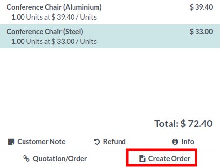
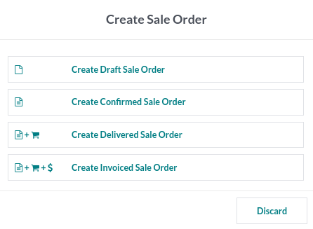

* Open your Point of sale
* Create a new order and select products
* Select a customer

* Click on the "Create Order" button

Four options are available (depending on the PoS settings):

* **Create a draft Order**
  A new sale order in a draft mode will be created that can be changed later.

* **Create a Confirmed Order**
  A new sale order will be created and confirmed.

* **Create Delivered Sale Order**
  A new sale order will be created and confirmed.
  the associated picking will be marked as delivered.

* **Create Invoiced Sale Order**
  A new sale order will be created and confirmed.
  the associated picking will be marked as delivered.
  An invoice will be created and confirmed.

