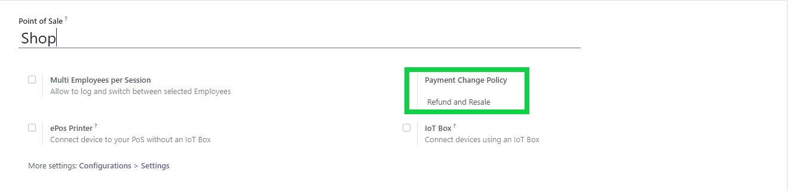

* Go to Point of Sale. 
* Choose the view list.
* Edit your point of sale, and select a value for the field
  'Payment Change Policy'.

Two options are available:

* 'Refund and Resale': Odoo will refund the current
  Pos Order to cancel it, and create a new PoS Order
  with the correct payment lines

* 'Update Payments': Odoo will change payment lines.

**Note**
In some countries the 'Update Payments' Option
is not allowed by law, because orders history shouldn't not be altered.

For that purpose, a constrains is present to check the value of this
field. If the module ``l10n_fr_certification`` is installed and if the
current company has an inalterable accounting, it will not be possible
to select the value 'Update Payments'.
