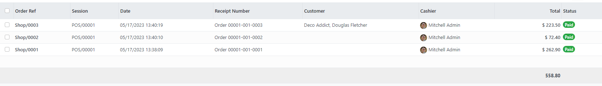

* Go to a PoS Order

* Click on the button 'Change Payments'

* In the pop up wizard, select the real payment(s) that have been
  used to pay the order

* Then click on the button 'Change Payments'

**Note**

If the option 'Refund and Resale' is selected, changing the payments will
display the three PoS orders. the oringal one, the refund one, and the new one.

