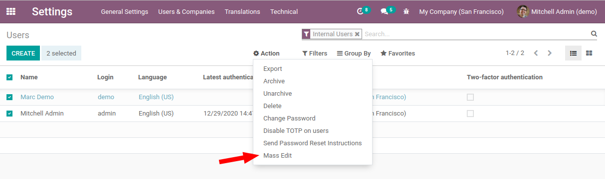
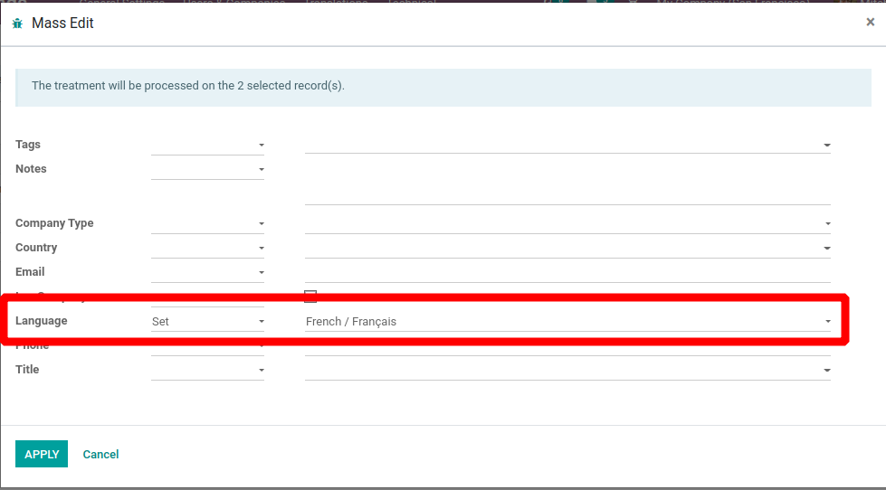
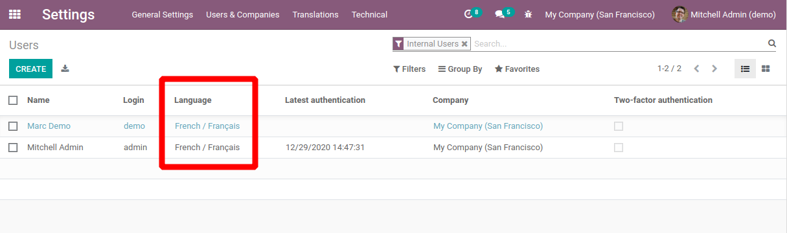

* *Go for Mass Editing*: select the records which you want to modify and click on *Action* to open mass editing popup.

* Select *Set / Remove* action and write down the value to set or remove the value for the given field.

* This way you can set / remove the values of the fields.

