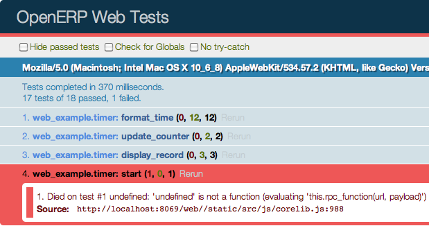

.. _module:

.. queue:: module/series

Building a Web module
=====================

There is no significant distinction between a Web module and
a regular module, the web part is mostly additional data and code
inside a regular module. This allows providing more seamless
features by integrating your module deeper into the web client.

A Basic Module
--------------

A very basic OpenERP module structure will be our starting point:

.. code-block:: text

    web_example
    ├── __init__.py
    └── __manifest__.py

.. patch::

This is a sufficient minimal declaration of a valid module.

Web Declaration
---------------

There is no such thing as a "web module" declaration. An OpenERP
module is automatically recognized as "web-enabled" if it contains a
``static`` directory at its root, so:

.. code-block:: text

    web_example
    ├── __init__.py
    ├── __manifest__.py
    └── static

is the extent of it. You should also change the dependency to list
``web``:

.. patch::

.. note::

    This does not matter in normal operation so you may not realize
    it's wrong (the web module does the loading of everything else, so
    it can only be loaded), but when e.g. testing the loading process
    is slightly different than normal, and incorrect dependency may
    lead to broken code.

This makes the "web" discovery system consider the module as having a
"web part", and check if it has web controllers to mount or javascript
files to load. The content of the ``static/`` folder is also
automatically made available to web browser at the URL
``$module-name/static/$file-path``. This is sufficient to provide
pictures (of cats, usually) through your module. However there are
still a few more steps to running javascript code.

Getting Things Done
-------------------

The first one is to add javascript code. It's customary to put it in
``static/src/js``, to have room for e.g. other file types, or
third-party libraries.

.. patch::

The client won't load any file unless specified, thus the new file
should be listed in the module's manifest file, under a new key ``js``
(a list of file names, or glob patterns):

.. patch::

At this point, if the module is installed and the client reloaded the
message should appear in your browser's development console.

.. note::

    Because the manifest file has been edited, you will have to
    restart the OpenERP server itself for it to be taken in account.

    You may also want to open your browser's console *before*
    reloading, depending on the browser messages printed while the
    console is closed may not work or may not appear after opening it.

.. note::

    If the message does not appear, try cleaning your browser's caches
    and ensure the file is correctly loaded from the server logs or
    the "resources" tab of your browser's developers tools.

At this point the code runs, but it runs only once when the module is
initialized, and it can't get access to the various APIs of the web
client (such as making RPC requests to the server). This is done by
providing a `javascript module`_:

.. patch::

If you reload the client, you'll see a message in the console exactly
as previously. The differences, though invisible at this point, are:

* All javascript files specified in the manifest (only this one so
  far) have been fully loaded
* An instance of the web client and a namespace inside that instance
  (with the same name as the module) have been created and are
  available for use

The latter point is what the ``instance`` parameter to the function
provides: an instance of the OpenERP Web client, with the contents of
all the new module's dependencies loaded in and initialized. These are
the entry points to the web client's APIs.

To demonstrate, let's build a simple :doc:`client action
<client_action>`: a stopwatch

First, the action declaration:

.. patch::

then set up the :doc:`client action hook <client_action>` to register
a function (for now):

.. patch::

Updating the module (in order to load the XML description) and
re-starting the server should display a new menu *Example Client
Action* at the top-level. Opening said menu will make the message
appear, as usual, in the browser's console.

Paint it black
--------------

The next step is to take control of the page itself, rather than just
print little messages in the console. This we can do by replacing our
client action function by a :doc:`widget`. Our widget will simply use
its :js:func:`~openerp.web.Widget.start` to add some content to its
DOM:

.. patch::

after reloading the client (to update the javascript file), instead of
printing to the console the menu item clears the whole screen and
displays the specified message in the page.

Since we've added a class on the widget's :ref:`DOM root
<widget-dom_root>` we can now see how to add a stylesheet to a module:
first create the stylesheet file:

.. patch::

then add a reference to the stylesheet in the module's manifest (which
will require restarting the OpenERP Server to see the changes, as
usual):

.. patch::

the text displayed by the menu item should now be huge, and
white-on-black (instead of small and black-on-white). From there on,
the world's your canvas.

.. note::

    Prefixing CSS rules with both ``.openerp`` (to ensure the rule
    will apply only within the confines of the OpenERP Web client) and
    a class at the root of your own hierarchy of widgets is strongly
    recommended to avoid "leaking" styles in case the code is running
    embedded in an other web page, and does not have the whole screen
    to itself.

So far we haven't built much (any, really) DOM content. It could all
be done in :js:func:`~openerp.web.Widget.start` but that gets unwieldy
and hard to maintain fast. It is also very difficult to extend by
third parties (trying to add or change things in your widgets) unless
broken up into multiple methods which each perform a little bit of the
rendering.

The first way to handle this method is to delegate the content to
plenty of sub-widgets, which can be individually overridden. An other
method [#DOM-building]_ is to use `a template
<http://en.wikipedia.org/wiki/Web_template>`_ to render a widget's
DOM.

OpenERP Web's template language is :doc:`qweb`. Although any
templating engine can be used (e.g. `mustache
<http://mustache.github.com/>`_ or `_.template
<http://underscorejs.org/#template>`_) QWeb has important features
which other template engines may not provide, and has special
integration to OpenERP Web widgets.

Adding a template file is similar to adding a style sheet:

.. patch::

The template can then easily be hooked in the widget:

.. patch::

And finally the CSS can be altered to style the new (and more complex)
template-generated DOM, rather than the code-generated one:

.. patch::

.. note::

    The last section of the CSS change is an example of "state
    classes": a CSS class (or set of classes) on the root of the
    widget, which is toggled when the state of the widget changes and
    can perform drastic alterations in rendering (usually
    showing/hiding various elements).

    This pattern is both fairly simple (to read and understand) and
    efficient (because most of the hard work is pushed to the
    browser's CSS engine, which is usually highly optimized, and done
    in a single repaint after toggling the class).

The last step (until the next one) is to add some behavior and make
our stopwatch watch. First hook some events on the buttons to toggle
the widget's state:

.. patch::

This demonstrates the use of the "events hash" and event delegation to
declaratively handle events on the widget's DOM. And already changes
the button displayed in the UI. Then comes some actual logic:

.. patch::

* An initializer (the ``init`` method) is introduced to set-up a few
  internal variables: ``_start`` will hold the start of the timer (as
  a javascript Date object), and ``_watch`` will hold a ticker to
  update the interface regularly and display the "current time".

* ``update_counter`` is in charge of taking the time difference
  between "now" and ``_start``, formatting as ``HH:MM:SS`` and
  displaying the result on screen.

* ``watch_start`` is augmented to initialize ``_start`` with its value
  and set-up the update of the counter display every 33ms.

* ``watch_stop`` disables the updater, does a final update of the
  counter display and resets everything.

* Finally, because javascript Interval and Timeout objects execute
  "outside" the widget, they will keep going even after the widget has
  been destroyed (especially an issue with intervals as they repeat
  indefinitely). So ``_watch`` *must* be cleared when the widget is
  destroyed (then the ``_super`` must be called as well in order to
  perform the "normal" widget cleanup).

Starting and stopping the watch now works, and correctly tracks time
since having started the watch, neatly formatted.

Burning through the skies
-------------------------

All work so far has been "local" outside of the original impetus
provided by the client action: the widget is self-contained and, once
started, does not communicate with anything outside itself. Not only
that, but it has no persistence: if the user leaves the stopwatch
screen (to go and see his inbox, or do some well-deserved accounting,
for instance) whatever was being timed will be lost.

To prevent this irremediable loss, we can use OpenERP's support for
storing data as a model, allowing so that we don't lose our data and
can later retrieve, query and manipulate it. First let's create a
basic OpenERP model in which our data will be stored:

.. patch::

then let's add saving times to the database every time the stopwatch
is stopped, using :js:class:`the "high-level" Model API
<openerp.web.Model.call>`:

.. patch::

A look at the "Network" tab of your preferred browser's developer
tools while playing with the stopwatch will show that the save
(creation) request is indeed sent (and replied to, even though we're
ignoring the response at this point).

These saved data should now be loaded and displayed when first opening
the action, so the user can see his previously recorded times. This is
done by overloading the model's ``start`` method: the purpose of
:js:func:`~openerp.base.Widget.start()` is to perform *asynchronous*
initialization steps, so the rest of the web client knows to "wait"
and gets a readiness signal. In this case, it will fetch the data
recorded previously using the :js:class:`~openerp.web.Query` interface
and add this data to an ordered list added to the widget's template:

.. patch::

And for consistency's sake (so that the display a user leaves is
pretty much the same as the one he comes back to), newly created
records should also automatically be added to the list:

.. patch::

Note that we're only displaying the record once we know it's been
saved from the database (the ``create`` call has returned without
error).

Mic check, is this working?
---------------------------

So far, features have been implemented, code has been worked and
tentatively tried. However, there is no guarantee they will *keep
working* as new changes are performed, new features added, …

The original author (you, dear reader) could keep a notebook with a
list of workflows to check, to ensure everything keeps working. And
follow the notebook day after day, every time something is changed in
the module.

That gets repetitive after a while. And computers are good at doing
repetitive stuff, as long as you tell them how to do it.

So let's add test to the module, so that in the future the computer
can take care of ensuring what works today keeps working tomorrow.

.. note::

    Here we're writing tests after having implemented the widget. This
    may or may not work, we may need to alter bits and pieces of code
    to get them in a testable state. An other testing methodology is
    :abbr:`TDD (Test-Driven Development)` where the tests are written
    first, and the code necessary to make these tests pass is written
    afterwards.

    Both methods have their opponents and detractors, advantages and
    inconvenients. Pick the one you prefer.

The first step of :doc:`testing` is to set up the basic testing
structure:

1. Creating a javascript file

   .. patch::

2. Containing a test section (and a few tests to make sure the tests
   are correctly run)

   .. patch::

3. Then declaring the test file in the module's manifest

   .. patch::

4. And finally — after restarting OpenERP — navigating to the test
   runner at ``/web/tests`` and selecting your soon-to-be-tested
   module:

   .. image:: module/testing_0.png
       :align: center

   the testing result do indeed match the test.

The simplest tests to write are for synchronous pure
functions. Synchronous means no RPC call or any other such thing
(e.g. ``setTimeout``), only direct data processing, and pure means no
side-effect: the function takes some input, manipulates it and yields
an output.

In our widget, only ``format_time`` fits the bill: it takes a duration
(in milliseconds) and returns an ``hours:minutes:second`` formatting
of it. Let's test it:

.. patch::

This series of simple tests passes with no issue. The next easy-ish
test type is to test basic DOM alterations from provided input, such
as (for our widget) updating the counter or displaying a record to the
records list: while it's not pure (it alters the DOM "in-place") it
has well-delimited side-effects and these side-effects come solely
from the provided input.

Because these methods alter the widget's DOM, the widget needs a
DOM. Looking up :doc:`a widget's lifecycle <widget>`, the widget
really only gets its DOM when adding it to the document. However a
side-effect of this is to :js:func:`~openerp.web.Widget.start` it,
which for us means going to query the user's times.

We don't have any records to get in our test, and we don't want to
test the initialization yet! So let's cheat a bit: we can manually
:js:func:`set a widget's DOM <openerp.web.Widget.setElement>`, let's
create a basic DOM matching what each method expects then call the
method:

.. patch::

The next group of patches (in terms of setup/complexity) is RPC tests:
testing components/methods which perform network calls (RPC
requests). In our module, ``start`` and ``watch_stop`` are in that
case: ``start`` fetches the user's recorded times and ``watch_stop``
creates a new record with the current watch.

By default, tests don't allow RPC requests and will generate an error
when trying to perform one:

To allow them, the test case (or the test suite) has to explicitly opt
into :js:attr:`rpc support <TestOptions.rpc>` by adding the ``rpc:
'mock'`` option to the test case, and providing its own "rpc
responses":

.. patch::

.. note::

    By defaut, tests cases don't load templates either. We had not
    needed to perform any template rendering before here, so we must
    now enable templates loading via :js:attr:`the corresponding
    option <TestOptions.templates>`.

Our final test requires altering the module's code: asynchronous tests
use :doc:`deferred </async>` to know when a test ends and the other
one can start (otherwise test content will execute non-linearly and
the assertions of a test will be executed during the next test or
worse), but although ``watch_stop`` performs an asynchronous
``create`` operation it doesn't return a deferred we can synchronize
on. We simply need to return its result:

.. patch::

This makes no difference to the original code, but allows us to write
our test:

.. patch::

.. [#DOM-building] they are not alternative solutions: they work very
                   well together. Templates are used to build "just
                   DOM", sub-widgets are used to build DOM subsections
                   *and* delegate part of the behavior (e.g. events
                   handling).

.. _javascript module:
    http://addyosmani.com/resources/essentialjsdesignpatterns/book/#modulepatternjavascript
