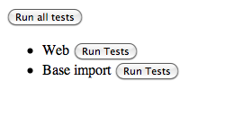
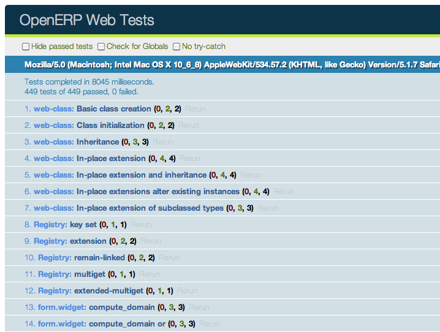
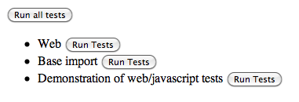
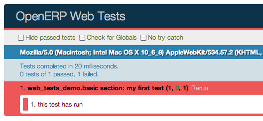
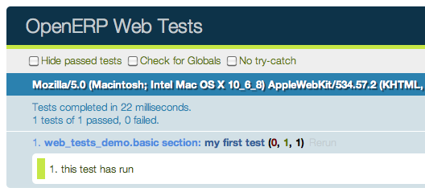
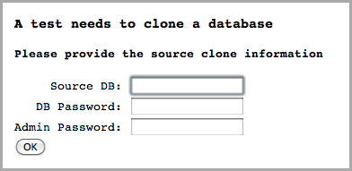

.. highlight:: javascript

Testing in OpenERP Web
======================

Javascript Unit Testing
-----------------------

OpenERP Web 7.0 includes means to unit-test both the core code of
OpenERP Web and your own javascript modules. On the javascript side,
unit-testing is based on QUnit_ with a number of helpers and
extensions for better integration with OpenERP.

To see what the runner looks like, find (or start) an OpenERP server
with the web client enabled, and navigate to ``/web/tests`` e.g. `on
OpenERP's CI <http://trunk.runbot.openerp.com/web/tests>`_. This will
show the runner selector, which lists all modules with javascript unit
tests, and allows starting any of them (or all javascript tests in all
modules at once).

Clicking any runner button will launch the corresponding tests in the
bundled QUnit_ runner:

Writing a test case
-------------------

The first step is to list the test file(s). This is done through the
``test`` key of the openerp manifest, by adding javascript files to it
(next to the usual YAML files, if any):

.. code-block:: python

    {
        'name': "Demonstration of web/javascript tests",
        'category': 'Hidden',
        'depends': ['web'],
        'test': ['static/test/demo.js'],
    }

and to create the corresponding test file(s)

.. note::

    Test files which do not exist will be ignored, if all test files
    of a module are ignored (can not be found), the test runner will
    consider that the module has no javascript tests.

After that, refreshing the runner selector will display the new module
and allow running all of its (0 so far) tests:

The next step is to create a test case::

    openerp.testing.section('basic section', function (test) {
        test('my first test', function () {
            ok(false, "this test has run");
        });
    });

All testing helpers and structures live in the ``openerp.testing``
module. OpenERP tests live in a :js:func:`~openerp.testing.section`,
which is itself part of a module. The first argument to a section is
the name of the section, the second one is the section body.

:js:func:`~openerp.testing.test`, provided by the
:js:func:`~openerp.testing.section` to the callback, is used to
register a given test case which will be run whenever the test runner
actually does its job. OpenERP Web test case use standard `QUnit
assertions`_ within them.

Launching the test runner at this point will run the test and display
the corresponding assertion message, with red colors indicating the
test failed:

Fixing the test (by replacing ``false`` to ``true`` in the assertion)
will make it pass:

Assertions
----------

As noted above, OpenERP Web's tests use `qunit assertions`_. They are
available globally (so they can just be called without references to
anything). The following list is available:

.. js:function:: ok(state[, message])

    checks that ``state`` is truthy (in the javascript sense)

.. js:function:: strictEqual(actual, expected[, message])

    checks that the actual (produced by a method being tested) and
    expected values are identical (roughly equivalent to ``ok(actual
    === expected, message)``)

.. js:function:: notStrictEqual(actual, expected[, message])

    checks that the actual and expected values are *not* identical
    (roughly equivalent to ``ok(actual !== expected, message)``)

.. js:function:: deepEqual(actual, expected[, message])

    deep comparison between actual and expected: recurse into
    containers (objects and arrays) to ensure that they have the same
    keys/number of elements, and the values match.

.. js:function:: notDeepEqual(actual, expected[, message])

    inverse operation to :js:func:`deepEqual`

.. js:function:: throws(block[, expected][, message])

    checks that, when called, the ``block`` throws an
    error. Optionally validates that error against ``expected``.

    :param Function block:
    :param expected: if a regexp, checks that the thrown error's
                     message matches the regular expression. If an
                     error type, checks that the thrown error is of
                     that type.
    :type expected: Error | RegExp

.. js:function:: equal(actual, expected[, message])

    checks that ``actual`` and ``expected`` are loosely equal, using
    the ``==`` operator and its coercion rules.

.. js:function:: notEqual(actual, expected[, message])

    inverse operation to :js:func:`equal`

Getting an OpenERP instance
---------------------------

The OpenERP instance is the base through which most OpenERP Web
modules behaviors (functions, objects, …) are accessed. As a result,
the test framework automatically builds one, and loads the module
being tested and all of its dependencies inside it. This new instance
is provided as the first positional parameter to your test
cases. Let's observe by adding javascript code (not test code) to the
test module:

.. code-block:: python

    {
        'name': "Demonstration of web/javascript tests",
        'category': 'Hidden',
        'depends': ['web'],
        'js': ['static/src/js/demo.js'],
        'test': ['static/test/demo.js'],
    }

::

    // src/js/demo.js
    openerp.web_tests_demo = function (instance) {
        instance.web_tests_demo = {
            value_true: true,
            SomeType: instance.web.Class.extend({
                init: function (value) {
                    this.value = value;
                }
            })
        };
    };

and then adding a new test case, which simply checks that the
``instance`` contains all the expected stuff we created in the
module::

    // test/demo.js
    test('module content', function (instance) {
        ok(instance.web_tests_demo.value_true, "should have a true value");
        var type_instance = new instance.web_tests_demo.SomeType(42);
        strictEqual(type_instance.value, 42, "should have provided value");
    });

DOM Scratchpad
--------------

As in the wider client, arbitrarily accessing document content is
strongly discouraged during tests. But DOM access is still needed to
e.g. fully initialize :js:class:`widgets <~openerp.web.Widget>` before
testing them.

Thus, test cases get a DOM scratchpad as its second positional
parameter, in a jQuery instance. That scratchpad is fully cleaned up
before each test, and as long as it doesn't do anything outside the
scratchpad your code can do whatever it wants::

    // test/demo.js
    test('DOM content', function (instance, $scratchpad) {
        $scratchpad.html('
ok
');
        ok($scratchpad.find('span').hasClass('foo'),
           "should have provided class");
    });
    test('clean scratchpad', function (instance, $scratchpad) {
        ok(!$scratchpad.children().length, "should have no content");
        ok(!$scratchpad.text(), "should have no text");
    });

.. note::

    The top-level element of the scratchpad is not cleaned up, test
    cases can add text or DOM children but shoud not alter
    ``$scratchpad`` itself.

Loading templates
-----------------

To avoid the corresponding processing costs, by default templates are
not loaded into QWeb. If you need to render e.g. widgets making use of
QWeb templates, you can request their loading through the
:js:attr:`~TestOptions.templates` option to the :js:func:`test case
function <openerp.testing.case>`.

This will automatically load all relevant templates in the instance's
qweb before running the test case:

.. code-block:: python

    {
        'name': "Demonstration of web/javascript tests",
        'category': 'Hidden',
        'depends': ['web'],
        'js': ['static/src/js/demo.js'],
        'test': ['static/test/demo.js'],
        'qweb': ['static/src/xml/demo.xml'],
    }

.. code-block:: xml

    <!-- src/xml/demo.xml -->
    <templates id="template" xml:space="preserve">
        <t t-name="DemoTemplate">
            <t t-foreach="5" t-as="value">
                
<t t-esc="value"/>

            </t>
        </t>
    </templates>

::

    // test/demo.js
    test('templates', {templates: true}, function (instance) {
        var s = instance.web.qweb.render('DemoTemplate');
        var texts = $(s).find('p').map(function () {
            return $(this).text();
        }).get();

        deepEqual(texts, ['0', '1', '2', '3', '4']);
    });

Asynchronous cases
------------------

The test case examples so far are all synchronous, they execute from
the first to the last line and once the last line has executed the
test is done. But the web client is full of :doc:`asynchronous code
</async>`, and thus test cases need to be async-aware.

This is done by returning a :js:class:`deferred <Deferred>` from the
case callback::

    // test/demo.js
    test('asynchronous', {
        asserts: 1
    }, function () {
        var d = $.Deferred();
        setTimeout(function () {
            ok(true);
            d.resolve();
        }, 100);
        return d;
    });

This example also uses the :js:class:`options parameter <TestOptions>`
to specify the number of assertions the case should expect, if less or
more assertions are specified the case will count as failed.

Asynchronous test cases *must* specify the number of assertions they
will run. This allows more easily catching situations where e.g. the
test architecture was not warned about asynchronous operations.

.. note::

    Asynchronous test cases also have a 10 seconds timeout: if the
    test does not finish within 10 seconds, it will be considered
    failed. This pretty much always means the test will not resolve.

.. note::

    If the returned deferred is rejected, the test will be failed
    unless :js:attr:`~TestOptions.fail_on_rejection` is set to
    ``false``.

RPC
---

An important subset of asynchronous test cases is test cases which
need to perform (and chain, to an extent) RPC calls.

.. note::

    Because they are a subset of asynchronous cases, RPC cases must
    also provide a valid :js:attr:`assertions count
    <TestOptions.asserts>`.

By default, test cases will fail when trying to perform an RPC
call. The ability to perform RPC calls must be explicitly requested by
a test case (or its containing test suite) through
:js:attr:`~TestOptions.rpc`, and can be one of two modes: ``mock`` or
``rpc``.

Mock RPC
++++++++

The preferred (and fastest from a setup and execution time point of
view) way to do RPC during tests is to mock the RPC calls: while
setting up the test case, provide what the RPC responses "should" be,
and only test the code between the "user" (the test itself) and the
RPC call, before the call is effectively done.

To do this, set the :js:attr:`rpc option <TestOptions.rpc>` to
``mock``. This will add a third parameter to the test case callback:

.. js:function:: mock(rpc_spec, handler)

    Can be used in two different ways depending on the shape of the
    first parameter:

    * If it matches the pattern ``model:method`` (if it contains a
      colon, essentially) the call will set up the mocking of an RPC
      call straight to the OpenERP server (through XMLRPC) as
      performed via e.g. :js:func:`openerp.web.Model.call`.

      In that case, ``handler`` should be a function taking two
      arguments ``args`` and ``kwargs``, matching the corresponding
      arguments on the server side and should simply return the value
      as if it were returned by the Python XMLRPC handler::

          test('XML-RPC', {rpc: 'mock', asserts: 3}, function (instance, $s, mock) {
              // set up mocking
              mock('people.famous:name_search', function (args, kwargs) {
                  strictEqual(kwargs.name, 'bob');
                  return [
                      [1, "Microsoft Bob"],
                      [2, "Bob the Builder"],
                      [3, "Silent Bob"]
                  ];
              });

              // actual test code
              return new instance.web.Model('people.famous')
                  .call('name_search', {name: 'bob'}).pipe(function (result) {
                      strictEqual(result.length, 3, "shoud return 3 people");
                      strictEqual(result[0][1], "Microsoft Bob",
                          "the most famous bob should be Microsoft Bob");
                  });
          });

    * Otherwise, if it matches an absolute path (e.g. ``/a/b/c``) it
      will mock a JSON-RPC call to a web client controller, such as
      ``/web/webclient/translations``. In that case, the handler takes
      a single ``params`` argument holding all of the parameters
      provided over JSON-RPC.

      As previously, the handler should simply return the result value
      as if returned by the original JSON-RPC handler::

          test('JSON-RPC', {rpc: 'mock', asserts: 3, templates: true}, function (instance, $s, mock) {
              var fetched_dbs = false, fetched_langs = false;
              mock('/web/database/get_list', function () {
                  fetched_dbs = true;
                  return ['foo', 'bar', 'baz'];
              });
              mock('/web/session/get_lang_list', function () {
                  fetched_langs = true;
                  return [['vo_IS', 'Hopelandic / Vonlenska']];
              });

              // widget needs that or it blows up
              instance.webclient = {toggle_bars: openerp.testing.noop};
              var dbm = new instance.web.DatabaseManager({});
              return dbm.appendTo($s).pipe(function () {
                  ok(fetched_dbs, "should have fetched databases");
                  ok(fetched_langs, "should have fetched languages");
                  deepEqual(dbm.db_list, ['foo', 'bar', 'baz']);
              });
          });

.. note::

    Mock handlers can contain assertions, these assertions should be
    part of the assertions count (and if multiple calls are made to a
    handler containing assertions, it multiplies the effective number
    of assertions).

.. _testing-rpc-rpc:

Actual RPC
++++++++++

A more realistic (but significantly slower and more expensive) way to
perform RPC calls is to perform actual calls to an actually running
OpenERP server. To do this, set the :js:attr:`rpc option
<~TestOptions.rpc>` to ``rpc``, it will not provide any new parameter
but will enable actual RPC, and the automatic creation and destruction
of databases (from a specified source) around tests.

First, create a basic model we can test stuff with:

.. code-block:: javascript

    from openerp.osv import orm, fields

    class TestObject(orm.Model):
        _name = 'web_tests_demo.model'

        _columns = {
            'name': fields.char("Name", required=True),
            'thing': fields.char("Thing"),
            'other': fields.char("Other", required=True)
        }
        _defaults = {
            'other': "bob"
        }

then the actual test::

    test('actual RPC', {rpc: 'rpc', asserts: 4}, function (instance) {
        var Model = new instance.web.Model('web_tests_demo.model');
        return Model.call('create', [{name: "Bob"}])
            .pipe(function (id) {
                return Model.call('read', [[id]]);
            }).pipe(function (records) {
                strictEqual(records.length, 1);
                var record = records[0];
                strictEqual(record.name, "Bob");
                strictEqual(record.thing, false);
                // default value
                strictEqual(record.other, 'bob');
            });
    });

This test looks like a "mock" RPC test but for the lack of mock
response (and the different ``rpc`` type), however it has further
ranging consequences in that it will copy an existing database to a
new one, run the test in full on that temporary database and destroy
the database, to simulate an isolated and transactional context and
avoid affecting other tests. One of the consequences is that it takes
a *long* time to run (5~10s, most of that time being spent waiting for
a database duplication).

Furthermore, as the test needs to clone a database, it also has to ask
which database to clone, the database/super-admin password and the
password of the ``admin`` user (in order to authenticate as said
user). As a result, the first time the test runner encounters an
``rpc: "rpc"`` test configuration it will produce the following
prompt:

and stop the testing process until the necessary information has been
provided.

The prompt will only appear once per test run, all tests will use the
same "source" database.

.. note::

    The handling of that information is currently rather brittle and
    unchecked, incorrect values will likely crash the runner.

.. note::

    The runner does not currently store this information (for any
    longer than a test run that is), the prompt will have to be filled
    every time.

Testing API
-----------

.. js:function:: openerp.testing.section(name[, options], body)

    A test section, serves as shared namespace for related tests (for
    constants or values to only set up once). The ``body`` function
    should contain the tests themselves.

    Note that the order in which tests are run is essentially
    undefined, do *not* rely on it.

    :param String name:
    :param TestOptions options:
    :param body:
    :type body: Function<:js:func:`~openerp.testing.case`, void>

.. js:function:: openerp.testing.case(name[, options], callback)

    Registers a test case callback in the test runner, the callback
    will only be run once the runner is started (or maybe not at all,
    if the test is filtered out).

    :param String name:
    :param TestOptions options:
    :param callback:
    :type callback: Function<instance, $, Function<String, Function, void>>

.. js:class:: TestOptions

    the various options which can be passed to
    :js:func:`~openerp.testing.section` or
    :js:func:`~openerp.testing.case`. Except for
    :js:attr:`~TestOptions.setup` and
    :js:attr:`~TestOptions.teardown`, an option on
    :js:func:`~openerp.testing.case` will overwrite the corresponding
    option on :js:func:`~openerp.testing.section` so
    e.g. :js:attr:`~TestOptions.rpc` can be set for a
    :js:func:`~openerp.testing.section` and then differently set for
    some :js:func:`~openerp.testing.case` of that
    :js:func:`~openerp.testing.section`

    .. js:attribute:: TestOptions.asserts

        An integer, the number of assertions which should run during a
        normal execution of the test. Mandatory for asynchronous tests.

    .. js:attribute:: TestOptions.setup

        Test case setup, run right before each test case. A section's
        :js:func:`~TestOptions.setup` is run before the case's own, if
        both are specified.

    .. js:attribute:: TestOptions.teardown

        Test case teardown, a case's :js:func:`~TestOptions.teardown`
        is run before the corresponding section if both are present.

    .. js:attribute:: TestOptions.fail_on_rejection

        If the test is asynchronous and its resulting promise is
        rejected, fail the test. Defaults to ``true``, set to
        ``false`` to not fail the test in case of rejection::

            // test/demo.js
            test('unfail rejection', {
                asserts: 1,
                fail_on_rejection: false
            }, function () {
                var d = $.Deferred();
                setTimeout(function () {
                    ok(true);
                    d.reject();
                }, 100);
                return d;
            });

    .. js:attribute:: TestOptions.rpc

        RPC method to use during tests, one of ``"mock"`` or
        ``"rpc"``. Any other value will disable RPC for the test (if
        they were enabled by the suite for instance).

    .. js:attribute:: TestOptions.templates

        Whether the current module (and its dependencies)'s templates
        should be loaded into QWeb before starting the test. A
        boolean, ``false`` by default.

The test runner can also use two global configuration values set
directly on the ``window`` object:

* ``oe_all_dependencies`` is an ``Array`` of all modules with a web
  component, ordered by dependency (for a module ``A`` with
  dependencies ``A'``, any module of ``A'`` must come before ``A`` in
  the array)

* ``oe_db_info`` is an object with 3 keys ``source``, ``supadmin`` and
  ``password``. It is used to pre-configure :ref:`actual RPC
  <testing-rpc-rpc>` tests, to avoid a prompt being displayed
  (especially for headless situations).

Running through Python
----------------------

.. todo:: make that work and document it

.. _qunit: http://qunitjs.com/

.. _qunit assertions: http://api.qunitjs.com/category/assert/
