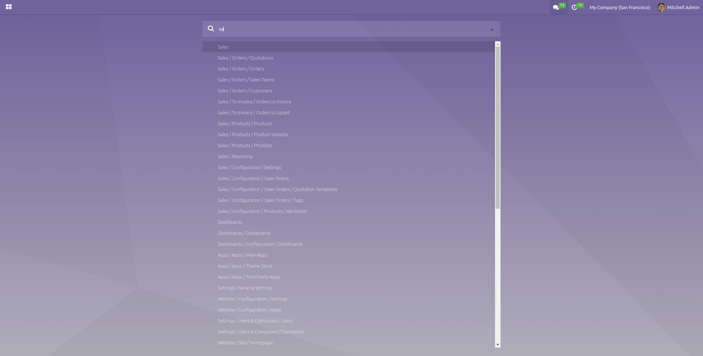
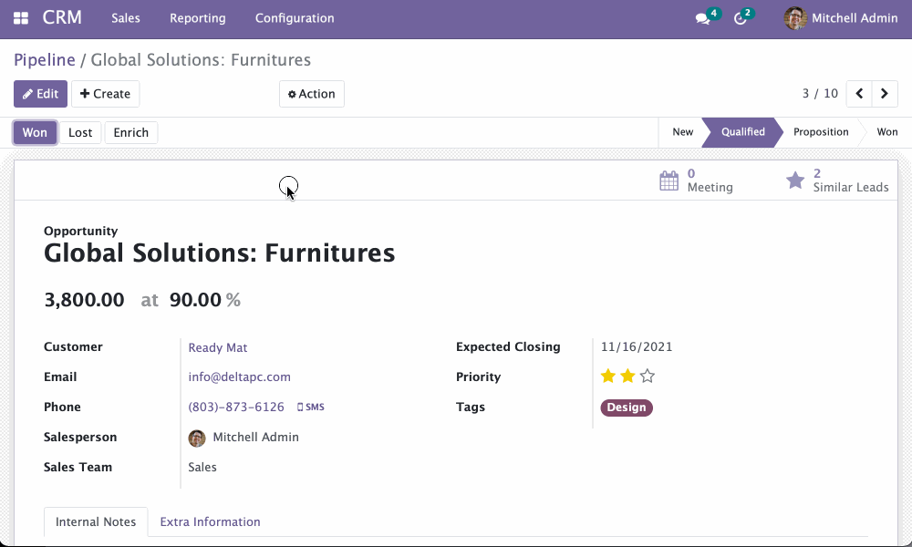

This module adds responsiveness to web backend.

**Features for all devices**:

- Redirect to the dashboard after logging in.
Users will only be redirected to the home page after login
if they have enabled the 'Redirect to Home' option in
their profile settings.

  

- New navigation with the fullscreen app menu

  

- Quick menu search inside the app menu

  

- Sticky header & footer in list view

  

- Sticky statusbar in form view

  

- Bigger checkboxes in list view

  

**Features for mobile**: \* View type picker dropdown displays
comfortably

- Control panel buttons use icons to save space.

  

- Followers and send button is displayed on mobile. Avatar is hidden.

  

- Big inputs on form in edit mode

**Features for desktop computers**:

- Keyboard shortcuts for easier navigation, **using \`Alt + Shift +
  \[NUM\]\`** combination instead of just Alt + \[NUM\] to avoid
  conflict with Firefox Tab switching. Standard Odoo keyboard hotkeys
  changed to be more intuitive or accessible by fingers of one hand.
  F.x. Alt + S for Save

  

- Autofocus on search menu box when opening the app menu

  

- When the chatter is on the side part, the document viewer fills that
  part for side-by-side reading instead of full screen. You can still
  put it on full width preview clicking on the new maximize button.

  

- When the user chooses to send a public message the color of the
  composer is different from the one when the message is an internal
  log.

  
