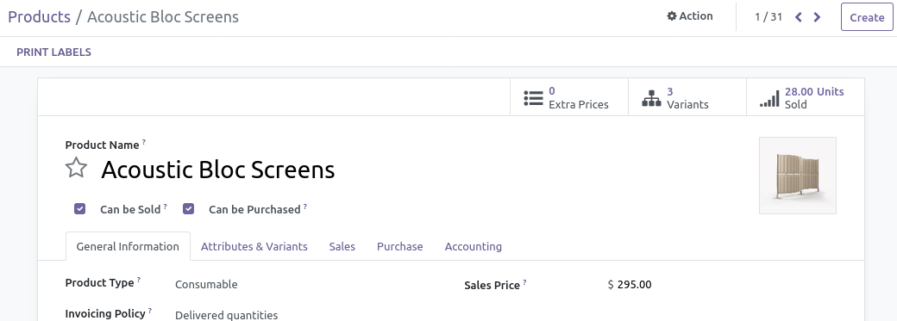
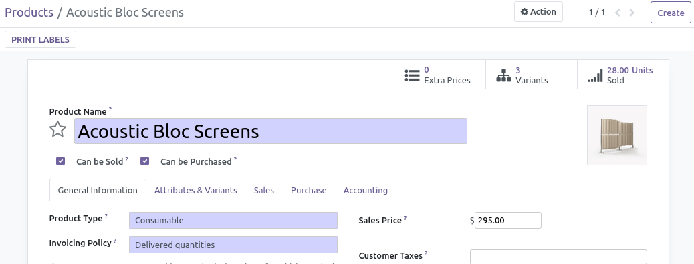

This module extend the Odoo Community Edition ``web`` module to improve visibility
of form view.

**Rational:**
In Odoo V16, the design is very pure. That's great, but it generates some problem for
users :

* buttons and fields are not identifiable. (we can not know exactly where there are
  until you hover over them with the cursor)

* there is no indication for the required fields until trying to save (or exit the screen)

In a way, this module restores the form display of version 15, but preserving the "save on the fly" new feature.

**Without this module**

**With this module**

