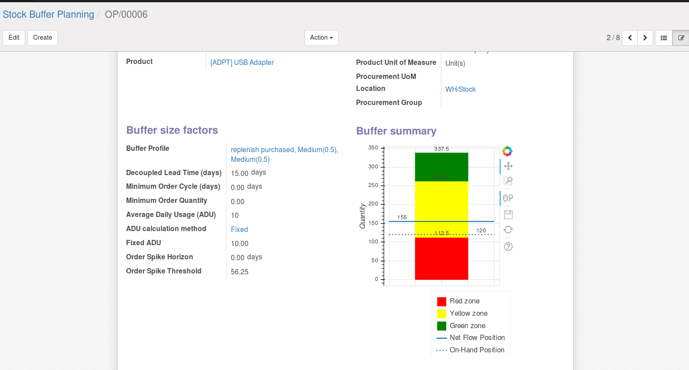

This module add the possibility to insert Bokeh charts into Odoo standard views.

`Bokeh <https://bokeh.pydata.org>`__ is a Python interactive visualization
library that targets modern web browsers for presentation. Its goal is to
provide elegant, concise construction of basic exploratory and advanced
custom graphics in the style of D3.js, but also deliver this capability with
high-performance interactivity over very large or streaming datasets. Bokeh
can help anyone who would like to quickly and easily create interactive
plots, dashboards, and data applications.

If you want to see some samples of bokeh's capabilities follow this `link
<https://bokeh.pydata.org/en/latest/docs/gallery.html>`_.
