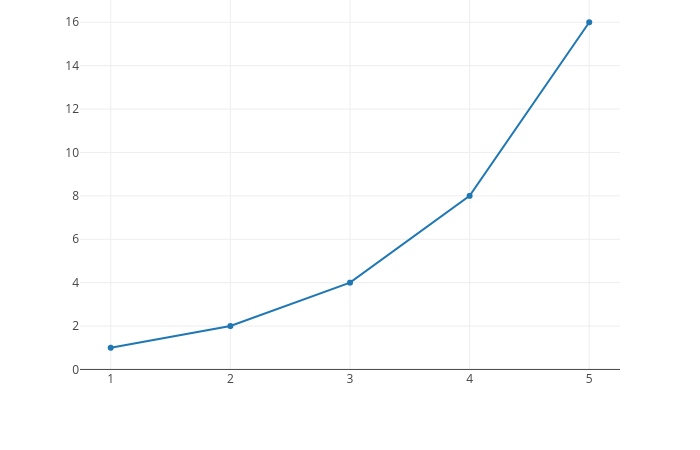

This module add the possibility to insert Plotly charts into Odoo standard views.

`Plotly <https://plot.ly/>`__ is a Python interactive visualization
library built on top of d3.js and stack.gl, plotly.js is a high-level,
declarative charting library. plotly.js ships with over 40 chart types,
including scientific charts, 3D graphs, statistical charts, SVG maps, financial
charts, and more.

If you want to see some samples of plotly's capabilities follow this `link
<https://github.com/plotly/plotly.py#overview>`_.
