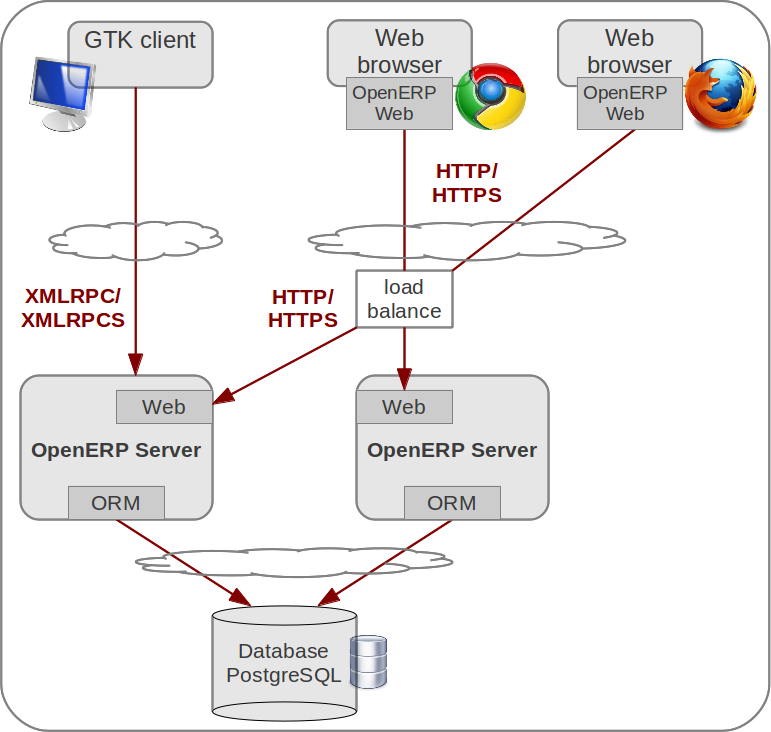
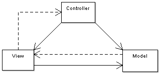

========================================
Architecture
========================================

OpenERP as a multitenant three-tiers architecture
=================================================

This section presents the OpenERP architecture along with technology details
of the application. The tiers composing OpenERP are presented. Communication
means and protocols between the application components are also presented.
Some details about used development languages and technology stack are then summarized.

OpenERP is a `multitenant <http://en.wikipedia.org/wiki/Multitenancy>`_, `three-tiers architecture 
<http://en.wikipedia.org/wiki/Multitier_architecture#Three-tier_architecture>`_:
database tier for data storage, application tier for processing and functionalities
and presentation tier providing user interface. Those are separate layers
inside OpenERP. The application tier itself is written as a core; multiple
additional modules can be installed in order to create a particular instance
of OpenERP adapted to specific needs and requirements. Moreover, OpenERP
follows the Model-View-Controller (MVC) architectural pattern.

A typical deployment of OpenERP is shown on `Figure 1`_. This deployment is
called Web embedded deployment. As shown, an OpenERP system consists of
three main components:

- a PostgreSQL database server which contains all OpenERP databases. 
  Databases contain all application data, and also most of the OpenERP
  system configuration elements. Note that this server can possibly be
  deployed using clustered databases.
- the OpenERP Server, which contains all the enterprise logic and ensures
  that OpenERP runs optimally. One layer of the server is dedicated to
  communicate and interface with the PostgreSQL database, the ORM engine.
  Another layer allows communications between the server and a web browser,
  the Web layer. Having more than one server is possible, for example in
  conjunction with a load balancing mechanism.
- the client running in the a web browser as javascript application.

The database server and the OpenERP server can be installed on the same
computer, or distributed onto separate computer servers, for example for
performance considerations.

.. _`Figure 1`:

   
   OpenERP 6.1 architecture for embedded web deployment

The next subsections give details about the different tiers of the OpenERP
architecture.

PostgreSQL database
+++++++++++++++++++

The data tier of OpenERP is provided by a PostgreSQL relational database.
While direct SQL queries can be executed from OpenERP modules, most accesses
to the relational database are done through the server Object Relational
Mapping layer.

Databases contain all application data, and also most of the OpenERP system
configuration elements. Note that this server can possibly be deployed using
clustered databases.

OpenERP server
++++++++++++++

OpenERP provides an application server on which specific business applications
can be built. It is also a complete development framework, offering a range
of features to write those applications. Among those features, the OpenERP
ORM provides functionalities and an interface on top of the PostgreSQL server.
The OpenERP server also features a specific layer designed to communicate
with the web browser-based client. This layer connects users using standard
browsers to the server.

From a developer perspective, the server acts both as a library which brings
the above benefits while hiding the low-level details, and as a simple way
to install, configure and run the written applications. The server also contains
other services, such as extensible data models and view, workflow engine or
reports engine. However, those are OpenERP services not specifically related
to security, and are therefore not discussed in details in this document.

**Server - ORM**

The Object Relational Mapping ORM layer is one of the salient features of
the OpenERP Server. It provides additional and essential functionalities
on top of PostgreSQL server. Data models are described in Python and OpenERP
creates the underlying database tables using this ORM. All the benefits of
RDBMS such as unique constraints, relational integrity or efficient querying
are used and completed by Python flexibility. For instance, arbitrary constraints
written in Python can be added to any model. Different modular extensibility
mechanisms are also afforded by OpenERP.

It is important to understand the ORM responsibility before attempting to
by-pass it and to access directly the underlying database via raw SQL queries.
When using the ORM, OpenERP can make sure the data remains free of any corruption.
For instance, a module can react to data creation in a particular table.
This behavior can occur only if queries go through the ORM.

The services granted by the ORM are among other :

 - consistency validation by powerful validity checks,
 - providing an interface on objects (methods, references, ...) allowing
   to design and implement efficient modules,
 - row-level security per user and group; more details about users and user
   groups are given in the section Users and User Roles,
 - complex actions on a group of resources,
 - inheritance service allowing fine modeling of new resources

**Server - Web**

The web layer offers an interface to communicate with standard browsers.
In the 6.1 version of OpenERP, the web-client has been rewritten and integrated
into the OpenERP server tier. This web layer is a WSGI-compatible application
based on werkzeug. It handles regular http queries to server static file or
dynamic content and JSON-RPC queries for the RPC made from the browser.

**Modules**

By itself, the OpenERP server is a core. For any enterprise, the value of
OpenERP lies in its different modules. The role of the modules is to implement
any business requirement. The server is the only necessary component to
add modules. Any official OpenERP release includes a lot of modules, and
hundreds of modules are available thanks to the community. Examples of
such modules are Account, CRM, HR, Marketing, MRP, Sale, etc.

Clients
+++++++

As the application logic is mainly contained server-side, the client is
conceptually simple. It issues a request to the server, gets data back
and display the result (e.g. a list of customers) in different ways
(as forms, lists, calendars, ...). Upon user actions, it sends queries
to modify data to the server.

The default client of OpenERP is an JavaScript application running in the
browser that communicates with the server using JSON-RPC.

MVC architecture in OpenERP
===========================

According to `Wikipedia <http://en.wikipedia.org/wiki/Model-view-controller>`_,
"a Model-view-controller (MVC) is an architectural pattern used in software
engineering". In complex computer applications presenting lots of data to
the user, one often wishes to separate data (model) and user interface (view)
concerns. Changes to the user interface does therefore not impact data
management, and data can be reorganized without changing the user interface.
The model-view-controller solves this problem by decoupling data access
and business logic from data presentation and user interaction, by
introducing an intermediate component: the controller.

.. _`Figure 3`:

   
   Model-View-Controller diagram

For example in the diagram above, the solid lines for the arrows starting
from the controller and going to both the view and the model mean that the
controller has a complete access to both the view and the model. The dashed
line for the arrow going from the view to the controller means that the view
has a limited access to the controller. The reasons of this design are :

 - From **View** to **Model** : the model sends notification to the view
   when its data has been modified in order the view to redraw its content.
   The model doesn't need to know the inner workings of the view to perform
   this operation. However, the view needs to access the internal parts of the model.
 - From **View** to **Controller** : the reason why the view has limited
   access to the controller is because the dependencies from the view to
   the controller need to be minimal: the controller can be replaced at
   any moment. 

OpenERP follows the MVC semantic with

 - model : The PostgreSQL tables.
 - view : views are defined in XML files in OpenERP.
 - controller : The objects of OpenERP. 

Network communications and WSGI
===============================
OpenERP is an HTTP web server and may also be deployed as an WSGI-compliant
application.

Clients may communicate with OpenERP using sessionless XML-RPC, the recommended
way to interoperate with OpenERP. Web-based clients communicates using the
session aware JSON-RPC.

Everything in OpenERP, and objects methods in particular, are exposed via
the network and a security layer. Access to the data model is in fact a ‘service’
and it is possible to expose new services. For instance, a WebDAV service and
a FTP service are available.

Services can make use of the `WSGI
<http://en.wikipedia.org/wiki/Web_Server_Gateway_Interface>`_ stack. WSGI is a
standard solution in the Python ecosystem to write HTTP servers, applications,
and middleware which can be used in a mix-and-match fashion. By using WSGI, it
is possible to run OpenERP in any WSGI compliant server. It is also possible to
use OpenERP to host a WSGI application.

A striking example of this possibility is the OpenERP Web layer that is
the server-side counter part to the web clients. It provides the requested
data to the browser and manages web sessions. It is a WSGI-compliant application.
As such, it can be run as a stand-alone HTTP server or embedded inside OpenERP.

The HTTP namespaces /openerp/ /object/ /common/ are reserved for the XML-RPC
layer, every module restrict it's HTTP namespace to /<name_of_the_module>/

