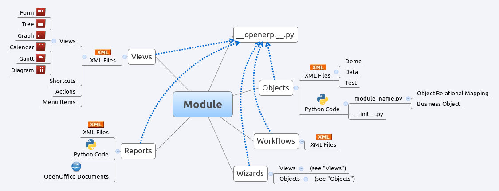

.. _module-dev-structure:

Module structure
================

A module can contain the following elements:

 - **Business object** : declared as Python classes extending the class
   osv.Model, the persistence of these resource is completly managed by
   OpenERP's ORM.
 - **Data** : XML/CSV files with meta-data (views and workflows declaration), 
   configuration data (modules parametrization) and demo data (optional but 
   recommended for testing),
 - **Reports** : RML (XML format). HTML/MAKO or OpenOffice report templates, to
   be merged with any kind of business data, and generate HTML, ODT or PDF
   reports.

   
   Module composition

Each module is contained in its own directory within either the server/bin/addons 
directory or another directory of addons, configured in server installation.
To create a new module for example the 'OpenAcademy' module, the following
steps are required:

 - create a ``openacademy`` subdirectory in the source/addons directory
 - create the module import file ``__init__.py``
 - create the module manifield file ``__openerp__.py``
 - create **Python** files containing **objects**
 - create **.xml files** holding module data such as views, menu entries 
   or demo data
 - optionally create **reports** or **workflows**

Python import file __init__.py
++++++++++++++++++++++++++++++

The ``__init__.py`` file is the Python import file, because an OpenERP module
is also a regular Python module. The file should import all the other python
file or submodules.

For example, if a module contains a single python file named ``openacademy.py``,
the file should look like:

    import openacademy

Manifest file __openerp__.py
+++++++++++++++++++++++++++++++

In the created module directory, you must add a **__openerp__.py** file.
This file, which must be a Python dict literal, is responsible to

   1. determine the *XML files that will be parsed* during the initialization
      of the server, and also to
   2. determine the *dependencies* of the created module.
   3. declare additional meta data

This file must contain a Python dictionary with the following values:

::

  name             The name of the module in English.
  version          The version of the module.
  summary          Short description or keywords
  description      The module description (text).
  category         The categrory of the module
  author           The author of the module.
  website          URL of the website of the module.
  license          The license of the module (default: AGPL-3).
  depends          List of modules on which this module depends beside base.
  data             List of .xml files to load when the module is installed or updated.
  demo             List of additional .xml files to load when the module is
                   installed or updated and demo flag is active.
  installable      True or False. Determines whether the module is installable 
                   or not.
  auto_install     True or False (default: False). If set to ``True``, the
                   module is a link module. It will be installed as soon
                   as all its dependencies are installed.

For the ``openacademy`` module, here is an example of ``__openerp__.py``
declaration file:

.. code-block:: python

    {
        'name' : "OpenAcademy",
        'version' : "1.0",
        'author' : "OpenERP SA",
        'category' : "Tools",
        'depends' : ['mail'],
        'data' : [
            'openacademy_view.xml',
            'openacademy_data.xml',
            'report/module_report.xml',
            'wizard/module_wizard.xml',
        ],
        'demo' : [
            'openacademy_demo.xml'
        ],
        'installable': True,
    }

Objects
+++++++

All OpenERP resources are objects: invoices, partners. Metadata are also object
too: menus, actions, reports...  Object names are hierarchical, as in the
following examples:

    * account.transfer : a money transfer
    * account.invoice : an invoice
    * account.invoice.line : an invoice line

Generally, the first word is the name of the module: account, stock, sale.

Those object are declared in python be subclassing osv.Model

The ORM of OpenERP is constructed over PostgreSQL. It is thus possible to
query the object used by OpenERP using the object interface (ORM) or by
directly using SQL statements.

But it is dangerous to write or read directly in the PostgreSQL database, as
you will shortcut important steps like constraints checking or workflow
modification.

.. .. figure::  images/pom_3_0_3.png
..    :scale: 50
..    :align: center

..    *The Physical Objects Model of [OpenERP version 3.0.3]*

XML Files
+++++++++

XML files located in the module directory are used to initialize or update the
the database when the module is installed or updated. They are used for many
purposes, among which we can cite :

    * initialization and demonstration data declaration,
    * views declaration,
    * reports declaration,
    * workflows declaration.

General structure of OpenERP XML files is more detailed in the 
:ref:`xml-serialization` section. Look here if you are interested in learning 
more about *initialization* and *demonstration data declaration* XML files. The 
following section are only related to XML specific to *actions, menu entries, 
reports, wizards* and *workflows* declaration.

Data can be inserted or updated into the PostgreSQL tables corresponding to the
OpenERP objects using XML files. The general structure of an OpenERP XML file
is as follows:

.. code-block:: xml

   <?xml version="1.0"?>
   <openerp>
     <data>
       <record model="model.name_1" id="id_name_1">
         <field name="field1"> "field1 content" </field>
         <field name="field2"> "field2 content" </field>
         (...)
       </record>
       <record model="model.name_2" id="id_name_2">
           (...)
       </record>
       (...)
     </data>
   </openerp>

Record Tag
//////////

**Description**

The addition of new data is made with the record tag. This one takes a
mandatory attribute : model. Model is the object name where the insertion has
to be done. The tag record can also take an optional attribute: id. If this
attribute is given, a variable of this name can be used later on, in the same
file, to make reference to the newly created resource ID.

A record tag may contain field tags. They indicate the record's fields value.
If a field is not specified the default value will be used.

The Record Field tag
////////////////////

The attributes for the field tag are the following:

name : mandatory
  the field name

eval : optional
  python expression that indicating the value to add
  
ref
  reference to an id defined in this file

model
  model to be looked up in the search

search
  a query

**Example**

.. code-block:: xml

    <record model="ir.actions.report.xml" id="l0">
         <field name="model">account.invoice</field>
         <field name="name">Invoices List</field>
         <field name="report_name">account.invoice.list</field>
         <field name="report_xsl">account/report/invoice.xsl</field>
         <field name="report_xml">account/report/invoice.xml</field>
    </record>

Let's review an example taken from the OpenERP source (base_demo.xml in the base module):

.. code-block:: xml

       <record model="res.company" id="main_company">
           <field name="name">Tiny sprl</field>
           <field name="partner_id" ref="main_partner"/>
           <field name="currency_id" ref="EUR"/>
       </record>

.. code-block:: xml

       <record model="res.users" id="user_admin">
           <field name="login">admin</field>
           <field name="password">admin</field>
           <field name="name">Administrator</field>
           <field name="signature">Administrator</field>
           <field name="action_id" ref="action_menu_admin"/>
           <field name="menu_id" ref="action_menu_admin"/>
           <field name="address_id" ref="main_address"/>
           <field name="groups_id" eval="[(6,0,[group_admin])]"/>
           <field name="company_id" ref="main_company"/>
       </record>

This last record defines the admin user :

    * The fields login, password, etc are straightforward.
    * The ref attribute allows to fill relations between the records :

.. code-block:: xml

       <field name="company_id" ref="main_company"/>

The field **company_id** is a many-to-one relation from the user object to the company object, and **main_company** is the id of to associate.

    * The **eval** attribute allows to put some python code in the xml: here the groups_id field is a many2many. For such a field, "[(6,0,[group_admin])]" means : Remove all the groups associated with the current user and use the list [group_admin] as the new associated groups (and group_admin is the id of another record).

    * The **search** attribute allows to find the record to associate when you do not know its xml id. You can thus specify a search criteria to find the wanted record. The criteria is a list of tuples of the same form than for the predefined search method. If there are several results, an arbitrary one will be chosen (the first one):

.. code-block:: xml

       <field name="partner_id" search="[]" model="res.partner"/>

This is a classical example of the use of **search** in demo data: here we do not really care about which partner we want to use for the test, so we give an empty list. Notice the **model** attribute is currently mandatory.

Function tag
////////////

A function tag can contain other function tags.

model : mandatory
  The model to be used

name : mandatory
  the function given name

eval
  should evaluate to the list of parameters of the method to be called, excluding cr and uid

**Example**

.. code-block:: xml

    <function model="ir.ui.menu" name="search" eval="[[('name','=','Operations')]]"/>

Views
+++++

Views are a way to represent the objects on the client side. They indicate to the client how to lay out the data coming from the objects on the screen.

There are two types of views:

    * form views
    * tree views

Lists are simply a particular case of tree views.

A same object may have several views: the first defined view of a kind (*tree, form*, ...) will be used as the default view for this kind. That way you can have a default tree view (that will act as the view of a one2many) and a specialized view with more or less information that will appear when one double-clicks on a menu item. For example, the products have several views according to the product variants.

Views are described in XML.

If no view has been defined for an object, the object is able to generate a view to represent itself. This can limit the developer's work but results in less ergonomic views.

Usage example
/////////////

When you open an invoice, here is the chain of operations followed by the client:

    * An action asks to open the invoice (it gives the object's data (account.invoice), the view, the domain (e.g. only unpaid invoices) ).
    * The client asks (with XML-RPC) to the server what views are defined for the invoice object and what are the data it must show.
    * The client displays the form according to the view

.. .. figure::  images/arch_view_use.png
..    :scale: 50
..    :align: center

To develop new objects
//////////////////////

The design of new objects is restricted to the minimum: create the objects and optionally create the views to represent them. The PostgreSQL tables do not have to be written by hand because the objects are able to automatically create them (or adapt them in case they already exist).

Reports
"""""""

OpenERP uses a flexible and powerful reporting system. Reports are generated either in PDF or in HTML. Reports are designed on the principle of separation between the data layer and the presentation layer.

Reports are described more in details in the `Reporting <http://openobject.com/wiki/index.php/Developers:Developper%27s_Book/Reports>`_ chapter.

Workflow
""""""""

The objects and the views allow you to define new forms very simply, lists/trees and interactions between them. But that is not enough, you must define the dynamics of these objects.

A few examples:

    * a confirmed sale order must generate an invoice, according to certain conditions
    * a paid invoice must, only under certain conditions, start the shipping order

The workflows describe these interactions with graphs. One or several workflows may be associated to the objects. Workflows are not mandatory; some objects don't have workflows.

Below is an example workflow used for sale orders. It must generate invoices and shipments according to certain conditions.

.. .. figure::  images/arch_workflow_sale.png
..    :scale: 85
..    :align: center

In this graph, the nodes represent the actions to be done:

    * create an invoice,
    * cancel the sale order,
    * generate the shipping order, ...

The arrows are the conditions;

    * waiting for the order validation,
    * invoice paid,
    * click on the cancel button, ...

The squared nodes represent other Workflows;

    * the invoice
    * the shipping

i18n
----

.. versionchanged:: 5.0

Each module has its own ``i18n`` folder. In addition, OpenERP can now deal with
``.po`` [#f_po]_ files as import/export format. The translation files of the
installed languages are automatically loaded when installing or updating a
module.

Translations are managed by the `Launchpad Web interface
<https://translations.launchpad.net/openobject>`_. Here, you'll find the list
of translatable projects.

Please read the `FAQ <https://answers.launchpad.net/rosetta/+faqs>`_ before asking questions.

.. [#f_po] http://www.gnu.org/software/autoconf/manual/gettext/PO-Files.html#PO-Files

