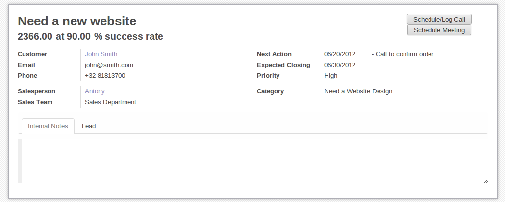
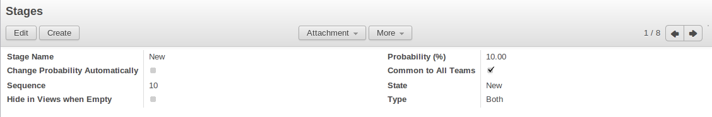

.. highlight:: xml

.. _form-view-guidelines:

Form Views Guidelines
=====================

.. sectionauthor:: Aline Preillon, Raphael Collet

This document presents functional and technical guidelines for
creating/organizing form views in Odoo. For each item, both the functional and
technical aspects are explained. The goal of the new style of forms is to make
Odoo easier to use, and to guide users through the system.

Business Views
--------------

Business views are targeted at regular users, not advanced users.  Examples
are: Opportunities, Products, Partners, Tasks, Projects, etc.

.. image:: forms/oppreadonly.png
   :class: img-responsive

In general, a business view is composed of

1. a status bar on top (with technical or business flow),
2. a sheet in the middle (the form itself),
3. a bottom part with History and Comments.

Technically, the new form views are structured as follows in XML::

    <form>
        <header> ... content of the status bar  ... </header>
        <sheet>  ... content of the sheet       ... </sheet>
        
 ... content of the bottom part ... 

    </form>

The Status Bar
''''''''''''''

The purpose of the status bar is to show the status of the current record and
the action buttons.

.. image:: forms/status.png
   :class: img-responsive

The Buttons
...........

The order of buttons follows the business flow. For instance, in a sale order,
the logical steps are:

1. Send the quotation
2. Confirm the quotation
3. Create the final invoice
4. Send the goods

Highlighted buttons (in red by default) emphasize the logical next step, to
help the user. It is usually the first active button. On the other hand,
:guilabel:`cancel` buttons *must* remain grey (normal).  For instance, in
Invoice the button :guilabel:`Refund` must never be red.

Technically, buttons are highlighted by adding the class "oe_highlight"::

    <button class="oe_highlight" name="..." type="..." states="..."/>

The Status
..........

Uses the ``statusbar`` widget, and shows the current state in red. States
common to all flows (for instance, a sale order begins as a quotation, then we
send it, then it becomes a full sale order, and finally it is done) should be
visible at all times but exceptions or states depending on particular sub-flow
should only be visible when current.

.. image:: forms/status1.png
   :class: img-responsive

.. image:: forms/status2.png
   :class: img-responsive

The states are shown following the order used in the field (the list in a
selection field, etc). States that are always visible are specified with the
attribute ``statusbar_visible``.

``statusbar_colors`` can be used to give a custom color to specific states.

::

    <field name="state" widget="statusbar"
        statusbar_visible="draft,sent,progress,invoiced,done"
        statusbar_colors="{'shipping_except':'red','waiting_date':'blue'}"/>

The Sheet
'''''''''

All business views should look like a printed sheet:

1. Elements inside a ``<form>`` or ``<page>`` do not define groups, elements
   inside them are laid out according to normal HTML rules. They content can
   be explicitly grouped using ``<group>`` or regular ``
`` elements.
2. By default, the element ``<group>`` defines two columns inside, unless an
   attribute ``col="n"`` is used.  The columns have the same width (1/n th of
   the group's width). Use a ``<group>`` element to produce a column of fields.
3. To give a title to a section, add a ``string`` attribute to a ``<group>`` element::

     <group string="Time-sensitive operations">

   this replaces the former use of ``<separator string="XXX"/>``.
4. The ``<field>`` element does not produce a label, except as direct children
   of a ``<group>`` element\ [#backwards-compatibility]_.  Use :samp:`<label
   for="{field_name}>` to produce a label of a field.

Sheet Headers
.............

Some sheets have headers with one or more fields, and the labels of those
fields are only shown in edit mode.

.. list-table::
   :header-rows: 1
   
   * - View mode
     - Edit mode
   * - .. image:: forms/header.png
          :class: img-responsive
     - .. image:: forms/header2.png
          :class: img-responsive

Use HTML text, ``
``, ``<h1>``, ``<h2>``… to produce nice headers, and
``<label>`` with the class ``oe_edit_only`` to only display the field's label
in edit mode. The class ``oe_inline`` will make fields inline (instead of
blocks): content following the field will be displayed on the same line rather
than on the line below it. The form above is produced by the following XML::

    <label for="name" class="oe_edit_only"/>
    <h1><field name="name"/></h1>

    <label for="planned_revenue" class="oe_edit_only"/>
    <h2>
        <field name="planned_revenue" class="oe_inline"/>
        <field name="company_currency" class="oe_inline oe_edit_only"/> at 
        <field name="probability" class="oe_inline"/> % success rate
    </h2>

Button Box
..........

Many relevant actions or links can be displayed in the form. For example, in
Opportunity form, the actions "Schedule a Call" and "Schedule a Meeting" take
an important place in the use of the CRM. Instead of placing them in the
"More" menu, put them directly in the sheet as buttons (on the top right) to
make them more visible and more easily accessible.

.. image:: forms/header3.png
   :class: img-responsive

Technically, the buttons are placed inside a 
 to group them as a block on
the right-hand side of the sheet.

::

    

        <button string="Schedule/Log Call" name="..." type="action"/>
        <button string="Schedule Meeting" name="action_makeMeeting" type="object"/>
    

Groups and Titles
.................

A column of fields is now produced with a ``<group>`` element, with an
optional title.

.. image:: forms/screenshot-03.png
   :class: img-responsive

::

    <group string="Payment Options">
        <field name="writeoff_amount"/>
        <field name="payment_option"/>
    </group>

It is recommended to have two columns of fields on the form. For this, simply
put the ``<group>`` elements that contain the fields inside a top-level
``<group>`` element.

To make :ref:`view extension <reference/views/inheritance>` simpler, it is
recommended to put a ``name`` attribute on ``<group>`` elements, so new fields
can easily be added at the right place.

Special Case: Subtotals
~~~~~~~~~~~~~~~~~~~~~~~

Some classes are defined to render subtotals like in invoice forms:

.. image:: forms/screenshot-00.png
   :class: img-responsive

::

    <group class="oe_subtotal_footer">
        <field name="amount_untaxed"/>
        <field name="amount_tax"/>
        <field name="amount_total" class="oe_subtotal_footer_separator"/>
        <field name="residual" style="margin-top: 10px"/>
    </group>

Placeholders and Inline Fields
..............................

Sometimes field labels make the form too complex. One can omit field labels,
and instead put a placeholder inside the field. The placeholder text is
visible only when the field is empty. The placeholder should tell what to
place inside the field, it *must not* be an example as they are often confused
with filled data.

One can also group fields together by rendering them "inline" inside an
explicit block element like `
``. This allows grouping semantically
related fields as if they were a single (composite) fields.

The following example, taken from the *Leads* form, shows both placeholders and
inline fields (zip and city).

.. list-table::
   :header-rows: 1

   * - Edit mode
     - View mode
   * - .. image:: forms/placeholder.png
          :class: img-responsive
     - .. image:: forms/screenshot-01.png
          :class: img-responsive

::

    <group>
        <label for="street" string="Address"/>
        

            <field name="street" placeholder="Street..."/>
            <field name="street2"/>
            

                <field name="zip" class="oe_inline" placeholder="ZIP"/>
                <field name="city" class="oe_inline" placeholder="City"/>
            

            <field name="state_id" placeholder="State"/>
            <field name="country_id" placeholder="Country"/>
        

    </group>

Images
......

Images, like avatars, should be displayed on the right of the sheet.  The
product form looks like:

.. image:: forms/screenshot-02.png
   :class: img-responsive

The form above contains a <sheet> element that starts with::

    <field name="product_image" widget="image" class="oe_avatar oe_right"/>

Tags
....

Most :class:`~openerp.fields.Many2many` fields, like categories, are better
rendered as a list of tags. Use the widget ``many2many_tags`` for this:

.. image:: forms/screenshot-04.png
   :class: img-responsive

::

    <field name="category_id"
        widget="many2many_tags"/>

Task-based forms
----------------

Configuration Forms
'''''''''''''''''''

Examples of configuration forms: Stages, Leave Type, etc.  This concerns all
menu items under Configuration of each application (like Sales/Configuration).

For those views, the guidelines are:

1. no header (because no state, no workflow, no button)
2. no sheet

Regular Wizards (dialog)
''''''''''''''''''''''''

Example: "Schedule a Call" from an opportunity.

.. image:: forms/wizard-popup.png
   :class: img-responsive

The guidelines are:

1. avoid separators (the title is already in the popup title bar, so another
   separator is not relevant)
2. avoid cancel buttons (user generally close the popup window to get the same
   effect)
3. action buttons must be highlighted (red)
4. when there is a text area, use a placeholder instead of a label or a
   separator
5. like in regular form views, put buttons in the <header> element

Configuration Wizard
''''''''''''''''''''

Example: Settings / Configuration / Sales.  The guidelines are:

1. always in line (no popup)
2. no sheet
3. keep the cancel button (users cannot close the window)
4. the button "Apply" must be red

.. [#backwards-compatibility] for backwards compatibility reasons
