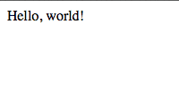
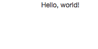

===================================
Howto: build a website with OpenERP
===================================

.. queue:: howto_website/series

.. warning::

   This guide assumes `basic knowledge of python
   <http://docs.python.org/2/tutorial/>`_.

   This guide assumes :ref:`an OpenERP installed and ready for development
   <getting_started_installation_source-link>`.

   For production deployment, see the dedicated guides :ref:`using-gunicorn`
   and :ref:`using-mod-wsgi`.

Creating a basic module
=======================

In OpenERP, doing things takes the form of creating modules, and these modules
customize the behavior of the OpenERP installation. The first step is thus to
create a module: at the command-line, go to your server's directory and enter

.. code-block:: console

    $ ./oe scaffold Academy ../my-modules

This will build a basic module for you in a directory called ``my-modules``
right next to your server's directory:

.. code-block:: text

    academy
    ├── __init__.py
    ├── __openerp__.py
    ├── controllers
    │   ├── __init__.py
    │   └── academy.py
    ├── models
    │   ├── __init__.py
    │   └── academy.py
    └── security
        └── ir.model.access.csv

* ``academy`` is the root directory of your module
* ``__init__.py`` tells Python that it is a valid package, and imports
  sub-packages and sub-modules
* ``__openerp__.py`` provides various meta-information about your module to
  OpenERP (a short description, the module's dependencies, its author, its
  version, ...)
* ``controllers`` holds the object responding to web (browser) requests
  - ``academy.py`` is where a default controller has been created for you
* ``models`` holds OpenERP stored objects, ignore it for now, we'll dive into
  it when `storing data in OpenERP`
* ``ir.model.access.csv`` defines basic access rights to the models, you can
  also ignore it for now

.. patch::
    :hidden:

Now we can create a database, start your OpenERP server and install your new
module in it:

.. code-block:: console

    $ createdb academy
    $ ./openerp-server --addons-path=addons,../my-modules \
                       -d academy -i academy --db-filter=academy

* ``--addons-path`` tells OpenERP where it can find its modules. By default it
  will only look into ``openerp/addons``, this adds the web client modules,
  the "standard" business modules (not needed yet) and the place where your
  own ``academy`` module lives.
* ``-i`` installs the provided module name in the database specified via
  ``-d``
* ``--db-filter`` means the specified database will be selected by default in
  the web interface, and will be the only one selectable (makes starting
  things up simpler)

Once the installation is finished you should see ``HTTP service (werkzeug)
running on 0.0.0.0:8069`` and nothing more happening in the log. You can now
open a web browser and navigate to http://localhost:8069. A page should
appear with just the words "Hello, world!" on it:

This page is generated by the ``index`` method in
:file:`academy/controllers/academy.py`, which just returns some text. Let's
make it prettier by returning HTML and using bootstrap_ to get a nicer default
rendering:

.. patch::

Restart the server, refresh the page

Although it is subtle for so little text and markup, the font has changed and
margins have been added to the page.

.. note::

   this example requires internet access as we're accessing a :abbr:`CDN
   (Content Delivery Network, large distributed networks hosting static files
   and trying to provide high-performance and high-availability of these
   files)`-hosted file.

.. note::

    At this point, the OpenERP server has no autoreloader. Every time you
    Python code (and later templates or data files), you should restart the
    server using the original startup instruction (without the re-creation of
    the database)

Controller Parameters
=====================

For dynamic pages, query parameters are passed as string parameters to the
controller method. For instance the index page can display a list of teaching
assistants, and link to each assistant's page using an index (in a global
array for now):

.. patch::

No validation is performed on query input values, it could be missing
altogether (if a user accesses ``/tas/`` directly) or it could be incorrectly
formatted. For this reason, query parameters are generally used to provide
"options" to a given page, and "required" data tends (when possible) to be
inserted directly in the URL.

This we can do by adding `converter patterns`_ to the URL in ``@http.route``:

.. patch::

These patterns will generally do some validation (e.g. if the ``id`` is not
a valid integer the converter will result in a ``404 Not Found`` page instead
of a 500 server error when the conversion failed in our own code) and may
perform some parsing or type conversion (in this case the conversion from a
URL section — a string — to a Python integer).

Basic templates
===============

So far we've output HTML by munging strings. It works, but is not exactly fun
to edit (and somewhat unsafe to boot) as even advanced text editors have a
hard time understanding they're dealing with HTML embedded in Python code.

The usual solution is to use templates_, documents with placeholders which can
be "rendered" to produce final pages (or others). OpenERP lets you use any
Python templating system you want, but bundles its own :doc:`QWeb
</06_ir_qweb>` templating system which we'll later see offers some useful
features.

Let's move our 2 pseudo-templates from inline strings to actual templates:

.. patch::

This simplifies the controller code by moving data formatting out of it, and
generally makes it simpler for designers to edit the markup.

.. note::

    You'll need to update the module to install the new templates

.. todo:: link to section about reusing/altering existing stuff, template
          overriding

.. _howto-website-support:

OpenERP's Website support
=========================

OpenERP 8 is bundled with new modules dedicated specifically to building
websites (whether it be simply sets of pages or more complex components such
as blogs).

First, we'll install the ``website`` module: restart your server with

.. code-block:: console

    $ ./openerp-server --addons-path=addons,../my-modules \
                       -d academy -i website --db-filter=academy

If you navigate to `your openerp`_, your basic page may have been replaced by
the generic index page of the ``website`` module. Don't panic! (if it has not
been replaced, don't panic either). The problem here is that both ``website``
and ``academy`` try to handle the ``/`` (root) URL, and which one *gets* it
depends on the order in which they're loaded (the last loaded module gets the
last say), which itself depends on a bunch of irrelevant stuff and is
essentially non-deterministic at this point.

To make loading order deterministic, we can add ``website`` as a dependency
to ``academy``:

.. patch::

This tells OpenERP that ``academy`` needs ``website`` to work correctly, and
that it must only be loaded after ``website`` has already been loaded. This
ensures ``academy``'s index page overwrites ``website``'s.

.. note::

    because a change in dependencies is a metadata alteration, you'll need
    to force an update to your module: restart your server with

    .. code-block:: console

        $ ./openerp-server --addons-path=addons,../my-modules \
                           -d academy -u academy --db-filter=academy

    instead of the previous command (note: ``-i`` was replaced by ``-u``)

If you reload `your openerp`_, you can see that your old index page hasn't
changed at all. Which is odd since we wanted to use the new ``website``
tools.

That is because much of these tools are inserted and enabled by the "layout
template" provided by ``website``.  Let's use that layout instead of our own
page structure:

.. patch::

* ``website.layout`` is the main Website layout, it provides standard headers
  and footers as well as integration with various customization tools.

* there's quite a bit of complex markup, used as hooks for various features
  (e.g. snippets). Although technically not mandatory, some things will not
  work if they're not there.

Reload `your openerp`_, the page has changed and new content has appeared
(footer, menus, …) but there's still no advanced edition tools in sight, as
you are not yet logged-in. Click on the :guilabel:`Sign In` link, fill in your
credentials (``admin``/``admin`` by default), click :guilabel:`Log in`.

You're now in OpenERP "proper", the backend/administrative interface. We'll
deal with it in :ref:`a latter section <howto-website-administration>`. For
now, click on the :menuselection:`Website` menu item in the top-left of the
browser, between :menuselection:`Messaging` and :menuselection:`Settings`.

You're back to your website, but are now an administrator and thus have access
to the advanced edition features of an OpenERP-built website.

* if you go in the HTML editor (:menuselection:`Customize --> HTML Editor`),
  you can see and edit your template
* if you click the :menuselection:`Edit` button in the top left, you'll switch
  to "Edition Mode" where the blocks (snippets) and rich text edition are
  available.
* there are a number of other features in the advanced editor, which we will
  not cover here

  .. todo:: link to document walking through editor features

.. todo:: website template generator

You can play around and add blocks or edit content on the home page, however
if you go to a TA's page and edit it things seem to work at first (e.g. insert
a :guilabel:`image-text` snippet to one of the TAs, as if adding a picture
and a short bio), but if you go to a different TA's page after saving the
first one… he has the exact same snippet inserted (and the same content, if
you edited the snippet's content)!

Because snippets are added in the template itself, they're content which is
the same across all pages using that template, and all the teaching assistants
share the same template (``academy.ta``).

Thus snippets are mostly for generic content, when a given template is only
used for a single page, or to add content in HTML fields.

.. todo:: link HTML fields to HTML fields doc?

.. note::

    When creating a new page (e.g. via :menuselection:`Content --> New Page`),
    OpenERP will duplicate a "source" template, and create a new template for
    each page. As a result, it's safe to use dedicated-content snippets for
    "static" pages.

Storing data in OpenERP
=======================

The conceptual storage model of OpenERP is simple: there are storage tables,
represented by OpenERP models, and inside these tables are records. The first
step, then, is to define a model.

We'll start by moving our teaching assistants in the database:

.. patch::

We've also altered the index method slightly, to retrieve our teaching
assistants from the database instead of storing them in a global list in the
module\ [#taprofile]_.

.. note:: :file:`ir.model.access.csv` is necessary to tell OpenERP that any
          user can *see* the teaching assistants: by default, only the
          administrator can see, edit, create or destroy objects.  Here, we
          only change the ``read`` permission to allow any user to list and
          browse teaching assistants.

.. todo:: command/shortcut

Update the module, reload `your openerp`_… and the Teaching Assistants list is
empty since we haven't put any TA in the database.

Let's add them in data files:

.. patch::

Update the module again, reload `your openerp`_ and the TAs are back.

.. warning:: if you can't see your data, check that you have reloaded the
             server with ``-i academy``, not ``-u academy``, new data files
             are not installed with ``-u``.

Click on a TA name, and you'll see an error message. Let's fix the TA view
now:

.. patch::

There are a few non-obvious things here, so let's go through them for clarity:

* OpenERP provides a has a special `converter pattern`_, which knows how to
  retrieve OpenERP objects by identifier. Instead of an integer or other
  similar basic value, ``ta`` thus gets a full-blown ``academy.tas`` object,
  without having to retrieve it by hand (as is done in ``index``).

* However because the ``model()`` `converter pattern`_ takes an identifier, we
  have to alter the creation of ``ta``'s URL to include such an identifier,
  rather than an index in an array

* Finally, ``website.render()`` wants a dict as its rendering context, not an
  object, which is why we wrap our ``ta`` object into one.

We're still where we started this section though: if we add snippets to or
edit the text of a TA's page, these editions will be visible across all TA
pages since they'll be stored in the shared ``academy.ta`` template.

Not only that, but we can not even edit the TA's name, even though it's not
shared content.

Let's fix that first, instead of using the basic "display this content"
template tag ``t-esc``, we'll use one aware of OpenERP objects and their
fields:

.. patch::

Update the module, go into a TA page and activate the edition mode. If you
move your mouse over the TA's name, it is surrounded by a yellow border, and
you can edit its content. If you change the name of a TA and save the page,
the change is correctly stored in the TA's record, the name is fixed when you
go to the index page but other TAs remain unaffected.

For the issue of customizing our TA profiles, we can expand our model with a
"freeform" HTML field:

.. patch::

Then, insert the new biographical content in the template using the same
object-aware template tag:

.. patch::

Update the module, browse to a TA's page and open the edition mode (using the
:guilabel:`Edit` button in the window's top-right).  The empty HTML field now
displays a big placeholder image, if you drop snippets in or write some
content for one of the teaching assistants, you will see that other TA
profiles are unaffected.

A more complex model
--------------------

Up to now, we've been working with displaying and manipulating objects
representing teaching assistants. It's a basic and simple concept, but not one
which allows for much further diving into interesting tools of OpenERP.

We need an object fitting the theme yet allowing for richer interactions and
more interesting extensions. Course lectures seem to fit: they can be
displayed in various manners (e.g. as a list of lectures or as a calendar),
they can be moved around as necessary (cancelled/rescheduled), they can have
numerous pieces of data attached both intrinsic (lecture transcripts) and
extrinsic (attendance records, student discussions, etc…).

.. patch::

Note a new feature: ``t-field`` tags can take options through
``t-field-options``. The options must be a JSON_ object. Available options
depend on the field's type and potentially the display widget (some types
of fields can be displayed in multiple manners). In this case, the same
``date`` field is displayed using custom date formats, one being the generic
``long`` (which depends on the current user's locale) and the other being
an explicit format for `the weekday in short form
<http://babel.pocoo.org/docs/dates/#date-fields>`_.

.. note:: in edition mode, formatted date and datetime fields revert to a
          canonical representation in order to provide all of the field's
          information.

.. warning::

    if you edit the course's dates, you will notice that the two displays of
    the ``date`` field are not synchronized, if one is edited the second one
    will not change until the edition is saved. This is a limitation of the
    current ``website`` but may be improved in future releases.

.. sending & storing comments (?)

.. _howto-website-administration:

Administration and ERP Integration
==================================

In practice, the data we've created so far using XML data files is usually
stored as "demo data", used for testing and demonstrations of modules, and the
actual user data is input via the OpenERP "backend", which we're going to try
out now. First let's move our data set to demo data:

.. patch::

the difference is simply that new databases can be created either in "demo"
mode or in "no demo" mode. In the former case, the database will be preloaded
with any demo data configured in the installed module.

A brief and incomplete introduction to the OpenERP administration
-----------------------------------------------------------------

You've already seen it for a very short time in :ref:`howto-website-support`,
you can go back to it using :menuselection:`Administrator --> Administration`
if you're already logged-in (which you should be), or go through
:menuselection:`Sign In` again if you are not.

The conceptual structure of the OpenERP backend is simple:

1. first are menus, menus are a tree (they can have sub-menus). To menus
   without children is mapped…

2. an action. Actions have various types, they can be links, reports (PDF),
   code which the server should execute or window actions. Window actions
   tell the client to display the OpenERP object according to certain views…

3. a view has a type, the broad category to which it corresponds (tree, form,
   graph, calendar, …) and its architecture which represents the way the
   object is laid out inside the view.

By default, when an OpenERP object is *defined* it is essentially invisible in
the interface. To make it visible, it needs to be available through an action,
which itself needs to be reachable somehow, usually a through a menu.

Let us, then, create a menu and an action for our lectures:

.. patch::

.. note::

    if a requested view does not exist, OpenERP will automatically generate a
    very basic one on-the-fly. That is the case here as we have not yet
    created a list and a form view for the lectures.

If you reload the backend, you should see a new menu :menuselection:`Academy`
at the top-left corner, before :menuselection:`Messaging`. In it is the
submenus we defined via ``menuitem``, and within (the first submenu is
selected by default) opens a list view of the lectures. To the right is a
series of 2 buttons, which lets you toggle between the "list" view (overview
of all records in the object) and the "form" view (view an manipulation of a
single record). The :guilabel:`Create` button above the list lets you create
new record, you can select records to delete them.

The names of the fields in the search and list view are automatically inferred
from the logical field names, but it's probably a good idea to specify them
anyway, by adding a ``string`` to the model field:

.. patch::

An issue is that the list view only displays the ``name`` field. To fix this,
we have to create an explicit list view for lectures:

.. patch::

.. todo:: link to list view documentation

Reusing and customizing existing work
-------------------------------------

OpenERP and its standard modules provide a number of models which may already
solve your problem or part of your problem. Part of being a good OpenERP
developer is having an idea of existing models and how they can be retrofit
to your purposes.

For our courses, instead of developing teaching assistants and lectures from
scratch we could reuse existing OpenERP *users* (for teaching assistants) and
*events* (for lectures)\ [#bonus]_, as well as the built-in website support
for events.

Install ``website_event`` (which will also install ``events``) by restarting
the server as:

.. code-block:: console

    $ ./openerp-server --addons-path=addons,../my-modules \
                       -d academy -i website_event --db-filter=academy

We'll also add it as a dependency to our module:

.. patch::

Reload `your openerp`_, click on the new :menuselection:`Events` item which
was added to the menu. This will be our new lectures page, but there are a few
adaptations to perform

Fixing the menu
~~~~~~~~~~~~~~~

The menu title is currently a generic *Events*, we only want lectures so we
will rename it to *Lectures*. Website menu items are defined through the
``website.menu`` model, *Events* is defined by ``website_event`` and has the
external id ``website_event.menu_events``, renaming it is as simple as
overwriting the ``name`` field for that record:

.. patch::

Restart the server with

.. code-block:: console

    $ ./openerp-server --addons-path=addons,../my-modules \
                       -d academy -i academy --db-filter=academy

and the menu item has been renamed to Lectures.

Removing the sidebar
~~~~~~~~~~~~~~~~~~~~

The filters sidebar is not necessary for our lectures. It can be removed in
the UI via :menuselection:`Customize --> Filters` (and new filters can be
added to the current filtering by date). Template customization is done by
adding and removing extension views, so much like the renaming of the menu,
we simply need to find the right record (here the Filters template view
extending the basic event page) and set its value correctly:

.. todo:: documentation for view inheritance/in-place extension

.. patch::

Note that the option is still available in :menuselection:`Customize`, we
have merely flipped the default around.

Simplifying templates
~~~~~~~~~~~~~~~~~~~~~

There are still two things to fix in the lectures list. First, remove the
*Our Events* link in the top-left corner, simply replace the breadcrumb
element by nothing:

.. patch::

Second, remove the "organized by" and type rows in the event's description,
keep only the datetime and location:

.. patch::

Moving lectures and TAs
~~~~~~~~~~~~~~~~~~~~~~~

The gist of the operation is fairly simple, but there are lots of changes:

* The custom models can be removed as we'll be using standard objects
* The controller has to be altered to fetch from standard objects
  (``event.event`` and ``res.users``), we'll use groups to discriminate
  between our academy objects and other demo objects, so that has to be used
  as well
* HTML templates have to be slightly edited to match the new objects
  (our lecture's ``date`` field is replaced by ``event.event``'s
  ``date_begin``)
* Missing parts of the standard events have to be added (``res.partner``,
  which is where "personal" informations are stored for ``res.users``, does
  not have a biographical field. We have to add it)
* Finally demo files must be converted, and existing demo data should be
  purged if we do not need it (e.g. existing non-lectures events and event
  types can be removed before adding our own)

.. note::

    because we're reusing the old XIDs on completely different models, we need
    to either remove the old reference or (simpler) just drop and re-create
    the database

.. patch::

Our data is back in the fontend (site), and in the backend we get
administrative views for free, e.g. a calendar view of our lectures.

.. [#taprofile] the teaching assistants profile view ends up broken for now,
                but don't worry we'll get around to it

.. [#bonus] as a bonus, we get access rights and TA access to the
            administrative backend "for free"

.. _bootstrap: http://getbootstrap.com

.. _converter pattern:
.. _converter patterns:
    http://werkzeug.pocoo.org/docs/routing/#rule-format

.. _templates: http://en.wikipedia.org/wiki/Web_template

.. _your openerp: http://localhost:8069/

.. _JSON: http://www.json.org
