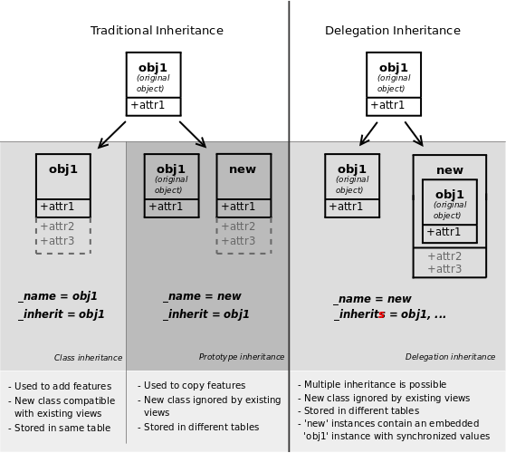

.. queue:: backend/series

=================
Building a Module
=================

.. warning::

    This tutorial requires :ref:`having installed Odoo <setup/install>`

Start/Stop the Odoo server
==========================

Odoo uses a client/server architecture in which clients are web browsers
accessing the Odoo server via RPC.

Business logic and extension is generally performed on the server side,
although supporting client features (e.g. new data representation such as
interactive maps) can be added to the client.

In order to start the server, simply invoke the command :ref:`odoo.py
<reference/cmdline>` in the shell, adding the full path to the file if
necessary:

.. code:: bash

    odoo.py

The server is stopped by hitting ``Ctrl-C`` twice from the terminal, or by
killing the corresponding OS process.

Build an Odoo module
====================

Both server and client extensions are packaged as *modules* which are
optionally loaded in a *database*.

Odoo modules can either add brand new business logic to an Odoo system, or
alter and extend existing business logic: a module can be created to add your
country's accounting rules to Odoo's generic accounting support, while the
next module adds support for real-time visualisation of a bus fleet.

Everything in Odoo thus starts and ends with modules.

Composition of a module
-----------------------

An Odoo module can contain a number of elements:

Business objects
    declared as Python classes, these resources are automatically persisted
    by Odoo based on their configuration

Data files
    XML or CSV files declaring metadata (views or workflows), configuration
    data (modules parameterization), demonstration data and more

Web controllers
    Handle requests from web browsers

Static web data
    Images, CSS or javascript files used by the web interface or website

Module structure
----------------

Each module is a directory within a *module directory*. Module directories
are specified by using the :option:`--addons-path <odoo.py --addons-path>`
option.

.. tip::
    :class: aphorism

    most command-line options can also be set using :ref:`a configuration
    file <reference/cmdline/config>`

An Odoo module is declared by its :ref:`manifest <reference/module/manifest>`. It
is mandatory and contains a single python dictionary declaring various
metadata for the module: the module's name and description, list of Odoo
modules required for this one to work properly, references to data files, …

The manifest's general structure is::

    {
        'name': "MyModule",
        'version': '1.0',
        'depends': ['base'],
        'author': "Author Name",
        'category': 'Category',
        'description': """
        Description text
        """,
        # data files always loaded at installation
        'data': [
            'mymodule_view.xml',
        ],
        # data files containing optionally loaded demonstration data
        'demo': [
            'demo_data.xml',
        ],
    }

A module is also a
`Python package <http://docs.python.org/2/tutorial/modules.html#packages>`_
with a ``__init__.py`` file, containing import instructions for various Python
files in the module.

For instance, if the module has a single ``mymodule.py`` file ``__init__.py``
might contain::

    from . import mymodule

Fortunately, there is a mechanism to help you set up an module. The command
``odoo.py`` has a subcommand :ref:`scaffold <reference/cmdline/scaffold>` to
create an empty module:

.. code:: bash

    odoo.py scaffold <module name> <where to put it>

The command creates a subdirectory for your module, and automatically creates a
bunch of standard files for a module. Most of them simply contain commented code
or XML. The usage of most of those files will be explained along this tutorial.

.. exercise:: Module creation

    Use the command line above to  create an empty module Open Academy, and
    install it in Odoo.

    .. only:: solutions

        #. Invoke the command ``odoo.py scaffold openacademy addons``.
        #. Adapt the manifest file to your module.
        #. Don't bother about the other files.

        .. patch::

Object-Relational Mapping
-------------------------

A key component of Odoo is the :abbr:`ORM (Object-Relational Mapping)` layer.
This layer avoids having to write most :abbr:`SQL (Structured Query Language)`
by hand and provides extensibility and security services\ [#rawsql]_.

Business objects are declared as Python classes extending
:class:`~openerp.models.Model` which integrates them into the automated
persistence system.

Models can be configured by setting a number of attributes at their
definition. The most important attribute is
:attr:`~openerp.models.Model._name` which is required and defines the name for
the model in the Odoo system. Here is a minimally complete definition of a
model::

    from openerp import models
    class MinimalModel(models.Model):
        _name = 'test.model'

Model fields
------------

Fields are used to define what the model can store and where. Fields are
defined as attributes on the model class::

    from openerp import models, fields

    class LessMinimalModel(models.Model):
        _name = 'test.model2'

        name = fields.Char()

Common Attributes
#################

Much like the model itself, its fields can be configured, by passing
configuration attributes as parameters::

    name = field.Char(required=True)

Some attributes are available on all fields, here are the most common ones:

:attr:`~openerp.fields.Field.string` (``unicode``, default: field's name)
    The label of the field in UI (visible by users).
:attr:`~openerp.fields.Field.required` (``bool``, default: ``False``)
    If ``True``, the field can not be empty, it must either have a default
    value or always be given a value when creating a record.
:attr:`~openerp.fields.Field.help` (``unicode``, default: ``''``)
    Long-form, provides a help tooltip to users in the UI.
:attr:`~openerp.fields.Field.index` (``bool``, default: ``False``)
    Requests that Odoo create a `database index`_ on the column

Simple fields
#############

There are two broad categories of fields: "simple" fields which are atomic
values stored directly in the model's table and "relational" fields linking
records (of the same model or of different models).

Example of simple fields are :class:`~openerp.fields.Boolean`,
:class:`~openerp.fields.Date`, :class:`~openerp.fields.Char`.

Reserved fields
###############

Odoo creates a few fields in all models\ [#autofields]_. These fields are
managed by the system and shouldn't be written to. They can be read if
useful or necessary:

:attr:`~openerp.fields.Model.id` (:class:`~openerp.fields.Id`)
    the unique identifier for a record in its model
:attr:`~openerp.fields.Model.create_date` (:class:`~openerp.fields.Datetime`)
    creation date of the record
:attr:`~openerp.fields.Model.create_uid` (:class:`~openerp.fields.Many2one`)
    user who created the record
:attr:`~openerp.fields.Model.write_date` (:class:`~openerp.fields.Datetime`)
    last modification date of the record
:attr:`~openerp.fields.Model.write_uid` (:class:`~openerp.fields.Many2one`)
    user who last modified the record

Special fields
##############

By default, Odoo also requires a ``name`` field on all models for various
display and search behaviors. The field used for these purposes can be
overridden by setting :attr:`~openerp.models.Model._rec_name`.

.. exercise:: Define a model

    Define a new data model *Course* in the *openacademy* module. A course
    has a title and a description. Courses must have a title.

    .. only:: solutions

        Edit the file ``openacademy/models.py`` to include a *Course* class.

        .. patch::

Data files
----------

Odoo is a highly data driven system. Although behavior is customized using
Python_ code part of a module's value is in the data it sets up when loaded.

.. tip:: some modules exist solely to add data into Odoo
    :class: aphorism

Module data is declared via :ref:`data files <reference/data>`, XML files with
``<record>`` elements. Each ``<record>`` element creates or updates a database
record.

.. code-block:: xml

    <openerp>
        <data>
            <record model="{model name}" id="{record identifier}">
                <field name="{a field name}">{a value}</field>
            </record>
        </data>
    <openerp>

* ``model`` is the name of the Odoo model for the record
* ``id`` is an :term:`external identifier`, it allows referring to the record
  (without having to know its in-database identifier)
* ``<field>`` elements have a ``name`` which is the name of the field in the
  model (e.g. ``description``). Their body is the field's value.

Data files have to be declared in the manifest file to be loaded, they can
be declared in the ``'data'`` list (always loaded) or in the ``'demo'`` list
(only loaded in demonstration mode).

.. exercise:: Define demonstration data

    Create demonstration data filling the *Courses* model with a few
    demonstration courses.

    .. only:: solutions

        Edit the file ``openacademy/demo.xml`` to include some data.

        .. patch::

Actions and Menus
-----------------

Actions and menus are regular records in database, usually declared through
data files. Actions can be triggered in three ways:

#. by clicking on menu items (linked to specific actions)
#. by clicking on buttons in views (if these are connected to actions)
#. as contextual actions on object

Because menus are somewhat complex to declare there is a ``<menuitem>``
shortcut to declare an ``ir.ui.menu`` and connect it to the corresponding
action more easily.

.. code-block:: xml

    <record model="ir.actions.act_window" id="action_list_ideas">
        <field name="name">Ideas</field>
        <field name="res_model">idea.idea</field>
        <field name="view_mode">tree,form</field>
    </record>
    <menuitem id="menu_ideas" parent="menu_root" name="Ideas" sequence="10"
              action="action_list_ideas"/>

.. danger::
    :class: aphorism

    The action must be declared before its corresponding menu in the XML file.

    Data files are executed sequentially, the action's ``id`` must be present
    in the database before the menu can be created.

.. exercise:: Define new menu entries

    Define new menu entries to access courses and sessions under the
    OpenAcademy menu entry. A user should be able to

    - display a list of all the courses
    - create/modify courses

    .. only:: solutions

        #. Create ``openacademy/views/openacademy.xml`` with an action and
           the menus triggering the action
        #. Add it to the ``data`` list of ``openacademy/__openerp__.py``

        .. patch::

Basic views
===========

Views define the way the records of a model are displayed. Each type of view
represents a mode of visualization (a list of records, a graph of their
aggregation, …). Views can either be requested generically via their type
(e.g. *a list of partners*) or specifically via their id. For generic
requests, the view with the correct type and the lowest priority will be
used (so the lowest-priority view of each type is the default view for that
type).

:ref:`View inheritance <reference/views/inheritance>` allows altering views
declared elsewhere (adding or removing content).

Generic view declaration
------------------------

A view is declared as a record of the model ``ir.ui.view``. The view type
is implied by the root element of the ``arch`` field:

.. code-block:: xml

    <record model="ir.ui.view" id="view_id">
        <field name="name">view.name</field>
        <field name="model">object_name</field>
        <field name="priority" eval="16"/>
        <field name="arch" type="xml">
            <!-- view content: <form>, <tree>, <graph>, ... -->
        </field>
    </record>

.. danger:: The view's content is XML.
    :class: aphorism

    The ``arch`` field must thus be declared as ``type="xml"`` to be parsed
    correctly.

Tree views
----------

Tree views, also called list views, display records in a tabular form.

Their root element is ``<tree>``. The simplest form of the tree view simply
lists all the fields to display in the table (each field as a column):

.. code-block:: xml

    <tree string="Idea list">
        <field name="name"/>
        <field name="inventor_id"/>
    </tree>

Form views
----------

Forms are used to create and edit single records.

Their root element is ``<form>``. They composed of high-level structure
elements (groups, notebooks) and interactive elements (buttons and fields):

.. code-block:: xml

    <form string="Idea form">
        <group colspan="4">
            <group colspan="2" col="2">
                <separator string="General stuff" colspan="2"/>
                <field name="name"/>
                <field name="inventor_id"/>
            </group>

            <group colspan="2" col="2">
                <separator string="Dates" colspan="2"/>
                <field name="active"/>
                <field name="invent_date" readonly="1"/>
            </group>

            <notebook colspan="4">
                <page string="Description">
                    <field name="description" nolabel="1"/>
                </page>
            </notebook>

            <field name="state"/>
        </group>
    </form>

.. exercise:: Customise form view using XML

    Create your own form view for the Course object. Data displayed should be:
    the name and the description of the course.

    .. only:: solutions

        .. patch::

.. exercise:: Notebooks

    In the Course form view, put the description field under a tab, such that
    it will be easier to add other tabs later, containing additional
    information.

    .. only:: solutions

        Modify the Course form view as follows:

        .. patch::

Form views can also use plain HTML for more flexible layouts:

.. code-block:: xml

    <form string="Idea Form">
        <header>
            <button string="Confirm" type="object" name="action_confirm"
                    states="draft" class="oe_highlight" />
            <button string="Mark as done" type="object" name="action_done"
                    states="confirmed" class="oe_highlight"/>
            <button string="Reset to draft" type="object" name="action_draft"
                    states="confirmed,done" />
            <field name="state" widget="statusbar"/>
        </header>
        <sheet>
            

                <label for="name" class="oe_edit_only" string="Idea Name" />
                <h1><field name="name" /></h1>
            

            <separator string="General" colspan="2" />
            <group colspan="2" col="2">
                <field name="description" placeholder="Idea description..." />
            </group>
        </sheet>
    </form>

Search views
------------

Search views customize the search field associated with the list view (and
other aggregated views). Their root element is ``<search>`` and they're
composed of fields defining which fields can be searched on:

.. code-block:: xml

    <search>
        <field name="name"/>
        <field name="inventor_id"/>
    </search>

If no search view exists for the model, Odoo generates one which only allows
searching on the ``name`` field.

.. exercise:: Search courses

    Allow searching for courses based on their title or their description.

    .. only:: solutions

        .. patch::

Relations between models
========================

A record from a model may be related to a record from another model. For
instance, a sale order record is related to a client record that contains the
client data; it is also related to its sale order line records.

.. exercise:: Create a session model

    For the module Open Academy, we consider a model for *sessions*: a session
    is an occurrence of a course taught at a given time for a given audience.

    Create a model for *sessions*. A session has a name, a start date, a
    duration and a number of seats. Add an action and a menu item to display
    them. Make the new model visible via a menu item.

    .. only:: solutions

        #. Create the class *Session* in ``openacademy/models.py``.
        #. Add access to the session object in ``openacademy/view/openacademy.xml``.

        .. patch::

        .. note:: ``digits=(6, 2)`` specifies the precision of a float number:
                  6 is the total number of digits, while 2 is the number of
                  digits after the comma. Note that it results in the number
                  digits before the comma is a maximum 4

Relational fields
-----------------

Relational fields link records, either of the same model (hierarchies) or
between different models.

Relational field types are:

:class:`Many2one(other_model, ondelete='set null') <openerp.fields.Many2one>`
    A simple link to an other object::

        print foo.other_id.name

    .. seealso:: `foreign keys <http://www.postgresql.org/docs/9.3/static/tutorial-fk.html>`_

:class:`One2many(other_model, related_field) <openerp.fields.One2many>`
    A virtual relationship, inverse of a :class:`~openerp.fields.Many2one`.
    A :class:`~openerp.fields.One2many` behaves as a container of records,
    accessing it results in a (possibly empty) set of records::

        for other in foo.other_ids:
            print other.name

    .. danger::

        Because a :class:`~openerp.fields.One2many` is a virtual relationship,
        there *must* be a :class:`~openerp.fields.Many2one` field in the
        :samp:`{other_model}`, and its name *must* be :samp:`{related_field}`

:class:`Many2many(other_model) <openerp.fields.Many2many>`
    Bidirectional multiple relationship, any record on one side can be related
    to any number of records on the other side. Behaves as a container of
    records, accessing it also results in a possibly empty set of records::

        for other in foo.other_ids:
            print other.name

.. exercise:: Many2one relations

    Using a many2one, modify the *Course* and *Session* models to reflect their
    relation with other models:

    - A course has a *responsible* user; the value of that field is a record of
      the built-in model ``res.users``.
    - A session has an *instructor*; the value of that field is a record of the
      built-in model ``res.partner``.
    - A session is related to a *course*; the value of that field is a record
      of the model ``openacademy.course`` and is required.
    - Adapt the views.

    .. only:: solutions

        #. Add the relevant ``Many2one`` fields to the models, and
        #. add them in the views.

        .. patch::

.. exercise:: Inverse one2many relations

    Using the inverse relational field one2many, modify the models to reflect
    the relation between courses and sessions.

    .. only:: solutions

        #. Modify the ``Course`` class, and
        #. add the field in the course form view.

        .. patch::

.. exercise:: Multiple many2many relations

    Using the relational field many2many, modify the *Session* model to relate
    every session to a set of *attendees*. Attendees will be represented by
    partner records, so we will relate to the built-in model ``res.partner``.
    Adapt the views accordingly.

    .. only:: solutions

        #. Modify the ``Session`` class, and
        #. add the field in the form view.

        .. patch::

Inheritance
===========

Model inheritance
-----------------

Odoo provides two *inheritance* mechanisms to extend an existing model in a
modular way.

The first inheritance mechanism allows a module to modify the behavior of a
model defined in another module:

- add fields to a model,
- override the definition of fields on a model,
- add constraints to a model,
- add methods to a model,
- override existing methods on a model.

The second inheritance mechanism (delegation) allows to link every record of a
model to a record in a parent model, and provides transparent access to the
fields of the parent record.

.. seealso::

    * :attr:`~openerp.models.Model._inherit`
    * :attr:`~openerp.models.Model._inherits`

View inheritance
----------------

Instead of modifying existing views in place (by overwriting them), Odoo
provides view inheritance where children "extension" views are applied on top of
root views, and can add or remove content from their parent.

An extension view references its parent using the ``inherit_id`` field, and
instead of a single view its ``arch`` field is composed of any number of
``xpath`` elements selecting and altering the content of their parent view:

.. code-block:: xml

    <!-- improved idea categories list -->
    <record id="idea_category_list2" model="ir.ui.view">
        <field name="name">id.category.list2</field>
        <field name="model">ir.ui.view</field>
        <field name="inherit_id" ref="id_category_list"/>
        <field name="arch" type="xml">
            <!-- find field description inside tree, and add the field
                 idea_ids after it -->
            <xpath expr="/tree/field[@name='description']" position="after">
              <field name="idea_ids" string="Number of ideas"/>
            </xpath>
        </field>
    </record>

``expr``
    An XPath_ expression selecting a single element in the parent view.
    Raises an error if it matches no element or more than one
``position``
    Operation to apply to the matched element:

    ``inside``
        appends ``xpath``'s body at the end of the matched element
    ``replace``
        replaces the matched element by the ``xpath``'s body
    ``before``
        inserts the ``xpath``'s body as a sibling before the matched element
    ``after``
        inserts the ``xpaths``'s body as a sibling after the matched element
    ``attributes``
        alters the attributes of the matched element using special
        ``attribute`` elements in the ``xpath``'s body

.. exercise:: Alter existing content

    * Using model inheritance, modify the existing *Partner* model to add an
      ``instructor`` boolean field, and a many2many field that corresponds to
      the session-partner relation
    * Using view inheritance, display this fields in the partner form view

    .. only:: solutions

       .. note::

           This is the opportunity to introduce the developer mode to
           inspect the view, find its external ID and the place to put the
           new field.

       #. Create a file ``openacademy/partner.py`` and import it in
          ``__init__.py``
       #. Create a file ``openacademy/views/partner.xml`` and add it to
          ``__openerp__.py``

       .. patch::

Domains
#######

In Odoo, :ref:`reference/orm/domains` are values that encode conditions on
records. A domain is a  list of criteria used to select a subset of a model's
records. Each criteria is a triple with a field name, an operator and a value.

For instance, when used on the *Product* model the following domain selects
all *services* with a unit price over *1000*::

    [('product_type', '=', 'service'), ('unit_price', '>', 1000)]

By default criteria are combined with an implicit AND. The logical operators
``&`` (AND), ``|`` (OR) and ``!`` (NOT) can be used to explicitly combine
criteria. They are used in prefix position (the operator is inserted before
its arguments rather than between). For instance to select products "which are
services *OR* have a unit price which is *NOT* between 1000 and 2000"::

    ['|',
        ('product_type', '=', 'service'),
        '!', '&',
            ('unit_price', '>=', 1000),
            ('unit_price', '<', 2000)]

A ``domain`` parameter can be added to relational fields to limit valid
records for the relation when trying to select records in the client interface.

.. exercise:: Domains on relational fields

    When selecting the instructor for a *Session*, only instructors (partners
    with ``instructor`` set to ``True``) should be visible.

    .. only:: solutions

        .. patch::

        .. note::

            A domain declared as a literal list is evaluated server-side and
            can't refer to dynamic values on the right-hand side, a domain
            declared as a string is evaluated client-side and allows
            field names on the right-hand side

.. exercise:: More complex domains

    Create new partner categories *Teacher / Level 1* and *Teacher / Level 2*.
    The instructor for a session can be either an instructor or a teacher
    (of any level).

    .. only:: solutions

        #. Modify the *Session* model's domain
        #. Modify ``openacademy/view/partner.xml`` to get access to
           *Partner categories*:

        .. patch::

Computed fields and default values
==================================

So far fields have been stored directly in and retrieved directly from the
database. Fields can also be *computed*. In that case, the field's value is not
retrieved from the database but computed on-the-fly by calling a method of the
model.

To create a computed field, create a field and set its attribute
:attr:`~openerp.fields.Field.compute` to the name of a method. The computation
method should simply set the value of the field to compute on every record in
``self``.

.. danger:: ``self`` is a collection
    :class: aphorism

    The object ``self`` is a *recordset*, i.e., an ordered collection of
    records. It supports the standard Python operations on collections, like
    ``len(self)`` and ``iter(self)``, plus extra set operations like ``recs1 +
    recs2``.

    Iterating over ``self`` gives the records one by one, where each record is
    itself a collection of size 1. You can access/assign fields on single
    records by using the dot notation, like ``record.name``.

.. code-block:: python

    import random
    from openerp import models, fields

    class ComputedModel(models.Model):
        _name = 'test.computed'

        name = fields.Char(compute='_compute_name')

        def _compute_name(self):
            for record in self:
                record.name = str(random.randint(1, 1e6))

Our compute method is very simple: it loops over ``self`` and performs the same
operation on every record. We can make it slightly simpler by using the
decorator :func:`~openerp.api.one` to automatically loop on the collection::

        @api.one
        def _compute_name(self):
            self.name = str(random.randint(1, 1e6))

Dependencies
------------

The value of a computed field usually depends on the values of other fields on
the computed record. The ORM expects the developer to specify those dependencies
on the compute method with the decorator :func:`~openerp.api.depends`.
The given dependencies are used by the ORM to trigger the recomputation of the
field whenever some of its dependencies have been modified::

    from openerp import models, fields, api

    class ComputedModel(models.Model):
        _name = 'test.computed'

        name = fields.Char(compute='_compute_name')
        value = fields.Integer()

        @api.one
        @api.depends('value')
        def _compute_name(self):
            self.name = "Record with value %s" % self.value

.. exercise:: Computed fields

    * Add the percentage of taken seats to the *Session* model
    * Display that field in the tree and form views
    * Display the field as a progress bar

    .. only:: solutions

        #. Add a computed field to *Session*
        #. Show the field in the *Session* view:

        .. patch::

Default values
--------------

Any field can be given a default value. In the field definition, add the option
``default=X`` where ``X`` is either a Python literal value (boolean, integer,
float, string), or a function taking a recordset and returning a value::

    name = fields.Char(default="Unknown")
    user_id = fields.Many2one('res.users', default=lambda self: self.env.user)

.. note::

    The object ``self.env`` gives access to request parameters and other useful
    things:

    - ``self.env.cr`` or ``self._cr`` is the database *cursor* object; it is
      used for querying the database
    - ``self.env.uid`` or ``self._uid`` is the current user's database id
    - ``self.env.user`` is the current user's record
    - ``self.env.context`` or ``self._context`` is the context dictionary
    - ``self.env.ref(xml_id)`` returns the record corresponding to an XML id
    - ``self.env[model_name]`` returns an instance of the given model

.. exercise:: Active objects – Default values

    * Define the start_date default value as today (see
      :class:`~openerp.fields.Date`).
    * Add a field ``active`` in the class Session, and set sessions as active by
      default.

    .. only:: solutions

        .. patch::

        .. note::

            Odoo has built-in rules making fields with an ``active`` field set
            to ``False`` invisible.

Onchange
========

The "onchange" mechanism provides a way for the client interface to update a
form whenever the user has filled in a value in a field, without saving anything
to the database.

For instance, suppose a model has three fields ``amount``, ``unit_price`` and
``price``, and you want to update the price on the form when any of the other
fields is modified. To achieve this, define a method where ``self`` represents
the record in the form view, and decorate it with :func:`~openerp.api.onchange`
to specify on which field it has to be triggered. Any change you make on
``self`` will be reflected on the form.

.. code-block:: xml

    <!-- content of form view -->
    <field name="amount"/>
    <field name="unit_price"/>
    <field name="price" readonly="1"/>

.. code-block:: python

    # onchange handler
    @api.onchange('amount', 'unit_price')
    def _onchange_price(self):
        # set auto-changing field
        self.price = self.amount * self.unit_price
        # Can optionally return a warning and domains
        return {
            'warning': {
                'title': "Something bad happened",
                'message': "It was very bad indeed",
            }
        }

For computed fields, valued ``onchange`` behavior is built-in as can be seen by
playing with the *Session* form: change the number of seats or participants, and
the ``taken_seats`` progressbar is automatically updated.

.. exercise:: Warning

    Add an explicit onchange to warn about invalid values, like a negative
    number of seats, or more participants than seats.

    .. only:: solutions

        .. patch::

Model constraints
=================

Odoo provides two ways to set up automatically verified invariants:
:func:`Python constraints <openerp.api.constrains>` and
:attr:`SQL constraints <openerp.models.Model._sql_constraints>`.

A Python constraint is defined as a method decorated with
:func:`~openerp.api.constrains`, and invoked on a recordset. The decorator
specifies which fields are involved in the constraint, so that the constraint is
automatically evaluated when one of them is modified. The method is expected to
raise an exception if its invariant is not satisfied::

    from openerp.exceptions import ValidationError

    @api.constrains('age')
    def _check_something(self):
        for record in self:
            if record.age > 20:
                raise ValidationError("Your record is too old: %s" % record.age)
        # all records passed the test, don't return anything

.. exercise:: Add Python constraints

    Add a constraint that checks that the instructor is not present in the
    attendees of his/her own session.

    .. only:: solutions

        .. patch::

SQL constraints are defined through the model attribute
:attr:`~openerp.models.Model._sql_constraints`. The latter is assigned to a list
of triples of strings ``(name, sql_definition, message)``, where ``name`` is a
valid SQL constraint name, ``sql_definition`` is a table_constraint_ expression,
and ``message`` is the error message.

.. exercise:: Add SQL constraints

    With the help of `PostgreSQL's documentation`_ , add the following
    constraints:

    #. CHECK that the course description and the course title are different
    #. Make the Course's name UNIQUE

    .. only:: solutions

        .. patch::

.. exercise:: Exercise 6 - Add a duplicate option

    Since we added a constraint for the Course name uniqueness, it is not
    possible to use the "duplicate" function anymore (:menuselection:`Form -->
    Duplicate`).

    Re-implement your own "copy" method which allows to duplicate the Course
    object, changing the original name into "Copy of [original name]".

    .. only:: solutions

        .. patch::

Advanced Views
==============

Tree views
----------

Tree views can take supplementary attributes to further customize their
behavior:

``colors``
    mappings of colors to conditions. If the condition evaluates to ``True``,
    the corresponding color is applied to the row:

    .. code-block:: xml

        <tree string="Idea Categories" colors="blue:state=='draft';red:state=='trashed'">
            <field name="name"/>
            <field name="state"/>
        </tree>

    Clauses are separated by ``;``, the color and condition are separated by
    ``:``.

``editable``
    Either ``"top"`` or ``"bottom"``. Makes the tree view editable in-place
    (rather than having to go through the form view), the value is the
    position where new rows appear.

.. exercise:: List coloring

    Modify the Session tree view in such a way that sessions lasting less than
    5 days are colored blue, and the ones lasting more than 15 days are
    colored red.

    .. only:: solutions

        Modify the session tree view:

        .. patch::

Calendars
---------

Displays records as calendar events. Their root element is ``<calendar>`` and
their most common attributes are:

``color``
    The name of the field used for *color segmentation*. Colors are
    automatically distributed to events, but events in the same color segment
    (records which have the same value for their ``@color`` field) will be
    given the same color.
``date_start``
    record's field holding the start date/time for the event
``date_stop`` (optional)
    record's field holding the end date/time for the event

field (to define the label for each calendar event)

.. code-block:: xml

    <calendar string="Ideas" date_start="invent_date" color="inventor_id">
        <field name="name"/>
    </calendar>

.. exercise:: Calendar view

    Add a Calendar view to the *Session* model enabling the user to view the
    events associated to the Open Academy.

    .. only:: solutions

        #. Add an ``end_date`` field computed from ``start_date`` and
           ``duration``

           .. tip:: the inverse function makes the field writable, and allows
                    moving the sessions (via drag and drop) in the calendar view

        #. Add a calendar view to the *Session* model
        #. And add the calendar view to the *Session* model's actions

        .. patch::

Search views
------------

Search view ``<field>`` elements can have a ``@filter_domain`` that overrides
the domain generated for searching on the given field. In the given domain,
``self`` represents the value entered by the user. In the example below, it is
used to search on both fields ``name`` and ``description``.

Search views can also contain ``<filter>`` elements, which act as toggles for
predefined searches. Filters must have one of the following attributes:

``domain``
    add the given domain to the current search
``context``
    add some context to the current search; use the key ``group_by`` to group
    results on the given field name

.. code-block:: xml

    <search string="Ideas">
        <field name="name"/>
        <field name="description" string="Name and description"
               filter_domain="['|', ('name', 'ilike', self), ('description', 'ilike', self)]"/>
        <field name="inventor_id"/>
        <field name="country_id" widget="selection"/>

        <filter name="my_ideas" string="My Ideas"
                domain="[('inventor_id', '=', uid)]"/>
        <group string="Group By">
            <filter name="group_by_inventor" string="Inventor"
                    context="{'group_by': 'inventor'}"/>
        </group>
    </search>

To use a non-default search view in an action, it should be linked using the
``search_view_id`` field of the action record.

The action can also set default values for search fields through its
``context`` field: context keys of the form
:samp:`search_default_{field_name}` will initialize *field_name* with the
provided value. Search filters must have an optional ``@name`` to have a
default and behave as booleans (they can only be enabled by default).

.. exercise:: Search views

    #. Add a button to filter the courses for which the current user is the
       responsible in the course search view. Make it selected by default.
    #. Add a button to group courses by responsible user.

    .. only:: solutions

        .. patch::

Gantt
-----

Horizontal bar charts typically used to show project planning and advancement,
their root element is ``<gantt>``.

.. code-block:: xml

    <gantt string="Ideas" date_start="invent_date" color="inventor_id">
        <level object="idea.idea" link="id" domain="[]">
            <field name="inventor_id"/>
        </level>
    </gantt>

.. exercise:: Gantt charts

    Add a Gantt Chart enabling the user to view the sessions scheduling linked
    to the Open Academy module. The sessions should be grouped by instructor.

    .. only:: solutions

        #. Create a computed field expressing the session's duration in hours
        #. Add the gantt view's definition, and add the gantt view to the
           *Session* model's action

        .. patch::

Graph views
-----------

Graph views allow aggregated overview and analysis of models, their root
element is ``<graph>``.

Graph views have 4 display modes, the default mode is selected using the
``@type`` attribute.

Pivot
    a multidimensional table, allows the selection of filers and dimensions
    to get the right aggregated dataset before moving to a more graphical
    overview
Bar (default)
    a bar chart, the first dimension is used to define groups on the
    horizontal axis, other dimensions define aggregated bars within each group.

    By default bars are side-by-side, they can be stacked by using
    ``@stacked="True"`` on the ``<graph>``
Line
    2-dimensional line chart
Pie
    2-dimensional pie

Graph views contain ``<field>`` with a mandatory ``@type`` attribute taking
the values:

``row`` (default)
    the field should be aggregated by default
``measure``
    the field should be aggregated rather than grouped on

.. code-block:: xml

    <graph string="Total idea score by Inventor">
        <field name="inventor_id"/>
        <field name="score" type="measure"/>
    </graph>

.. warning::

    Graph views perform aggregations on database values, they do not work
    with non-stored computed fields.

.. exercise:: Graph view

    Add a Graph view in the Session object that displays, for each course, the
    number of attendees under the form of a bar chart.

    .. only:: solutions

        #. Add the number of attendees as a stored computed field
        #. Then add the relevant view

        .. patch::

Kanban
------

Used to organize tasks, production processes, etc… their root element is
``<kanban>``.

A kanban view shows a set of cards possibly grouped in columns. Each card
represents a record, and each column the values of an aggregation field.

For instance, project tasks may be organized by stage (each column is a
stage), or by responsible (each column is a user), and so on.

Kanban views define the structure of each card as a mix of form elements
(including basic HTML) and :ref:`reference/qweb`.

.. exercise:: Kanban view

    Add a Kanban view that displays sessions grouped by course (columns are
    thus courses).

    .. only:: solutions

        #. Add an integer ``color`` field to the *Session* model
        #. Add the kanban view and update the action

        .. patch::

Workflows
=========

Workflows are models associated to business objects describing their dynamics.
Workflows are also used to track processes that evolve over time.

.. exercise:: Almost a workflow

    Add a ``state`` field to the *Session* model. It will be used to define
    a workflow-ish.

    A sesion can have three possible states: Draft (default), Confirmed and
    Done.

    In the session form, add a (read-only) field to
    visualize the state, and buttons to change it. The valid transitions are:

    * Draft -> Confirmed
    * Confirmed -> Draft
    * Confirmed -> Done
    * Done -> Draft

    .. only:: solutions

        #. Add a new ``state`` field
        #. Add state-transitioning methods, those can be called from view
           buttons to change the record's state
        #. And add the relevant buttons to the session's form view

        .. patch::

Workflows may be associated with any object in Odoo, and are entirely
customizable. Workflows are used to structure and manage the lifecycles of
business objects and documents, and define transitions, triggers, etc. with
graphical tools. Workflows, activities (nodes or actions) and transitions
(conditions) are declared as XML records, as usual. The tokens that navigate
in workflows are called workitems.

.. warning::

    A workflow associated with a model is only created when the
    model's records are created. Thus there is no workflow instance
    associated with session instances created before the workflow's
    definition

.. exercise:: Workflow

    Replace the ad-hoc *Session* workflow by a real workflow. Transform the
    *Session* form view so its buttons call the workflow instead of the
    model's methods.

    .. only:: solutions

        .. patch::

        .. tip::

            In order to check if instances of the workflow are correctly
            created alongside sessions, go to :menuselection:`Settings -->
            Technical --> Workflows --> Instances`

.. exercise:: Automatic transitions

    Automatically transition sessions from *Draft* to *Confirmed* when more
    than half the session's seats are reserved.

    .. only:: solutions

        .. patch::

.. exercise:: Server actions

    Replace the Python methods for synchronizing session state by
    server actions.

    Both the workflow and the server actions could have been created entirely
    from the UI.

    .. only:: solutions

        .. patch::

Security
========

Access control mechanisms must be configured to achieve a coherent security
policy.

Group-based access control mechanisms
-------------------------------------

Groups are created as normal records on the model ``res.groups``, and granted
menu access via menu definitions. However even without a menu, objects may
still be accessible indirectly, so actual object-level permissions (read,
write, create, unlink) must be defined for groups. They are usually inserted
via CSV files inside modules. It is also possible to restrict access to
specific fields on a view or object using the field's groups attribute.

Access rights
-------------

Access rights are defined as records of the model ``ir.model.access``. Each
access right is associated to a model, a group (or no group for global
access), and a set of permissions: read, write, create, unlink. Such access
rights are usually created by a CSV file named after its model:
``ir.model.access.csv``.

.. code-block:: text

    id,name,model_id/id,group_id/id,perm_read,perm_write,perm_create,perm_unlink
    access_idea_idea,idea.idea,model_idea_idea,base.group_user,1,1,1,0
    access_idea_vote,idea.vote,model_idea_vote,base.group_user,1,1,1,0

.. exercise:: Add access control through the OpenERP interface

    Create a new user "John Smith". Then create a group
    "OpenAcademy / Session Read" with read access to the *Session* model.

    .. only:: solutions

        #. Create a new user *John Smith* through
           :menuselection:`Settings --> Users --> Users`
        #. Create a new group ``session_read`` through
           :menuselection:`Settings --> Users --> Groups`, it should have
           read access on the *Session* model
        #. Edit *John Smith* to make them a member of ``session_read``
        #. Log in as *John Smith* to check the access rights are correct

.. exercise:: Add access control through data files in your module

    Using data files,

    * Create a group *OpenAcademy / Manager* with full access to all
      OpenAcademy models
    * Make *Session* and *Course* readable by all users

    .. only:: solutions

        #. Create a new file ``openacademy/security/security.xml`` to
           hold the OpenAcademy Manager group
        #. Edit the file ``openacademy/security/ir.model.access.csv`` with
           the access rights to the models
        #. Finally update ``openacademy/__openerp__.py`` to add the new data
           files to it

        .. patch::

Record rules
------------

A record rule restricts the access rights to a subset of records of the given
model. A rule is a record of the model ``ir.rule``, and is associated to a
model, a number of groups (many2many field), permissions to which the
restriction applies, and a domain. The domain specifies to which records the
access rights are limited.

Here is an example of a rule that prevents the deletion of leads that are not
in state ``cancel``. Notice that the value of the field ``groups`` must follow
the same convention as the method :meth:`~openerp.models.Model.write` of the ORM.

.. code-block:: xml

    <record id="delete_cancelled_only" model="ir.rule">
        <field name="name">Only cancelled leads may be deleted</field>
        <field name="model_id" ref="crm.model_crm_lead"/>
        <field name="groups" eval="[(4, ref('base.group_sale_manager'))]"/>
        <field name="perm_read" eval="0"/>
        <field name="perm_write" eval="0"/>
        <field name="perm_create" eval="0"/>
        <field name="perm_unlink" eval="1" />
        <field name="domain_force">[('state','=','cancel')]</field>
    </record>

.. exercise:: Record rule

    Add a record rule for the model Course and the group
    "OpenAcademy / Manager", that restricts ``write`` and ``unlink`` accesses
    to the responsible of a course. If a course has no responsible, all users
    of the group must be able to modify it.

    .. only:: solutions

        Create a new rule in ``openacademy/security/security.xml``:

        .. patch::

Wizards
=======

Wizards describe interactive sessions with the user (or dialog boxes) through
dynamic forms. A wizard is simply a model that extends the class
:class:`~openerp.models.TransientModel` instead of
:class:`~openerp.models.Model`. The class
:class:`~openerp.models.TransientModel` extends :class:`~openerp.models.Model`
and reuse all its existing mechanisms, with the following particularities:

- Wizard records are not meant to be persistent; they are automatically deleted
  from the database after a certain time. This is why they are called
  *transient*.
- Wizard models do not require explicit access rights: users have all
  permissions on wizard records.
- Wizard records may refer to regular records or wizard records through many2one
  fields, but regular records *cannot* refer to wizard records through a
  many2one field.

We want to create a wizard that allow users to create attendees for a particular
session, or for a list of sessions at once.

.. exercise:: Define the wizard

    Create a wizard model with a many2one relationship with the *Session*
    model and a many2many relationship with the *Partner* model.

    .. only:: solutions

        Add a new file ``openacademy/wizard.py``:

        .. patch::

Launching wizards
-----------------

Wizards are launched by ``ir.actions.act_window`` records, with the field
``target`` set to the value ``new``. The latter opens the wizard view into a
popup window. The action may be triggered by a menu item.

There is another way to launch the wizard: using an ``ir.actions.act_window``
record like above, but with an extra field ``src_model`` that specifies in the
context of which model the action is available. The wizard will appear in the
contextual actions of the model, above the main view. Because of some internal
hooks in the ORM, such an action is declared in XML with the tag ``act_window``.

.. code:: xml

    <act_window id="launch_the_wizard"
                name="Launch the Wizard"
                src_model="context_model_name"
                res_model="wizard_model_name"
                view_mode="form"
                target="new"
                key2="client_action_multi"/>

Wizards use regular views and their buttons may use the attribute
``special="cancel"`` to close the wizard window without saving.

.. exercise:: Launch the wizard

    #. Define a form view for the wizard.
    #. Add the action to launch it in the context of the *Session* model.
    #. Define a default value for the session field in the wizard; use the
       context parameter ``self._context`` to retrieve the current session.

    .. only:: solutions

        .. patch::

.. exercise:: Register attendees

    Add buttons to the wizard, and implement the corresponding method for adding
    the attendees to the given session.

    .. only:: solutions

        .. patch::

.. exercise:: Register attendees to multiple sessions

    Modify the wizard model so that attendees can be registered to multiple
    sessions.

    .. only:: solutions

        .. patch::

Internationalization
====================

Each module can provide its own translations within the i18n directory, by
having files named LANG.po where LANG is the locale code for the language, or
the language and country combination when they differ (e.g. pt.po or
pt_BR.po). Translations will be loaded automatically by Odoo for all
enabled languages. Developers always use English when creating a module, then
export the module terms using Odoo's gettext POT export feature
(:menuselection:`Settings --> Translations --> Import/Export --> Export
Translation` without specifying a language), to create the module template POT
file, and then derive the translated PO files. Many IDE's have plugins or modes
for editing and merging PO/POT files.

.. tip:: The GNU gettext format (Portable Object) used by Odoo is
         integrated into LaunchPad, making it an online collaborative
         translation platform.

.. code-block:: text

   |- idea/ # The module directory
      |- i18n/ # Translation files
         | - idea.pot # Translation Template (exported from Odoo)
         | - fr.po # French translation
         | - pt_BR.po # Brazilian Portuguese translation
         | (...)

.. tip:: 

   By default Odoo's POT export only extracts labels inside XML files or
   inside field definitions in Python code, but any Python string can be
   translated this way by surrounding it with the function :func:`openerp._`
   (e.g. ``_("Label")``)

.. exercise:: Translate a module

   Choose a second language for your Odoo installation. Translate your
   module using the facilities provided by Odoo.

   .. only:: solutions

        #. Create a directory ``openacademy/i18n/``
        #. Install whichever language you want (
           :menuselection:`Administration --> Translations --> Load an
           Official Translation`)
        #. Synchronize translatable terms (:menuselection:`Administration -->
           Translations --> Application Terms --> Synchronize Translations`)
        #. Create a template translation file by exporting (
           :menuselection:`Administration --> Translations -> Import/Export
           --> Export Translation`) without specifying a language, save in
           ``openacademy/i18n/``
        #. Create a translation file by exporting (
           :menuselection:`Administration --> Translations --> Import/Export
           --> Export Translation`) and specifying a language. Save it in
           ``openacademy/i18n/``
        #. Open the exported translation file (with a basic text editor or a
           dedicated PO-file editor e.g. POEdit_ and translate the missing
           terms

        #. In ``models.py``, add an import statement for the function
           ``openerp._`` and mark missing strings as translatable

        #. Repeat steps 3-6

        .. patch::

        .. todo:: do we never reload translations?

Reporting
=========

Printed reports
---------------

Odoo 8.0 comes with a new report engine based on :ref:`reference/qweb`,
`Twitter Bootstrap`_ and Wkhtmltopdf_. 

A report is a combination two elements:

* an ``ir.actions.report.xml``, for which a ``<report>`` shortcut element is
  provided, it sets up various basic parameters for the report (default
  type, whether the report should be saved to the database after generation,…)

  .. code-block:: xml

      <report
          id="account_invoices"
          model="account.invoice"
          string="Invoices"
          report_type="qweb-pdf"
          name="account.report_invoice"
          file="account.report_invoice"
          attachment_use="True"
          attachment="(object.state in ('open','paid')) and
              ('INV'+(object.number or '').replace('/','')+'.pdf')"
      />

* A standard :ref:`QWeb view <reference/views/qweb>` for the actual report:

  .. code-block:: xml

    <t t-call="report.html_container">
        <t t-foreach="docs" t-as="o">
            <t t-call="report.external_layout">
                

                    <h2>Report title</h2>
                

            </t>
        </t>
    </t>

    the standard rendering context provides a number of elements, the most
    important being:

    ``docs``
        the records for which the report is printed
    ``user``
        the user printing the report

Because reports are standard web pages, they are available through a URL and
output parameters can be manipulated through this URL, for instance the HTML
version of the *Invoice* report is available through
http://localhost:8069/report/html/account.report_invoice/1 (if ``account`` is
installed) and the PDF version through
http://localhost:8069/report/pdf/account.report_invoice/1.

.. exercise:: Create a report for the Session model

   For each session, it should display session's name, its start and end,
   and list the session's attendees.

   .. only:: solutions

        .. patch::

Dashboards
----------

.. exercise:: Define a Dashboard

   Define a dashboard containing the graph view you created, the sessions
   calendar view and a list view of the courses (switchable to a form
   view). This dashboard should be available through a menuitem in the menu,
   and automatically displayed in the web client when the OpenAcademy main
   menu is selected.

   .. only:: solutions

        #. Create a file ``openacademy/views/session_board.xml``. It should contain
           the board view, the actions referenced in that view, an action to
           open the dashboard and a re-definition of the main menu item to add
           the dashboard action

           .. note:: Available dashboard styles are ``1``, ``1-1``, ``1-2``,
                     ``2-1`` and ``1-1-1``

        #. Update ``openacademy/__openerp__.py`` to reference the new data
           file

        .. patch::

WebServices
===========

The web-service module offer a common interface for all web-services :

- XML-RPC
- JSON-RPC

Business objects can also be accessed via the distributed object
mechanism. They can all be modified via the client interface with contextual
views.

Odoo is accessible through XML-RPC/JSON-RPC interfaces, for which libraries
exist in many languages.

XML-RPC Library
---------------

The following example is a Python program that interacts with an Odoo
server with the library ``xmlrpclib``::

   import xmlrpclib

   root = 'http://%s:%d/xmlrpc/' % (HOST, PORT)

   uid = xmlrpclib.ServerProxy(root + 'common').login(DB, USER, PASS)
   print "Logged in as %s (uid: %d)" % (USER, uid)

   # Create a new note
   sock = xmlrpclib.ServerProxy(root + 'object')
   args = {
       'color' : 8,
       'memo' : 'This is a note',
       'create_uid': uid,
   }
   note_id = sock.execute(DB, uid, PASS, 'note.note', 'create', args)

.. exercise:: Add a new service to the client

   Write a Python program able to send XML-RPC requests to a PC running
   Odoo (yours, or your instructor's). This program should display all
   the sessions, and their corresponding number of seats. It should also
   create a new session for one of the courses.

   .. only:: solutions

        .. code-block:: python

            import functools
            import xmlrpclib
            HOST = 'localhost'
            PORT = 8069
            DB = 'openacademy'
            USER = 'admin'
            PASS = 'admin'
            ROOT = 'http://%s:%d/xmlrpc/' % (HOST,PORT)

            # 1. Login
            uid = xmlrpclib.ServerProxy(ROOT + 'common').login(DB,USER,PASS)
            print "Logged in as %s (uid:%d)" % (USER,uid)

            call = functools.partial(
                xmlrpclib.ServerProxy(ROOT + 'object').execute,
                DB, uid, PASS)

            # 2. Read the sessions
            sessions = call('openacademy.session','search_read', [], ['name','seats'])
            for session in sessions:
                print "Session %s (%s seats)" % (session['name'], session['seats'])
            # 3.create a new session
            session_id = call('openacademy.session', 'create', {
                'name' : 'My session',
                'course_id' : 2,
            })

        Instead of using a hard-coded course id, the code can look up a course
        by name::

            # 3.create a new session for the "Functional" course
            course_id = call('openacademy.course', 'search', [('name','ilike','Functional')])[0]
            session_id = call('openacademy.session', 'create', {
                'name' : 'My session',
                'course_id' : course_id,
            })

JSON-RPC Library
----------------

The following example is a Python program that interacts with an Odoo server
with the standard Python libraries ``urllib2`` and ``json``::

    import json
    import random
    import urllib2

    def json_rpc(url, method, params):
        data = {
            "jsonrpc": "2.0",
            "method": method,
            "params": params,
            "id": random.randint(0, 1000000000),
        }
        req = urllib2.Request(url=url, data=json.dumps(data), headers={
            "Content-Type":"application/json",
        })
        reply = json.load(urllib2.urlopen(req))
        if reply.get("error"):
            raise Exception(reply["error"])
        return reply["result"]

    def call(url, service, method, *args):
        return json_rpc(url, "call", {"service": service, "method": method, "args": args})

    # log in the given database
    url = "http://%s:%s/jsonrpc" % (HOST, PORT)
    uid = call(url, "common", "login", DB, USER, PASS)

    # create a new note
    args = {
        'color' : 8,
        'memo' : 'This is another note',
        'create_uid': uid,
    }
    note_id = call(url, "object", "execute", DB, uid, PASS, 'note.note', 'create', args)

Here is the same program, using the library
`jsonrpclib <https://pypi.python.org/pypi/jsonrpclib>`::

    import jsonrpclib

    # server proxy object
    url = "http://%s:%s/jsonrpc" % (HOST, PORT)
    server = jsonrpclib.Server(url)

    # log in the given database
    uid = server.call(service="common", method="login", args=[DB, USER, PASS])

    # helper function for invoking model methods
    def invoke(model, method, *args):
        args = [DB, uid, PASS, model, method] + list(args)
        return server.call(service="object", method="execute", args=args)

    # create a new note
    args = {
        'color' : 8,
        'memo' : 'This is another note',
        'create_uid': uid,
    }
    note_id = invoke('note.note', 'create', args)

Examples can be easily adapted from XML-RPC to JSON-RPC.

.. note::

    There are a number of high-level APIs in various languages to access Odoo
    systems without *explicitly* going through XML-RPC or JSON-RPC, such as:

    * https://github.com/akretion/ooor
    * https://github.com/syleam/openobject-library
    * https://github.com/nicolas-van/openerp-client-lib
    * https://pypi.python.org/pypi/oersted/

.. [#autofields] it is possible to :attr:`disable the automatic creation of some
                 fields <openerp.models.Model._log_access>`
.. [#rawsql] writing raw SQL queries is possible, but requires care as it
             bypasses all Odoo authentication and security mechanisms.

.. _database index:
    http://use-the-index-luke.com/sql/preface

.. _POEdit: http://poedit.net

.. _PostgreSQL's documentation:
.. _table_constraint:
    http://www.postgresql.org/docs/9.3/static/ddl-constraints.html

.. _python: http://python.org

.. _XPath: http://w3.org/TR/xpath

.. _twitter bootstrap: http://getbootstrap.com

.. _wkhtmltopdf: http://wkhtmltopdf.org
