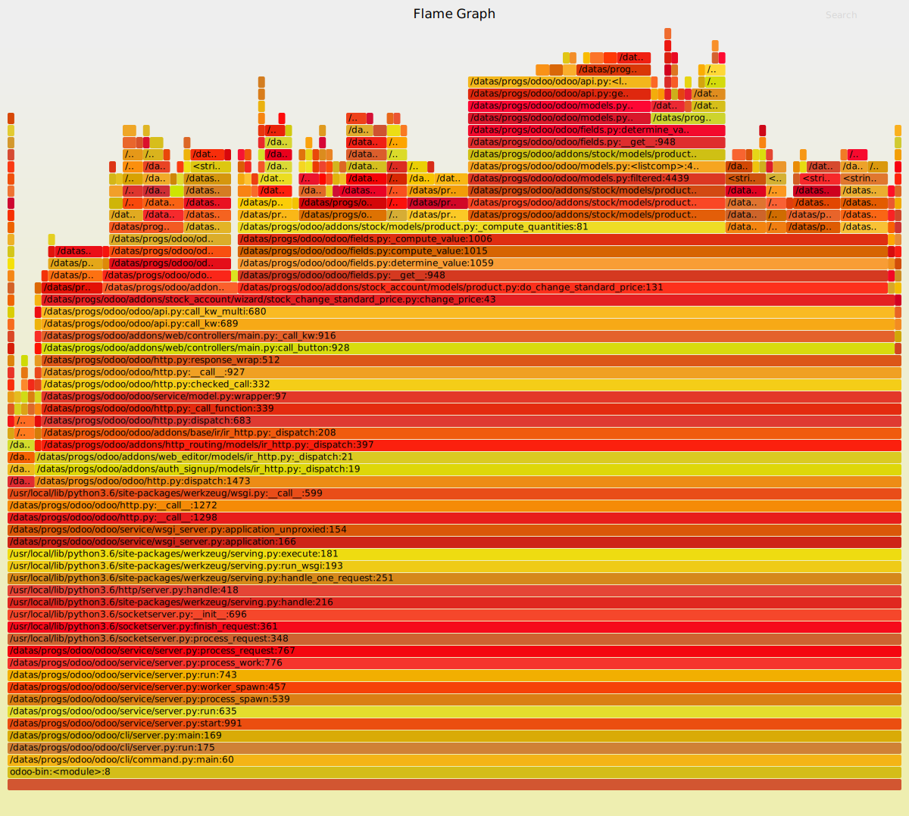

===================
Profiling Odoo code
===================

.. warning::

    This tutorial requires :ref:`having installed Odoo <setup/install>`
    and :doc:`writing Odoo code <backend>`

Graph a method
==============

Odoo embeds a profiler of code. This embedded profiler output can be used to
generate a graph of calls triggered by the method, number of queries, percentage
of time taken in the method itself as well as the time that the method took and
its sub-called methods.

.. code:: python

    from odoo.tools.misc import profile
    [...]
    @profile('/temp/prof.profile')
    def mymethod(...)

This produces a file called /temp/prof.profile

A tool called *gprof2dot* will produce a graph with this result:

.. code:: bash

    gprof2dot -f pstats -o /temp/prof.xdot /temp/prof.profile

A tool called *xdot* will display the resulting graph:

.. code:: bash
    
    xdot /temp/prof.xdot
    
Log a method
============

Another profiler can be used to log statistics on a method:

.. code:: python

    from odoo.tools.profiler import profile
    [...]
    @profile
    @api.model
    def mymethod(...):

The statistics will be displayed into the logs once the method to be analysed is
completely reviewed.

.. code:: bash

    2018-03-28 06:18:23,196 22878 INFO openerp odoo.tools.profiler:
    calls     queries   ms
    project.task ------------------------ /home/odoo/src/odoo/addons/project/models/project.py, 638

    1         0         0.02          @profile
                                      @api.model
                                      def create(self, vals):
                                          # context: no_log, because subtype already handle this
    1         0         0.01              context = dict(self.env.context, mail_create_nolog=True)

                                          # for default stage
    1         0         0.01              if vals.get('project_id') and not context.get('default_project_id'):
                                              context['default_project_id'] = vals.get('project_id')
                                          # user_id change: update date_assign
    1         0         0.01              if vals.get('user_id'):
                                              vals['date_assign'] = fields.Datetime.now()
                                          # Stage change: Update date_end if folded stage
    1         0         0.0               if vals.get('stage_id'):
                                              vals.update(self.update_date_end(vals['stage_id']))
    1         108       631.8             task = super(Task, self.with_context(context)).create(vals)
    1         0         0.01              return task

    Total:
    1         108       631.85

Dump stack
==========

Sending the SIGQUIT signal to an Odoo process (only available on POSIX) makes
this process output the current stack trace to log, with info level. When an
odoo process seems stucked, sending this signal to the process permit to know
what the process is doing, and letting the process continue his job.

Tracing code execution
======================

Instead of sending the SIGQUIT signal to an Odoo process often enough, to check
where the processes are performing worse than expected, we can use the `py-spy`_ tool to
do it for us.

Install py-spy
--------------

.. code:: bash

    python3 -m pip install py-spy

Record executed code
--------------------

As py-spy is installed, we now record the executed code lines.
This tool will record, multiple times a second, the stacktrace of the process.

.. code:: bash

    # record to raw file
    py-spy record -o profile.json -f speedscope --pid <PID>

    # OR record directly to svg
    py-spy record -o profile.svg --pid <PID>

where <PID> is the process ID of the odoo process you want to graph.

To open profile.json you can use online tool `speedscope.app`_.

To open profile.svg you should use browser, because other viewer may not
support interactive part.

.. _py-spy: https://github.com/benfred/py-spy

.. _speedscope.app: https://www.speedscope.app/
