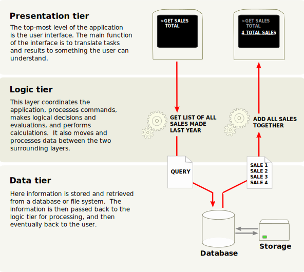

.. _howto/rdtraining/01_architecture:

================================
Chapter 1: Architecture Overview
================================

Multitier application
=====================

Odoo follows a `multitier architecture`_, meaning that the presentation, the business
logic and the data storage are separated. More specifically, it uses a three-tier architecture
(image from Wikipedia):

The presentation tier is a combination of HTML5, JavaScript and CSS. The logic tier is exclusively
written in Python, while the data tier only supports PostgreSQL as an RDBMS.

Depending on the scope of your module, Odoo development can be done in any of these tiers.
Therefore, before going any further, it may be a good idea to refresh your memory if you don't have
an intermediate level in these topics.

In order to go through this tutorial, you will need a very basic knowledge of HTML and an intermediate
level of Python. Advanced topics will require more knowledge in the other subjects. There are
plenty of tutorials freely accessible, so we cannot recommend one over another since it depends
on your background.

For reference this is the official `Python tutorial`_.

Odoo modules
============

Both server and client extensions are packaged as *modules* which are
optionally loaded in a *database*. A module is a collection of functions and data that target a
single purpose.

Odoo modules can either add brand new business logic to an Odoo system or
alter and extend existing business logic. One module can be created to add your
country's accounting rules to Odoo's generic accounting support, while
a different module can add support for real-time visualisation of a bus fleet.

Everything in Odoo starts and ends with modules.

Terminology: developers group their business features in Odoo *modules*. The main user-facing
modules are flagged and exposed as *Apps*, but a majority of the modules aren't Apps. *Modules*
may also be referred to as *addons* and the directories where the Odoo server finds them
form the ``addons_path``.

Composition of a module
-----------------------

An Odoo module **can** contain a number of elements:

:ref:`Business objects <reference/orm>`
    A business object (e.g. an invoice) is declared as a Python class. The fields defined in
    these classes are automatically mapped to database columns thanks to the
    :abbr:`ORM (Object-Relational Mapping)` layer.

:ref:`Object views <reference/views>`
    Define UI display

:ref:`Data files <reference/data>`
    XML or CSV files declaring the model data:

    * :ref:`views <reference/views>` or :ref:`reports <reference/reports>`,
    * configuration data (modules parametrization, :ref:`security rules <reference/security>`),
    * demonstration data
    * and more

:ref:`Web controllers <reference/controllers>`
    Handle requests from web browsers

Static web data
    Images, CSS or JavaScript files used by the web interface or website

None of these elements are mandatory. Some modules may only add data files (e.g. country-specific
accounting configuration), while others may only add business objects. During this training, we will
create business objects, object views and data files.
:ref:`Web controllers <howto/rdtraining/G_website>` and
:ref:`static web data <howto/rdtraining/I_jswidget>` are advanced topics.

Module structure
----------------

Each module is a directory within a *module directory*. Module directories
are specified by using the :option:`--addons-path <odoo-bin --addons-path>`
option.

An Odoo module is declared by its :ref:`manifest <reference/module/manifest>`.

When an Odoo module includes business objects (i.e. Python files), they are organized as a
`Python package <http://docs.python.org/3/tutorial/modules.html#packages>`_
with a ``__init__.py`` file. This file contains import instructions for various Python
files in the module.

Here is a simplified module directory:

.. code-block:: bash

    module
    ├── models
    │   ├── *.py
    │   └── __init__.py
    ├── data
    │   └── *.xml
    ├── __init__.py
    └── __manifest__.py

Odoo Editions
=============

Odoo is available in `two versions`_: Odoo Enterprise (licensed & shared sources) and Odoo Community
(open-source). In addition to services such as support or upgrades, the Enterprise version provides extra
functionalities to Odoo. From a technical point-of-view, these functionalities are simply
new modules installed on top of the modules provided by the Community version.

Ready to start? Before writing actual code, let's go to the
:ref:`next chapter <howto/rdtraining/02_setup>` to review the Odoo installation process. Even if
Odoo is already running on your system, we strongly suggest you go through this chapter
to make sure we start on the same page during the development of our new application.

.. _multitier architecture:
    https://en.wikipedia.org/wiki/Multitier_architecture

.. _Python tutorial:
    https://docs.python.org/3.6/tutorial/

.. _two versions:
    https://www.odoo.com/page/editions
