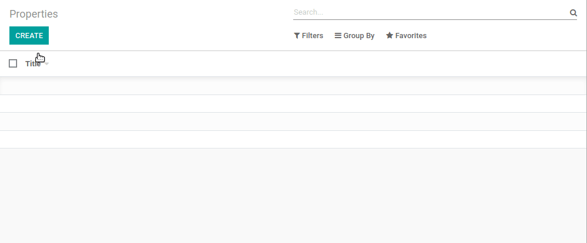

.. _howto/rdtraining/06_firstui:

=====================================
Part 6: Finally, Some UI To Play With
=====================================

After the creation of a new :ref:`model <howto/rdtraining/04_basicmodel>` and its corresponding
:ref:`access rights <howto/rdtraining/05_securityintro>`, it is now time to be able to interact in
the user interface.

At the end of this chapter, a couple of menus will be created in order to access a default list
and form view.

Data Files (XML)
================

**Reference**: the documentation related to this topic can be found in
:ref:`reference/data`.

In the :ref:`howto/rdtraining/05_securityintro` chapter, we added data through a CSV file. The CSV
format is convenient when the data to load has a simple format. If the format is more complex
(e.g. load the structure of a view or an email template), we use the XML format. For example,
this
`help field <https://github.com/odoo/odoo/blob/09c59012bf80d2ccbafe21c39e604d6cfda72924/addons/crm/views/crm_lost_reason_views.xml#L61-L69>`__
contains HTML tags. While it would be possible to load such data through a CSV, it is more
convenient to use an XML file.

The XML files must be added in the same folders as the CSV files, and defined similarly in the
``__manifest__.py``. The content of the data files is also loaded when a module is installed or
updated, sequentially. Therefore, all remarks made for the CSV files holds true for the XML files.
When the data we add is linked to views, we add it in the ``views`` folder.

In this chapter, we will load our first action and menus though an XML file. Actions and menus are
regular records in database.

.. note::

    When performance is important, the CSV format is preferred over the XML format. Indeed, in Odoo
    loading a CSV file is faster than loading an XML file.

Actions
=======

**Reference**: the documentation related to this topic can be found in
:ref:`reference/actions`.

.. note::

    **Goal**: at the end of this section, an action should be loaded in the system. We won't see
    anything yet in the UI, but the file should be loaded in the log:

    .. code-block:: text

        INFO rd-demo odoo.modules.loading: loading estate/data/estate_property_views.xml

Actions can be triggered in three ways:

1. by clicking on menu items (linked to specific actions)
2. by clicking on buttons in views (if these are connected to actions)
3. as contextual actions on object

We will only cover the first case in this chapter. The second case will be covered in an
:ref:`upcoming chapter <howto/rdtraining/10_actions>` while the last one is the topic of an appendix.
In our Real Estate example, we would like to link a menu to the ``estate.property`` model, so we
are able to create a new record. The action can be seen as the link between the menu and
the model.

A minimal action for our ``test.model`` would look like:

.. code-block:: xml

    <record id="test_model_action" model="ir.actions.act_window">
        <field name="name">Test action</field>
        <field name="res_model">test.model</field>
        <field name="view_mode">tree,form</field>
    </record>

- ``id`` is an :term:`external identifier`, it allows referring to the record
  (without having to know its in-database identifier).
- ``model`` has a fixed value of ``ir.actions.act_window`` (:ref:`reference/actions/window`)
- ``name`` is the name of the action.
- ``res_model`` is the model to which the action applies.
- ``view_mode`` are the views which will be available, in this case the list (tree) and form views.
  We'll see :ref:`later <howto/rdtraining/15_qwebintro>` that there can be other view modes.

Examples can be found everywhere in Odoo, but
`this one <https://github.com/odoo/odoo/blob/09c59012bf80d2ccbafe21c39e604d6cfda72924/addons/crm/views/crm_lost_reason_views.xml#L57-L70>`__
is a good example of a simple action. Pay attention to the structure of the XML data file, you will
need it in the following exercise.

.. exercise:: Add an action.

    Create the ``estate_property_views.xml`` file in the appropriate folder and define it in the
    ``__manifest__.py`` file.

    Create an action for the model ``estate.property``.

Restart the server, you should see the file loaded in the log.

Menus
=====

**Reference**: the documentation related to this topic can be found in
:ref:`reference/data/shortcuts`.

.. note::

    **Goal**: at the end of this section, three menus should be created and the default view is
    displayed:

    .. image:: 06_firstui/media/estate_menu_root.png
      :align: center
      :alt: Root menus

    .. image:: 06_firstui/media/estate_menu_action.png
      :align: center
      :alt: First level and action menus

    .. image:: 06_firstui/media/estate_form_default.png
      :align: center
      :alt: Default form view

Because menus are somewhat complex to declare there is a ``<menuitem>``
shortcut to declare an ``ir.ui.menu`` and connect it to the corresponding
action more easily.

A minimal menu for our ``test_model_action`` would look like:

.. code-block:: xml

    <menuitem id="test_model_menu_action" action="test_model_action"/>

The menu ``test_model_menu_action`` is linked to the action ``test_model_action``, and the action
is linked to the model ``test.model``. As mentioned before, the action can be seen as the link
between the menu and the model.

However, menus always follow an architecture; in practice, there are three levels of menus:

1. The root menu, which is displayed in the App switcher
2. The first level menu, displayed in the top bar
3. The action menus

   .. image:: 06_firstui/media/menu_01.png
      :align: center
      :alt: Root menus

   .. image:: 06_firstui/media/menu_02.png
      :align: center
      :alt: First level and action menus

The easiest way to define the structure is to create a structure in the XML file. A minimal
structure for our ``test_model_action`` would look like:

.. code-block:: xml

    <menuitem id="test_menu_root" name="Test">
        <menuitem id="test_first_level_menu" name="First Level">
            <menuitem id="test_model_menu_action" action="test_model_action"/>
        </menuitem>
    </menuitem>

The third menu will get the name of the ``action``.

.. exercise:: Add the menus.

    Create the ``estate_menus.xml`` file in the appropriate folder and define it in the
    ``__manifest__.py`` file. Remember the sequential loading of the data files ;-)

    Create the three levels of menus for the ``estate.property`` action created in the previous
    exercise. Refer to the **Goal** of the section for the expected result.

Restart the server and **refresh the browser**. You should now see the menus, and you'll even
be able to create your first real estate property advertisement!

Fields, Attributes And View
===========================

.. note::

    **Goal**: at the end of this section, the selling price should be read-only and the number
    of bedrooms and the availability date is set by default. The latter is not copied when the
    record is duplicated

    .. image:: 06_firstui/media/attribute_and_default.gif
      :align: center
      :alt: Interaction between model and view
    
    The reserved fields ``active`` and ``state`` are added to the ``estate.property`` model.

Up to now, we were able to generate a default view for our real estate property advertisements.
In many cases we want to fine tune the view. There are many fine-tunings possible in Odoo, but
the very first step is usually to make sure that:

- some fields have a default value
- some fields are read-only
- some fields are not copied when duplicating the record

In our real estate business case, we would like the following:

- The selling price should be read-only (it will be filled in automatically later)
- The availability date and the selling price should not be copied when duplicating a record
- The default number of bedrooms should be 2
- The default availability date should be in 3 months

Some New Attributes
-------------------

Before moving further on the view design, let's come back to our model definition. We saw that some
attributes, such as ``required=True``, impact the table schema in the database. Other attributes
will impact the view or provide default values.

.. exercise:: Add new attributes to the fields

  Find the appropriate attributes (see :class:`~odoo.fields.Field`) to:

  - set the selling price as read-only
  - prevent copying the value of the availability date and the selling price

Restart the server and refresh the browser: you should not be able to set any selling price. When
duplicating a record, the availability date should be empty.

Default Values
--------------

Any field can be given a default value. In the field definition, add the option
``default=X`` where ``X`` is either a Python literal value (boolean, integer,
float, string), or a function taking a recordset and returning a value::

    name = fields.Char(default="Unknown")
    last_seen = fields.Datetime("Last Seen", default=lambda self: fields.Datetime.now())

The ``name`` field get the 'Unknown' value by default, while the ``last_seen`` field is set as
the current time.

.. exercise:: Default values

    Add the appropriate default attributes so that:

    - the default number of bedrooms is 2
    - the default availability date is in 3 months

    Tip: this might help you: :meth:`~odoo.fields.Date.today`

Check that the default values are set as expected.

Reserved Fields
---------------

**Reference**: the documentation related to this topic can be found in
:ref:`reference/orm/fields/reserved`.

A few field names are reserved for pre-defined behaviors beyond that of
automated fields. They should be defined on a model when the related
behavior is desired.

.. exercise:: Active field

    Add the ``active`` field to the ``estate.property`` model.

Restart the server, create a new property, then come back to the list view... The property should
not be listed! ``active`` is the example of such a reserved field with a specific behavior: when
a record has ``active=False``, it is automatically removed from any search. To display the
property created, you need to specifically search for inactive records.

.. exercise:: Active field, set a default value

    Set the appropriate default value to the ``active`` field so it doesn't disappear anymore.

Note that the default ``active=False`` value was assigned to all existing records.

.. exercise:: State field

    Add a ``state`` field to the ``estate.property`` model. 5 values are possible: New,
    Offer Received, Offer Accepted, Sold and Canceled. It must be required, should not be copied
    and have its default value set to 'New'.

    Pay attention to use the correct type!

The ``state`` will be used later on for several UI enhancements.

Now that we have are to interact with the UI thanks to the default views, the next step is
obvious: we want to define :ref:`our own views <howto/rdtraining/07_basicviews>`.
