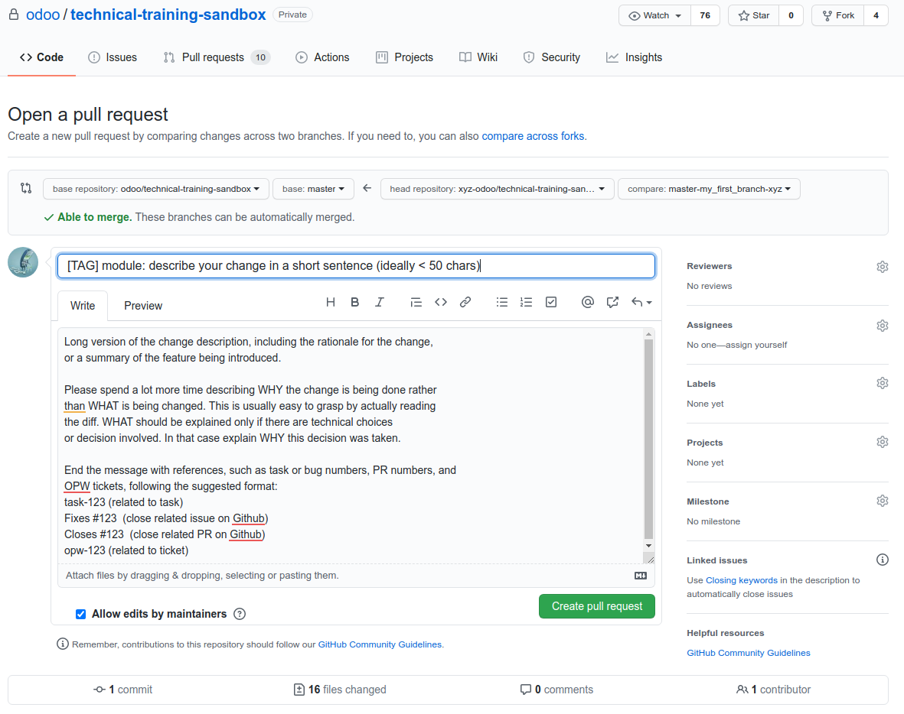

.. _howto/rdtraining/16_guidelines_pr:

=========================================
Part 16: Make It Shine And Submit Your PR
=========================================

In the previous chapters we saw how to create a fully functional business application. Now we will
prepare our code, to be shared and learn how to share it.

Coding guidelines
=================

We will start refactoring the code to match to the Odoo coding guidelines. The guidelines aim
to improve the quality of Odoo Apps code.

**Reference**: you will find the Odoo coding guidelines in :ref:`reference/guidelines`.

.. exercise:: Make it shine

    Refactor your code to respect the coding guidelines. Don't forget to respect the module
    structure, the variable names, the method name convention, the model attribute order and the
    xml ids.

Your first Pull Request (PR)
============================

**The following is intended to be used by Odoo staff members only. All repositories mentioned are
not accessible by third-party.**

Now that your code respects the Odoo code guidelines and is shiny, let's share it with others.

Configure development repository
--------------------------------

We will start creating a git development environment for the 'custom' folder, as we did it in the
beginning for 'odoo' and 'enterprise'. The PR will target the `odoo/technical-training-sandbox` repository.

To do this the first step is to
`fork this repository in GitHub <https://guides.github.com/activities/forking/>`__ to create your
own development repository.

After you successfully created your development repository, we will configure your existing `$HOME/src/custom`
folder to be able to commit your work.

.. code-block:: console

    $ cd $HOME/src/custom
    $ git init
    $ git remote add training git@github.com:odoo/technical-training-sandbox.git
    $ git remote add training-dev git@github.com:xyz-odoo/technical-training-sandbox.git #Don't forget to change xyz-odoo to your own GitHub account
    $ git remote set-url --push training no_push #Avoid pushing directly into the main repository
    $ git fetch --all --prune
    $ git branch master training/master
    $ git checkout master #Two new files will be downloaded README.md and .gitignore

Note that if your work is already in a :ref:`Git and GitHub configured folder <howto/rdtraining/02_setup/development_repository>`
the previous steps are not needed. This is going to be the case when you will start working in the
'odoo' or 'enterprise' folders.

Branch, Commit & Push
---------------------

Before creating the PR, a new working branch has to be created and used to commit the code. Afterwards
the branch will be pushed to the development repository.

Create your working branch:

.. code-block:: console

    $ git checkout -b master-my_first_branch-xyz

Your branch name must follow the following name strucutre : <targetVersion>-<feature>-<trigram>

Example: The branch master-sale-fixes-abc on odoo-dev/odoo is a branch containing fixes for the
sales app in the odoo/odoo repository, to be deployed in master and done by ABC.

Commit your code:

.. code-block:: console

    $ git add .
    $ git commit

**Everyone is reading your commit messages!**

The commit message is very important, follow the :ref:`Developer guidelines <reference/guidelines/git>`.

Push your new branch to your developement repository:

.. code-block:: console

    $ git push -u master-my_first_branch-xyz

.. warning:: NEVER use `git push --force` (or `git push -f`) in a branch that does not belong to you
             nor in a stable branch. Never, never, never!

.. tip:: Remember that you can use `git status` at any step to know the current status of your branch
.. tip:: You can create git alias to shorten some of theses commands. Ask your colleagues around you
         if they use git aliases and get inspired by their work.

Create your first PR
--------------------

After pushing your branch to your development repository, the output will look like this:

.. code-block:: console

    Enumerating objects: 24, done.
    Counting objects: 100% (24/24), done.
    Compressing objects: 100% (20/20), done.
    Writing objects: 100% (23/23), 6.67 KiB | 525.00 KiB/s, done.
    Total 23 (delta 1), reused 0 (delta 0)
    remote: Resolving deltas: 100% (1/1), done.
    remote:
    remote: Create a pull request for 'master-my_first_branch-xyz' on GitHub by visiting:
    remote:      https://github.com/xyz-odoo/technical-training-sandbox/pull/new/master-my_first_branch-xyz
    remote:
    To github.com:xyz-odoo/technical-training-sandbox.git
    * [new branch]      master-my_first_branch-xyz -> master-my_first_branch-xyz
    Branch 'master-my_first_branch-xyz' set up to track remote branch 'master-my_first_branch-xyz' from 'training-dev'.

There are two ways to create the PR:

- Click on the link displayed in the output of the push command.
- Open a browser in your development repository `https://github.com/xyz-odoo/technical-training-sandbox`.
  A button will suggest you to create a new pull request.

  .. image:: 16_guidelines_pr/media/pr_from_branch.png

You will notice that your commit message is used as pull request message, this occurs if you have only 1 commit.
If you have multiple commits, you can make a summary of the commit as PR message. Or, if you have few
commits, just copy/paste your commit messagges as the PR message.

Test on the runbot
==================

Odoo has its own :abbr:`CI (Continuous integration)` server named `runbot <https://runbot.odoo.com/>`__. All
the commits, branches and PR will be tested to avoid regressions or breaking the stable versions.
All the runs that pass the tests are deployed on their own server with demo data.

.. exercise:: Play with runbot

    Feel free to go to runbot, open the last stable version of Odoo and check all the available
    applications and functionalities.
