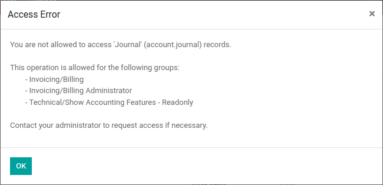

.. _howto/rdtraining/B_acl_irrules:

================================
Advanced B: ACL and Record Rules
================================

.. warning::

    This tutorial assumes you have completed the :ref:`Core Training
    <howto/rdtraining>`.

    To follow the exercise, it is recommended that you fetch the branch
    14.0-core from the repository XXX, it
    contains a version of the module created during the core training we can use
    as a starting point.

So far we have mostly concerned ourselves with implementing useful features.
However in most business scenarios *security* quickly becomes a concern:
currently,

* Any employee (which is what ``group_user`` stands for) can create, read,
  update or delete properties, property types, or property tags.
* If ``estate_account`` is installed then only agents allowed to interact
  with invoicing can confirm sales as that's necessary to :ref:`create an
  invoice <howto/rdtraining/14_other_module/create>`.

However:

* We do not want third parties to be able to access properties directly.
* Not all our employees may be real-estate agents (e.g. administrative
  personnel, property managers, ...), we don't want non-agents to see the
  available properties.
* Real-estate agents don't need or get to decide what property types or tags are
  *available*.
* Real-estate agents can have *exclusive* properties, we do not want one agent
  to be able to manage another's exclusivities.
* All real-estate agents should be able to confirm the sale of a property they
  can manage, but we do not want them to be able to validate or mark as paid
  any invoice in the system.

.. note::

    We may actually be fine with some or most of these for a small business.

    Because it's easier for users to disable unnecessary security rules than it
    is to create them from nothing, it's better to err on the side of caution
    and limiting access: users can relax that access if necessary or convenient.

Groups
======

.. seealso::

    The documentation related to this topic can be found in :ref:`the security
    reference <reference/security>`.

    :ref:`The guidelines <reference/guidelines>` document the format and
    location of master data items.

.. admonition:: **Goal**

    At the end of this section,

    - We can make employees *real-estate agents* or *real-estate managers*.
    - The ``admin`` user is a real-estate manager.
    - We have a new *real-estate agent* employee with no access to invoicing
      or administration.

It would not be practical to attach individual security rules to employees any
time we need a change so *groups* link security rules and users. They correspond
to roles that can be assigned to employees.

For most Odoo applications [#app]_ a good baseline is to have *user* and
*manager* (or administrator) roles: the manager can change the configuration of
the application and oversee the entirety of its use while the user can well,
use the application [#appuser]_.

This baseline seems sufficient for us:

* Real estate managers can configure the system (manage available types and
  tags) as well as oversee every property in the pipeline.
* Real estate agents can manage the properties under their care, or properties
  which are not specifically under the care of any agent.

In keeping with Odoo's data-driven nature, a group is no more than a record of
the ``res.groups`` model. They are normally part of a module's :ref:`master data
<howto/rdtraining/C_data>`, defined in one of the module's data files.

As simple example `can be found here <https://github.com/odoo/odoo/blob/532c083cbbe0ee6e7a940e2bdc9c677bd56b62fa/addons/hr/security/hr_security.xml#L9-L14>`_.

.. admonition:: what is the *category_id*?

    ``category_id`` a *module category*, it is automatically generated from the
    :ref:`category defined in module manifest files <howto/rdtraining/03_newapp>`.

    .. todo:: the demo module needs to have the category set, to
              *Real Estate/Brokerage*, ideally the newapp part would already do
              that

.. exercise::

    Create the ``security.xml`` file in the appropriate folder and add it to the
    ``__manifest__.py`` file.

    Add a record creating a group with the id ``estate_group_user``, the name
    "Agent" and the category ``base.module_category_real_estate_brokerage``.

    Below that, add a record creating a group with the id
    ``estate_group_manager``, the name "Manager" and the category
    ``base.module_category_real_estate_brokerage``. The ``estate_group_manager``
    group needs to imply ``estate_group_user``.

    .. tip::

        Since we modified data files, remember to restart Odoo and update the
        module using ``-u estate``.

    If you go to :menuselection:`Settings --> Manage Users` and open the
    ``admin`` user ("Mitchell Admin"), you should see a new section:

    .. figure:: B_acl_irrules/groups.png

    Set the admin user to be a *Real Estate manager*.

.. exercise::

    Via the web interface, create a new user with only the "real estate agent"
    access. The user should not have any Invoicing or Administration access.

    Use a private tab or window to log in with the new user (remember to set
    a password), as the real-estate agent you should only see the real estate
    application, and possibly the Discuss (chat) application:

    .. figure:: B_acl_irrules/agent.png

Access Rights
=============

.. seealso:: The documentation related to this topic can be found at
             :ref:`reference/security/acl`.

.. admonition:: **Goal**

    At the end of this section,

    - Employees who are not at least real-estate agents will not see the
      real-estate application.
    - Real-estate agents will not be able to update the property types or tags.

Access rights were first introduced in :ref:`howto/rdtraining/05_securityintro`.

Access rights are a way to give users access to models *via* groups: associate
an access right to a group, then all users with that group will have the access.

For instance we don't want real-estate agents to be able to modify what property
types are available, so we would not link that access to the "user" group.

Access rights can only give access, they can't remove it: when access is
checked, the system looks to see if *any* access right associated with the user
(via any group) grants that access.

====== ====== ==== ====== ======
group  create read update delete
------ ------ ---- ------ ------
A         X     X
B               X
C                     X
====== ====== ==== ====== ======

A user with the groups A and C will be able to do anything but delete the object
while one with B and C will be able to read or update, but not search or read.

.. note::

    * The group of an access right can be ommitted, this means the ACL applies
      to *every user*, this is a useful but risky fallback as depending on the
      applications installed it can grant even non-users access to the model.
    * If no access right applies to a user, they are not granted access
      (default-deny).
    * If a menu item points to a model to which a user doesn't have acces and
      has no submenus which the user can see, the menu will not be displayed.

.. exercise:: Update the access rights file to:

    * Give full access to all objects to your Real Estate Manager group.
    * Give agents (real estate users) only read access to types and tags.
    * Give nobody the right to delete properties.
    * Check that your agent user is not able to alter types or tags, or to
      delete properties, but that they can otherwise create or update
      properties.

    .. warning::

        Remember to give different xids to your ``ir.model.access`` records
        otherwise they will overwrite one another.

Since the "demo" user was not made a real-estate agent or manager, they should
not even be able to see the real-estate application. Use a private tab or window
to check for this (the "demo" user has the password "demo").

Access Rules
============

.. seealso:: The documentation related to this topic can be found at
             :ref:`reference/security/rules`.

.. admonition:: **Goal**

    At the end of this section, agents will not be able to see the properties
    exclusive to their colleagues; but managers will still be able to see
    everything.

Access rights can grant access to an entire model but often we need to be
more specific: while an agent can interact with properties in general we may not
want them to update or even see properties managed by one of their colleagues.

Access *rules* provide that precision: they can grant or reject access to
individual records:

.. code-block:: xml

    <record id="rule_id" model="ir.rule">
        <field name="name">A description of the rule's role</field>
        <field name="model_id" ref="model_to_manage"/>
        <field name="perm_read" eval="False"/>
        <field name="groups" eval="[(4, ref('base.group_user'))]"/>
        <field name="domain_force">[
            '|', ('user_id', '=', user.id),
                 ('user_id', '=', False)
        ]</field>
    </record>

The :ref:`reference/orm/domains` is how access is managed: if the record passes
then access is granted, otherwise access is rejected.

.. tip::

    Because rules tends to be rather complex and not created in bulk, they're
    usually created in XML rather than the CSV used for access rights.

The rule above:

* Only applies to the "create", "update" (write) and "delete" (unlink)
  operations: here we want every employee to be able to see other users' records
  but only the author / assignee can update a record.
* Is :ref:`non-global <reference/security/rules/global>` so we can provide an
  additional rule for e.g. managers.
* Allows the operation if the current user (``user.id``) is set (e.g. created,
  or is assigned) on the record, or if the record has no associated user at all.

.. note::

    If no rule is defined or applies to a model and operation, then the
    operation is allowed (*default-allow*), this can have odd effects
    if access rights are not set up correctly (are too permissive).

.. exercise::

    Define a rule which limits agents to only being able to see or modify
    properties which have no salesperson, or for which they are the salesperson.

    You may want to create a second real-estate agent user, or create a few
    properties for which the salesperson is a manager or some other user.

    Verify that your real estate manager(s) can still see all properties. If
    not, why not? Remember:

        The ``estate_group_manager`` group needs to imply ``estate_group_user``.

Security Override
=================

Bypassing Security
------------------

.. admonition:: **Goal**

    At the end of this section, agents should be able to confirm property sales
    without needing invoicing access.

If you try to mark a property as "sold" as the real estate agent, you should get
an access error:

This happens because ``estate_account`` tries to create an invoice during the
process, but creating an invoice requires the right to all invoice management.

We want agents to be able to confirm a sale without them having full invoicing
access, which means we need to *bypass* the normal security checks of Odoo in
order to create an invoice *despite* the current user not having the right to
do so.

There are two main ways to bypass existing security checks in Odoo, either
wilfully or as a side-effect:

* The ``sudo()`` method will create a new recorset in "sudo mode", this ignores
  all access rules and access rights (although hard-coded group and user checks
  may still apply).
* Performing raw SQL queries will bypass access rules and access rights as a
  side-effect of bypassing the ORM itself.

.. exercise::

    Update ``estate_account`` to bypass access rights and rules when creating
    the invoice.

.. danger::

    These features should generally be avoided, and only used with extreme care,
    after having checked that the current user and operation should be able to
    bypass normal access rights validation.

    Operations performed in such modes should also rely on user input as little
    as possible, and should validate it to the maximum extent they can.

Programmatically checking security
----------------------------------

.. admonition:: **Goal**

    At the end of this section, the creation of the invoice should be resilient
    to security issues regardless to changes to ``estate``.

In Odoo, access rights and access rules are only checked *when performing data
access via the ORM* e.g. creating, reading, searching, writing, or unlinking a
record via ORM methods. Other methods do *not* necessarily check against any
sort of access rights.

In the previous section, we bypassed the access rules when creating the invoice
in ``action_sold``. This bypass can be reached by any user without any access
right being checked:

- Add a print to ``action_sold`` in ``estate_account`` before the creation of
  the invoice (as creating the invoice accesses the property, therefore triggers
  an ACL check) e.g.::

      print(" reached ".center(100, '=')

- Execute ``bypass.py`` in ``estate_account``, giving it the name of your
  database, and the name of your version of ``action_sold`` (unless you named it
  ``action_sold`` then it's fine)

You should see ``reached`` in your Odoo log, followed by an access error.

.. danger:: Just because you're already in Python code does not mean any access
            right or rule has or will be checked.

*Currently* the accesses are implicitly checked by accessing data on ``self`` as
well as calling ``super()`` (which does the same and *updates* ``self``),
triggering access errors and cancelling the transaction "uncreating" our
invoice.

*However* if this changes in the future, or we add side-effects to the method
(e.g. reporting the sale to a government agency), or bugs are introduced in
``estate``, ... it would be possible for non-agents to trigger operations they
should not have access to.

Therefore when performing non-CRUD operations, or legitimately bypassing the
ORM or security, or when triggering other side-effects, it is extremely
important to perform *explicit security checks*.

Explicit security checks can be performed by:

* Checking who the current user is (``self.env.user``) and match them against
  specific models or records.
* Checking that the current user has specific groups hard-coded to allow or deny
  an operation (``self.env.user.has_group``).
* Calling the ``check_access_rights(operation)`` method on a recorset, this
  verifies whether the current user has access to the model itself.
* Calling ``check_access_rule(operations)`` on a non-empty recorset, this
  verifies that the current user is allowed to perform the operation on *every*
  record of the set.

.. warning:: Checking access rights and checking access rules are separate
             operations, if you're checking access rules you usually want to
             also check access rights beforehand.

.. exercise::

    Before creating the invoice, use ``check_access_rights`` and
    ``check_access_rule`` to ensure that the current user can update properties
    in general, and this specific property in particular.

    Re-run the bypass script, check that the error occurs before the print.

.. _howto/rdtraining/B_acl_irrules/multicompany:

Multi-company security
======================

.. seealso::

    :ref:`reference/howtos/company` for an overview of multi-company facilities
    in general, and :ref:`multi-company security rules <howto/company/security>`
    this in particular.

    Documentation on rules in general can, again, be found at
    :ref:`reference/security/rules`.

.. admonition:: **Goal**

    At the end of this section, agents should only have access to properties
    of their agency (or agencies).

For one reason or an other we might need to manage our real-estate business
as multiple companies e.g. we might have largely autonomous agencies, or a
franchise setup, or multiple brands (possibly from having acquired other
real-estate businesses) which remain legally or financially separate from one
another.

Odoo can be used to manage multiple companies inside the same system, however
the actual handling is up to individual modules: Odoo itself provides the tools
to manage the issue like company-dependent fields and *multi-company rules*,
which is what we're going to concern outselves with.

We want different agencies to be "siloed" from one another, with properties
belonging to a given agency and users (whether agents or managers) only able to
see properties linked to their agency.

As before, because this is based on non-trivial records it's easier for a user
to relax rules than to tighten them so it makes sense to default to a
relatively stronger security model.

Multi-company rules are simply access rules based on the ``company_ids`` or
``company_id`` fields:

* ``company_ids`` is all the companies to which the current user has access
* ``company_id`` is the currently active company (the one the user is currently
  working in / for).

Multi-company rules will *usually* use the former i.e. check if the record is
associated with *one* of the companies the user has access to:

.. code-block:: xml

    <record model="ir.rule" id="hr_appraisal_plan_comp_rule">
        <field name="name">Appraisal Plan multi-company</field>
        <field name="model_id" ref="model_hr_appraisal_plan"/>
        <field name="domain_force">[
            '|', ('company_id', '=', False),
                 ('company_id', 'in', company_ids)
        ]</field>
    </record>

.. danger::

    Multi-company rules are usually :ref:`global <reference/security/rules/global>`,
    otherwise there is a high risk that additional rules would allow bypassing
    the muti-company rules.

.. exercise::

    * Add a ``company_id`` field to ``estate.property``, it should be required
      (we don't want agency-less properties), and should default to the current
      user's current company.
    * Create a new company, with a new estate agent in that company.
    * The manager should be a member of both companies.
    * The old agent should only be a member of the old company.
    * Create a few properties in each company (either use the company selector
      as the manager or use the agents). Unset the default salesman to avoid
      triggering *that* rule.
    * All agents can see all companies, which is not desirable, add the record
      rule restricting this behaviour.

.. warning:: remember to ``--update`` your module when you change its model or
             data

Visibility != security
======================

.. admonition:: **Goal**

    At the end of this section, real-estate agents should not see the Settings
    menu of the rea-estate application, but should still be able to set the
    property type or tags.

Specific Odoo models can be associated directly with groups (or companies, or
users). It is important to figure out whether this association is a *security*
or a *visibility* feature before using it:

* *Visibility* features mean a user can still access the model or record
  otherwise, either through an other part of the interface or by :doc:`perform
  operations remotely using RPC </webservices/odoo>`, things might just not be
  visible in the web interface in some contexts.
* *Security* features mean a user can not access records, fields or operations.

Here are some examples:

* Groups on *model fields* (in Python) are a security feature, users outside the
  group will not be able to retrieve the field, or even know it exists.

  Example: in server actions, `only system users can see or update Python code
  <https://github.com/odoo/odoo/blob/7058e338a980268df1c502b8b2860bdd8be9f727/odoo/addons/base/models/ir_actions.py#L414-L417>`_.
* Groups on *view elements* (in XML) are a visibility feature, users outside the
  group will not be able to see the element or its content in the form but they
  will otherwise be able to interact with the object (including that field).

  Example: `only managers have an immediate filter to see their teams' leaves
  <https://github.com/odoo/odoo/blob/8e19904bcaff8300803a7b596c02ec45fcf36ae6/addons/hr_holidays/report/hr_leave_reports.xml#L16>`_.
* Groups on menus and actions are visibility features, the menu or action will
  not be shown in the interface but that doesn't prevent directly interacting
  with the underlying object.

  Example: `only system administrators can see the elearning settings menu
  <https://github.com/odoo/odoo/blob/ff828a3e0c5386dc54e6a46fd71de9272ef3b691/addons/website_slides/views/website_slides_menu_views.xml#L64-L69>`_.

.. exercise::

    Real Estate agents can not add property types or tags, and can see their
    options from the Property form view when creating it.

    The Settings menu just adds noise to their interface, it should only be
    visible to managers.

Despite not having access to the Property Types and Property Tags menus anymore,
agents can still access the underlying objects since they can still select
tags or a type to set on their properties.

.. [#app] An Odoo Application is a group of related modules covering a business
          area or field, usually composed of a base module and a number of
          expansions on that base to add optional or specific features, or link
          to other business areas.

.. [#appuser] For applications which would be used by most or every employees,
              the "application user" role might be done away with and its
              abilities granted to all employees directly e.g. generally all
              employees can submit expenses or take time off.
