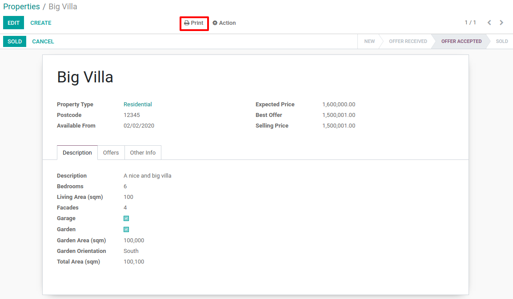

.. _howto/rdtraining/J_reports:

=======================
Advanced J: PDF Reports
=======================

.. warning::

    This tutorial assumes you have completed the :ref:`Core Training <howto/rdtraining>`
    and have installed :ref:`wkhtmltopdf <howto/rdtraining/02_setup/install-wkhtmltopdf>`.

    To follow the exercise, it is recommended that you fetch the branch
    14.0-core from the repository XXX, it
    contains a version of the module created during the core training we can use
    as a starting point.

We were previously :ref:`introduced to QWeb <howto/rdtraining/15_qwebintro>`
in the Core Training where it was used to build a kanban view. Now we will expand on one of QWeb's
other main uses: creating PDF reports. A common business requirement is the ability to create documents
to send to customers and to use internally. These reports can be used to summarize and display
information in an organized template to support the business in different ways. Odoo
can additionally add our company's header and footer to our reports with minimal extra effort.

The documentation related to this topic can be found in :ref:`reference/qweb`,
:ref:`reference/reports/report` and the :ref:`reference/actions/report`
section of the Actions reference.

File Structure
==============

The bulk of a PDF report is its QWeb template. It also typically needs a corresponding
``ir.actions.report`` to include the report within a module's business logic.
There is no strict rule for the file names or where they are located, but these two parts are
typically stored in 2 separate files within a ``report`` folder in the top level of your module's
directory. If a module has many or multiple long report templates, then they are often organized in
a logical manner across different files named after the report(s) they contain. All actions
for the reports are usually stored in the same file ending with ``_report_views.xml`` regardless of the
number of reports it contains.

Therefore it is expected that your work tree will look something like:

.. code-block:: bash

  estate
  ├── models
  │   ├── *.py
  │   └── __init__.py
  ├── report
  │   ├── estate_report_templates.xml
  │   └── estate_report_views.xml
  ├── security
  │   └── ir.model.access.csv
  ├── views
  │   └── *.xml
  ├── __init__.py
  └── __manifest__.py

Note that you will often see other non-QWeb and non-XML files containing "report" in their name also within
the report folder. These are unrelated to the reports covered in this tutorial and are covered in
:ref:`another advanced topic <howto/rdtraining/K_dashboard>`. For now you can think of them as customized views
that use direct SQL queries (sometimes referred to as SQL Views).

Don't forget to add whatever files your template and action view will be located in to your ``__manifest__.py``.
In this case you will want to add the files to the ``data`` list and remember that the files listed in a manifest
are loaded sequentially!

Basic Report
============

.. note::

    **Goal**: at the end of this section, we will can print a report that displays all offers for a
    property.

    .. image:: J_reports/simple_report.png
      :align: center
      :alt: Simple PDF report

In our real estate example there are many useful reports that we could create. One simple report we
can create is one that displays all of a property's offers.

Report Data
-----------

Before we do anything we first need some data to populate our reports or else this tutorial
won't be very interesting. When creating reports, you will need some data to test your report code
and check that the resulting look is as expected. It is a good idea to test with data that will cover most
or all of your expected use cases. A good representation set for our simple report is:

* At least 3 properties where 1 is "sold", 1 is "offer received" and 1 is "new".
* At least 2-3 offers for our "sold" and "offer received" properties

If you don't have a set of data like this already, you can either:

* Complete :ref:`howto/rdtraining/C_data` (if you haven't done so already) and add the extra
  cases to your demo data (you may need to create a new database to load in the demo data).
* Manually create the data in your database.
* Copy this `data file <https://github.com/odoo/technical-training-solutions/blob/14.0-J_reports/estate/data/estate_demo.xml>`__
  into a new directory (data) in your estate module and copy
  `these lines <https://github.com/odoo/technical-training-solutions/blob/14.0-J_reports/estate/__manifest__.py#L21-L23>`__
  into your __manifest__.py file (you may need to create a new database to load in the demo data).

Before continuing, click through your data in your database and make sure your data is as expected.
Of course you can add the data after you write your report code, but then you will not be able to
incrementally test portions of your code as you write it. This can make checking for mistakes and
debugging your code more difficult in the long run for complicated reports.

Minimal Template
----------------

A minimal viable template is viewable under the "Minimal viable template" section of the
:ref:`reference/reports/templates` documentation. We can modify this example to build
our minimal property offers template file:

.. code-block:: xml

    <?xml version="1.0" encoding="UTF-8" ?>
    <odoo>
        <template id="report_property_offers">
            <t t-foreach="docs" t-as="property">
                <t t-call="web.html_container">
                    <t t-call="web.external_layout">
                        

                            <h2>
                                
                            </h2>
                            

                                <strong>Expected Price: </strong>
                                
                            

                            <table class="table">
                                <thead>
                                    <tr>
                                        <th>Price</th>
                                    </tr>
                                </thead>
                                <tbody>
                                    <t t-set="offers" t-value="property.mapped('offer_ids')"/>
                                    <tr t-foreach="offers" t-as="offer">
                                        <td>
                                            
                                        </td>
                                    </tr>
                                </tbody>
                            </table>
                        

                    </t>
                </t>
            </t>
        </template>
    </odoo>

Most of the Odoo specific (i.e. non-HTML) items in our file are explained in the minimal viable template section.
Some additional features in our template are:

* The use of the ``class="table"`` attribute so our table has some nice formatting. Twitter Bootstrap
  (we're using its table class in this case) and FontAwesome (useful for adding icons) classes can
  be used in your report template.
* The use of ``t-set``, ``t-value``, ``t-foreach`` and ``t-as`` so that we can loop over all of the ``offer_ids``.

If you are already familiar with website templating engines, then the QWeb directives (i.e. the `t-` commands)
probably don't need much explanation and you can just look at its :ref:`documentation <reference/qweb>` and
skip ahead to the next subsection.

Otherwise you are encouraged to read more about them (
`Wikipedia <https://en.wikipedia.org/wiki/Template_processor>`__ has a good high level description), but
the general idea is that QWeb provides the ability to dynamically generate web code based on Odoo data and
simple commands. I.e. QWeb can access recordset data (and methods) and process simple programming operations
such as setting and accessing temporary variables. For example, in the above example:

* ``t-set`` creates a temporary variable called "offers" that has its value set by ``t-value`` to the current
  ``estate.property`` recordset's ``offer_ids``.
* the ``t-foreach`` and ``t-as`` usage is the equivalent to the Python:

.. code-block:: Python

  for offer in offers:

Report Action
-------------

Now that we have a template, we need to make it accessible in our app via a ``ir.actions.report``.
A practical example of ``ir.actions.report`` is
`here <https://github.com/odoo/odoo/blob/0e12fa135882cd5095dbf15fe2f64231c6a84336/addons/event/report/event_event_reports.xml#L20-L30>`__
corresponding to
`this template <https://github.com/odoo/odoo/blob/0e12fa135882cd5095dbf15fe2f64231c6a84336/addons/event/report/event_event_templates.xml#L5>`__.
Its contents are all explained in :ref:`the documentation <reference/actions/report>`.

An ``ir.actions.report`` is primarily used via the Print menu of a model's view. In the practical
example, the ``binding_model_id`` specifies which model's views the report should show in and Odoo
will auto-magically add it for you. Another common use case of the report action is to link it to
a button like we learned in :ref:`howto/rdtraining/10_actions`. This is handy for reports that
only make sense under specific conditions. For example, if we wanted to make a "Final Sale" report,
then we can link it to a "Print Sale Info" button that appears in the form view only when the
property is "Sold".

You may have noticed or are wondered why our report template loops through a recordset. When our
template is passed more than one record, it can produce one PDF report for all of the records.
Using the Print menu in the list view with multiple records selected will demonstrate this.

Make a Report
---------------

Finally, you now know where to create your files and how the content of the files should look. Happy report making!

.. exercise:: Make a report.

    - Add the property offers report from the minimal template subsection to the Print menu of the Property views.

    - Improve the report by adding more data. Refer to the **Goal** of this section to see what additional
      data you can add and feel free to add even more.

    - Bonus: Make an extra flexible report by adding in some logic so that when there are no offers on a property
      then we don't create a table and instead write something about how there are no offers yet. Hint: you will
      need to use ``t-if`` and ``t-else``.

    Remember to check that your PDF reports match your data as expected.

Sub-templates
=============

.. note::

    **Goal**: at the end of this section, we will have a sub-template that we use in 2 reports.

    .. image:: J_reports/report_subtemplate.png
      :align: center
      :alt: Report using a subtemplate

There are two main reasons for using sub-templates. One is to make the code easier to read when working with
extra long or complicated templates. The other is to reuse code where possible. Our simple property offers
report is useful, but listing property offers information can be useful for more than just one report template.
One example is a report that lists all of a salesman's properties' offers.

See if you can understand how to call a sub-template by reading the
:ref:`documentation <reference/qweb/sub-templates>` on it and/or by looking at an
`example <https://github.com/odoo/odoo/blob/0e12fa135882cd5095dbf15fe2f64231c6a84336/addons/portal/static/src/xml/portal_chatter.xml#L147-L160>`__
(remember QWeb uses the same control flows regardless if it is for a report or a view in Odoo.)

.. exercise:: Create and use a sub-template.

    - Split the table portion of the offers into its own template. Remember to check that your
      original report still prints correctly afterwards.

    - Add a new report for ``res.users`` that allows you to print all of the Real Estate Properties
      that are visible in their form view (i.e. in the "Settings" app). Include the offers for each
      of those saleman's properties in the same report. Hint: since the ``binding_model_id`` in this
      case will not be within the estate module, you will need to use ``ref="base.model_res_users"``.

      Your end result should look similar to the image in the **Goal** of this section.

    Remember to check that your reports match your data as expected!

Report Inheritance
==================

.. note::

    **Goal**: at the end of this section, we will inherit the property report in the ``estate_account``
    module.

    .. image:: J_reports/inherited_report.png
      :align: center
      :alt: An inherited report

Inheritance in QWeb uses the same ``xpath`` elements as :ref:`views inheritance <reference/views/inheritance>`.
A QWeb template refers to its parent template in a different way though. It is even easier to do by just adding
the ``inherit_id`` attribute to the ``template`` element and setting it equal to the *module.parent_template_id*.

We didn't add any new fields to any of the estate models in `estate_account`, but we can still add information
to our existing property report. For example, we know that any "Sold" properties will already have an invoice
created for them, so we can add this information to our report.

.. exercise:: Inherit a report.

    - Extend the property report to include some information about the invoice. You can look at the **Goal** of this
      section for inspiration (i.e. print a line when the property is Done, otherwise print nothing).

    Again, remember to check that your reports match your data as expected!

Additional Features
===================

All of the following extra features are described further in the :ref:`reference/reports/report`
documentation, including how to implement each of them.

Translations
------------

We all know Odoo is used in multiple languages thanks to automated and manual translating. QWeb reports are no
exception! Note that sometimes the translations do not work properly if there are unnecessary spaces in your
template's text content so try to avoid them when possible (especially leading spaces).

Reports are web pages
---------------------

You probably are tired of hearing that QWeb creates HTML, but we're saying it again! One of the
neat features about reports being written in QWeb is they can be viewed within the web browser.
This can be useful if you want to embed a hyperlink that leads to a specific report. Note that
the usual security checks will still apply to prevent unauthorized users from accessing the reports.

Barcodes
--------

Odoo has a built-in barcode image creator that allows for barcodes to be embedded in your reports.
Check out the corresponding
`code <https://github.com/odoo/odoo/blob/0e12fa135882cd5095dbf15fe2f64231c6a84336/addons/web/controllers/main.py#L2044-L2046>`__
to see all the supported barcode types.
