:banner: banners/build_a_theme.jpg

=====================
Theme Tutorial
=====================

.. rst-class:: lead

Odoo celebrates freedom. Freedom for the designer to go further and
freedom for the user to customize everything according to their needs.

Ready to create your own theme? Great. Here are some things you should know before you begin. This tutorial is a guide to creating an Odoo theme.

.. image:: theme_tutorial_assets/img/Intro.jpg


An introduction for web designers
=================================

If you are a web designer using Odoo for the first time, you are in the right place.
This introduction will outline the basics of Odoo theme creation.

.. note::

   Odoo’s team has created a framework that’s powerful and easy to use. There’s no need to know special syntaxes to use this set of tools.

From common CMS to Odoo
-----------------------

.. note::

   If you always think and work in the same way, you’ll probably get the same results. If you want something completely new,  then try something different.

..

    Where is my header.php file?

This is usually the first question from a web designer used to working with Wordpress or Joomla and coming to Odoo for the first time.

.. container:: col-sm-4

   .. image:: theme_tutorial_assets/img/cms.jpg

.. container:: col-sm-7

  Indeed, when using common CMSs, you have to code several files (like header.php, page.php, post.php, etc.) in order to create a basic structure for your website. With those systems, this base structure acts as a design foundation that you have to update over time to ensure compatibility within your CMS. So, even after you have spent hours coding the files, you have not even started on the design yet.

  This **does not** apply to creating Odoo themes.


.. note::
   :class: col-sm-12

   We think that theme design should be simple (and powerful). When we created our Website Builder, we decided to start from scratch instead of relying on what already existed. This approach gave us the freedom to focus on the things that are really important for designers: styles, content and the logic behind them. No more struggling with technical stuff.

Odoo default theme structure
----------------------------

.. container:: col-sm-8

  Odoo comes with a default theme structure.
  It is a very basic “theme” that provides minimal structure and layout. When you create a new theme, you are actually extending this.
  Indeed it’s always enabled in your setup and it acts exactly like the CMS’s base structure we mentioned above, except that you don’t have to create or maintain it.
  It will upgrade automatically within your Odoo installation and, since it is included in the Website Builder module, everything is smoothly integrated by default.

  As a result, you are totally free to focus on design while this structure does the job of providing integrations and functionality.

.. container:: col-sm-4

   .. image:: theme_tutorial_assets/img/def_structure.jpg

.. container:: col-md-6

   **Main features:**

   * Basic layouts for pages, blog and eCommerce
   * Website Builder integration
   * Basic Snippets
   * Automatic Less/Sass compiling
   * Automatic Js and CSS minification and combination

.. container:: col-md-6

   **Main technologies:**

   * Twitter Bootstrap
   * jQuery
   * jQuery UI
   * underscore.js

Thinking "modular"
==================

An Odoo theme is not a folder containing HTML or PHP files, it’s a modular framework written in XML. Never worked with XML files before? Don’t worry, after following the tutorial, you’ll be able to create your first theme with only basic knowledge of HTML.

Using classical web design workflows, you usually code the layout of the entire page. The result of this is a “static” web page. You can update the content, of course, but your client will need you to work on making even basic changes.

Creating themes for Odoo is a total change of perspective. Instead of defining the complete layout for a page, you can create blocks (snippets) at let the user choose where to “drag&drop” them, creating the page layout on their own.
We call this modular design.

Imagine an Odoo theme as a “list” of elements and options that you have to create and style.
As a designer, your goal is to style these elements in order to achieve a wonderful result, regardless of where the end user chooses to place them.

Let’s take a tour of our “list” elements:

.. row

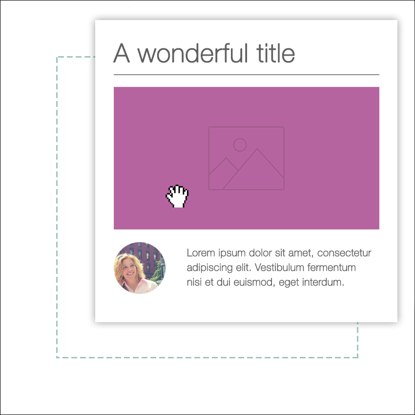

   Snippets (or building-blocks)

   A piece of HTML code.  The user  will  drag&drop, modify and combine them using our built-in Website Builder interface. You can define sets of options and styles for each snippet. The user will choose from them according to their needs.

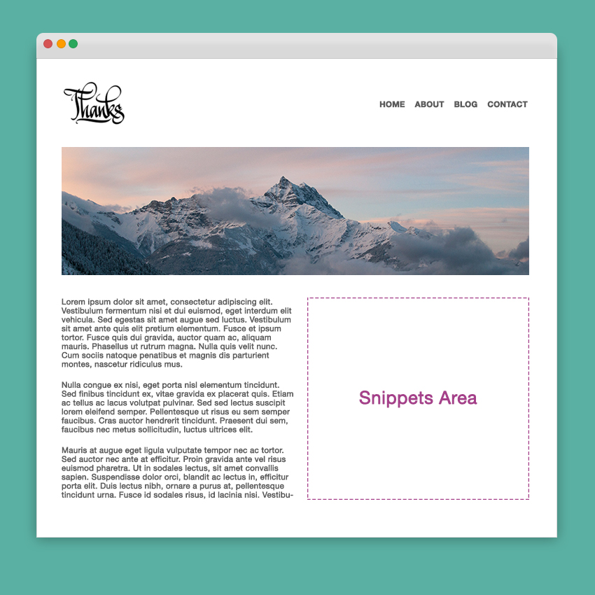

   Pages

   These are normal web pages, except that they will be editable by the final user and that you can define an empty area that the user can “fill” by dragging snippets into it.

.. /row
.. raw:: html

    <div class="clearfix themes"></div>

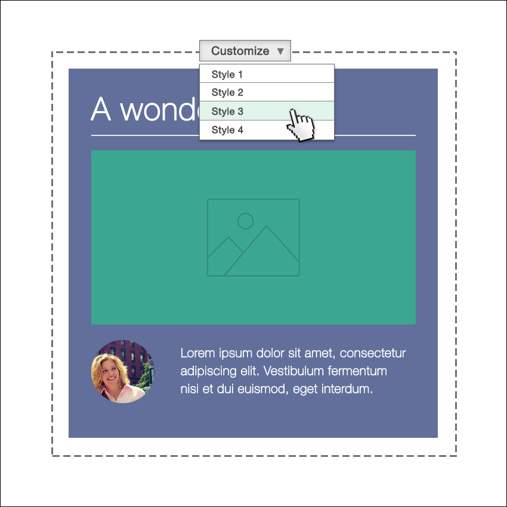

   Styles

   Styles are defined using standard CSS files (or Less/Sass). You can define a style as **default** or **optional**. The default styles are always active in your theme, the optional styles can be enabled or disabled by the user.


   Functionalities

   Thanks to Odoo’s modularity, everything can be personalized even more. This means there are endless possibilities for your creativity. Adding functionalities is easy and it’s simple to provide the end user with customizable options.

.. /row

Odoo's XML files, an overview
-----------------------------

Any Odoo XML file starts with encoding specifications.
After that, you have to write your code inside a ``<data>`` tag, placed into an ``</odoo>`` tag.

.. code-block:: xml

   [XML]
   <?xml version="1.0" encoding="utf-8" ?>
   <odoo>
     <data>
       ## YOUR CODE HERE
     </data>
   </odoo>

Almost every element and option that you create has to be placed inside a ``<template>`` tag, like in this example.

.. code-block:: xml

    [XML]
    <template id="my_title" name="My title">
      <h1>This is an HTML block</h1>
      <h2 class="lead">And this is a subtitle</h2>
    </template>

.. important::

   don't misunderstand what ``template`` means. A template tag only
   defines a piece of html code or options - but it does not
   necessarily coincide with a visual arrangement of elements.

The previous code defines a title, but it will not be displayed
anywhere because that *template* is not associated with any part of
the **Odoo default structure**.  In order to do that you can use
**xpath**, **qWeb** or a combination of both.

Keep reading the tutorial to learn to how properly extend it with your own code.

Update your theme
-----------------

.. container:: col-sm-6

  Since XML files are only loaded when you install the theme, you will have to force reloading every time you make changes on an xml file.

  To do that, click on the Upgrade button in the module’s page.

  .. image:: theme_tutorial_assets/img/restart.png

.. container:: col-sm-5

  .. image:: theme_tutorial_assets/img/upgrade_module.png


Create a theme module
======================

Odoo’s themes are packaged like modules. Even if you are designing a very simple website for your company or client, you need to package the theme like an Odoo module.

``main folder``
  Create a folder and name it like this: ``theme_`` followed by your
  theme's name.

``__manifest__.py``
  Create an empty document and save it to your folder as
  ``__manifest__.py``. This will contain the configuration info for
  your theme.

``__init__.py``
  Create another empty file and name it ``__init__.py``. It's a
  mandatory system file. Create and leave it blank.

``views`` and ``static`` folders
  Create them in the main folder. In ``views`` you'll place your xml
  files that define your snippets, your pages and your
  options. ``static`` folder is the right place for your style ,
  images and custom js code.

.. important::

  Use two underscore characters at the beginning
  and two at the end of odoo and init file names.

The final result should be something like this:

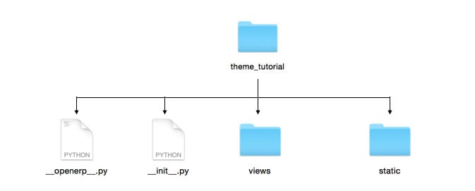

Edit ``__manifest__.py``
------------------------

Open the ``__manifest__.py`` you created and copy/paste the following:

.. code-block:: python

  {
    'name':'Tutorial theme',
    'description': 'A description for your theme.',
    'version':'1.0',
    'author':'Your name',

    'data': [
    ],
    'category': 'Theme/Creative',
    'depends': ['website'],
  }

Replace the first four property’s values with anything you like.
These values will be used to identify your new theme in Odoo’s backend.

The ``data`` property will contain the xml files list. Right now it’s empty, but we will add any new files created.

``application: True`` is mandatory.

``category`` defines your module category (always “Theme”) and, after a slash, the subcategory. You can use one subcategory from the Odoo Apps categories list. (https://www.odoo.com/apps/themes)


``depends`` specifies the modules needed by our theme to work properly. For our tutorial theme, we only need website. If you need blogging or eCommerce features as well, you have to add those modules too.

.. code-block:: python

   ...
   'depends': ['website', 'website_blog', 'sale'],
   ...


Installing your theme
---------------------

To install your theme, you just place your theme folder inside addons in your Odoo installation.

After that, navigate to the Settings page, look for your theme and click on the install button.

Structure of an Odoo page
=========================

An Odoo page is the visual result of a combination of 2 kind of elements, **cross-pages** and **unique**.
By default, Odoo provides you with a **Header** and a **Footer** (cross-pages) and a unique main element that contains the content that makes your page unique.

.. note::

  Cross-pages elements will be the same on every page. Unique elements are related to a specific page only.

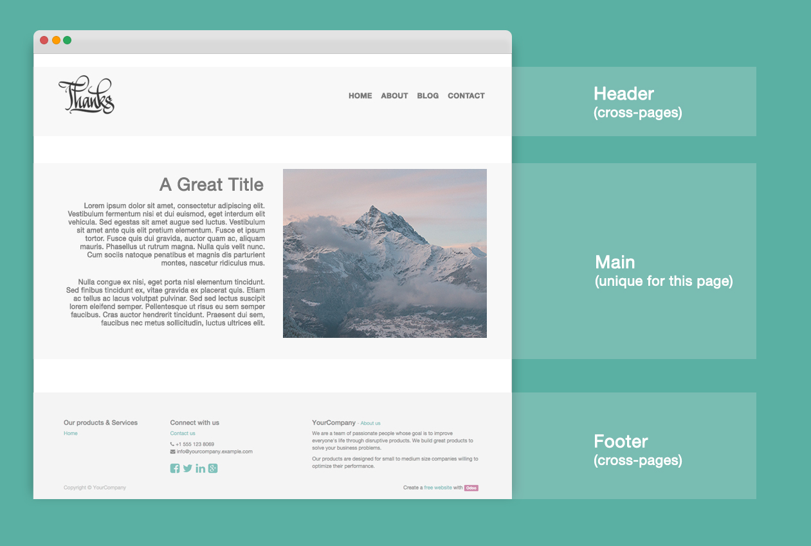

To inspect the default layout, simply create a new page using the
Website Builder.  Click on :menuselection:`Content --> New Page` and
add a page name.  Inspect the page using your browser.

.. code-block:: html

  <div id=“wrapwrap”>
    <header />
    <main />
    <footer />
  </div>

Extend the default Header
-------------------------

By default, Odoo header contains a responsive navigation menu and the company’s logo. You can easily add new elements or style the existing one.

To do so, create a **layout.xml** file in your **views** folder and add the default Odoo xml markup.

.. code-block:: xml

   <?xml version="1.0" encoding="utf-8" ?>
   <odoo>
     <data>

     </data>
   </odoo>

Create a new template into the ``<data>`` tag, copy-pasting the following
code.

.. code-block:: xml

  <!-- Customize header  -->
  <template id="custom_header" inherit_id="website.layout" name="Custom Header">

    <!-- Assign an id  -->
    <xpath expr="//div[@id='wrapwrap']/header" position="attributes">
      <attribute name="id">my_header</attribute>
    </xpath>

    <!-- Add an element after the top menu  -->
    <xpath expr="//div[@id='wrapwrap']/header/div" position="after">
      <div class="container">
        <div class="alert alert-info mt16" role="alert">
          <strong>Welcome</strong> in our website!
        </div>
      </div>
    </xpath>
  </template>

The first xpath will add the id ``my_header`` to the header. It’s the best option if you want to
target css rules to that element and avoid these affecting other content on the page.

.. warning::

  Be careful replacing default elements attributes. As your theme will extend the default one,
  your changes will take priority in any future Odoo’s update.

The second xpath will add a welcome message just after the navigation menu.

The last step is to add layout.xml to the list of xml files used by
the theme. To do that, edit your ``__manifest__.py`` file like this

.. code-block:: python

  'data': [ 'views/layout.xml' ],

Update your theme


Great! We successfully added an id to the
header and an element after the navigation menu. These changes will be
applied to each page of the website.

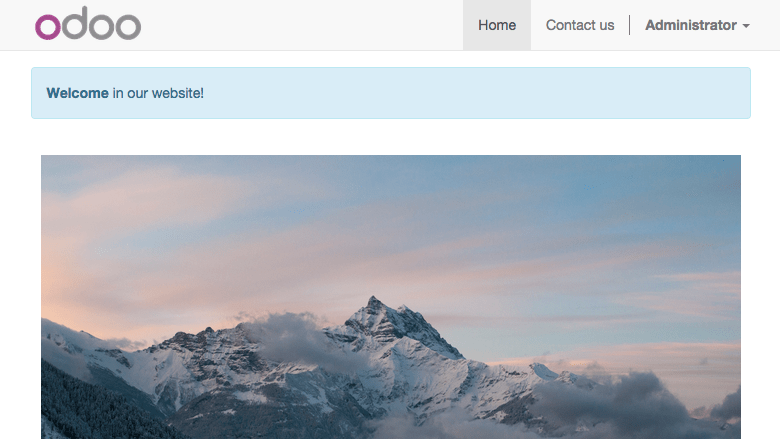

Create a specific page layout
=============================

Imagine that we want to create a specific layout for a Services page.
For this page, we need to add a list of services to the top and give the client the possibility of setting the rest of the page’s layout using snippets.

Inside your *views* folder, create a **pages.xml** file and add the
default Odoo markup.  Inside ``<data>`` create a ``<template>`` tag, set the
``page`` attribute to ``True`` and add your code into it.

.. code-block:: xml

   <?xml version="1.0" encoding="utf-8" ?>
   <odoo>
     <data>
       <!-- === Services Page === -->
       <template name="Services page" id="website.services" page="True">
         <h1>Our Services</h1>
           <ul class="services">
             <li>Cloud Hosting</li>
             <li>Support</li>
             <li>Unlimited space</li>
           </ul>
         </template>
       </data>
     </odoo>

The page title will be the template ID. In our case *Services* (from ``website.services``)

We successfully created a new page layout, but we haven't told the
system **how to use it**. To do that, we can use **QWeb**. Wrap the
html code into a ``<t>`` tag, like in this example.

.. code-block:: xml

   <!-- === Services Page === -->
   <template name="Services page" id="website.services" page="True">
     <t t-call="website.layout">
       <div id="wrap">
         <div class="container">
           <h1>Our Services</h1>
           <ul class="services">
             <li>Cloud Hosting</li>
             <li>Support</li>
             <li>Unlimited space</li>
           </ul>
         </div>
       </div>
     </t>
   </template>

Using ``<t t-call="website.layout">`` we will extend the Odoo
default page layout with our code.

As you can see, we wrapped our code into two ``<div>``,  one with ID ``wrap`` and the other one with class ``container``. This is to provide a minimal layout.

The next step is to add an empty area that the user
can fill with snippets. To achieve this, just create a ``div`` with
``oe_structure`` class just before closing the ``div#wrap`` element.

.. code-block:: xml

   <?xml version="1.0" encoding="utf-8" ?>
   <odoo>
   <data>

   <!-- === Services Page === -->
   <template name="Services page" id="website.services" page="True">
     <t t-call="website.layout">
      <div id="wrap">
        <div class="container">
          <h1>Our Services</h1>
          <ul class="services">
            <li>Cloud Hosting</li>
            <li>Support</li>
            <li>Unlimited space</li>
          </ul>
          <!-- === Snippets' area === -->
          <div class="oe_structure" />
        </div>
      </div>
     </t>
   </template>

   </data>
   </odoo>

.. tip::

   You can create as many snippet areas as you like and place them anywhere in your pages.

Our page is almost ready. Now all we have to do is add **pages.xml** in our **__manifest__.py** file

.. code-block:: python

   'data': [
     'views/layout.xml',
     'views/pages.xml'
   ],

Update your theme


Great, our Services page is ready and you’ll be able to access it by navigating to ``/yourwebsite/page/services``.

You will notice that it's possible to drag/drop snippets underneath the
*Our Services* list.

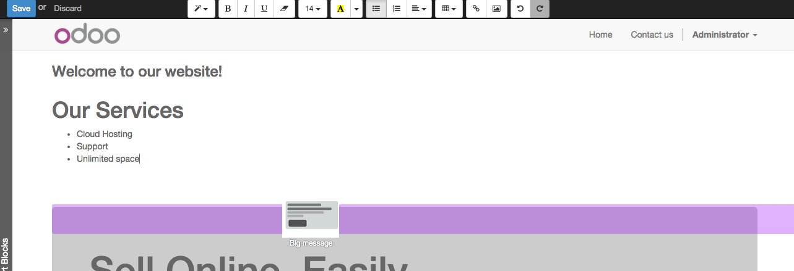

Now let's go back to our *pages.xml* and, after our page template,
copy/paste the following code.

.. code-block:: xml

  <record id="services_page_link" model="website.menu">
    <field name="name">Services</field>
    <field name="url">/page/services</field>
    <field name="parent_id" ref="website.main_menu" />
    <field name="sequence" type="int">99</field>
  </record>

This code will add a link to the main menu.

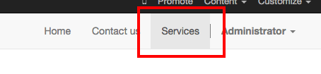

The **sequence** attribute defines the link’s position in the top menu.
In our example, we set the value to ``99`` in order to place it last. I you want to place it in a particular position, you have to replace the value according to your needs.

As you can see inspecting the *data.xml* file in the ``website`` module, the **Home** link is set to ``10`` and the **Contact** us one is set to ``60`` by default.
If, for example, you want to place your link in the **middle**, you can set your link’s sequence value to ``40``.

Add Styles
==========

Odoo includes Bootstrap by default. This means that you can take advantage of all Bootstrap styles and layout functionalities out of the box.

Of course Bootstrap is not enough if you want to provide a unique design. The following steps will guide you through how to add custom styles to your theme.
The final result won't be pretty, but will provide you with enough information to build upon on your own.

Let’s start by creating an empty file called **style.less** and place it in a folder called **less** in your static folder.
The following rules will style our *Services* page. Copy and paste it, then save the file.

.. code-block:: css

   .services {
       background: #EAEAEA;
       padding: 1em;
       margin: 2em 0 3em;
       li {
           display: block;
           position: relative;
           background-color: #16a085;
           color: #FFF;
           padding: 2em;
           text-align: center;
           margin-bottom: 1em;
           font-size: 1.5em;
       }
   }

Our file is ready but it is not included in our theme yet.

Let’s navigate to the view folder and create an XML file called *assets.xml*. Add the default Odoo xml markup and copy/paste the following code. Remember to replace ``theme folder`` with your theme’s main folder name.

.. code-block:: xml

   <template id="mystyle" name="My style" inherit_id="website.assets_frontend">
       <xpath expr="link[last()]" position="after">
           <link href="/theme folder/static/less/style.less" rel="stylesheet" type="text/less"/>
       </xpath>
   </template>

We just created a template specifying our less file. As you can see,
our template has a special attribute called ``inherit_id``.  This
attribute tells Odoo that our template is referring to another one in
order to operate.

In this case, we are referring to ``assets_frontend`` template,
located in the ``website`` module. ``assets_frontend`` specifies the
list of assets loaded by the website builder and our goal is to add
our less file to this list.

This can be achieved using xpath with the attributes
``expr="link[last()]"`` and ``position="after"``, which means "*take my
style file and place it after the last link in the list of the
assets*".

Placing it after the last one, we ensure that our file will
be loaded at the end and take priority.

Finally add **assets.xml** in your **__manifest__.py** file.

Update your theme


Our less file is now included in our theme, it will be automatically compiled, minified and combined with all Odoo’s assets.

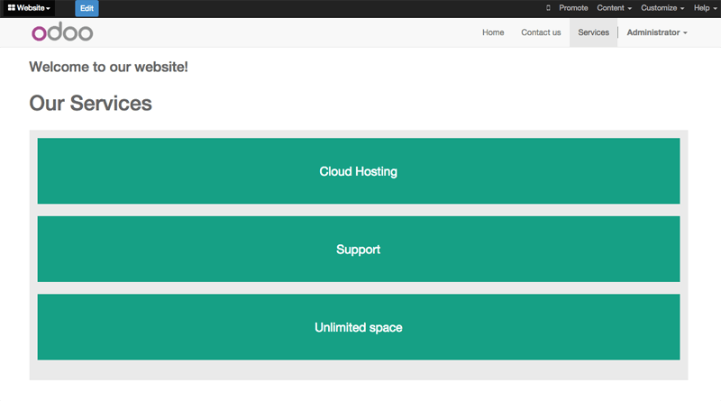

Create Snippets
===============

Since snippets are how users design and layout pages, they are the most important element of your design.
Let’s create a snippet for our Service page. The snippet will display three testimonials and it will be editable by the end user using the Website Builder UI.
Navigate to the view folder and create an XML file called **snippets.xml**.
Add the default Odoo xml markup and copy/paste the following code.
The template contains the HTML markup that will be displayed by the snippet.

.. code-block:: xml

   <template id="snippet_testimonial" name="Testimonial snippet">
     <section class="snippet_testimonial">
       <div class="container text-center">
         <div class="row">
           <div class="col-md-4">
             
             <h3>Client Name</h3>
             <p>Lorem ipsum dolor sit amet, consectetur adipiscing elit.</p>
           </div>
           <div class="col-md-4">
             
             <h3>Client Name</h3>
             <p>Lorem ipsum dolor sit amet, consectetur adipiscing elit.</p>
           </div>
           <div class="col-md-4">
             
             <h3>Client Name</h3>
             <p>Lorem ipsum dolor sit amet, consectetur adipiscing elit.</p>
           </div>
         </div>
       </div>
     </section>
   </template>

As you can see, we used Bootstrap default classes for our three columns. It’s not just about layout, these classes **will be triggered by the Website Builder to make them resizable by the user**.

The previous code will create the snippet’s content, but we still need to place it into the editor bar, so the user will be able to drag&drop it into the page. Copy/paste this template in your **snippets.xml** file.

.. code-block:: xml

   <template id="place_into_bar" inherit_id="website.snippets" name="Place into bar">
     <xpath expr="//div[@id='snippet_structure']/div[@class='o_panel_body']" position="inside">
       <t t-snippet="theme_tutorial.snippet_testimonial"
          t-thumbnail="/theme_tutorial/static/src/img/ui/snippet_thumb.jpg"/>
     </xpath>
   </template>

.. rst-class:: col-sm-6

Using xpath, we are targeting a particular element with id
``snippet_structure``. This means that the snippet will appear in the
Structure tab. If you want to change the destination tab, you have just to replace the ``id`` value in the xpath expression.


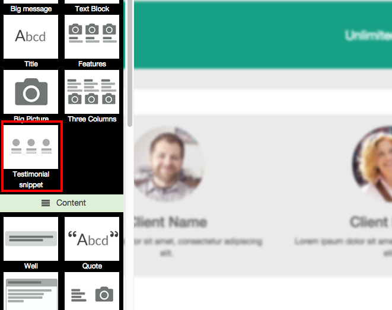


============  ==================================
Tab Name      Xpath expression
============  ==================================
Structure     ``//div[@id='snippet_structure']``
Content       ``//div[@id='snippet_content']``
Feature       ``//div[@id='snippet_feature']``
Effect        ``//div[@id='snippet_effect']``
============  ==================================

The ``<t>`` tag will call our snippet's template and will assign a thumbnail placed in the img folder.
You can now drag your snippet from the snippet bar, drop it in your page and see the result.

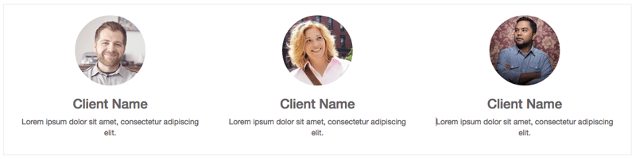


Snippet options
===============

Options allow publishers to edit a snippet’s appearance using the Website Builder’s UI.
Using Website Builder functionalities, you can create snippet options easily and automatically add them to the UI.

Options group properties
-------------------------

Options are wrapped in groups. Groups can have properties that define how the included options will interact with the user interface.

``data-selector=" css selector(s) "``
  Bind all the options included into the group to a particular element.
``data-js=" custom method name "``
  Is used to bind custom Javascript methods.
``data-drop-in=" css selector(s) "``
  Defines the list of elements where the snippet can be dropped into.
``data-drop-near=" css selector(s) "``
  Defines the list of elements that the snippet can be dropped beside.

Default option methods
-----------------------

Options apply standard CSS classes to the snippet. Depending on the method that you choose, the UI will behave differently.

``data-select_class=" class name "``
  More data-select_class in the same group defines a list of classes that the user can choose to apply. Only one option can be enabled at a time.

``data-toggle_class=" class name "``
  The data-toggle_class is used to apply one or more CSS classes from the list to a snippet. Multiple selections can be applied at once.

Let's demonstrate how default options work with a basic example.

We start by adding a new file in our views folder - name it **options.xml** and add the default Odoo XML markup. Create a new template copy/pasting the following


.. code-block:: xml

  <template id="snippet_testimonial_opt" name="Snippet Testimonial Options" inherit_id="website.snippet_options">
    <xpath expr="//div[@data-js='background']" position="after">
      <div data-selector=".snippet_testimonial"> <!-- Options group -->
        <li class="dropdown-submenu">
          <a href="#">Your Option</a>
          <ul class="dropdown-menu"> <!-- Options list -->
            <li data-select_class="opt_shadow"><a>Shadow Images</a></li>
            <li data-select_class="opt_grey_bg"><a>Grey Bg</a></li>
            <li data-select_class=""><a>None</a></li>
          </ul>
        </li>
      </div>
    </xpath>
   </template>

.. note::

  The previous template will inherit the default **snippet_options template** adding our options after the **background** options (xpath expr attribute).
  To place your options in a particular order, inspect the **snippet_options template** from the **website module** and add your options before/after the desired position.

As you can see, we wrapped all our options inside a DIV tag that will
group our options and that will target them to the right selector
(``data-selector=".snippet_testimonial"``).

To define our options we applied ``data-select_class`` attributes to the
``li`` elements. When the user selects an option, the class contained in
the attribute will automatically be applied to the element.

Since ``select_class`` method avoids multiple selections, the last "empty"
option will reset the snippet to default.

Add **options.xml** to ``__manifest__.py`` and update your theme.


Dropping our snippet onto the page, you will notice that our new options are automatically added to the customize menu. Inspecting the page, you will also notice that the class will be applied to the element when selecting an option.

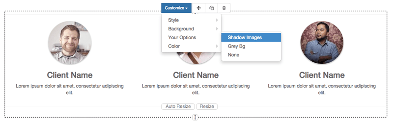

Let’s create some css rules in order to provide a visual feedback for our options. Open our **style.less** file and add the following

.. code-block:: css

   .snippet_testimonial {
     border: 1px solid #EAEAEA;
     padding: 20px;
   }

   // These lines will add a default style for our snippet. Now let's create our custom rules for the options.

   .snippet_testimonial {
     border: 1px solid #EAEAEA;
     padding: 20px;

     &.opt_shadow img {
       box-shadow: 0 2px 5px rgba(51, 51, 51, 0.4);
     }

     &.opt_grey_bg {
       border: none;
       background-color: #EAEAEA;
     }
   }

.. image:: theme_tutorial_assets/img/snippet_options2.png
   :class: shadow-0

Great! We successfully created options for our snippet.

Any time the publisher clicks on an option, the system will add the class specified in the data-select_class attribute.

By replacing ``data-select_class`` with ``data-toggle_class`` you will be able to select
more classes at the same time.


Javascript Options
------------------

``data-select_class`` and ``data-toggle_class`` are great if you need to perform
simple class change operations. But what if your snippet’s customization needs something more?

As we said before, ``data-js`` propriety can be assigned to an options group in order to define a custom method. Let’s create one for our *testimonials snippet* by adding a ``data-js`` attribute to the option’s group div that we created earlier.

.. code-block:: xml

   <div data-js="snippet_testimonial_options" data-selector=".snippet_testimonial">
     [...]
   </div>

Done. From now on, the Website Builder will look for a
``snippet_testimonial_options`` method each time the publisher enters in edit
mode.

Let's go one step further by creating a javascript file, name
it **tutorial_editor.js** and place it into the **static** folder.  Copy/paste
the following code

.. code-block:: javascript

    (function() {
        'use strict';
        var website = odoo.website;
        website.odoo_website = {};
    })();

Great, we successfully created our javascript editor file. This file will contain all the javascript functions used by our snippets in edit mode. Let’s create a new function for our testimonial snippet using the ``snippet_testimonial_options`` method that we created before.

.. code-block:: javascript

   (function() {
       'use strict';
       var website = odoo.website;
       website.odoo_website = {};

       website.snippet.options.snippet_testimonial_options = website.snippet.Option.extend({
           on_focus: function() {
               alert("On focus!");
           }
       })
   })();

As you will notice, we used a method called ``on_focus`` to trigger our function. The Website Builder provides several events you can use to trigger your custom functions.

===========================  ==================================
Event                        Description
===========================  ==================================
``start``                    Fires when the publisher selects the snippet for the first time in an editing session or when the snippet is drag-dropped into the page
``on_focus``                 Fires each time the snippet is selected by the user or when the snippet is drag-dropped into the page.
``on_blur``                  This event occurs when a snippet loses focus.
``on_clone``                 Fires just after a snippet is duplicated. A new js variable is created ($clone) containing the cloned element.
``on_remove``                It occurs just before that the snippet is removed.
``drop_and_build_snippet``   Fires just after that the snippet is drag and dropped into a drop zone. When this event is triggered, the content is already inserted in the page.
``clean_for_save``           It trigger before the publisher save the page.
===========================  ==================================

Let’s add our new javascript files to the editor assets list.
Go back to **assets.xml** and create a new template like the previous one.
This time we have to inherit ``assets_editor`` instead of ``assets_frontend``.

.. code-block:: xml

  <template id="my_js" inherit_id="website.assets_editor" name="My Js">
    <xpath expr="script[last()]" position="after">
      <script type="text/javascript" src="/theme_tutorial/static/src/js/tutorial_editor.js" />
    </xpath>
  </template>

Update your theme


Let’s test our new javascript function. Enter in Edit mode and drop into the page.
You should now see the javascript alert that we bound on the ``on_focus`` event.
If you close it, then click outside of your snippet and then click in it again, the event will trigger again.

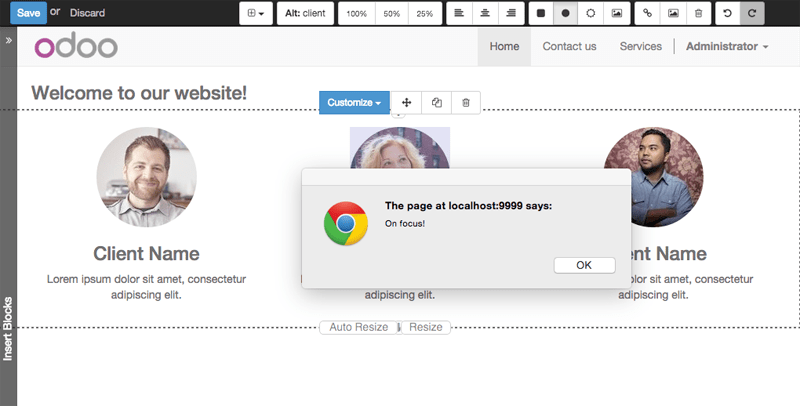


Editing Reference Guide
=======================

Basically all the elements in a page can be edited by the publisher.
Besides that, some element types and css classes will trigger special Website Builder functionalities when edited.

Layout
------

``<section />``
  Any section element can be edited like a block of content. The publisher can move or duplicate it. It’s also possible to set a background image or color. Section is the standard main container of any snippet.

``.row > .col-md-*``
  Any medium  bootstrap columns  directly descending from a .row element, will be resizable by the publisher.

``contenteditable="False"``
  This attribute will prevent editing to the element and all its children.

``contenteditable="True"``
  Apply it to an element inside a contenteditable="False" element in order to create an exception and make the element and its children editable.

``<a href=”#” />``
  In Edit Mode, any link can be edited and styled. Using the “Link Modal” it’s also possible to replace it with a button.

Media
-----
``<span class=”fa” />``
  Pictogram elements. Editing this element will open the Pictogram library to replace the icon. It’s also possible to transform the elements using CSS.

````
  Once clicked, the Image Library will open and you can replace images. Transformation is also possible for this kind of element.

.. code-block:: html

  <div class="media_iframe_video" data-src="[your url]" >
    <div class="css_editable_mode_display"/>
    <div class="media_iframe_video_size"/>
    <iframe src="[your url]"/>
  </div>

This html structure will create an ``<iframe>`` element editable by the publisher.


SEO best practice
=================

Facilitate content insertion
----------------------------

Modern search engine algorithms increasingly focus on content, which means there is less focus on **keyword saturation** and more focus on whether or not the content is **actually relevant to the keywords**.

As content is so important for SEO, you should concentrate on giving publishers the tools to easily insert it. It is important that your snippets are “content-responsive”, meaning that they should fit the publisher’s content regardless of size.

Let’s have a look to this example of a classic two column snippet, implemented in two different ways.


.. container:: col-sm-7

  .. image:: theme_tutorial_assets/img/seo_snippet_wrong.png

.. container:: col-sm-5

  Bad

  Using fixed image, the publisher will be forced to limit the text in order to follow the layout.


.. container:: col-sm-7

  .. image:: theme_tutorial_assets/img/seo_snippet_good.png

.. container:: col-sm-5

  Good

  Using background images that fit the column height, the publisher will be free to add the content regardless of the image’s height.


Page segmentation
-----------------

Basically, page segmentation means that a page is divided into several separate parts and these parts are treated as separate entries by search engines.
When you design pages or snippets, you should be sure to use the right tags in order to facilitate search engine indexing.

``<article>``
  Specifies an independent block of content. Within it should be a piece of self-contained content that should make sense on its own. You can nest ``<article>`` elements within one another. In this case, it’s implied that the nested elements are related to the outer ``<article>`` element.

``<header>``
  Indicates the header section of a self-contained block of content (an ``<article>``).

``<section>``
  Is the snippet default tag and it specifies a subsection of a block of content. It can be used to split ``<article>`` content into several parts. It’s advisable to use a heading element (``<h1>`` – ``<h6>``) to define the section’s topic.

``<hgroup>``
  Is used to wrap a section of headings (``<h1>`` - ``<h6>``). A great example would be an article with both a headline and sub-headline at the top:

  .. code-block:: html

    <hgroup>
      <h1>Main Title</h1>
      <h2>Subheading</h2>
    </hgroup>

Describe your page
------------------

Define keywords
'''''''''''''''
You should use appropriate, relevant keywords and synonyms for those keywords. You can define them for each page using the built-in “Promote” function found in the bar at the top.

Define a title and a description
''''''''''''''''''''''''''''''''

Define them using the “Promote” function. Keep your page titles short and include the main keyword phrase for the page.
Good titles evoke an emotional response, ask a question or promise something.

Descriptions, while not important to search engine rankings, are extremely important in gaining user click-through. These are an opportunity to advertise content and to let people searching know exactly whether the given page contains the information they're looking for. It is important that titles and descriptions on each page are unique.
