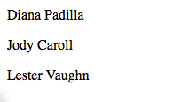

:banner: banners/build_a_website.jpg

.. queue:: website/series

==================
Building a Website
==================

.. warning::

    * This guide assumes `basic knowledge of Python
      <http://docs.python.org/2/tutorial/>`_
    * This guide assumes :ref:`an installed Odoo <setup/install>`

Creating a basic module
=======================

In Odoo, tasks are performed by creating modules.

Modules customize the behavior of an Odoo installation, either by adding new
behaviors or by altering existing ones (including behaviors added by other
modules).

:ref:`Odoo's scaffolding <reference/cmdline/scaffold>` can setup a basic
module. To quickly get started simply invoke:

.. code-block:: console

    $ ./odoo.py scaffold Academy my-modules

This will automatically create a ``my-modules`` *module directory* with an
``academy`` module inside. The directory can be an existing module directory
if you want, but the module name must be unique within the directory.

.. patch::
    :hidden:

A demonstration module
======================

We have a "complete" module ready for installation.

Although it does absolutely nothing we can install it:

* start the Odoo server

  .. code-block:: console

      $ ./odoo.py --addons-path addons,my-modules

* go to http://localhost:8069
* create a new database including demonstration data
* to go :menuselection:`Settings --> Modules --> Local Modules`
* in the top-right corner remove the *Installed* filter and search for
  *academy*
* click the :guilabel:`Install` button for the *Academy* module

To the browser
==============

:ref:`Controllers <reference/http/controllers>` interpret browser requests and
send data back.

Add a simple controller and ensure it is imported by ``__init__.py`` (so
Odoo can find it):

.. patch::

Shut down your server (:kbd:`^C`) then restart it:

.. code-block:: console

    $ ./odoo.py --addons-path addons,my-modules

and open a page to http://localhost:8069/academy/academy/, you should see your
"page" appear:

.. figure:: website/helloworld.png

Templates
=========

Generating HTML in Python isn't very pleasant.

The usual solution is templates_, pseudo-documents with placeholders and
display logic. Odoo allows any Python templating system, but provides its
own :ref:`QWeb <reference/qweb>` templating system which integrates with other
features.

Create a template and ensure the template file is registered in the
``__openerp__.py`` manifest, and alter the controller to use our template:

.. patch::

The templates iterates (``t-foreach``) on all the teachers (passed through the
*template context*), and prints each teacher in its own paragraph.

Finally restart Odoo and update the module's data (to install the template)
by going to :menuselection:`Settings --> Modules --> Local Modules -->
Academy` and clicking :guilabel:`Upgrade`.

.. tip::

    Alternatively, Odoo can be restarted :option:`and update modules at
    the same time<odoo.py -u>`:

    .. code-block:: console

        $ odoo.py --addons-path addons,my-modules -d academy -u academy

Going to http://localhost:8069/academy/academy/ should now result in:

Storing data in Odoo
====================

:ref:`Odoo models <reference/orm/model>` map to database tables.

In the previous section we just displayed a list of string entered statically
in the Python code. This doesn't allow modifications or persistent storage
so we'll now move our data to the database.

Defining the data model
-----------------------

Define a teacher model, and ensure it is imported from ``__init__.py`` so it
is correctly loaded:

.. patch::

Then setup :ref:`basic access control <reference/security/acl>` for the model
and add them to the manifest:

.. patch::

this simply gives read access (``perm_read``) to all users (``group_id:id``
left empty).

.. note::

    :ref:`Data files <reference/data>` (XML or CSV) must be added to the
    module manifest, Python files (models or controllers) don't but have to
    be imported from ``__init__.py`` (directly or indirectly)

.. warning::

    the administrator user bypasses access control, they have access to all
    models even if not given access

Demonstration data
------------------

The second step is to add some demonstration data to the system so it's
possible to test it easily. This is done by adding a ``demo``
:ref:`data file <reference/data>`, which must be linked from the manifest:

.. patch::

.. tip::

    :ref:`Data files <reference/data>` can be used for demo and non-demo data.
    Demo data are only loaded in "demonstration mode" and can be used for flow
    testing and demonstration, non-demo data are always loaded and used as
    initial system setup.

    In this case we're using demonstration data because an actual user of the
    system would want to input or import their own teachers list, this list
    is only useful for testing.

Accessing the data
------------------

The last step is to alter model and template to use our demonstration data:

#. fetch the records from the database instead of having a static list
#. Because :meth:`~openerp.models.Model.search` returns a set of records
   matching the filter ("all records" here), alter the template to print each
   teacher's ``name``

.. patch::

Restart the server and update the module (in order to update the manifest
and templates and load the demo file) then navigate to
http://localhost:8069/academy/academy/. The page should look slightly
different: names should simply be prefixed by a number (the database
identifier for the teacher).

Website support
===============

Odoo bundles a module dedicated to building websites.

So far we've used controllers fairly directly, but Odoo 8 added deeper
integration and a few other services (e.g. default styling, theming) via the
``website`` module.

#. first, add ``website`` as a dependency to ``academy``
#. then add the ``website=True`` flag on the controller, this sets up a few
   new variables on :ref:`the request object <reference/http/request>` and
   allows using the website layout in our template
#. use the website layout in the template

.. patch::

After restarting the server while updating the module (in order to update the
manifest and template) access http://localhost:8069/academy/academy/ should
yield a nicer looking page with branding and a number of built-in page
elements (top-level menu, footer, …)

.. image:: website/layout.png

The website layout also provides support for edition tools: click
:guilabel:`Sign In` (in the top-right), fill the credentials in (``admin`` /
``admin`` by default) then click :guilabel:`Log In`.

You're now in Odoo "proper": the administrative interface. For now click on
the :guilabel:`Website` menu item (top-left corner.

We're back in the website but as an administrator, with access to advanced
edition features provided by the *website* support:

* a template code editor (:menuselection:`Customize --> HTML Editor`) where
  you can see and edit all templates used for the current page
* the :guilabel:`Edit` button in the top-left switches to "edition mode" where
  blocks (snippets) and rich text edition are available
* a number of other features such as mobile preview or :abbr:`SEO (Search
  Engine Optimization)`

URLs and routing
================

Controller methods are associated with *routes* via the
:func:`~openerp.http.route` decorator which takes a routing string and a
number of attributes to customise its behavior or security.

We've seen a "literal" routing string, which matches a URL section exactly,
but routing strings can also use `converter patterns`_ which match bits
of URLs and make those available as local variables. For instance we can
create a new controller method which takes a bit of URL and prints it out:

.. patch::

restart Odoo, access http://localhost:8069/academy/Alice/ and
http://localhost:8069/academy/Bob/ and see the difference.

As the name indicates, `converter patterns`_ don't just do extraction, they
also do *validation* and *conversion*, so we can change the new controller
to only accept integers:

.. patch::

Restart Odoo, access http://localhost:8069/academy/2, note how the old value
was a string, but the new one was converted to an integers. Try accessing
http://localhost:8069/academy/Carol/ and note that the page was not found:
since "Carol" is not an integer, the route was ignored and no route could be
found.

Odoo provides an additional converter called ``model`` which provides records
directly when given their id. Let's use this to create a generic page for
teacher biographies:

.. patch::

then change the list of model to link to our new controller:

.. patch::

Restart Odoo and upgrade the module, then you can visit each teacher's page.
As an exercise, try adding blocks to a teacher's page to write a biography,
then go to another teacher's page and so forth. You will discover, that your
biography is shared between all teachers, because blocks are added to the
*template*, and the *biography* template is shared between all teachers, when
one page is edited they're all edited at the same time.

Field edition
=============

Data which is specific to a record should be saved on that record, so let us
add a new biography field to our teachers:

.. patch::

Restart Odoo and update the views, reload the teacher's page and… the field
is invisible since it contains nothing.

.. todo:: the view has been set to noupdate because modified previously,
          force via ``-i`` or do something else?

For record fields, templates can use a special ``t-field`` directive which
allows editing the field content from the website using field-specific
interfaces. Change the *person* template to use ``t-field``:

.. patch::

Restart Odoo and upgrade the module, there is now a placeholder under the
teacher's name and a new zone for blocks in :guilabel:`Edit` mode. Content
dropped there is stored in the corresponding teacher's ``biography`` field, and
thus specific to that teacher.

The teacher's name is also editable, and when saved the change is visible on
the index page.

``t-field`` can also take formatting options which depend on the exact field.
For instance if we display the modification date for a teacher's record:

.. patch::

it is displayed in a very "computery" manner and hard to read, but we could
ask for a human-readable version:

.. patch::

or a relative display:

.. patch::

Administration and ERP integration
==================================

A brief and incomplete introduction to the Odoo administration
--------------------------------------------------------------

The Odoo administration was briefly seen during the `website support`_ section.
We can go back to it using :menuselection:`Administrator --> Administrator` in
the menu (or :guilabel:`Sign In` if you're signed out).

The conceptual structure of the Odoo backend is simple:

#. first are menus, a tree (menus can have sub-menus) of records. Menus
   without children map to…
#. actions. Actions have various types: links, reports, code which Odoo should
   execute or data display. Data display actions are called *window actions*,
   and tell Odoo to display a given *model* according to a set of views…
#. a view has a type, a broad category to which it corresponds (a list,
   a graph, a calendar) and an *architecture* which customises the way the
   model is displayed inside the view.

Editing in the Odoo administration
----------------------------------

By default, an Odoo model is essentially invisible to a user. To make it
visible it must be available through an action, which itself needs to be
reachable, generally through a menu.

Let's create a menu for our model:

.. patch::

then accessing http://localhost:8069/web/ in the top left should be a menu
:guilabel:`Academy`, which is selected by default, as it is the first menu,
and having opened a listing of teachers. From the listing it is possible to
:guilabel:`Create` new teacher records, and to switch to the "form" by-record
view.

If there is no definition of how to present records (a
:ref:`view <reference/views>`) Odoo will automatically create a basic one
on-the-fly. In our case it works for the "list" view for now (only displays
the teacher's name) but in the "form" view the HTML ``biography`` field is
displayed side-by-side with the ``name`` field and not given enough space.
Let's define a custom form view to make viewing and editing teacher records
a better experience:

.. patch::

Relations between models
------------------------

We have seen a pair of "basic" fields stored directly in the record. There are
:ref:`a number of basic fields <reference/orm/fields/basic>`. The second
broad categories of fields are :ref:`relational
<reference/orm/fields/relational>` and used to link records to one another
(within a model or across models).

For demonstration, let's create a *courses* model. Each course should have a
``teacher`` field, linking to a single teacher record, but each teacher can
teach many courses:

.. patch::

let's also add views so we can see and edit a course's teacher:

.. patch::

It should also be possible to create new courses directly from a teacher's
page, or to see all the courses they teach, so add
:class:`the inverse relationship <openerp.fields.One2many>` to the *teachers*
model:

.. patch::

Discussions and notifications
-----------------------------

Odoo provides technical models, which don't directly fulfill business needs
but which add capabilities to business objects without having to build
them by hand.

One of these is the *Chatter* system, part of Odoo's email and messaging
system, which can add notifications and discussion threads to any model.
The model simply has to :attr:`~openerp.models.Model._inherit`
``mail.thread``, and add the ``message_ids`` field to its form view to display
the discussion thread. Discussion threads are per-record.

For our academy, it makes sense to allow discussing courses to handle e.g.
scheduling changes or discussions between teachers and assistants:

.. patch::

At the bottom of each course form, there is now a discussion thread and the
possibility for users of the system to leave messages and follow or unfollow
discussions linked to specific courses.

Selling courses
---------------

Odoo also provides business models which allow using or opting in business
needs more directly. For instance the ``website_sale`` module sets up an
e-commerce site based on the products in the Odoo system. We can easily make
course subscriptions sellable by making our courses specific kinds of
products.

Rather than the previous classical inheritance, this means replacing our
*course* model by the *product* model, and extending products in-place (to
add anything we need to it).

First of all we need to add a dependency on ``website_sale`` so we get both
products (via ``sale``) and the ecommerce interface:

.. patch::

restart Odoo, update your module, there is now a :guilabel:`Shop` section in
the website, listing a number of pre-filled (via demonstration data) products.

The second step is to replace the *courses* model by ``product.template``,
and add a new category of product for courses:

.. patch::

With this installed, a few courses are now available in the :guilabel:`Shop`,
though they may have to be looked for.

.. note::

    * to extend a model in-place, it's :attr:`inherited
      <openerp.models.Model._inherit>` without giving it a new
      :attr:`~openerp.models.Model._name`
    * ``product.template`` already uses the discussions system, so we can
      remove it from our extension model
    * we're creating our courses as *published* by default so they can be
      seen without having to log in

Altering existing views
-----------------------

So far, we have briefly seen:

* the creation of new models
* the creation of new views
* the creation of new records
* the alteration of existing models

We're left with the alteration of existing records and the alteration of
existing views. We'll do both on the :guilabel:`Shop` pages.

View alteration is done by creating *extension* views, which are applied on
top of the original view and alter it. These alteration views can be added or
removed without modifying the original, making it easier to try things out and
roll changes back.

Since our courses are free, there is no reason to display their price on the
shop page, so we're going to alter the view and hide the price if it's 0. The
first task is finding out which view displays the price, this can be done via
:menuselection:`Customize --> HTML Editor` which lets us read the various
templates involved in rendering a page. Going through a few of them, "Product
item" looks a likely culprit.

Altering view architectures is done in 3 steps:

#. Create a new view
#. Extend the view to modify by setting the new view's ``inherit_id`` to the
   modified view's external id
#. In the architecture, use the ``xpath`` tag to select and alter elements
   from the modified view

.. patch::

The second thing we will change is making the product categories sidebar
visible by default: :menuselection:`Customize --> Product Categories` lets
you toggle a tree of product categories (used to filter the main display) on
and off.

This is done via the ``customize_show`` and ``active`` fields of extension
templates: an extension template (such as the one we've just created) can be
*customize_show=True*. This choice will display the view in the :guilabel:`Customize`
menu with a check box, allowing administrators to activate or disable them
(and easily customize their website pages).

We simply need to modify the *Product Categories* record and set its default
to *active="True"*:

.. patch::

With this, the *Product Categories* sidebar will automatically be enabled when
the *Academy* module is installed.

.. _templates: http://en.wikipedia.org/wiki/Web_template
.. _postgres:
.. _postgresql:
    http://www.postgresql.org
.. _converter pattern:
.. _converter patterns:
    http://werkzeug.pocoo.org/docs/routing/#rule-format
