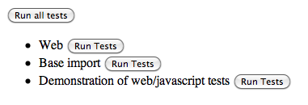
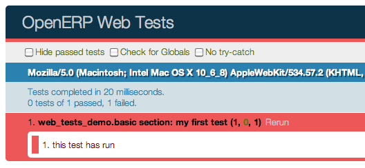
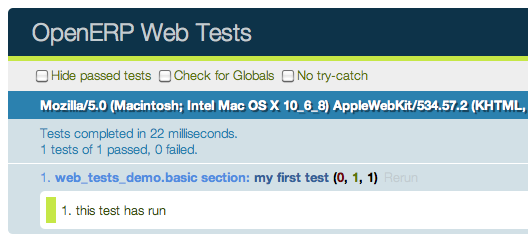

:banner: banners/javascript.jpg

.. highlight:: javascript

.. default-domain:: js

==========
Javascript
==========

Widgets
=======

.. class:: Widget

    Exported in ``web.Widget``, the base class for all visual components.
    It corresponds to an MVC view, and provides a number of service to
    simplify handling of a section of a page:

    * Handles parent/child relationships between widgets
    * Provides extensive lifecycle management with safety features (e.g.
      automatically destroying children widgets during the destruction of a
      parent)
    * Automatic rendering with :ref:`qweb <reference/qweb>`
    * Backbone-compatible shortcuts

DOM Root
--------

A :class:`~Widget` is responsible for a section of the page
materialized by the DOM root of the widget.

A widget's DOM root is available via two attributes:

.. attribute:: Widget.el

    raw DOM element set as root to the widget

.. attribute:: Widget.$el

    jQuery wrapper around :attr:`~Widget.el`

There are two main ways to define and generate this DOM root:

.. attribute:: Widget.template

    Should be set to the name of a :ref:`QWeb template <reference/qweb>`.
    If set, the template will be rendered after the widget has been
    initialized but before it has been started. The root element generated by
    the template will be set as the DOM root of the widget.

.. attribute:: Widget.tagName

    Used if the widget has no template defined. Defaults to ``div``,
    will be used as the tag name to create the DOM element to set as
    the widget's DOM root. It is possible to further customize this
    generated DOM root with the following attributes:

    .. attribute:: Widget.id

        Used to generate an ``id`` attribute on the generated DOM
        root.

    .. attribute:: Widget.className

        Used to generate a ``class`` attribute on the generated DOM root.

    .. attribute:: Widget.attributes

        Mapping (object literal) of attribute names to attribute
        values. Each of these k:v pairs will be set as a DOM attribute
        on the generated DOM root.

    None of these is used in case a template is specified on the widget.

The DOM root can also be defined programmatically by overridding

.. function:: Widget.renderElement

    Renders the widget's DOM root and sets it. The default
    implementation will render a set template or generate an element
    as described above, and will call
    :func:`~Widget.setElement` on the result.

    Any override to :func:`~Widget.renderElement` which
    does not call its ``_super`` **must** call
    :func:`~Widget.setElement` with whatever it
    generated or the widget's behavior is undefined.

    .. note::

        The default :func:`~Widget.renderElement` can
        be called repeatedly, it will *replace* the previous DOM root
        (using ``replaceWith``). However, this requires that the
        widget correctly sets and unsets its events (and children
        widgets). Generally, :func:`~Widget.renderElement` should
        not be called repeatedly unless the widget advertizes this feature.

Using a widget
''''''''''''''

A widget's lifecycle has 3 main phases:

* creation and initialization of the widget instance

  .. function:: Widget.init(parent)

       initialization method of widgets, synchronous, can be overridden to
       take more parameters from the widget's creator/parent

       :param parent: the new widget's parent, used to handle automatic
                      destruction and event propagation. Can be ``null`` for
                      the widget to have no parent.
       :type parent: :class:`~Widget`

* DOM injection and startup, this is done by calling one of:

  .. function:: Widget.appendTo(element)

    Renders the widget and inserts it as the last child of the target, uses
    `.appendTo()`_

  .. function:: Widget.prependTo(element)

    Renders the widget and inserts it as the first child of the target, uses
    `.prependTo()`_

  .. function:: Widget.insertAfter(element)

    Renders the widget and inserts it as the preceding sibling of the target,
    uses `.insertAfter()`_

  .. function:: Widget.insertBefore(element)

    Renders the widget and inserts it as the following sibling of the target,
    uses `.insertBefore()`_

  All of these methods accept whatever the corresponding jQuery method accepts
  (CSS selectors, DOM nodes or jQuery objects). They all return a deferred_
  and are charged with three tasks:

  * rendering the widget's root element via
    :func:`~Widget.renderElement`
  * inserting the widget's root element in the DOM using whichever jQuery
    method they match
  * starting the widget, and returning the result of starting it

    .. function:: Widget.start()

        asynchronous startup of the widget once it's been injected in the DOM,
        generally used to perform asynchronous RPC calls to fetch whatever
        remote data is necessary for the widget to do its work.

        Must return a deferred_ to indicate when its work is done.

        A widget is *not guaranteed* to work correctly until its
        :func:`~Widget.start` method has finished executing. The
        widget's parent/creator must wait for a widget to be fully started
        before interacting with it

        :returns: deferred_ object

* widget destruction and cleanup

  .. function:: Widget.destroy()

    destroys the widget's children, unbinds its events and removes its root
    from the DOM. Automatically called when the widget's parent is destroyed,
    must be called explicitly if the widget has no parents or if it is
    removed but its parent remains.

    A widget being destroyed is automatically unlinked from its parent.

Related to widget destruction is an important utility method:

.. function:: Widget.alive(deferred[, reject=false])

    A significant issue with RPC and destruction is that an RPC call may take
    a long time to execute and return while a widget is being destroyed or
    after it has been destroyed, trying to execute its operations on a widget
    in a broken/invalid state.

    This is a frequent source of errors or strange behaviors.

    :func:`~Widget.alive` can be used to wrap an RPC call,
    ensuring that whatever operations should be executed when the call ends
    are only executed if the widget is still alive::

        this.alive(this.model.query().all()).then(function (records) {
            // would break if executed after the widget is destroyed, wrapping
            // rpc in alive() prevents execution
            _.each(records, function (record) {
                self.$el.append(self.format(record));
            });
        });

    :param deferred: a deferred_ object to wrap
    :param reject: by default, if the RPC call returns after the widget has
                   been destroyed the returned deferred_ is left in limbo
                   (neither resolved nor rejected). If ``reject`` is set to
                   ``true``, the deferred_ will be rejected instead.
    :returns: deferred_ object

.. function:: Widget.isDestroyed()

    :returns: ``true`` if the widget is being or has been destroyed, ``false``
              otherwise

Accessing DOM content
'''''''''''''''''''''

Because a widget is only responsible for the content below its DOM root, there
 is a shortcut for selecting sub-sections of a widget's DOM:

.. function:: Widget.$(selector)

    Applies the CSS selector specified as parameter to the widget's
    DOM root::

        this.$(selector);

    is functionally identical to::

        this.$el.find(selector);

    :param String selector: CSS selector
    :returns: jQuery object

    .. note:: this helper method is similar to ``Backbone.View.$``

Resetting the DOM root
''''''''''''''''''''''

.. function:: Widget.setElement(element)

    Re-sets the widget's DOM root to the provided element, also
    handles re-setting the various aliases of the DOM root as well as
    unsetting and re-setting delegated events.

    :param Element element: a DOM element or jQuery object to set as
                            the widget's DOM root

    .. note:: should be mostly compatible with `Backbone's
              setElement`_

DOM events handling
-------------------

A widget will generally need to respond to user action within its
section of the page. This entails binding events to DOM elements.

To this end, :class:`~Widget` provides a shortcut:

.. attribute:: Widget.events

    Events are a mapping of an event selector (an event name and an optional
    CSS selector separated by a space) to a callback. The callback can
    be the name of a widget's method or a function object. In either case, the
    ``this`` will be set to the widget::

        events: {
            'click p.oe_some_class a': 'some_method',
            'change input': function (e) {
                e.stopPropagation();
            }
        },

    The selector is used for jQuery's `event delegation`_, the
    callback will only be triggered for descendants of the DOM root
    matching the selector\ [#eventsdelegation]_. If the selector is left out
    (only an event name is specified), the event will be set directly on the
    widget's DOM root.

.. function:: Widget.delegateEvents

    This method is in charge of binding :attr:`~Widget.events` to the
    DOM. It is automatically called after setting the widget's DOM root.

    It can be overridden to set up more complex events than the
    :attr:`~Widget.events` map allows, but the parent should always be
    called (or :attr:`~Widget.events` won't be handled correctly).

.. function:: Widget.undelegateEvents

    This method is in charge of unbinding :attr:`~Widget.events` from
    the DOM root when the widget is destroyed or the DOM root is reset, in
    order to avoid leaving "phantom" events.

    It should be overridden to un-set any event set in an override of
    :func:`~Widget.delegateEvents`.

.. note:: this behavior should be compatible with `Backbone's
          delegateEvents`_, apart from not accepting any argument.

Subclassing Widget
------------------

:class:`~Widget` is subclassed in the standard manner (via the
:func:`~Class.extend` method), and provides a number of
abstract properties and concrete methods (which you may or may not want to
override). Creating a subclass looks like this::

    var MyWidget = Widget.extend({
        // QWeb template to use when rendering the object
        template: "MyQWebTemplate",
        events: {
            // events binding example
            'click .my-button': 'handle_click',
        },

        init: function(parent) {
            this._super(parent);
            // insert code to execute before rendering, for object
            // initialization
        },
        start: function() {
            var sup = this._super();
            // post-rendering initialization code, at this point

            // allows multiplexing deferred objects
            return $.when(
                // propagate asynchronous signal from parent class
                sup,
                // return own's asynchronous signal
                this.rpc(/* … */))
        }
    });

The new class can then be used in the following manner::

    // Create the instance
    var my_widget = new MyWidget(this);
    // Render and insert into DOM
    my_widget.appendTo(".some-div");

After these two lines have executed (and any promise returned by
:func:`~Widget.appendTo` has been resolved if needed), the widget is
ready to be used.

.. note:: the insertion methods will start the widget themselves, and will
          return the result of :func:`~Widget.start()`.

          If for some reason you do not want to call these methods, you will
          have to first call :func:`~Widget.render()` on the
          widget, then insert it into your DOM and start it.

If the widget is not needed anymore (because it's transient), simply terminate
it::

    my_widget.destroy();

will unbind all DOM events, remove the widget's content from the DOM and
destroy all widget data.

Development Guidelines
----------------------

* Identifiers (``id`` attribute) should be avoided. In generic applications
  and modules, ``id`` limits the re-usability of components and tends to make
  code more brittle. Most of the time, they can be replaced with nothing,
  classes or keeping a reference to a DOM node or jQuery element.

  If an ``id`` is absolutely necessary (because a third-party library requires
  one), the id should be partially generated using ``_.uniqueId()`` e.g.::

      this.id = _.uniqueId('my-widget-')
* Avoid predictable/common CSS class names. Class names such as "content" or
  "navigation" might match the desired meaning/semantics, but it is likely an
  other developer will have the same need, creating a naming conflict and
  unintended behavior. Generic class names should be prefixed with e.g. the
  name of the component they belong to (creating "informal" namespaces, much
  as in C or Objective-C).
* Global selectors should be avoided. Because a component may be used several
  times in a single page (an example in Odoo is dashboards), queries should be
  restricted to a given component's scope. Unfiltered selections such as
  ``$(selector)`` or ``document.querySelectorAll(selector)`` will generally
  lead to unintended or incorrect behavior.  Odoo Web's
  :class:`~Widget` has an attribute providing its DOM root
  (:attr:`~Widget.$el`), and a shortcut to select nodes directly
  (:func:`~Widget.$`).
* More generally, never assume your components own or controls anything beyond
  its own personal :attr:`~Widget.$el`
* html templating/rendering should use QWeb unless absolutely trivial.
* All interactive components (components displaying information to the screen
  or intercepting DOM events) must inherit from :class:`~Widget`
  and correctly implement and use its API and life cycle.

.. _.appendTo():
    http://api.jquery.com/appendTo/

.. _.prependTo():
    http://api.jquery.com/prependTo/

.. _.insertAfter():
    http://api.jquery.com/insertAfter/

.. _.insertBefore():
    http://api.jquery.com/insertBefore/

.. _event delegation:
    http://api.jquery.com/delegate/

.. _Backbone's setElement:
    http://backbonejs.org/#View-setElement

.. _Backbone's delegateEvents:
    http://backbonejs.org/#View-delegateEvents

.. _deferred: http://api.jquery.com/category/deferred-object/

RPC
===

To display and interact with data, calls to the Odoo server are necessary.
This is performed using :abbr:`RPC <Remote Procedure Call>`.

Odoo Web provides two primary APIs to handle this: a low-level
JSON-RPC based API communicating with the Python section of Odoo
Web (and of your module, if you have a Python part) and a high-level
API above that allowing your code to talk directly to high-level Odoo models.

All networking APIs are :ref:`asynchronous <reference/async>`. As a result,
all of them will return Deferred_ objects (whether they resolve those with
values or not). Understanding how those work before before moving on is
probably necessary.

High-level API: calling into Odoo models
-------------------------------------------

Access to Odoo object methods (made available through XML-RPC from the server)
is done via :class:`Model`. It maps onto the Odoo server objects via two primary
methods, :func:`~Model.call` (exported in ``web.Model``) and :func:`~Model.query`
(exported in ``web.DataModel``, only available in the backend client).

:func:`~Model.call` is a direct mapping to the corresponding method of
the Odoo server object. Its usage is similar to that of the Odoo Model API,
with three differences:

* The interface is :ref:`asynchronous <reference/async>`, so instead of
  returning results directly RPC method calls will return
  Deferred_ instances, which will themselves resolve to the
  result of the matching RPC call.

* Because ECMAScript 3/Javascript 1.5 doesnt feature any equivalent to
  ``__getattr__`` or ``method_missing``, there needs to be an explicit
  method to dispatch RPC methods.

* No notion of pooler, the model proxy is instantiated where needed,
  not fetched from an other (somewhat global) object::

    var Users = new Model('res.users');

    Users.call('change_password', ['oldpassword', 'newpassword'],
                      {context: some_context}).then(function (result) {
        // do something with change_password result
    });

:func:`~Model.query` is a shortcut for a builder-style
interface to searches (``search`` + ``read`` in Odoo RPC terms). It
returns a :class:`~odoo.web.Query` object which is immutable but
allows building new :class:`~odoo.web.Query` instances from the
first one, adding new properties or modifiying the parent object's::

    Users.query(['name', 'login', 'user_email', 'signature'])
         .filter([['active', '=', true], ['company_id', '=', main_company]])
         .limit(15)
         .all().then(function (users) {
        // do work with users records
    });

The query is only actually performed when calling one of the query
serialization methods, :func:`~odoo.web.Query.all` and
:func:`~odoo.web.Query.first`. These methods will perform a new
RPC call every time they are called.

For that reason, it's actually possible to keep "intermediate" queries
around and use them differently/add new specifications on them.

.. class:: Model(name)

    .. attribute:: Model.name

        name of the model this object is bound to

    .. function:: Model.call(method[, args][, kwargs])

         Calls the ``method`` method of the current model, with the
         provided positional and keyword arguments.

         :param String method: method to call over rpc on the
                               :attr:`~Model.name`
         :param Array<> args: positional arguments to pass to the
                              method, optional
         :param Object<> kwargs: keyword arguments to pass to the
                                 method, optional
         :rtype: Deferred<>

    .. function:: Model.query(fields)

         :param Array<String> fields: list of fields to fetch during
                                      the search
         :returns: a :class:`~odoo.web.Query` object
                   representing the search to perform

.. class:: odoo.web.Query(fields)

    The first set of methods is the "fetching" methods. They perform
    RPC queries using the internal data of the object they're called
    on.

    .. function:: odoo.web.Query.all()

        Fetches the result of the current :class:`~odoo.web.Query` object's
        search.

        :rtype: Deferred<Array<>>

    .. function:: odoo.web.Query.first()

       Fetches the **first** result of the current
       :class:`~odoo.web.Query`, or ``null`` if the current
       :class:`~odoo.web.Query` does have any result.

       :rtype: Deferred<Object | null>

    .. function:: odoo.web.Query.count()

       Fetches the number of records the current
       :class:`~odoo.web.Query` would retrieve.

       :rtype: Deferred<Number>

    .. function:: odoo.web.Query.group_by(grouping...)

       Fetches the groups for the query, using the first specified
       grouping parameter

       :param Array<String> grouping: Lists the levels of grouping
                                      asked of the server. Grouping
                                      can actually be an array or
                                      varargs.
       :rtype: Deferred<Array<odoo.web.QueryGroup>> | null

    The second set of methods is the "mutator" methods, they create a
    **new** :class:`~odoo.web.Query` object with the relevant
    (internal) attribute either augmented or replaced.

    .. function:: odoo.web.Query.context(ctx)

       Adds the provided ``ctx`` to the query, on top of any existing
       context

    .. function:: odoo.web.Query.filter(domain)

       Adds the provided domain to the query, this domain is
       ``AND``-ed to the existing query domain.

    .. function:: opeenrp.web.Query.offset(offset)

       Sets the provided offset on the query. The new offset
       *replaces* the old one.

    .. function:: odoo.web.Query.limit(limit)

       Sets the provided limit on the query. The new limit *replaces*
       the old one.

    .. function:: odoo.web.Query.order_by(fields…)

       Overrides the model's natural order with the provided field
       specifications. Behaves much like Django's :py:meth:`QuerySet.order_by
       <django.db.models.query.QuerySet.order_by>`:

       * Takes 1..n field names, in order of most to least importance
         (the first field is the first sorting key). Fields are
         provided as strings.

       * A field specifies an ascending order, unless it is prefixed
         with the minus sign "``-``" in which case the field is used
         in the descending order

       Divergences from Django's sorting include a lack of random sort
       (``?`` field) and the inability to "drill down" into relations
       for sorting.

Aggregation (grouping)
''''''''''''''''''''''

Odoo has powerful grouping capacities, but they are kind-of strange
in that they're recursive, and level n+1 relies on data provided
directly by the grouping at level n. As a result, while
:py:meth:`odoo.models.Model.read_group` works it's not a very intuitive
API.

Odoo Web eschews direct calls to :py:meth:`~odoo.models.Model.read_group`
in favor of calling a method of :class:`~odoo.web.Query`, :py:meth:`much
in the way it is one in SQLAlchemy <sqlalchemy.orm.query.Query.group_by>`
[#terminal]_::

    some_query.group_by(['field1', 'field2']).then(function (groups) {
        // do things with the fetched groups
    });

This method is asynchronous when provided with 1..n fields (to group
on) as argument, but it can also be called without any field (empty
fields collection or nothing at all). In this case, instead of
returning a Deferred object it will return ``null``.

When grouping criterion come from a third-party and may or may not
list fields (e.g. could be an empty list), this provides two ways to
test the presence of actual subgroups (versus the need to perform a
regular query for records):

* A check on ``group_by``'s result and two completely separate code
  paths::

      var groups;
      if (groups = some_query.group_by(gby)) {
          groups.then(function (gs) {
              // groups
          });
      }
      // no groups

* Or a more coherent code path using :func:`when`'s ability to
  coerce values into deferreds::

      $.when(some_query.group_by(gby)).then(function (groups) {
          if (!groups) {
              // No grouping
          } else {
              // grouping, even if there are no groups (groups
              // itself could be an empty array)
          }
      });

The result of a (successful) :func:`~odoo.web.Query.group_by` is
an array of :class:`~odoo.web.QueryGroup`:

.. class:: odoo.web.QueryGroup

    .. function:: odoo.web.QueryGroup.get(key)

        returns the group's attribute ``key``. Known attributes are:

        ``grouped_on``
            which grouping field resulted from this group
        ``value``
            ``grouped_on``'s value for this group
        ``length``
            the number of records in the group
        ``aggregates``
            a {field: value} mapping of aggregations for the group

    .. function:: odoo.web.QueryGroup.query([fields...])

        equivalent to :func:`Model.query` but pre-filtered to
        only include the records within this group. Returns a
        :class:`~odoo.web.Query` which can be further manipulated as
        usual.

    .. function:: odoo.web.QueryGroup.subgroups()

        returns a deferred to an array of :class:`~odoo.web.QueryGroup`
        below this one

Low-level API: RPC calls to Python side
---------------------------------------

While the previous section is great for calling core OpenERP code
(models code), it does not work if you want to call the Python side of
Odoo Web.

For this, a lower-level API exists on on
:class:`~Session` objects (the class is exported in ``web.Session``, but
an instance isusually available through ``web.session``): the ``rpc`` method.

This method simply takes an absolute path (the absolute URL of the JSON
:ref:`route <reference/http/routing>` to call) and a mapping of attributes to
values (passed as keyword arguments to the Python method). This function
fetches the return value of the Python methods, converted to JSON.

For instance, to call the ``resequence`` of the
:class:`~web.controllers.main.DataSet` controller::

    session.rpc('/web/dataset/resequence', {
        model: some_model,
        ids: array_of_ids,
        offset: 42
    }).then(function (result) {
        // resequence didn't error out
    }, function () {
        // an error occured during during call
    });

.. _reference/javascript/client:

Web Client
==========

Javascript module system overview
---------------------------------

A new module system (inspired from requirejs) has now been deployed.
It has many advantages over the Odoo version 8 system.

* loading order: dependencies are guaranteed to be loaded first, even if
  files are not loaded in the correct order in the bundle files.
* easier to split a file into smaller logical units.
* no global variables: easier to reason.
* it is possible to examine every dependencies and dependants.  This
  makes refactoring much simpler, and less risky.

It has also some disadvantages:

* files are required to use the module system if they want to interact 
  with odoo, since the various objects are only available in the module
  system, and not in global variables
* circular dependencies are not supported.  It makes sense, but it means
  that one needs to be careful.

This is obviously a very large change and will require everyone to
adopt new habits.  For example, the variable odoo does not exist
anymore.  The new way of doing things is to import explicitely the module 
you need, and declaring explicitely the objects you export.  Here is a
simple example::

    odoo.define('addon_name.service', function (require) {
        var utils = require('web.utils');
        var Model = require('web.Model');

        // do things with utils and Model
        var something_useful = 15;
        return  {
            something_useful: something_useful,
        };
    });

This snippet shows a module named ``addon_name.service``.  It is defined
with the ``odoo.define`` function.  ``odoo.define`` takes a name and a
function for arguments:

* The name is the concatenation of the name of the addon it is defined in
  and a name describing its purpose.
* The function is the place where the javascript module is actually
  defined.  It takes a function ``require`` as first argument, and
  returns something (or not, depending if it needs to export something).
  The ``require`` function is used to get a handle on the dependencies.
  In this case, it gives a handle on two javascript modules from the 
  ``web`` addon, namely ``web.utils`` and ``web.Model``.

The idea is that you define what you need to import (by using the
``require`` function) and declare what you export (by returning
something).  The web client will then make sure that your code is loaded
properly.

Modules are contained in a file, but a file can define several modules 
(however, it is better to keep them in separate files).

Each module can return a deferred. In that case, the module is marked as loaded
only when the deferred is resolved, and its value is equal to the resolved value.
The module can be rejected (unloaded). This will be logged in the console as info.

* ``Missing dependencies``:
  These modules do not appear in the page. It is possible that the JavaScript 
  file is not in the page or that the module name is wrong
* ``Failed modules``:
  A javascript error is detected
* ``Rejected modules``:
  The module returns a rejected deferred. It (and its dependent modules) is not 
  loaded.
* ``Rejected linked modules``:
  Modules who depend on a rejected module
* ``Non loaded modules``:
  Modules who depend on a missing or a failed module

Web client structure
--------------------

The web client files have been refactored into smaller and simpler files.
Here is a description of the current file structure:

* the ``framework/`` folder contains all basic low level modules.  The
  modules here are supposed to be generic.  Some of them are:

  * ``web.ajax`` implements rpc calls
  * ``web.core`` is a generic modules.  It exports various useful
    objects and functions, such as ``qweb``, ``_t`` or the main bus.
  * ``web.Widget`` contains the widget class
  * ``web.Model`` is an abstraction over ``web.ajax`` to make
    calls to the server model methods
  * ``web.session`` is the former ``odoo.session``
  * ``web.utils`` for useful code snippets
  * ``web.time`` for every time-related generic functions
* the ``views/`` folder contains all view definitions
* ``widgets/`` is for standalone widgets

The ``js/`` folder also contains some important files:

* ``action_manager.js`` is the ActionManager class
* ``boot.js`` is the file actually implementing the module system
* ``menu.js`` is the definition of the top menu
* ``web_client.js`` is for the root widget WebClient
* ``view_manager.js`` contains the ViewManager

The two other files are ``tour.js`` for the tours and ``compatibility.js``.
The latter file is a compatibility layer bridging the old system to the
new module system.  This is where every module names are exported to the
global variable ``odoo``.  In theory, our addons should work without
ever using the variable ``odoo``, and the compatibility module can be
disabled safely.

Javascript conventions
----------------------

Here are some basic conventions for the javascript code:

* declare all your dependencies at the top of the module.  Also, they
  should be sorted alphabetically by module name.  This makes it
  easier to understand your module.
* declare all exports at the end.
* add the ``use strict`` statement at the beginning of every module
* always name your module properly: ``addon_name.description``.
* use capital letters for classes (for example, ``ActionManager`` is
  defined in the module ``web.ActionManager``), and lowercase for
  everything else (for example, ``ajax`` is defined in ``web.ajax``).
* declare one module per file

Testing in Odoo Web Client
==========================

Javascript Unit Testing
-----------------------

Odoo Web includes means to unit-test both the core code of
Odoo Web and your own javascript modules. On the javascript side,
unit-testing is based on QUnit_ with a number of helpers and
extensions for better integration with Odoo.

To see what the runner looks like, find (or start) an Odoo server
with the web client enabled, and navigate to ``/web/tests``
This will show the runner selector, which lists all modules with javascript
unit tests, and allows starting any of them (or all javascript tests in all
modules at once).

.. image:: ./images/runner.png
    :align: center

Clicking any runner button will launch the corresponding tests in the
bundled QUnit_ runner:

.. image:: ./images/tests.png
    :align: center

Writing a test case
-------------------

The first step is to list the test file(s). This is done through the
``test`` key of the Odoo manifest, by adding javascript files to it:

.. code-block:: python

    {
        'name': "Demonstration of web/javascript tests",
        'category': 'Hidden',
        'depends': ['web'],
        'test': ['static/tests/demo.js'],
    }

and to create the corresponding test file(s)

.. note::

    Test files which do not exist will be ignored, if all test files
    of a module are ignored (can not be found), the test runner will
    consider that the module has no javascript tests.

After that, refreshing the runner selector will display the new module
and allow running all of its (0 so far) tests:

The next step is to create a test case::

    odoo.testing.section('basic section', function (test) {
        test('my first test', function () {
            ok(false, "this test has run");
        });
    });

All testing helpers and structures live in the ``odoo.testing``
module. Odoo tests live in a :func:`~odoo.testing.section`,
which is itself part of a module. The first argument to a section is
the name of the section, the second one is the section body.

:func:`test <odoo.testing.case>`, provided by the
:func:`~odoo.testing.section` to the callback, is used to
register a given test case which will be run whenever the test runner
actually does its job. Odoo Web test case use standard `QUnit
assertions`_ within them.

Launching the test runner at this point will run the test and display
the corresponding assertion message, with red colors indicating the
test failed:

Fixing the test (by replacing ``false`` to ``true`` in the assertion)
will make it pass:

Assertions
----------

As noted above, Odoo Web's tests use `qunit assertions`_. They are
available globally (so they can just be called without references to
anything). The following list is available:

.. function:: ok(state[, message])

    checks that ``state`` is truthy (in the javascript sense)

.. function:: strictEqual(actual, expected[, message])

    checks that the actual (produced by a method being tested) and
    expected values are identical (roughly equivalent to ``ok(actual
    === expected, message)``)

.. function:: notStrictEqual(actual, expected[, message])

    checks that the actual and expected values are *not* identical
    (roughly equivalent to ``ok(actual !== expected, message)``)

.. function:: deepEqual(actual, expected[, message])

    deep comparison between actual and expected: recurse into
    containers (objects and arrays) to ensure that they have the same
    keys/number of elements, and the values match.

.. function:: notDeepEqual(actual, expected[, message])

    inverse operation to :func:`deepEqual`

.. function:: throws(block[, expected][, message])

    checks that, when called, the ``block`` throws an
    error. Optionally validates that error against ``expected``.

    :param Function block:
    :param expected: if a regexp, checks that the thrown error's
                     message matches the regular expression. If an
                     error type, checks that the thrown error is of
                     that type.
    :type expected: Error | RegExp

.. function:: equal(actual, expected[, message])

    checks that ``actual`` and ``expected`` are loosely equal, using
    the ``==`` operator and its coercion rules.

.. function:: notEqual(actual, expected[, message])

    inverse operation to :func:`equal`

Getting an Odoo instance
------------------------

The Odoo instance is the base through which most Odoo Web
modules behaviors (functions, objects, …) are accessed. As a result,
the test framework automatically builds one, and loads the module
being tested and all of its dependencies inside it. This new instance
is provided as the first positional parameter to your test
cases. Let's observe by adding javascript code (not test code) to the
test module:

.. code-block:: python

    {
        'name': "Demonstration of web/javascript tests",
        'category': 'Hidden',
        'depends': ['web'],
        'js': ['static/src/js/demo.js'],
        'test': ['static/tests/demo.js'],
    }

::

    // src/js/demo.js
    odoo.web_tests_demo = function (instance) {
        instance.web_tests_demo = {
            value_true: true,
            SomeType: instance.web.Class.extend({
                init: function (value) {
                    this.value = value;
                }
            })
        };
    };

and then adding a new test case, which simply checks that the
``instance`` contains all the expected stuff we created in the
module::

    // test/demo.js
    test('module content', function (instance) {
        ok(instance.web_tests_demo.value_true, "should have a true value");
        var type_instance = new instance.web_tests_demo.SomeType(42);
        strictEqual(type_instance.value, 42, "should have provided value");
    });

DOM Scratchpad
--------------

As in the wider client, arbitrarily accessing document content is
strongly discouraged during tests. But DOM access is still needed to
e.g. fully initialize :class:`widgets <~odoo.Widget>` before
testing them.

Thus, a test case gets a DOM scratchpad as its second positional
parameter, in a jQuery instance. That scratchpad is fully cleaned up
before each test, and as long as it doesn't do anything outside the
scratchpad your code can do whatever it wants::

    // test/demo.js
    test('DOM content', function (instance, $scratchpad) {
        $scratchpad.html('
ok
');
        ok($scratchpad.find('span').hasClass('foo'),
           "should have provided class");
    });
    test('clean scratchpad', function (instance, $scratchpad) {
        ok(!$scratchpad.children().length, "should have no content");
        ok(!$scratchpad.text(), "should have no text");
    });

.. note::

    The top-level element of the scratchpad is not cleaned up, test
    cases can add text or DOM children but shoud not alter
    ``$scratchpad`` itself.

Loading templates
-----------------

To avoid the corresponding processing costs, by default templates are
not loaded into QWeb. If you need to render e.g. widgets making use of
QWeb templates, you can request their loading through the
:attr:`~TestOptions.templates` option to the :func:`test case
function <odoo.testing.case>`.

This will automatically load all relevant templates in the instance's
qweb before running the test case:

.. code-block:: python

    {
        'name': "Demonstration of web/javascript tests",
        'category': 'Hidden',
        'depends': ['web'],
        'js': ['static/src/js/demo.js'],
        'test': ['static/tests/demo.js'],
        'qweb': ['static/src/xml/demo.xml'],
    }

.. code-block:: xml

    <!-- src/xml/demo.xml -->
    <templates id="template" xml:space="preserve">
        <t t-name="DemoTemplate">
            <t t-foreach="5" t-as="value">
                
<t t-esc="value"/>

            </t>
        </t>
    </templates>

::

    // test/demo.js
    test('templates', {templates: true}, function (instance) {
        var s = instance.web.qweb.render('DemoTemplate');
        var texts = $(s).find('p').map(function () {
            return $(this).text();
        }).get();

        deepEqual(texts, ['0', '1', '2', '3', '4']);
    });

Asynchronous cases
------------------

The test case examples so far are all synchronous, they execute from
the first to the last line and once the last line has executed the
test is done. But the web client is full of :ref:`asynchronous code
<reference/async>`, and thus test cases need to be async-aware.

This is done by returning a :class:`deferred <Deferred>` from the
case callback::

    // test/demo.js
    test('asynchronous', {
        asserts: 1
    }, function () {
        var d = $.Deferred();
        setTimeout(function () {
            ok(true);
            d.resolve();
        }, 100);
        return d;
    });

This example also uses the :class:`options parameter <TestOptions>`
to specify the number of assertions the case should expect, if less or
more assertions are specified the case will count as failed.

Asynchronous test cases *must* specify the number of assertions they
will run. This allows more easily catching situations where e.g. the
test architecture was not warned about asynchronous operations.

.. note::

    Asynchronous test cases also have a 2 seconds timeout: if the test
    does not finish within 2 seconds, it will be considered
    failed. This pretty much always means the test will not
    resolve. This timeout *only* applies to the test itself, not to
    the setup and teardown processes.

.. note::

    If the returned deferred is rejected, the test will be failed
    unless :attr:`~TestOptions.fail_on_rejection` is set to
    ``false``.

RPC
---

An important subset of asynchronous test cases is test cases which
need to perform (and chain, to an extent) RPC calls.

.. note::

    Because they are a subset of asynchronous cases, RPC cases must
    also provide a valid :attr:`assertions count
    <TestOptions.asserts>`.

To enable mock RPC, set the :attr:`rpc option <TestOptions.rpc>` to
``mock``. This will add a third parameter to the test case callback:

.. function:: mock(rpc_spec, handler)

    Can be used in two different ways depending on the shape of the
    first parameter:

    * If it matches the pattern ``model:method`` (if it contains a
      colon, essentially) the call will set up the mocking of an RPC
      call straight to the Odoo server (through XMLRPC) as
      performed via e.g. :func:`odoo.web.Model.call`.

      In that case, ``handler`` should be a function taking two
      arguments ``args`` and ``kwargs``, matching the corresponding
      arguments on the server side and should simply return the value
      as if it were returned by the Python XMLRPC handler::

          test('XML-RPC', {rpc: 'mock', asserts: 3}, function (instance, $s, mock) {
              // set up mocking
              mock('people.famous:name_search', function (args, kwargs) {
                  strictEqual(kwargs.name, 'bob');
                  return [
                      [1, "Microsoft Bob"],
                      [2, "Bob the Builder"],
                      [3, "Silent Bob"]
                  ];
              });

              // actual test code
              return new instance.web.Model('people.famous')
                  .call('name_search', {name: 'bob'}).then(function (result) {
                      strictEqual(result.length, 3, "shoud return 3 people");
                      strictEqual(result[0][1], "Microsoft Bob",
                          "the most famous bob should be Microsoft Bob");
                  });
          });

    * Otherwise, if it matches an absolute path (e.g. ``/a/b/c``) it
      will mock a JSON-RPC call to a web client controller, such as
      ``/web/webclient/translations``. In that case, the handler takes
      a single ``params`` argument holding all of the parameters
      provided over JSON-RPC.

      As previously, the handler should simply return the result value
      as if returned by the original JSON-RPC handler::

          test('JSON-RPC', {rpc: 'mock', asserts: 3, templates: true}, function (instance, $s, mock) {
              var fetched_dbs = false, fetched_langs = false;
              mock('/web/database/get_list', function () {
                  fetched_dbs = true;
                  return ['foo', 'bar', 'baz'];
              });
              mock('/web/session/get_lang_list', function () {
                  fetched_langs = true;
                  return [['vo_IS', 'Hopelandic / Vonlenska']];
              });

              // widget needs that or it blows up
              instance.webclient = {toggle_bars: odoo.testing.noop};
              var dbm = new instance.web.DatabaseManager({});
              return dbm.appendTo($s).then(function () {
                  ok(fetched_dbs, "should have fetched databases");
                  ok(fetched_langs, "should have fetched languages");
                  deepEqual(dbm.db_list, ['foo', 'bar', 'baz']);
              });
          });

.. note::

    Mock handlers can contain assertions, these assertions should be
    part of the assertions count (and if multiple calls are made to a
    handler containing assertions, it multiplies the effective number
    of assertions).

Testing API
-----------

.. function:: odoo.testing.section(name[, options], body)

    A test section, serves as shared namespace for related tests (for
    constants or values to only set up once). The ``body`` function
    should contain the tests themselves.

    Note that the order in which tests are run is essentially
    undefined, do *not* rely on it.

    :param String name:
    :param TestOptions options:
    :param body:
    :type body: Function<:func:`~odoo.testing.case`, void>

.. function:: odoo.testing.case(name[, options], callback)

    Registers a test case callback in the test runner, the callback
    will only be run once the runner is started (or maybe not at all,
    if the test is filtered out).

    :param String name:
    :param TestOptions options:
    :param callback:
    :type callback: Function<instance, $, Function<String, Function, void>>

.. class:: TestOptions

    the various options which can be passed to
    :func:`~odoo.testing.section` or
    :func:`~odoo.testing.case`. Except for
    :attr:`~TestOptions.setup` and
    :attr:`~TestOptions.teardown`, an option on
    :func:`~odoo.testing.case` will overwrite the corresponding
    option on :func:`~odoo.testing.section` so
    e.g. :attr:`~TestOptions.rpc` can be set for a
    :func:`~odoo.testing.section` and then differently set for
    some :func:`~odoo.testing.case` of that
    :func:`~odoo.testing.section`

    .. attribute:: TestOptions.asserts

        An integer, the number of assertions which should run during a
        normal execution of the test. Mandatory for asynchronous tests.

    .. attribute:: TestOptions.setup

        Test case setup, run right before each test case. A section's
        :func:`~TestOptions.setup` is run before the case's own, if
        both are specified.

    .. attribute:: TestOptions.teardown

        Test case teardown, a case's :func:`~TestOptions.teardown`
        is run before the corresponding section if both are present.

    .. attribute:: TestOptions.fail_on_rejection

        If the test is asynchronous and its resulting promise is
        rejected, fail the test. Defaults to ``true``, set to
        ``false`` to not fail the test in case of rejection::

            // test/demo.js
            test('unfail rejection', {
                asserts: 1,
                fail_on_rejection: false
            }, function () {
                var d = $.Deferred();
                setTimeout(function () {
                    ok(true);
                    d.reject();
                }, 100);
                return d;
            });

    .. attribute:: TestOptions.rpc

        RPC method to use during tests, one of ``"mock"`` or
        ``"rpc"``. Any other value will disable RPC for the test (if
        they were enabled by the suite for instance).

    .. attribute:: TestOptions.templates

        Whether the current module (and its dependencies)'s templates
        should be loaded into QWeb before starting the test. A
        boolean, ``false`` by default.

The test runner can also use two global configuration values set
directly on the ``window`` object:

* ``oe_all_dependencies`` is an ``Array`` of all modules with a web
  component, ordered by dependency (for a module ``A`` with
  dependencies ``A'``, any module of ``A'`` must come before ``A`` in
  the array)

Running through Python
----------------------

The web client includes the means to run these tests on the
command-line (or in a CI system), but while actually running it is
pretty simple the setup of the pre-requisite parts has some
complexities.

#. Install PhantomJS_. It is a headless
   browser which allows automating running and testing web
   pages. QUnitSuite_ uses it to actually run the qunit_ test suite.

   The PhantomJS_ website provides pre-built binaries for some
   platforms, and your OS's package management probably provides it as
   well.

   If you're building PhantomJS_ from source, I recommend preparing
   for some knitting time as it's not exactly fast (it needs to
   compile both `Qt <http://qt-project.org/>`_ and `Webkit
   <http://www.webkit.org/>`_, both being pretty big projects).

   .. note::

       Because PhantomJS_ is webkit-based, it will not be able to test
       if Firefox, Opera or Internet Explorer can correctly run the
       test suite (and it is only an approximation for Safari and
       Chrome). It is therefore recommended to *also* run the test
       suites in actual browsers once in a while.

   .. note::

       The version of PhantomJS_ this was build through is 1.7,
       previous versions *should* work but are not actually supported
       (and tend to just segfault when something goes wrong in
       PhantomJS_ itself so they're a pain to debug).

#. Install a new database with all relevant modules (all modules with
   a web component at least), then restart the server

   .. note::

       For some tests, a source database needs to be duplicated. This
       operation requires that there be no connection to the database
       being duplicated, but Odoo doesn't currently break
       existing/outstanding connections, so restarting the server is
       the simplest way to ensure everything is in the right state.

#. Launch ``oe run-tests -d $DATABASE -mweb`` with the correct
   addons-path specified (and replacing ``$DATABASE`` by the source
   database you created above)

   .. note::

       If you leave out ``-mweb``, the runner will attempt to run all
       the tests in all the modules, which may or may not work.

If everything went correctly, you should now see a list of tests with
(hopefully) ``ok`` next to their names, closing with a report of the
number of tests run and the time it took:

.. literalinclude:: test-report.txt
    :language: text

Congratulation, you have just performed a successful "offline" run of
the OpenERP Web test suite.

.. note::

    Note that this runs all the Python tests for the ``web`` module,
    but all the web tests for all of Odoo. This can be surprising.

.. _qunit: http://qunitjs.com/

.. _qunit assertions: http://api.qunitjs.com/category/assert/

.. _QUnitSuite: http://pypi.python.org/pypi/QUnitSuite/

.. _PhantomJS: http://phantomjs.org/

.. [#eventsdelegation] not all DOM events are compatible with events delegation

.. [#terminal]
    with a small twist: :py:meth:`sqlalchemy.orm.query.Query.group_by` is not
    terminal, it returns a query which can still be altered.

