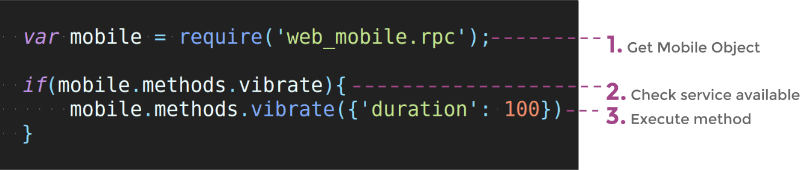
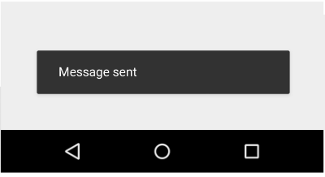
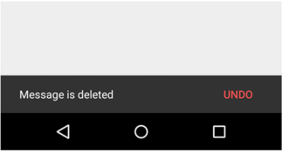
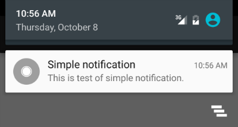
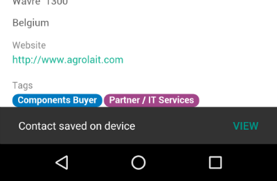
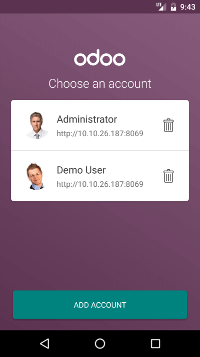

:banner: banners/mobile.jpg
:types: api

.. _reference/mobile:

==================
Mobile JavaScript
==================

Introduction
============

In Odoo 10.0 we released a mobile app, allows you to access all **Odoo apps**
(even your customized modules). 

The application is a combination of **Odoo Web** and **Native Mobile
components**, in other words it is a Odoo Web instance loaded inside native
WebView container of mobile.

This page documents how you can access mobile native components like Camera,
Vibration, Notification, Toast through Odoo Web (via JavaScript). For this, you
do not need to be a mobile developer, if you know Odoo JavaScript API you can
access all available mobile features.

.. warning:: These features work with **Odoo Enterprise 10.0+** only

How does it work? 
=================

Internal working of Mobile application:

.. image:: images/mobile_working.jpg

Of course, it is a web page that loads on a Mobile Native Web container. But it
is integrated in such a way that you can access native resources from your web
JavaScript.

WebPages (Odoo Web) is on the top of each layer, where second layer is a Bridge
between Odoo Web (JS) and Native component of mobile.

When any call from JavaScript triggered it passes through Bridge and Bridge
pass it to native invoker to perform that action.

When the native component has done their work, it again is passed to Bridge and
you get the output in JavaScript.

Process time taken by the Native component depends on what you are requesting
from Native resources. Like Camera or GPS Location.

How to use it?
==============

As Odoo Web Framework, Mobile api can be used anywhere by getting object of
**web_mobile.rpc**

Mobile rpc object provide list of methods available (Works only with Mobile
App). 

Just check for method availability and execute it.

Methods
-------

.. note:: Each of the methods returns JQuery Deffered object with returning
   data JSON dictionary

Show Toast in device
.....................

.. js:function:: showToast

	:param object args: **message** text to display

A toast provides simple feedback about an operation in a small popup. It only
fills the amount of space required for the message and the current activity
remains visible and interactive

.. code-block:: javascript

	mobile.methods.showToast({'message': 'Message sent'});

Vibrating device
................

.. js:function:: vibrate

	:param object args: Vibrates constantly for the specified period of time
	       (in milliseconds).

Vibrate mobile device with given duration.

.. code-block:: javascript

	mobile.methods.vibrate({'duration': 100});

Show snackbar with action
.........................

.. js:function:: showSnackBar

	:param object args: (*required*) **Message** to show in snackbar and action **button label** in Snackbar (optional)
	:returns:  ``True`` if User click on Action button, ``False`` if SnackBar auto dismissed after some time

Snackbars provide lightweight feedback about an operation. They show a brief
message at the bottom of the screen on mobile and lower left on larger devices.
Snackbars appear above all other elements on screen and only one can be
displayed at a time.

.. code-block:: javascript

	mobile.methods.showSnackBar({'message': 'Message is deleted', 'btn_text': 'Undo'}).then(function(result){
		if(result){
			// Do undo operation
		}else{
			// Snack Bar dismissed
		}
	});

Showing notification
.....................

.. js:function:: showNotification

	:param object args: **title** (first row) of the notification, **message** (second row) of the notification, in a standard notification.

A notification is a message you can display to the user outside of your
application's normal UI. When you tell the system to issue a notification, it
first appears as an icon in the notification area. To see the details of the
notification, the user opens the notification drawer. Both the notification
area and the notification drawer are system-controlled areas that the user can
view at any time.

.. code-block:: javascript
	
	mobile.showNotification({'title': 'Simple Notification', 'message': 'This is test of simple notification'})

Create contact in device
.........................

.. js:function:: addContact

	:param object args: Dictionary with contact details. Possible keys (name, mobile, phone, fax, email, website, street, street2, country_id, state_id, city, zip, parent_id, function and image)

Create device contact with given contact details.

.. code-block:: javascript
	
	var contact = {
		'name': 'Michel Fletcher',
		'mobile': '9999999999',
		'phone': '7954856587',
		'fax': '765898745',
		'email': 'michel.fletcher@agrolait.example.com',
		'website': 'http://www.agrolait.com',
		'street': '69 rue de Namur',
		'street2': false,
		'country_id': [21, 'Belgium'],
		'state_id': false,
		'city': 'Wavre',
		'zip': '1300',
		'parent_id': [8, 'Agrolait'],
		'function': 'Analyst',
		'image': '<<BASE 64 Image Data>>'
	}

	mobile.methods.addContact(contact);

Scanning barcodes
..................

.. js:function:: scanBarcode

	:returns: Scanned ``code`` from any barcodes

The Barcode API detects barcodes in real-time, on device, in any orientation.

It reads the following barcode formats:

* 1D barcodes: EAN-13, EAN-8, UPC-A, UPC-E, Code-39, Code-93, Code-128, ITF, Codabar
* 2D barcodes: QR Code, Data Matrix, PDF-417, AZTEC

.. code-block:: javascript

	mobile.methods.scanBarcode().then(function(code){
		if(code){
			// Perform operation with code scanned
		}
	});

Switching account in device
...........................

.. js:function:: switchAccount

Use to switch device account.

.. code-block:: javascript
	
	mobile.methods.switchAccount();

