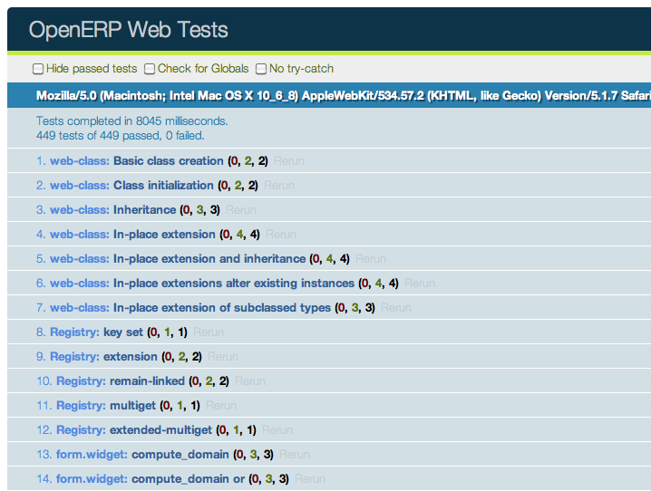

:banner: banners/testing_modules.jpg

.. _reference/testing:

===============
Testing Odoo
===============

There are many ways to test an application.  In Odoo, we have three kinds of
tests

- Python unit tests (see `Testing Python code`_): useful for testing model business logic
- JS unit tests (see `Testing JS code`_): useful to test the javascript code in isolation
- Tours (see `Integration Testing`_): tours simulate a real situation. They ensures that the
  python and the javascript parts properly talk to each other.

Testing Python code
===================

Odoo provides support for testing modules using unittest.

To write tests, simply define a ``tests`` sub-package in your module, it will
be automatically inspected for test modules. Test modules should have a name
starting with ``test_`` and should be imported from ``tests/__init__.py``,
e.g.

.. code-block:: text

    your_module
    |-- ...
    `-- tests
        |-- __init__.py
        |-- test_bar.py
        `-- test_foo.py

and ``__init__.py`` contains::

    from . import test_foo, test_bar

.. warning::

    test modules which are not imported from ``tests/__init__.py`` will not be
    run

The test runner will simply run any test case, as described in the official
`unittest documentation`_, but Odoo provides a number of utilities and helpers
related to testing Odoo content (modules, mainly):

.. autoclass:: odoo.tests.common.TransactionCase
    :members: browse_ref, ref

.. autoclass:: odoo.tests.common.SingleTransactionCase
    :members: browse_ref, ref

.. autoclass:: odoo.tests.common.SavepointCase

.. autoclass:: odoo.tests.common.HttpCase
    :members: browse_ref, ref, url_open, phantom_js

.. autofunction:: odoo.tests.common.tagged

By default, tests are run once right after the corresponding module has been
installed. Test cases can also be configured to run after all modules have
been installed, and not run right after the module installation:

.. autofunction:: odoo.tests.common.at_install

.. autofunction:: odoo.tests.common.post_install

The most common situation is to use
:class:`~odoo.tests.common.TransactionCase` and test a property of a model
in each method::

    class TestModelA(common.TransactionCase):
        def test_some_action(self):
            record = self.env['model.a'].create({'field': 'value'})
            record.some_action()
            self.assertEqual(
                record.field,
                expected_field_value)

        # other tests...

.. note::

    Test methods must start with ``test_``

.. autoclass:: odoo.tests.common.Form
    :members:

.. autoclass:: odoo.tests.common.M2MProxy
    :members: add, remove, clear

.. autoclass:: odoo.tests.common.O2MProxy
    :members: new, edit, remove

Running tests
-------------

Tests are automatically run when installing or updating modules if
:option:`--test-enable <odoo-bin --test-enable>` was enabled when starting the
Odoo server.

.. _unittest documentation: https://docs.python.org/3/library/unittest.html

Test selection
--------------

In Odoo, Python tests can be tagged to facilitate the test selection when
running tests.

Subclasses of :class:`odoo.tests.common.BaseCase` (usually through
:class:`~odoo.tests.common.TransactionCase`,
:class:`~odoo.tests.common.SavepointCase` or
:class:`~odoo.tests.common.HttpCase`) are automatically tagged with
``standard``, ``at_install`` and their source module's name by default.

Invocation
^^^^^^^^^^

:option:`--test-tags <odoo-bin --test-tags>` can be used to select/filter tests
to run on the command-line.

This option defaults to ``+standard`` meaning tests tagged ``standard``
(explicitly or implicitly) will be run by default when starting Odoo
with :option:`--test-enable <odoo-bin --test-enable>`.

When writing tests, the :func:`~odoo.tests.common.tagged` decorator can be
used on **test classes** to add or remove tags.

The decorator's arguments are tag names, as strings.

.. danger:: :func:`~odoo.tests.common.tagged` is a class decorator, it has no
            effect on functions or methods

Tags can be prefixed with the minus (``-``) sign, to *remove* them instead of
add or select them e.g. if you don't want your test to be executed by
default you can remove the ``standard`` tag:

.. code-block:: python

    from odoo.tests import TransactionCase, tagged

    @tagged('-standard', 'nice')
    class NiceTest(TransactionCase):
        ...

This test will not be selected by default, to run it the relevant tag will
have to be selected explicitely:

.. code-block:: console

    $ odoo-bin --test-enable --test-tags nice

Note that only the tests tagged ``nice`` are going to be executed. To run
*both* ``nice`` and ``standard`` tests, provide multiple values to
:option:`--test-tags <odoo-bin --test-tags>`: on the command-line, values
are *additive* (you're selecting all tests with *any* of the specified tags)

.. code-block:: console

    $ odoo-bin --test-enable --test-tags nice,standard

The config switch parameter also accepts the ``+`` and ``-`` prefixes. The
``+`` prefix is implied and therefore, totaly optional. The ``-`` (minus)
prefix is made to deselect tests tagged with the prefixed tags, even if they
are selected by other specified tags e.g. if there are ``standard`` tests which
are also tagged as ``slow`` you can run all standard tests *except* the slow
ones:

.. code-block:: console

    $ odoo-bin --test-enable --test-tags 'standard,-slow'

When you write a test that does not inherit from the
:class:`~odoo.tests.common.BaseCase`, this test will not have the default tags,
you have to add them explicitely to have the test included in the default test
suite.  This is a common issue when using a simple ``unittest.TestCase`` as
they're not going to get run:

.. code-block:: python

    import unittest
    from odoo.tests import tagged

    @tagged('standard', 'at_install')
    class SmallTest(unittest.TestCase):
        ...

Special tags
^^^^^^^^^^^^

- ``standard``: All Odoo tests that inherit from
  :class:`~odoo.tests.common.BaseCase` are implicitely tagged standard.
  :option:`--test-tags <odoo-bin --test-tags>` also defaults to ``standard``.

  That means untagged test will be executed by default when tests are enabled.
- ``at_install``: Means that the test will be executed right after the module
  installation and before other modules are installed. This is a default
  implicit tag.
- ``post_install``: Means that the test will be executed after all the modules
  are installed. This is what you want for HttpCase tests most of the time.

  Note that this is *not exclusive* with ``at_install``, however since you
  will generally not want both ``post_install`` is usually paired with
  ``-at_install`` when tagging a test class.
- *module_name*: Odoo tests classes extending
  :class:`~odoo.tests.common.BaseCase` are implicitely tagged with the
  technical name of their module. This allows easily selecting or excluding
  specific modules when testing e.g. if you want to only run tests from
  ``stock_account``:

  .. code-block:: console

      $ odoo-bin --test-enable --test-tags stock_account

Examples
^^^^^^^^

.. important::

    Tests will be executed only in the installed or updated modules.  So
    modules have to be selected with the :option:`-u <odoo-bin -u>` or
    :option:`-i <odoo-bin -i>` switches.  For simplicity, those switches are
    not specified in the examples below.

Run only the tests from the sale module:

.. code-block:: console

    $ odoo-bin --test-enable --test-tags sale

Run the tests from the sale module but not the ones tagged as slow:

.. code-block:: console

    $ odoo-bin --test-enable --test-tags 'sale,-slow'

Run only the tests from stock or tagged as slow:

.. code-block:: console

    $ odoo-bin --test-enable --test-tags '-standard, slow, stock'

.. note:: ``-standard`` is implicit (not required), and present for clarity

Testing JS code
===============

Testing a complex system is an important safeguard to prevent regressions and to
guarantee that some basic functionality still works. Since Odoo has a non trivial
codebase in Javascript, it is necessary to test it. In this section, we will
discuss the practice of testing JS code in isolation: these tests stay in the
browser, and are not supposed to reach the server.

Qunit test suite
----------------

The Odoo framework uses the QUnit_ library testing framework as a test runner.
QUnit defines the concepts of *tests* and *modules* (a set of related tests),
and gives us a web based interface to execute the tests.

For example, here is what a pyUtils test could look like:

.. code-block:: javascript

    QUnit.module('py_utils');

    QUnit.test('simple arithmetic', function (assert) {
        assert.expect(2);

        var result = pyUtils.py_eval("1 + 2");
        assert.strictEqual(result, 3, "should properly evaluate sum");
        result = pyUtils.py_eval("42 % 5");
        assert.strictEqual(result, 2, "should properly evaluate modulo operator");
    });

The main way to run the test suite is to have a running Odoo server, then
navigate a web browser to ``/web/tests``.  The test suite will then be executed
by the web browser Javascript engine.

The web UI has many useful features: it can run only some submodules, or
filter tests that match a string. It can show every assertions, failed or passed,
rerun specific tests, ...

.. warning::

    While the test suite is running, make sure that:

    - your browser window is focused,
    - it is not zoomed in/out. It needs to have exactly 100% zoom level.

    If this is not the case, some tests will fail, without a proper explanation.

Testing Infrastructure
----------------------

Here is a high level overview of the most important parts of the testing
infrastructure:

- there is an asset bundle named `web.js_tests_assets`_.  This bundle contains
  the main code (assets common + assets backend), some libraries, the QUnit test
  runner, and some additional helper code

- another asset bundle, `web.qunit_suite`_, contains all the tests (and the
  js_tests_assets code).  Almost all the test files should be added to this
  bundle

- there is a `controller`_ in web, mapped to the route */web/tests*. This controller
  simply renders the *web.qunit_suite* template.

- to execute the tests, one can simply point its browser to the route */web/tests*.
  In that case, the browser will download all assets, and QUnit will take over.

- there is some code in `qunit_config.js`_ which logs in the console some
  information when a test passes or fails.

- we want the runbot to also run these tests, so there is a test (in `test_js.py`_)
  which simply spawns a browser and points it to the *web/tests* url.  Note that
  the phantom_js method does not spawn phantom_js, but Chrome headless instead.

Modularity and testing
----------------------

With the way Odoo is designed, any addon can modify the behaviour of other parts
of the system.  For example, the *voip* addon can modify the *FieldPhone* widget
to use extra features.  This is not really good from the perspective of the
testing system, since this means that a test in the addon web will fail whenever
the voip addon is installed (note that the runbot runs the tests with all addons
installed).

At the same time, our testing sytem is good, because it can detect whenever
another module breaks some core functionality.  There is no complete solution to
this issue.  For now, we solve this on a case by case basis.

Usually, it is not a good idea to modify some other behaviour.  For our voip
example, it is certainly cleaner to add a new *FieldVOIPPhone* widget and
modify the few views that needs it.  This way, the *FieldPhone* widget is not
impacted, and both can be tested.

Adding a new test case
----------------------

Let us assume that we are maintaining an addon *my_addon*, and that we
want to add a test for some javascript code (for example, some utility function
myFunction, located in *my_addon.utils*). The process to add a new test case is
the following:

1. create a new file *my_addon/static/tests/utils_tests.js*. This file contains the basic code to
   add a QUnit module *my_addon > utils*.

    .. code-block:: javascript

        odoo.define('my_addon.utils_tests', function (require) {
        "use strict";

        var utils = require('my_addon.utils');

        QUnit.module('my_addon', {}, function () {

            QUnit.module('utils');

        });
        });

2. In *my_addon/assets.xml*, add the file to the main test assets:

    .. code-block:: xml

        <?xml version="1.0" encoding="utf-8"?>
        <odoo>
            <template id="qunit_suite" name="my addon tests" inherit_id="web.qunit_suite">
                <xpath expr="//script[last()]" position="after">
                    <script type="text/javascript" src="/my_addon/static/tests/utils_tests.js"/>
                </xpath>
            </template>
        </odoo>

3. Restart the server and update *my_addon*, or do it from the interface (to
   make sure the new test file is loaded)

4. Add a test case after the definition of the *utils* sub test suite:

    .. code-block:: javascript

        QUnit.test("some test case that we want to test", function (assert) {
            assert.expect(1);

            var result = utils.myFunction(someArgument);
            assert.strictEqual(result, expectedResult);
        });

5. Visit */web/tests/* to make sure the test is executed

Helper functions and specialized assertions
-------------------------------------------

Without help, it is quite difficult to test some parts of Odoo. In particular,
views are tricky, because they communicate with the server and may perform many
rpcs, which needs to be mocked.  This is why we developed some specialized
helper functions, located in `test_utils.js`_.

- Mock test functions: these functions help setting up a test environment. The
  most important use case is mocking the answers given by the Odoo server. These
  functions use a `mock server`_. This is a javascript class that simulates
  answers to the most common model methods: read, search_read, nameget, ...

- DOM helpers: useful to simulate events/actions on some specific target. For
  example, testUtils.dom.click performs a click on a target.  Note that it is
  safer than doing it manually, because it also checks that the target exists,
  and is visible.

- create helpers: they are probably the most important functions exported by
  `test_utils.js`_.  These helpers are useful to create a widget, with a mock
  environment, and a lot of small detail to simulate as much as possible the
  real conditions.  The most important is certainly `createView`_.

- `qunit assertions`_: QUnit can be extended with specialized assertions. For
  Odoo, we frequently test some DOM properties. This is why we made some
  assertions to help with that.  For example, the *containsOnce* assertion takes
  a widget/jQuery/HtmlElement and a selector, then checks if the target contains
  exactly one match for the css selector.

For example, with these helpers, here is what a simple form test could look like:

.. code-block:: javascript

    QUnit.test('simple group rendering', function (assert) {
        assert.expect(1);

        var form = testUtils.createView({
            View: FormView,
            model: 'partner',
            data: this.data,
            arch: '<form string="Partners">' +
                    '<group>' +
                        '<field name="foo"/>' +
                    '</group>' +
                '</form>',
            res_id: 1,
        });

        assert.containsOnce(form, 'table.o_inner_group');

        form.destroy();
    });

Notice the use of the testUtils.createView helper and of the containsOnce
assertion.  Also, the form controller was properly destroyed at the end of
the test.

Best Practices
--------------

In no particular order:

- all test files should be added in *some_addon/static/tests/*
- for bug fixes, make sure that the test fails without the bug fix, and passes
  with it.  This ensures that it actually works.
- try to have the minimal amount of code necessary for the test to work.
- usually, two small tests are better than one large test.  A smaller test is
  easier to understand and to fix.
- always cleanup after a test.  For example, if your test instantiates a widget,
  it should destroy it at the end.
- no need to have full and complete code coverage.  But adding a few tests helps
  a lot: it makes sure that your code is not completely broken, and whenever a
  bug is fixed, it is really much easier to add a test to an existing test suite.
- if you want to check some negative assertion (for example, that a HtmlElement
  does not have a specific css class), then try to add the positive assertion in
  the same test (for example, by doing an action that changes the state). This
  will help avoid the test to become dead in the future (for example, if the css
  class is changed).

Tips
----

- running only one test: you can (temporarily!) change the *QUnit.test(...)*
  definition into *QUnit.only(...)*.  This is useful to make sure that QUnit
  only runs this specific test.
- debug flag: most create utility functions have a debug mode (activated by the
  debug: true parameter).  In that case, the target widget will be put in the DOM
  instead of the hidden qunit specific fixture, and more information will be
  logged. For example, all mocked network communications will be available in the
  console.
- when working on a failing test, it is common to add the debug flag, then
  comment the end of the test (in particular, the destroy call).  With this, it
  is possible to see the state of the widget directly, and even better, to
  manipulate the widget by clicking/interacting with it.

Integration Testing
===================

Testing Python code and JS code separately is very useful, but it does not prove
that the web client and the server work together.  In order to do that, we can
write another kind of test: tours.  A tour is a mini scenario of some interesting
business flow.  It explains a sequence of steps that should be followed.  The
test runner will then create a phantom_js browser, point it to the proper url
and simulate the click and inputs, according to the scenario.

Screenshots and screencasts during browser_js tests
---------------------------------------------------

When running tests that use HttpCase.browser_js from the command line, the Chrome
browser is used in headless mode. By default, if a test fails, a PNG screenshot is
taken at the moment of the failure and written in

.. code-block:: console

  '/tmp/odoo_tests/{db_name}/screenshots/'

Two new command line arguments were added since Odoo 13.0 to control this behavior:
:option:`--screenshots <odoo-bin --screenshots>` and :option:`--screencasts <odoo-bin --screencasts>`

.. _qunit: https://qunitjs.com/
.. _qunit_config.js: https://github.com/odoo/odoo/blob/51ee0c3cb59810449a60dae0b086b49b1ed6f946/addons/web/static/tests/helpers/qunit_config.js#L49
.. _web.js_tests_assets: https://github.com/odoo/odoo/blob/51ee0c3cb59810449a60dae0b086b49b1ed6f946/addons/web/views/webclient_templates.xml#L427
.. _web.qunit_suite: https://github.com/odoo/odoo/blob/51ee0c3cb59810449a60dae0b086b49b1ed6f946/addons/web/views/webclient_templates.xml#L509
.. _controller: https://github.com/odoo/odoo/blob/51ee0c3cb59810449a60dae0b086b49b1ed6f946/addons/web/controllers/main.py#L637
.. _test_js.py: https://github.com/odoo/odoo/blob/51ee0c3cb59810449a60dae0b086b49b1ed6f946/addons/web/tests/test_js.py#L13
.. _test_utils.js: https://github.com/odoo/odoo/blob/51ee0c3cb59810449a60dae0b086b49b1ed6f946/addons/web/static/tests/helpers/test_utils.js
.. _mock server: https://github.com/odoo/odoo/blob/51ee0c3cb59810449a60dae0b086b49b1ed6f946/addons/web/static/tests/helpers/mock_server.js
.. _qunit assertions: https://github.com/odoo/odoo/blob/51ee0c3cb59810449a60dae0b086b49b1ed6f946/addons/web/static/tests/helpers/qunit_asserts.js
.. _createView: https://github.com/odoo/odoo/blob/51ee0c3cb59810449a60dae0b086b49b1ed6f946/addons/web/static/tests/helpers/test_utils_create.js#L267
