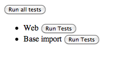

:banner: banners/testing_modules.jpg

.. _reference/testing:

===============
Testing Odoo
===============

There are many ways to test an application.  In Odoo, we have three kinds of
tests

- python unit tests: useful for testing model business logic
- js unit tests: this is necessary to test the javascript code in isolation
- tours: this is a form of integration testing.  The tours ensure that the
  python and the javascript parts properly talk to each other.

Testing Python code
===================

Odoo provides support for testing modules using unittest.

To write tests, simply define a ``tests`` sub-package in your module, it will
be automatically inspected for test modules. Test modules should have a name
starting with ``test_`` and should be imported from ``tests/__init__.py``,
e.g.

.. code-block:: text

    your_module
    |-- ...
    `-- tests
        |-- __init__.py
        |-- test_bar.py
        `-- test_foo.py

and ``__init__.py`` contains::

    from . import test_foo, test_bar

.. warning::

    test modules which are not imported from ``tests/__init__.py`` will not be
    run

.. versionchanged:: 8.0

    previously, the test runner would only run modules added to two lists
    ``fast_suite`` and ``checks`` in ``tests/__init__.py``. In 8.0 it will
    run all imported modules

The test runner will simply run any test case, as described in the official
`unittest documentation`_, but Odoo provides a number of utilities and helpers
related to testing Odoo content (modules, mainly):

.. autoclass:: odoo.tests.common.TransactionCase
    :members: browse_ref, ref

.. autoclass:: odoo.tests.common.SingleTransactionCase
    :members: browse_ref, ref

.. autoclass:: odoo.tests.common.SavepointCase

.. autoclass:: odoo.tests.common.HttpCase
    :members: browse_ref, ref, url_open, phantom_js

By default, tests are run once right after the corresponding module has been
installed. Test cases can also be configured to run after all modules have
been installed, and not run right after the module installation:

.. autofunction:: odoo.tests.common.at_install

.. autofunction:: odoo.tests.common.post_install

The most common situation is to use
:class:`~odoo.tests.common.TransactionCase` and test a property of a model
in each method::

    class TestModelA(common.TransactionCase):
        def test_some_action(self):
            record = self.env['model.a'].create({'field': 'value'})
            record.some_action()
            self.assertEqual(
                record.field,
                expected_field_value)

        # other tests...

.. note::

    Test methods must start with ``test_``

Running tests
-------------

Tests are automatically run when installing or updating modules if
:option:`--test-enable <odoo-bin --test-enable>` was enabled when starting the
Odoo server.

As of Odoo 8, running tests outside of the install/update cycle is not
supported.

.. _unittest documentation: https://docs.python.org/2/library/unittest.html

Testing JS code
===============

Qunit test suite
----------------

Odoo Web includes means to unit-test both the core code of
Odoo Web and your own javascript modules. On the javascript side,
unit-testing is based on QUnit_ with a number of helpers and
extensions for better integration with Odoo.

To see what the runner looks like, find (or start) an Odoo server
with the web client enabled, and navigate to ``/web/tests``
This will show the runner selector, which lists all modules with javascript
unit tests, and allows starting any of them (or all javascript tests in all
modules at once).

Clicking any runner button will launch the corresponding tests in the
bundled QUnit_ runner:

.. image:: ./images/tests.png
    :align: center

Writing a test case
-------------------

This section will be updated as soon as possible.

.. _qunit: http://qunitjs.com/

Integration Testing
===================

Testing Python code and JS code separately is very useful, but it does not prove
that the web client and the server work together.  In order to do that, we can
write another kind of test: tours.  A tour is a mini scenario of some interesting
business flow.  It explains a sequence of steps that should be followed.  The
test runner will then create a phantom_js browser, point it to the proper url
and simulate the click and inputs, according to the scenario.