:banner: banners/views.jpg

.. highlight:: xml
.. _reference/views:

=====
Views
=====

.. _reference/views/structure:

Common Structure
================

View objects expose a number of fields, they are optional unless specified
otherwise.

``name`` (mandatory)
    only useful as a mnemonic/description of the view when looking for one in
    a list of some sort
``model``
    the model linked to the view, if applicable
``priority``
    client programs can request views by ``id``, or by ``(model, type)``. For
    the latter, all the views for the right type and model will be searched,
    and the one with the lowest ``priority`` number will be returned (it is
    the "default view").

    ``priority`` also defines the order of application during :ref:`view
    inheritance <reference/views/inheritance>`
``arch``
    the description of the view's layout
``groups_id``
    :class:`~odoo.fields.Many2many` field to the groups allowed to view/use
    the current view
``inherit_id``
    the current view's parent view, see :ref:`reference/views/inheritance`,
    unset by default
``mode``
    inheritance mode, see :ref:`reference/views/inheritance`. If
    ``inherit_id`` is unset the ``mode`` can only be ``primary``. If
    ``inherit_id`` is set, ``extension`` by default but can be explicitly set
    to ``primary``
``application``
    website feature defining togglable views. By default, views are always
    applied
``banner_route``
    a route address to be fetched and prepended to the view.

    If this attribute is set, the
    :ref:`controller route url<reference/http/controllers>` will be fetched and
    displayed above the view. The json response from the controller should
    contain an "html" key.

    If the html contains a stylesheet <link> tag, it will be
    removed and appended to <head>.

    To interact with the backend you can use <a type="action"> tags. Please take
    a look at the documentation of the _onActionClicked method of
    AbstractController (*addons/web/static/src/js/views/abstract_controller.js*)
    for more details.

    Only views extending AbstractView and AbstractController can use this
    attribute, like :ref:`reference/views/form`, :ref:`reference/views/kanban`,
    :ref:`reference/views/list`, ...

    Example:

    .. code-block:: xml

        <tree banner_route="/module_name/hello" />

    .. code-block:: python

        class MyController(odoo.http.Controller):
            @http.route('/module_name/hello', auth='user', type='json')
            def hello(self):
                return {
                    'html': """
                        

                            <link href="/module_name/static/src/css/banner.css"
                                rel="stylesheet">
                            <h1>hello, world</h1>
                        
 """
                }

.. _reference/views/inheritance:

Inheritance
===========

View matching
-------------

* if a view is requested by ``(model, type)``, the view with the right model
  and type, ``mode=primary`` and the lowest priority is matched
* when a view is requested by ``id``, if its mode is not ``primary`` its
  *closest* parent with mode ``primary`` is matched

View resolution
---------------

Resolution generates the final ``arch`` for a requested/matched ``primary``
view:

#. if the view has a parent, the parent is fully resolved then the current
   view's inheritance specs are applied
#. if the view has no parent, its ``arch`` is used as-is
#. the current view's children with mode ``extension`` are looked up  and their
   inheritance specs are applied depth-first (a child view is applied, then
   its children, then its siblings)

The result of applying children views yields the final ``arch``

Inheritance specs
-----------------

Inheritance specs are comprised of an element locator, to match
the inherited element in the parent view, and children element that
will be used to modify the inherited element.

There are three types of element locators for matching a target element:

* An ``xpath`` element with an ``expr`` attribute. ``expr`` is an XPath_
  expression\ [#hasclass]_ applied to the current ``arch``, the first node
  it finds is the match
* a ``field`` element with a ``name`` attribute, matches the first ``field``
  with the same ``name``. All other attributes are ignored during matching
* any other element: the first element with the same name and identical
  attributes (ignoring ``position`` and ``version`` attributes) is matched

The inheritance spec may have an optional ``position`` attribute specifying
how the matched node should be altered:

``inside`` (default)
    the content of the inheritance spec is appended to the matched node
``replace``
    the content of the inheritance spec replaces the matched node.
    Any text node containing only ``$0`` within the contents of the spec will
    be replaced  by a complete copy of the matched node, effectively wrapping
    the matched node.
``after``
    the content of the inheritance spec is added to the matched node's
    parent, after the matched node
``before``
    the content of the inheritance spec is added to the matched node's
    parent, before the matched node
``attributes``
    the content of the inheritance spec should be ``attribute`` elements
    with a ``name`` attribute and an optional body:

    * if the ``attribute`` element has a body, a new attributed named
      after its ``name`` is created on the matched node with the
      ``attribute`` element's text as value
    * if the ``attribute`` element has no body, the attribute named after
      its ``name`` is removed from the matched node. If no such attribute
      exists, an error is raised

Additionally, the ``position`` ``move`` can be used as a direct child of a spec
with a ``inside``, ``replace``, ``after`` or ``before`` ``position`` attribute
to move a node.

.. code-block:: xml

    <xpath expr="//@target" position="after">
        <xpath expr="//@node" position="move"/>
    </xpath>

    <field name="target_field" position="after">
        <field name="my_field" position="move"/>
    </field>

A view's specs are applied sequentially.

.. _reference/views/list:

Lists
=====

The root element of list views is ``<tree>``\ [#treehistory]_. The list view's
root can have the following attributes:

``editable``
    by default, selecting a list view's row opens the corresponding
    :ref:`form view <reference/views/form>`. The ``editable`` attributes makes
    the list view itself editable in-place.

    Valid values are ``top`` and ``bottom``, making *new* records appear
    respectively at the top or bottom of the list.

    The architecture for the inline :ref:`form view <reference/views/form>` is
    derived from the list view. Most attributes valid on a :ref:`form view
    <reference/views/form>`'s fields and buttons are thus accepted by list
    views although they may not have any meaning if the list view is
    non-editable
``default_order``
    overrides the ordering of the view, replacing the model's default order.
    The value is a comma-separated list of fields, postfixed by ``desc`` to
    sort in reverse order:

    .. code-block:: xml

        <tree default_order="sequence,name desc">
``decoration-{$name}``
    allow changing the style of a row's text based on the corresponding
    record's attributes.

    Values are Python expressions. For each record, the expression is evaluated
    with the record's attributes as context values and if ``true``, the
    corresponding style is applied to the row. Other context values are
    ``uid`` (the id of the current user) and ``current_date`` (the current date
    as a string of the form ``yyyy-MM-dd``).

    ``{$name}`` can be ``bf`` (``font-weight: bold``), ``it``
    (``font-style: italic``), or any `bootstrap contextual color
    <https://getbootstrap.com/docs/3.3/components/#available-variations>`_ (``danger``,
    ``info``, ``muted``, ``primary``, ``success`` or ``warning``).
``create``, ``edit``, ``delete``, ``duplicate``, ``import``
    allows *dis*\ abling the corresponding action in the view by setting the
    corresponding attribute to ``false``
``limit``
    the default size of a page. It should be a positive integer
``expand``
    when the list view is grouped, automatically open the first level of groups
    if set to true (default: false)

Possible children elements of the list view are:

.. _reference/views/list/button:

``button``
    displays a button in a list cell

    ``icon``
        icon to use to display the button
    ``string``
        * if there is no ``icon``, the button's text
        * if there is an ``icon``, ``alt`` text for the icon
    ``type``
        type of button, indicates how it clicking it affects Odoo:

        ``object``
            call a method on the list's model. The button's ``name`` is the
            method, which is called with the current row's record id and the
            current context.

            .. web client also supports a @args, which allows providing
               additional arguments as JSON. Should that be documented? Does
               not seem to be used anywhere

        ``action``
            load an execute an ``ir.actions``, the button's ``name`` is the
            database id of the action. The context is expanded with the list's
            model (as ``active_model``), the current row's record
            (``active_id``) and all the records currently loaded in the list
            (``active_ids``, may be just a subset of the database records
            matching the current search)
    ``name``
        see ``type``
    ``args``
        see ``type``
    ``attrs``
        dynamic attributes based on record values.

        A mapping of attributes to domains, domains are evaluated in the
        context of the current row's record, if ``True`` the corresponding
        attribute is set on the cell.

        Possible attribute is ``invisible`` (hides the button).
    ``states``
        shorthand for ``invisible`` ``attrs``: a list of states, comma separated,
        requires that the model has a ``state`` field and that it is
        used in the view.

        Makes the button ``invisible`` if the record is *not* in one of the
        listed states

        .. danger::

            Using ``states`` in combination with ``attrs`` may lead to
            unexpected results as domains are combined with a logical AND.
    ``context``
        merged into the view's context when performing the button's Odoo call
    ``confirm``
        confirmation message to display (and for the user to accept) before
        performing the button's Odoo call

    .. declared but unused: help

``field``
    defines a column where the corresponding field should be displayed for
    each record. Can use the following attributes:

    ``name``
        the name of the field to display in the current model. A given name
        can only be used once per view
    ``string``
        the title of the field's column (by default, uses the ``string`` of
        the model's field)
    ``invisible``
        fetches and stores the field, but doesn't display the column in the
        table. Necessary for fields which shouldn't be displayed but are
        used by e.g. ``@colors``
    ``groups``
        lists the groups which should be able to see the field
    ``widget``
        alternate representations for a field's display. Possible list view
        values are:

        ``progressbar``
            displays ``float`` fields as a progress bar.
        ``many2onebutton``
            replaces the m2o field's value by a checkmark if the field is
            filled, and a cross if it is not
        ``handle``
            for ``sequence`` fields, instead of displaying the field's value
            just displays a drag&drop icon
    ``sum``, ``avg``
        displays the corresponding aggregate at the bottom of the column. The
        aggregation is only computed on *currently displayed* records. The
        aggregation operation must match the corresponding field's
        ``group_operator``
    ``attrs``
        dynamic attributes based on record values. Only effects the current
        field, so e.g. ``invisible`` will hide the field but leave the same
        field of other records visible, it will not hide the column itself

    .. note:: if the list view is ``editable``, any field attribute from the
              :ref:`form view <reference/views/form>` is also valid and will
              be used when setting up the inline form view

``control``
  defines custom controls for the current view.

  This makes sense if the parent ``tree`` view is inside a One2many field.

  Does not support any attribute, but can have children:

  ``create``
    adds a button to create a new element on the current list.

    .. note:: If any ``create`` is defined, it will overwrite the default
              "add a line" button.

    The following attributes are supported:

    ``string`` (required)
      The text displayed on the button.

    ``context``
      This context will be merged into the existing context
      when retrieving the default value of the new record.

      For example it can be used to override default values.

  The following example will override the default "add a line" button
  by replacing it with 3 new buttons:
  "Add a product", "Add a section" and "Add a note".

  "Add a product" will set the field 'display_type' to its default value.

  The two other buttons will set the field 'display_type'
  to be respectively 'line_section' and 'line_note'.

  .. code-block:: xml

    <control>
      <create
        string="Add a product"
      />
      <create
        string="Add a section"
        context="{'default_display_type': 'line_section'}"
      />
      <create
        string="Add a note"
        context="{'default_display_type': 'line_note'}"
      />
    </control>

.. _reference/views/form:

Forms
=====

Form views are used to display the data from a single record. Their root
element is ``<form>``. They are composed of regular HTML_ with additional
structural and semantic components.

Structural components
---------------------

Structural components provide structure or "visual" features with little
logic. They are used as elements or sets of elements in form views.

``notebook``
  defines a tabbed section. Each tab is defined through a ``page`` child
  element. Pages can have the following attributes:

  ``string`` (required)
    the title of the tab
  ``accesskey``
    an HTML accesskey_
  ``attrs``
    standard dynamic attributes based on record values

``group``
  used to define column layouts in forms. By default, groups define 2 columns
  and most direct children of groups take a single column. ``field`` direct
  children of groups display a label by default, and the label and the field
  itself have a colspan of 1 each.

  The number of columns in a ``group`` can be customized using the ``col``
  attribute, the number of columns taken by an element can be customized using
  ``colspan``.

  Children are laid out horizontally (tries to fill the next column before
  changing row).

  Groups can have a ``string`` attribute, which is displayed as the group's
  title
``newline``
  only useful within ``group`` elements, ends the current row early and
  immediately switches to a new row (without filling any remaining column
  beforehand)
``separator``
  small horizontal spacing, with a ``string`` attribute behaves as a section
  title
``sheet``
  can be used as a direct child to ``form`` for a narrower and more responsive
  form layout
``header``
  combined with ``sheet``, provides a full-width location above the sheet
  itself, generally used to display workflow buttons and status widgets

Semantic components
-------------------

Semantic components tie into and allow interaction with the Odoo
system. Available semantic components are:

``button``
  call into the Odoo system, similar to :ref:`list view buttons
  <reference/views/list/button>`. In addition, the following attribute can be
  specified:

  ``special``
    for form views opened in dialogs: ``save`` to save the record and close the
    dialog, ``cancel`` to close the dialog without saving.

``field``
  renders (and allow edition of, possibly) a single field of the current
  record. Using several times a field in a form view is supported and the fields 
  can receive different values for modifiers 'invisible' and 'readonly'. However,
  the behavior is not guaranteed when several fields exist with different values 
  for modifier 'required'. Possible attributes of the field node are:

  ``name`` (mandatory)
    the name of the field to render
  ``widget``
    fields have a default rendering based on their type
    (e.g. :class:`~odoo.fields.Char`,
    :class:`~odoo.fields.Many2one`). The ``widget`` attributes allows using
    a different rendering method and context.

    .. todo:: list of widgets

       & options & specific attributes (e.g. widget=statusbar
       statusbar_visible clickable)
  ``options``
    JSON object specifying configuration option for the field's widget
    (including default widgets)
  ``class``
    HTML class to set on the generated element, common field classes are:

    ``oe_inline``
      prevent the usual line break following fields
    ``oe_left``, ``oe_right``
      floats_ the field to the corresponding direction
    ``oe_read_only``, ``oe_edit_only``
      only displays the field in the corresponding form mode
    ``oe_no_button``
      avoids displaying the navigation button in a
      :class:`~odoo.fields.Many2one`
    ``oe_avatar``
      for image fields, displays images as "avatar" (square, 90x90 maximum
      size, some image decorations)
  ``groups``
    only displays the field for specific users
  ``on_change``
    calls the specified method when this field's value is edited, can generate
    update other fields or display warnings for the user

    .. deprecated:: 8.0

       Use :func:`odoo.api.onchange` on the model

  ``attrs``
    dynamic meta-parameters based on record values
  ``domain``
    for relational fields only, filters to apply when displaying existing
    records for selection
  ``context``
    for relational fields only, context to pass when fetching possible values
  ``readonly``
    display the field in both readonly and edition mode, but never make it
    editable
  ``required``
    generates an error and prevents saving the record if the field doesn't
    have a value
  ``nolabel``
    don't automatically display the field's label, only makes sense if the
    field is a direct child of a ``group`` element
  ``placeholder``
    help message to display in *empty* fields. Can replace field labels in
    complex forms. *Should not* be an example of data as users are liable to
    confuse placeholder text with filled fields
  ``mode``
    for :class:`~odoo.fields.One2many`, display mode (view type) to use for
    the field's linked records. One of ``tree``, ``form``, ``kanban`` or
    ``graph``. The default is ``tree`` (a list display)
  ``help``
    tooltip displayed for users when hovering the field or its label
  ``filename``
    for binary fields, name of the related field providing the name of the
    file
  ``password``
    indicates that a :class:`~odoo.fields.Char` field stores a password and
    that its data shouldn't be displayed

.. todo:: classes for forms

.. todo:: widgets?

Business Views guidelines
-------------------------

.. sectionauthor:: Aline Preillon, Raphael Collet

Business views are targeted at regular users, not advanced users.  Examples
are: Opportunities, Products, Partners, Tasks, Projects, etc.

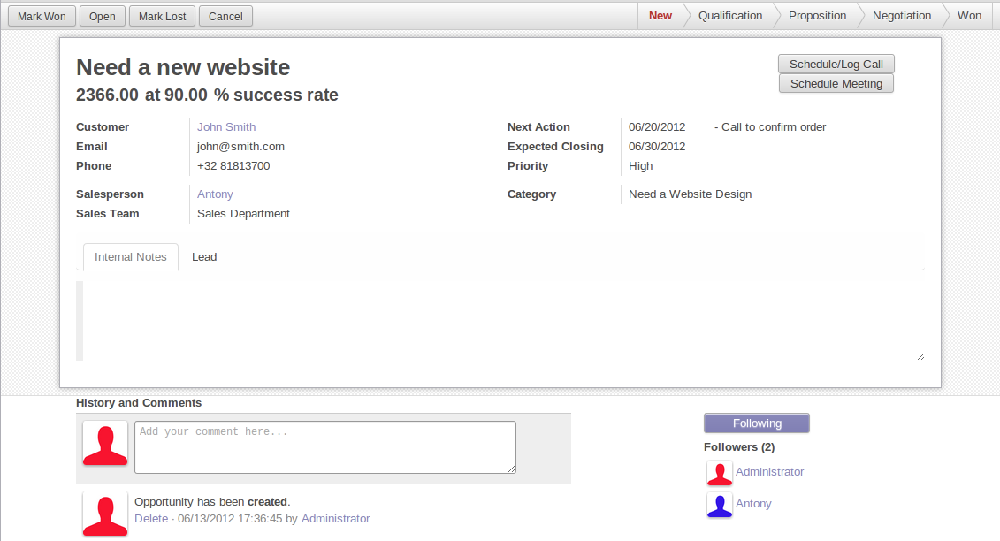

In general, a business view is composed of

1. a status bar on top (with technical or business flow),
2. a sheet in the middle (the form itself),
3. a bottom part with History and Comments.

Technically, the new form views are structured as follows in XML::

    <form>
        <header> ... content of the status bar  ... </header>
        <sheet>  ... content of the sheet       ... </sheet>
        
 ... content of the bottom part ... 

    </form>

The Status Bar
''''''''''''''

The purpose of the status bar is to show the status of the current record and
the action buttons.

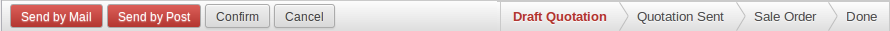

The Buttons
...........

The order of buttons follows the business flow. For instance, in a sale order,
the logical steps are:

1. Send the quotation
2. Confirm the quotation
3. Create the final invoice
4. Send the goods

Highlighted buttons (in red by default) emphasize the logical next step, to
help the user. It is usually the first active button. On the other hand,
:guilabel:`cancel` buttons *must* remain grey (normal).  For instance, in
Invoice the button :guilabel:`Refund` must never be red.

Technically, buttons are highlighted by adding the class "oe_highlight"::

    <button class="oe_highlight" name="..." type="..." states="..."/>

The Status
..........

Uses the ``statusbar`` widget, and shows the current state in red. States
common to all flows (for instance, a sale order begins as a quotation, then we
send it, then it becomes a full sale order, and finally it is done) should be
visible at all times but exceptions or states depending on particular sub-flow
should only be visible when current.

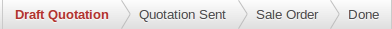

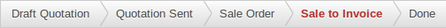

The states are shown following the order used in the field (the list in a
selection field, etc). States that are always visible are specified with the
attribute ``statusbar_visible``.

::

    <field name="state" widget="statusbar"
        statusbar_visible="draft,sent,progress,invoiced,done" />

The Sheet
'''''''''

All business views should look like a printed sheet:

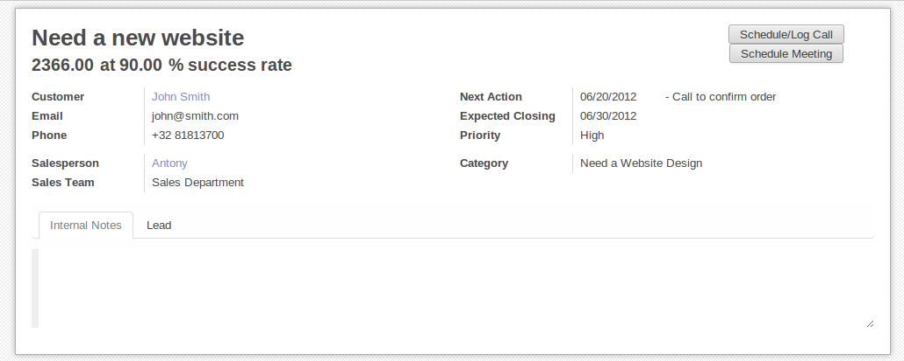

1. Elements inside a ``<form>`` or ``<page>`` do not define groups, elements
   inside them are laid out according to normal HTML rules. They content can
   be explicitly grouped using ``<group>`` or regular ``
`` elements.
2. By default, the element ``<group>`` defines two columns inside, unless an
   attribute ``col="n"`` is used.  The columns have the same width (1/n th of
   the group's width). Use a ``<group>`` element to produce a column of fields.
3. To give a title to a section, add a ``string`` attribute to a ``<group>`` element::

     <group string="Time-sensitive operations">

   this replaces the former use of ``<separator string="XXX"/>``.
4. The ``<field>`` element does not produce a label, except as direct children
   of a ``<group>`` element\ [#backwards-compatibility]_.  Use :samp:`<label
   for="{field_name}>` to produce a label of a field.

Sheet Headers
.............

Some sheets have headers with one or more fields, and the labels of those
fields are only shown in edit mode.

.. list-table::
   :header-rows: 1

   * - View mode
     - Edit mode
   * - .. image:: forms/header.png
          :class: img-responsive
     - .. image:: forms/header2.png
          :class: img-responsive

Use HTML text, ``
``, ``<h1>``, ``<h2>``… to produce nice headers, and
``<label>`` with the class ``oe_edit_only`` to only display the field's label
in edit mode. The class ``oe_inline`` will make fields inline (instead of
blocks): content following the field will be displayed on the same line rather
than on the line below it. The form above is produced by the following XML::

    <label for="name" class="oe_edit_only"/>
    <h1><field name="name"/></h1>

    <label for="planned_revenue" class="oe_edit_only"/>
    <h2>
        <field name="planned_revenue" class="oe_inline"/>
        <field name="company_currency" class="oe_inline oe_edit_only"/> at
        <field name="probability" class="oe_inline"/> % success rate
    </h2>

Button Box
..........

Many relevant actions or links can be displayed in the form. For example, in
Opportunity form, the actions "Schedule a Call" and "Schedule a Meeting" have
an important place in the use of the CRM. Instead of placing them in the
"More" menu, put them directly in the sheet as buttons (on the top) to make
them more visible and more easily accessible.

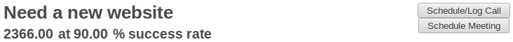

Technically, the buttons are placed inside a ``
`` to group them as a
block on the top of the sheet.

::

    

        <button string="Schedule/Log Call" name="..." type="action"/>
        <button string="Schedule Meeting" name="action_makeMeeting" type="object"/>
    

Groups and Titles
.................

A column of fields is now produced with a ``<group>`` element, with an
optional title.

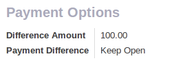

::

    <group string="Payment Options">
        <field name="writeoff_amount"/>
        <field name="payment_option"/>
    </group>

It is recommended to have two columns of fields on the form. For this, simply
put the ``<group>`` elements that contain the fields inside a top-level
``<group>`` element.

To make :ref:`view extension <reference/views/inheritance>` simpler, it is
recommended to put a ``name`` attribute on ``<group>`` elements, so new fields
can easily be added at the right place.

Special Case: Subtotals
~~~~~~~~~~~~~~~~~~~~~~~

Some classes are defined to render subtotals like in invoice forms:

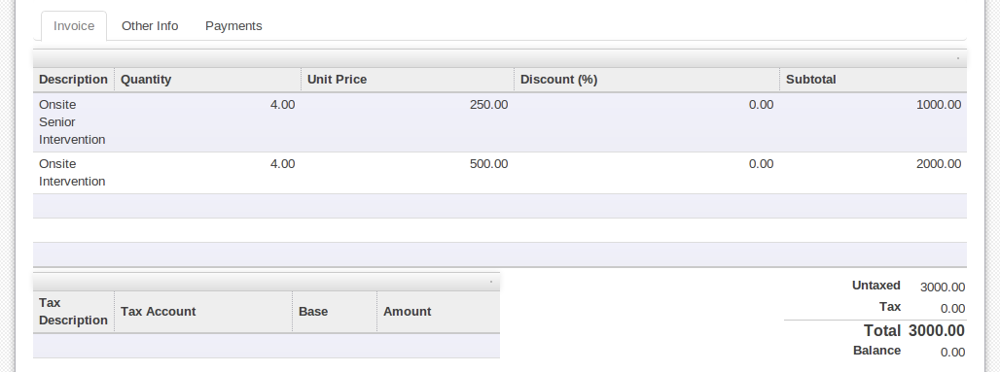

::

    <group class="oe_subtotal_footer">
        <field name="amount_untaxed"/>
        <field name="amount_tax"/>
        <field name="amount_total" class="oe_subtotal_footer_separator"/>
        <field name="residual" style="margin-top: 10px"/>
    </group>

Placeholders and Inline Fields
..............................

Sometimes field labels make the form too complex. One can omit field labels,
and instead put a placeholder inside the field. The placeholder text is
visible only when the field is empty. The placeholder should tell what to
place inside the field, it *must not* be an example as they are often confused
with filled data.

One can also group fields together by rendering them "inline" inside an
explicit block element like ``
``. This allows grouping semantically
related fields as if they were a single (composite) fields.

The following example, taken from the *Leads* form, shows both placeholders and
inline fields (zip and city).

.. list-table::
   :header-rows: 1

   * - Edit mode
     - View mode
   * - .. image:: forms/placeholder.png
          :class: img-responsive
     - .. image:: forms/screenshot-01.png
          :class: img-responsive

::

    <group>
        <label for="street" string="Address"/>
        

            <field name="street" placeholder="Street..."/>
            <field name="street2"/>
            

                <field name="zip" class="oe_inline" placeholder="ZIP"/>
                <field name="city" class="oe_inline" placeholder="City"/>
            

            <field name="state_id" placeholder="State"/>
            <field name="country_id" placeholder="Country"/>
        

    </group>

Images
......

Images, like avatars, should be displayed on the right of the sheet.  The
product form looks like:

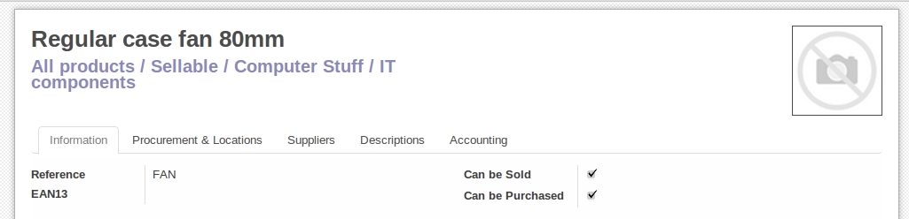

The form above contains a <sheet> element that starts with:

::

    <field name="product_image" widget="image" class="oe_avatar oe_right"/>

Tags
....

Most :class:`~odoo.fields.Many2many` fields, like categories, are better
rendered as a list of tags. Use the widget ``many2many_tags`` for this:

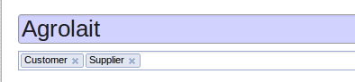

::

    <field name="category_id" widget="many2many_tags"/>

Configuration forms guidelines
------------------------------

Examples of configuration forms: Stages, Leave Type, etc.  This concerns all
menu items under Configuration of each application (like Sales/Configuration).

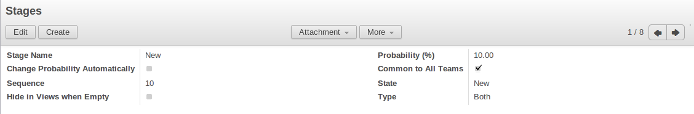

1. no header (because no state, no workflow, no button)
2. no sheet

Dialog forms guidelines
-----------------------

Example: "Schedule a Call" from an opportunity.

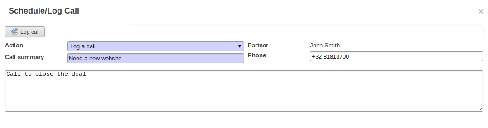

1. avoid separators (the title is already in the popup title bar, so another
   separator is not relevant)
2. avoid cancel buttons (user generally close the popup window to get the same
   effect)
3. action buttons must be highlighted (red)
4. when there is a text area, use a placeholder instead of a label or a
   separator
5. like in regular form views, put buttons in the <header> element

Configuration Wizards guidelines
--------------------------------

Example: Settings / Configuration / Sales.

1. always in line (no popup)
2. no sheet
3. keep the cancel button (users cannot close the window)
4. the button "Apply" must be red

.. _reference/views/graph:

Graphs
======

The graph view is used to visualize aggregations over a number of records or
record groups. Its root element is ``<graph>`` which can take the following
attributes:

``type``
  one of ``bar`` (default), ``pie`` and ``line``, the type of graph to use
``stacked``
  only used for ``bar`` charts. If present and set to ``True``, stacks bars
  within a group

The only allowed element within a graph view is ``field`` which can have the
following attributes:

``name`` (required)
  the name of a field to use in the view. If used for grouping (rather
  than aggregating)

``title`` (optional)
  string displayed on the top of the graph.

``type``
  indicates whether the field should be used as a grouping criteria or as an
  aggregated value within a group. Possible values are:

  ``row`` (default)
    groups by the specified field. All graph types support at least one level
    of grouping, some may support more.
  ``col``
    authorized in graph views but only used by pivot tables
  ``measure``
    field to aggregate within a group

``interval``
  on date and datetime fields, groups by the specified interval (``day``,
  ``week``, ``month``, ``quarter`` or ``year``) instead of grouping on the
  specific datetime (fixed second resolution) or date (fixed day resolution).

The measures are automatically generated from the model fields; only the
aggregatable fields are used. Those measures are also alphabetically
sorted on the string of the field.

.. warning::

   graph view aggregations are performed on database content, non-stored
   function fields can not be used in graph views

.. _reference/views/pivot:

Pivots
======

The pivot view is used to visualize aggregations as a `pivot table`_. Its root
element is ``<pivot>`` which can take the following attributes:

``disable_linking``
  Set to ``True`` to remove table cell's links to list view.
``display_quantity``
  Set to ``true`` to display the Quantity column by default.
``default_order``
  The name of the measure and the order (asc or desc) to use as default order
  in the view.

  .. code-block:: xml

     <pivot default_order="foo asc">
        <field name="foo" type="measure"/>
     </pivot>

The only allowed element within a pivot view is ``field`` which can have the
following attributes:

``name`` (required)
  the name of a field to use in the view. If used for grouping (rather
  than aggregating)

``string``
  the name that will be used to display the field in the pivot view,
  overrides the default python String attribute of the field.

``type``
  indicates whether the field should be used as a grouping criteria or as an
  aggregated value within a group. Possible values are:

  ``row`` (default)
    groups by the specified field, each group gets its own row.
  ``col``
    creates column-wise groups
  ``measure``
    field to aggregate within a group
  ``interval``
    on date and datetime fields, groups by the specified interval (``day``,
    ``week``, ``month``, ``quarter`` or ``year``) instead of grouping on the
    specific datetime (fixed second resolution) or date (fixed day resolution).

``invisible``
  if true, the field will not appear either in the active measures nor in the
  selectable measures (useful for fields that do not make sense aggregated,
  such as fields in different units, e.g. € and $).

The measures are automatically generated from the model fields; only the
aggregatable fields are used. Those measures are also alphabetically
sorted on the string of the field.

.. warning::

    like the graph view, the pivot aggregates data on database content
    which means that non-stored function fields can not be used in pivot views

In Pivot view a ``field`` can have a ``widget`` attribute to dictate its format.
The widget should be a field formatter, of which the most interesting are
``date``, ``datetime``, ``float_time``, and ``monetary``.

For instance a timesheet pivot view could be defined as::

    <pivot string="Timesheet">
        <field name="employee_id" type="row"/>
        <field name="date" interval="month" type="col"/>
        <field name="unit_amount" type="measure" widget="float_time"/>
    </pivot>

.. _reference/views/kanban:

Kanban
======

The kanban view is a `kanban board`_ visualisation: it displays records as
"cards", halfway between a :ref:`list view <reference/views/list>` and a
non-editable :ref:`form view <reference/views/form>`. Records may be grouped
in columns for use in workflow visualisation or manipulation (e.g. tasks or
work-progress management), or ungrouped (used simply to visualize records).

.. note:: The kanban view will load and display a maximum of ten columns.
          Any column after that will be closed (but can still be opened by
          the user).

The root element of the Kanban view is ``<kanban>``, it can use the following
attributes:

``default_group_by``
  whether the kanban view should be grouped if no grouping is specified via
  the action or the current search. Should be the name of the field to group
  by when no grouping is otherwise specified
``default_order``
  cards sorting order used if the user has not already sorted the records (via
  the list view)
``class``
  adds HTML classes to the root HTML element of the Kanban view
``group_create``
  whether the "Add a new column" bar is visible or not. Default: true.
``group_delete``
  whether groups can be deleted via the context menu. Default: true.
``group_edit``
  whether groups can be edited via the context menu. Default: true.
``archivable``
  whether records belonging to a column can be archived / restored if an
  ``active`` field is defined on the model. Default: true.
``quick_create``
  whether it should be possible to create records without switching to the
  form view. By default, ``quick_create`` is enabled when the Kanban view is
  grouped by many2one, selection, char or boolean fields, and disabled when not.

  Set to ``true`` to always enable it, and to ``false`` to always disable it.

Possible children of the view element are:

``field``
  declares fields to use in kanban *logic*. If the field is simply displayed in
  the kanban view, it does not need to be pre-declared.

  Possible attributes are:

  ``name`` (required)
    the name of the field to fetch

``progressbar``
  declares a progressbar element to put on top of kanban columns.

  Possible attributes are:

  ``field`` (required)
    the name of the field whose values are used to subgroup column's records in
    the progressbar

  ``colors`` (required)
    JSON mapping the above field values to either "danger", "warning" or
    "success" colors

  ``sum_field`` (optional)
    the name of the field whose column's records' values will be summed and
    displayed next to the progressbar (if omitted, displays the total number of
    records)

``templates``
  defines a list of :ref:`reference/qweb` templates. Cards definition may be
  split into multiple templates for clarity, but kanban views *must* define at
  least one root template ``kanban-box``, which will be rendered once for each
  record.

  The kanban view uses mostly-standard :ref:`javascript qweb
  <reference/qweb/javascript>` and provides the following context variables:

  ``widget``
    the current :js:class:`KanbanRecord`, can be used to fetch some
    meta-information. These methods are also available directly in the
    template context and don't need to be accessed via ``widget``
  ``record``
    an object with all the requested fields as its attributes. Each field has
    two attributes ``value`` and ``raw_value``, the former is formatted
    according to current user parameters, the latter is the direct value from
    a :meth:`~odoo.models.Model.read` (except for date and datetime fields
    that are `formatted according to user's locale
    <https://github.com/odoo/odoo/blob/a678bd4e/addons/web_kanban/static/src/js/kanban_record.js#L102>`_)
  ``context``
    the current context, coming from the action, and the one2many or many2many
    field in the case of a Kanban view embedded in a Form view
  ``user_context``
    self-explanatory
  ``read_only_mode``
    self-explanatory

    .. rubric:: buttons and fields

    While most of the Kanban templates are standard :ref:`reference/qweb`, the
    Kanban view processes ``field``, ``button`` and ``a`` elements specially:

    * by default fields are replaced by their formatted value, unless they
      match specific kanban view widgets

      .. todo:: list widgets?

    * buttons and links with a ``type`` attribute become perform Odoo-related
      operations rather than their standard HTML function. Possible types are:

      ``action``, ``object``
        standard behavior for :ref:`Odoo buttons
        <reference/views/list/button>`, most attributes relevant to standard
        Odoo buttons can be used.
      ``open``
        opens the card's record in the form view in read-only mode
      ``edit``
        opens the card's record in the form view in editable mode
      ``delete``
        deletes the card's record and removes the card

    .. todo::

       * kanban-specific CSS
       * kanban structures/widgets (vignette, details, ...)

``searchpanel``
  allows to display a search panel on the left of the kanban view.
  This tool allows to quickly filter data on the basis of given fields. The fields
  are specified as direct children of the ``searchpanel`` with tag name ``field``,
  and the following attributes:

  * ``name`` (mandatory) the name of the field to filter on

  * ``select`` determines the behavior and display. Possible values are

      ``one`` (default) at most one value can be selected. Supported field types are
        many2one and selection.

      ``multi`` several values can be selected (checkboxes). Supported field
        types are many2one, many2many and selection.

  * ``groups``: restricts to specific users

  * ``string``: determines the label to display

  * ``icon``: specifies which icon is used

  * ``color``: determines the icon color

  Additional optional attributes are available in the ``multi`` case:

  * ``domain``: determines conditions that the comodel records have to satisfy.

  A domain might be used to express a dependency on another field (with select="one")
  of the search panel. Consider

  .. code-block:: xml

    <searchpanel>
      <field name="department_id"/>
      <field name="manager_id" select="multi" domain="[('department_id', '=', department_id)]"/>
    <searchpanel/>

  In the above example, the range of values for manager_id (manager names) available at screen
  will depend on the value currently selected for the field ``department_id``.

  * ``groupby``: field name of the comodel (only available for many2one and many2many fields). Values will be grouped by that field.

  * ``disable_counters``: default is false. If set to true the counters won't be computed.

    This feature has been implemented in case performances would be too bad.

    Another way to solve performance issues is to properly override the
    ``search_panel_select_multi_range`` method.

If you need to extend the Kanban view, see :js:class::`the JS API <KanbanRecord>`.

.. _reference/views/calendar:

Calendar
========

Calendar views display records as events in a daily, weekly or monthly
calendar. Their root element is ``<calendar>``. Available attributes on the
calendar view are:

``date_start`` (required)
    name of the record's field holding the start date for the event
``date_stop``
    name of the record's field holding the end date for the event, if
    ``date_stop`` is provided records become movable (via drag and drop)
    directly in the calendar
``date_delay``
    alternative to ``date_stop``, provides the duration of the event instead of
    its end date (unit: day)
``color``
    name of a record field to use for *color segmentation*. Records in the
    same color segment are allocated the same highlight color in the calendar,
    colors are allocated semi-randomly.
    Displayed the display_name/avatar of the visible record in the sidebar
``readonly_form_view_id``
    view to open in readonly mode
``form_view_id``
    view to open when the user create or edit an event. Note that if this attribute
    is not set, the calendar view will fall back to the id of the form view in the
    current action, if any.
``event_open_popup``
    If the option 'event_open_popup' is set to true, then the calendar view will
    open events (or records) in a FormViewDialog. Otherwise, it will open events
    in a new form view (with a do_action)
``quick_add``
    enables quick-event creation on click: only asks the user for a ``name``
    and tries to create a new event with just that and the clicked event
    time. Falls back to a full form dialog if the quick creation fails
``all_day``
    name of a boolean field on the record indicating whether the corresponding
    event is flagged as day-long (and duration is irrelevant)
``mode``
    Default display mode when loading the calendar.
    Possible attributes are: ``day``, ``week``, ``month``

``<field>``
  declares fields to aggregate or to use in kanban *logic*. If the field is
  simply displayed in the calendar cards.

  Fields can have additional attributes:

    ``invisible``
        use "True" to hide the value in the cards
    ``avatar_field``
        only for x2many field, to display the avatar instead the display_name
        in the cards
    ``write_model`` and ``write_field``
        you can add a filter and save the result in the defined model, the
        filter is added in the sidebar

``templates``
  defines the :ref:`reference/qweb` template ``calendar-box``. Cards definition
  may be split into multiple templates for clarity which will be rendered once
  for each record.

  The kanban view uses mostly-standard :ref:`javascript qweb
  <reference/qweb/javascript>` and provides the following context variables:

  ``widget``
    the current :js:class:`KanbanRecord`, can be used to fetch some
    meta-information. These methods are also available directly in the
    template context and don't need to be accessed via ``widget``
    ``getColor`` to convert in a color integer
    ``getAvatars`` to convert in an avatar image
    ``displayFields`` list of not invisible fields
  ``record``
    an object with all the requested fields as its attributes. Each field has
    two attributes ``value`` and ``raw_value``
  ``event``
    the calendar event object
  ``format``
    format method to convert values into a readable string with the user
    parameters
  ``fields``
    definition of all model fields
    parameters
  ``user_context``
    self-explanatory
  ``read_only_mode``
    self-explanatory

.. _reference/views/gantt:

Gantt
=====

Gantt views appropriately display Gantt charts (for scheduling).

The root element of gantt views is ``<gantt/>``, it has no children but can
take the following attributes:

``date_start`` (required)
  name of the field providing the start datetime of the event for each
  record.
``date_stop`` (required)
  name of the field providing the end duration of the event for each
  record.
``color``
  name of the field used to color the pills according to its value
``decoration-{$name}``
    allow changing the style of a row's text based on the corresponding
    record's attributes.

    Values are Python expressions. For each record, the expression is evaluated
    with the record's attributes as context values and if ``true``, the
    corresponding style is applied to the row. Other context values are
    ``uid`` (the id of the current user) and ``current_date`` (the current date
    as a string of the form ``yyyy-MM-dd``).

    ``{$name}`` can be any `bootstrap contextual color
    <https://getbootstrap.com/docs/3.3/components/#available-variations>`_ (``danger``,
    ``info``, ``muted``, ``primary``, ``success`` or ``warning``).
``default_group_by``
  name of a field to group tasks by
``consolidation``
  field name to display consolidation value in record cell
``consolidation_max``
  dictionnary with the "group by" field as key and the maximum consolidation
  value that can be reached before displaying the cell in red
  (e.g. ``{"user_id": 100}``)
``consolidation_exclude``
  name of the field that describes if the task has to be excluded
  from the consolidation
  if set to true it displays a striped zone in the consolidation line
``create``, ``edit``
    allows *dis*\ abling the corresponding action in the view by setting the
    corresponding attribute to ``false``. If ``create`` is enabled, a "+" button
    will be displayed while hovering each time slot to create a new record in
    that slot, and if ``edit`` is enabled, a "magnifying glass" button will be
    displayed to plan records into that time slot.
``offset``
  Depending on the scale, the number of units to add to today to compute the
  default period. Examples: An offset of +1 in default_scale week will open the
  gantt view for next week, and an offset of -2 in default_scale month will open
  the gantt view of 2 months ago.
``progress``
  name of a field providing the completion percentage for the record's event,
  between 0 and 100
``string``
  title of the gantt view
``precision``
  JSON object specifying snapping precisions for the pills in each scale.

  * Possible values for scale ``day`` are (default: ``hour``):

    ``hour``: records times snap to full hours (ex: 7:12 becomes 8:00)

    ``hour:half``: records times snap to half hours (ex: 7:12 becomes 7:30)

    ``hour:quarter``: records times snap to half hours (ex: 7:12 becomes 7:15)

  * Possible values for scale ``week`` are (default: ``day:half``):

    ``day``: records times snap to full days (ex: 7:28 AM becomes 11:59:59 PM)

    ``day:half``: records times snap to half hours (ex: 7:28 AM becomes 12:00 PM)

  * Possible values for scale ``month`` are (default: ``day:half``):

    ``day``: records times snap to full days (ex: 7:28 AM becomes 11:59:59 PM)

    ``day:half``: records times snap to half hours (ex: 7:28 AM becomes 12:00 PM)

  * Scale ``year`` always snap to full day.
  Example of precision attribute: ``{"day": "hour:quarter", "week": "day:half", "month": "day"}``
``total_row``
  boolean to control whether the row containing the total count of records should
  be displayed. (default: ``false``)
``collapse_first_level``
  boolean to control whether it is possible to collapse each row if grouped by
  one field. (default: ``false``, the collapse starts when grouping by two fields)
``display_unavailability``
  boolean to mark the dates returned by the ``gantt_unavailability`` function of
  the model as available inside the gantt view. Records can still be scheduled
  in them, but their unavailability is visually displayed. (default: ``false``)
``default_scale``
  default scale when rendering the view. Possible values are (default: ``month``):

  * ``day``
  * ``week``
  * ``month``
  * ``year``
``scales``
  comma-separated list of allowed scales for this view. By default, all scales
  are allowed. For possible scale values to use in this list, see ``default_scale``.

``templates``
  defines the :ref:`reference/qweb` template ``gantt-popover`` which is used
  when the user hovers over one of the records in the gantt view.

  The gantt view uses mostly-standard :ref:`javascript qweb
  <reference/qweb/javascript>` and provides the following context variables:

  ``widget``
    the current :js:class:`GanttRow`, can be used to fetch some
    meta-information. The ``getColor`` method to convert in a color integer is
    also available directly in the template context without using ``widget``.

.. _reference/views/diagram:

Diagram
=======

The diagram view can be used to display directed graphs of records. The root
element is ``<diagram>`` and takes no attributes.

Possible children of the diagram view are:

``node`` (required, 1)
    Defines the nodes of the graph. Its attributes are:

    ``object``
      the node's Odoo model
    ``shape``
      conditional shape mapping similar to colors and fonts in :ref:`the list
      view <reference/views/list>`. The only valid shape is ``rectangle`` (the
      default shape is an ellipsis)
    ``bgcolor``
      same as ``shape``, but conditionally maps a background color for
      nodes. The default background color is white, the only valid alternative
      is ``grey``.
``arrow`` (required, 1)
    Defines the directed edges of the graph. Its attributes are:

    ``object`` (required)
      the edge's Odoo model
    ``source`` (required)
      :class:`~odoo.fields.Many2one` field of the edge's model pointing to
      the edge's source node record
    ``destination`` (required)
      :class:`~odoo.fields.Many2one` field of the edge's model pointing to
      the edge's destination node record
    ``label``
      Python list of attributes (as quoted strings). The corresponding
      attributes's values will be concatenated and displayed as the edge's
      label

``label``
    Explanatory note for the diagram, the ``string`` attribute defines the
    note's content. Each ``label`` is output as a paragraph in the diagram
    header, easily visible but without any special emphasis.

.. _reference/views/dashboard:

Dashboard
=========

Like pivot and graph view, The dashboard view is used to display aggregate data.
However, the dashboard can embed sub views, which makes it possible to have a
more complete and interesting look on a given dataset.

.. warning::

   The Dashboard view is only available in Odoo Enterprise.

The dashboard view can display sub views, aggregates for some fields (over a
domain), or even *formulas* (expressions which involves one or more aggregates).
For example, here is a very simple dashboard:

.. code-block:: xml

    <dashboard>
        <view type="graph" ref="sale_report.view_order_product_graph"/>
        <group string="Sale">
            <aggregate name="price_total" field="price_total" widget="monetary"/>
            <aggregate name="order_id" field="order_id" string="Orders"/>
            <formula name="price_average" string="Price Average"
                value="record.price_total / record.order_id" widget="percentage"/>
        </group>
        <view type="pivot" ref="sale_report.view_order_product_pivot"/>
    </dashboard>

The root element of the Dashboard view is <dashboard>, it does not accept any
attributes.

There are 5 possible type of tags in a dashboard view:

``view``
    declares a sub view.

    Admissible attributes are:

    - ``type`` (mandatory)
        The type of the sub view.  For example, *graph* or *pivot*.

    - ``ref`` (optional)
        An xml id for a view. If not given, the default view for the model will
        be used.

    - ``name`` (optional)
        A string which identifies this element.  It is mostly
        useful to be used as a target for an xpath.

``group``
    defines a column layout.  This is actually very similar to the group element
    in a form view.

    Admissible attributes are:

    - ``string`` (optional)
        A description which will be displayed as a group title.

    - ``colspan`` (optional)
        The number of subcolumns in this group tag. By default, 6.

    - ``col`` (optional)
        The number of columns spanned by this group tag (only makes sense inside
        another group). By default, 6.

``aggregate``
    declares an aggregate.  This is the value of an aggregate for a given field
    over the current domain.

    Note that aggregates are supposed to be used inside a group tag (otherwise
    the style will not be properly applied).

    Admissible attributes are:

    - ``field`` (mandatory)
        The field name to use for computing the aggregate. Possible field types
        are:

        - ``integer`` (default group operator is sum)
        - ``float``  (default group operator is sum)
        - ``many2one`` (default group operator is count distinct)

    - ``name`` (mandatory)
        A string to identify this aggregate (useful for formulas)

    - ``string`` (optional)
        A short description that will be displayed above the value. If not
        given, it will fall back to the field string.

    - ``domain`` (optional)
        An additional restriction on the set of records that we want to aggregate.
        This domain will be combined with the current domain.

    - ``domain_label`` (optional)
        When the user clicks on an aggregate with a domain, it will be added to
        the search view as a facet.  The string displayed for this facet can
        be customized with this attribute.

    - ``group_operator`` (optional)
        A valid postgreSQL aggregate function identifier to use when aggregating
        values (see https://www.postgresql.org/docs/9.5/static/functions-aggregate.html).
        If not provided, By default, the group_operator from the field definition is used.
        Note that no aggregation of field values is achieved if the group_operator value is "".

        .. note:: The special aggregate function ``count_distinct`` (defined in odoo) can also be used here

        .. code-block:: xml

          <aggregate name="price_total_max" field="price_total" group_operator="max"/>

    - ``col`` (optional)
        The number of columns spanned by this tag (only makes sense inside a
        group). By default, 1.

    - ``widget`` (optional)
        A widget to format the value (like the widget attribute for fields).
        For example, monetary.

    - ``help`` (optional)
        A help message to dipslay in a tooltip (equivalent of help for a field in python)

    - ``measure`` (optional)
        This attribute is the name of a field describing the measure that has to be used
        in the graph and pivot views when clicking on the aggregate.
        The special value __count__ can be used to use the count measure.

        .. code-block:: xml

          <aggregate name="total_ojects" string="Total Objects" field="id" group_operator="count" measure="__count__"/>

    - ``clickable`` (optional)
        A boolean indicating if this aggregate should be clickable or not (default to true).
        Clicking on a clickable aggregate will change the measures used by the subviews
        and add the value of the domain attribute (if any) to the search view.

    - ``value_label`` (optional)
        A string put on the right of the aggregate value.
        For example, it can be useful to indicate the unit of measure
        of the aggregate value.

``formula``
    declares a derived value.  Formulas are values computed from aggregates.

    Note that like aggregates, formulas are supposed to be used inside a group
    tag (otherwise the style will not be properly applied).

    Admissible attributes are:

    - ``value`` (mandatory)
        A string expression that will be evaluated, with the builtin python
        evaluator (in the web client).  Every aggregate can be used in the
        context, in the ``record`` variable.  For example,
        ``record.price_total / record.order_id``.

    - ``name`` (optional)
        A string to identify this formula

    - ``string`` (optional)
        A short description that will be displayed above the formula.

    - ``col`` (optional)
        The number of columns spanned by this tag (only makes sense inside a
        group). By default, 1.

    - ``widget`` (optional)
        A widget to format the value (like the widget attribute for fields).
        For example, monetary. By default, it is 'float'.

    - ``help`` (optional)
        A help message to dipslay in a tooltip (equivalent of help for a field in python)

    - ``value_label`` (optional)
        A string put on the right of the formula value.
        For example, it can be useful to indicate the unit of measure
        of the formula value.

``widget``
    Declares a specialized widget to be used to display the information. This is
    a mechanism similar to the widgets in the form view.

    Admissible attributes are:

    - ``name`` (mandatory)
        A string to identify which widget should be instantiated. The view will
        look into the ``widget_registry`` to get the proper class.

    - ``col`` (optional)
        The number of columns spanned by this tag (only makes sense inside a
        group). By default, 1.

.. _reference/views/cohort:

Cohort
=========

The cohort view is used to display and understand the way some data changes over
a period of time.  For example, imagine that for a given business, clients can
subscribe to some service.  The cohort view can then display the total number
of subscriptions each month, and study the rate at which client leave the service
(churn). When clicking on a cell, the cohort view will redirect you to a new action
in which you will only see the records contained in the cell's time interval;
this action contains a list view and a form view.

.. warning::

   The Cohort view is only available in Odoo Enterprise.

.. note:: By default the cohort view will use the same list and form views as those
   defined on the action. You can pass a list view and a form view
   to the context of the action in order to set/override the views that will be
   used (the context keys to use being `form_view_id` and `list_view_id`)

For example, here is a very simple cohort view:

.. code-block:: xml

    <cohort string="Subscription" date_start="date_start" date_stop="date" interval="month"/>

The root element of the Cohort view is <cohort>, it accepts the following
attributes:

- ``string`` (mandatory)
    A title, which should describe the view

- ``date_start`` (mandatory)
    A valid date or datetime field. This field is understood by the view as the
    beginning date of a record

- ``date_stop`` (mandatory)
    A valid date or datetime field. This field is understood by the view as the
    end date of a record.  This is the field that will determine the churn.

- ``mode`` (optional)
    A string to describe the mode. It should be either 'churn' or
    'retention' (default). Churn mode will start at 0% and accumulate over time
    whereas retention will start at 100% and decrease over time.

- ``timeline`` (optional)
    A string to describe the timeline. It should be either 'backward' or 'forward' (default).
    Forward timeline will display data from date_start to date_stop, whereas backward timeline
    will display data from date_stop to date_start (when the date_start is in future / greater
    than date_stop).

- ``interval`` (optional)
    A string to describe a time interval. It should be 'day', 'week', 'month''
    (default) or 'year'.

- ``measure`` (optional)
    A field that can be aggregated.  This field will be used to compute the values
    for each cell.  If not set, the cohort view will count the number of occurrences.

.. _reference/views/activity:

Activity
========

The Activity view is used to display the activities linked to the records. The
data are displayed in a chart with the records forming the rows and the activity
types the columns. When clicking on a cell, a detailed description of all
activities of the same type for the record is displayed.

.. warning::

   The Activity view is only available when the ``mail`` module is installed,
   and for the models that inherit from the ``mail.activity.mixin``.

For example, here is a very simple Activity view:

.. code-block:: xml

    <activity string="Activities"/>

The root element of the Activity view is <activity>, it accepts the following
attributes:

- ``string`` (mandatory)
    A title, which should describe the view

.. _reference/views/search:

Search
======

Search views are a break from previous view types in that they don't display
*content*: although they apply to a specific model, they are used to filter
other view's content (generally aggregated views
e.g. :ref:`reference/views/list` or :ref:`reference/views/graph`). Beyond that
difference in use case, they are defined the same way.

The root element of search views is ``<search>``. It takes no attributes.

.. @string is not displayed anywhere, should be removed

Possible children elements of the search view are:

``field``
    fields define domains or contexts with user-provided values. When search
    domains are generated, field domains are composed with one another and
    with filters using **AND**.

    Fields can have the following attributes:

    ``name``
        the name of the field to filter on
    ``string``
        the field's label
    ``operator``
        by default, fields generate domains of the form :samp:`[({name},
        {operator}, {provided_value})]` where ``name`` is the field's name and
        ``provided_value`` is the value provided by the user, possibly
        filtered or transformed (e.g. a user is expected to provide the
        *label* of a selection field's value, not the value itself).

        The ``operator`` attribute allows overriding the default operator,
        which depends on the field's type (e.g. ``=`` for float fields but
        ``ilike`` for char fields)
    ``filter_domain``
        complete domain to use as the field's search domain, can use a
        ``self`` variable to inject the provided value in the custom
        domain. Can be used to generate significantly more flexible domains
        than ``operator`` alone (e.g. searches on multiple fields at once)

        If both ``operator`` and ``filter_domain`` are provided,
        ``filter_domain`` takes precedence.
    ``context``
        allows adding context keys, including the user-provided values (which
        as for ``domain`` are available as a ``self`` variable, an array of
        values e.g. ``[id_1, id_2]`` for a :class:`~odoo.fields.Many2one` field).
        By default, fields don't generate domains.

        .. note:: the domain and context are inclusive and both are generated
                  if a ``context`` is specified. To only generate context
                  values, set ``filter_domain`` to an empty list:
                  ``filter_domain="[]"``
    ``groups``
        make the field only available to specific users
    ``widget``
        use specific search widget for the field (the only use case in
        standard Odoo 8.0 is a ``selection`` widget for
        :class:`~odoo.fields.Many2one` fields)
    ``domain``
        if the field can provide an auto-completion
        (e.g. :class:`~odoo.fields.Many2one`), filters the possible
        completion results.

``filter``
    a filter is a predefined toggle in the search view, it can only be enabled
    or disabled. Its main purposes are to add data to the search context (the
    context passed to the data view for searching/filtering), or to append new
    sections to the search filter.

    Filters can have the following attributes:

    ``string`` (required)
        the label of the filter
    ``domain`` (optional)
        an Odoo :ref:`domain <reference/orm/domains>`, will be appended to the
        action's domain as part of the search domain.
    ``date`` (optional)
        the name of a field of type ``date`` or ``datetime``.
        Using this attribute has the effect to create
        a set of filters available in a submenu
        of the filters menu.

        Example:

        .. code-block:: xml

          <filter name="filter_create_date" date="create_date" string="Creation Date"/>

        The example above allows to easily search for records with creation date field
        values in one of the periods below.

        .. code-block:: text

          Create Date >
            Today
            This Week
            This Month
            This Quarter
            This Year
          --------------
            Yesterday
            Last Week
            Last Month
            Last Quarter
            Last Year
          --------------
            Last 7 Days
            Last 30 Days
            Last 365 Days

        Note that the generated domains are dynamic and can be saved as such (via the favorites menu).

    ``default_period`` (optional)
        only makes sense for a filter with non empty ``date`` attribute.
        determines which period is activated if the filter is in the
        default set of filters activated at the view initialization. If not provided,
        'this_month' is used by default.

        To choose among the following options:
        today, this_week, this_month, this_quarter, this_year,
        yesterday, last_week, last_month,
        last_quarter, last_year, last_7_days, last_30_days, last_365_days

        Example:

        .. code-block:: xml

          <filter name="filter_create_date" date="create_date" string="Creation Date" default_period="this_week"/>

    ``context``
        a Python dictionary, merged into the action's domain to generate the
        search domain

        The key ``group_by`` can be used to define a groupby available in the
        'Group By' menu.
        The 'group_by' value can be a valid field name or a list of field names.

        .. code-block:: xml

          <filter name="groupby_category" string="Category" context = {'group_by': 'category_id'}/>

        The groupby defined above allows to group data by category.

        When the field is of type ``date`` or ``datetime``, the filter generates a submenu of the Group By
        menu in which the following interval options are available: day, week, month, quarter, year.

        In case the filter is in the default set of filters activated at the view initialization,
        the records are grouped by month by default. This can be changed by using the syntax
        'date_field:interval' as in the following example.

        Example:

        .. code-block:: xml

          <filter name="groupby_create_date" string="Creation Date" context = {'group_by': 'create_date:week'}/>

    ``name``
        logical name for the filter, can be used to :ref:`enable it by default
        <reference/views/search/defaults>`, can also be used as
        :ref:`inheritance hook <reference/views/inheritance>`
    ``help``
        a longer explanatory text for the filter, may be displayed as a
        tooltip
    ``groups``
        makes a filter only available to specific users

    .. tip::

       .. versionadded:: 7.0

       Sequences of filters (without non-filters separating them) are treated
       as inclusively composited: they will be composed with ``OR`` rather
       than the usual ``AND``, e.g.

       ::

          <filter domain="[('state', '=', 'draft')]"/>
          <filter domain="[('state', '=', 'done')]"/>

       if both filters are selected, will select the records whose ``state``
       is ``draft`` or ``done``, but

       ::

          <filter domain="[('state', '=', 'draft')]"/>
          <separator/>
          <filter domain="[('delay', '<', 15)]"/>

       if both filters are selected, will select the records whose ``state``
       is ``draft`` **and** ``delay`` is below 15.

``separator``
    can be used to separates groups of filters in simple search views
``group``
    can be used to separate groups of filters, more readable than
    ``separator`` in complex search views

.. _reference/views/search/defaults:

Search defaults
---------------

Search fields and filters can be configured through the action's ``context``
using :samp:`search_default_{name}` keys. For fields, the value should be the
value to set in the field, for filters it's a boolean value. For instance,
assuming ``foo`` is a field and ``bar`` is a filter an action context of:

.. code-block:: python

  {
    'search_default_foo': 'acro',
    'search_default_bar': 1
  }

will automatically enable the ``bar`` filter and search the ``foo`` field for
*acro*.

.. _reference/views/qweb:

QWeb
====

QWeb views are standard :ref:`reference/qweb` templates inside a view's
``arch``. They don't have a specific root element. Because QWeb views don't
have a specific root element, their type must be specified explicitly (it can
not be inferred from the root element of the ``arch`` field).

QWeb views have two use cases:

* they can be used as frontend templates, in which case
  :ref:`reference/data/template` should be used as a shortcut.
* they can be used as actual qweb views (opened inside an action), in which
  case they should be defined as regular view with an explicit ``type`` (it
  can not be inferred) and a model.

The main additions of qweb-as-view to the basic qweb-as-template are:

* qweb-as-view has a special case for a ``<nav>`` element bearing the CSS
  class ``o_qweb_cp_buttons``: its contents should be buttons and will be
  extracted and moved to the control panel's button area, the ``<nav>`` itself
  will be removed, this is a work-around to control panel views not existing
  yet
* qweb-as-view rendering adds several items to the standard qweb rendering
  context:

  ``model``
    the model to which the qweb view is bound
  ``domain``
    the domain provided by the search view
  ``context``
    the context provided by the search view
  ``records``
    a lazy proxy to ``model.search(domain)``, this can be used if you just
    want to iterate the records and not perform more complex operations
    (e.g. grouping)
* qweb-as-view also provides additional rendering hooks:

  - ``_qweb_prepare_context(view_id, domain)`` prepares the rendering context
    specific to qweb-as-view
  - ``qweb_render_view(view_id, domain)`` is the method called by the client
    and will call the context-preparation methods and ultimately
    ``env['ir.qweb'].render()``.

.. [#backwards-compatibility] for backwards compatibility reasons
.. [#hasclass] an extension function is added for simpler matching in QWeb
               views: ``hasclass(*classes)`` matches if the context node has
               all the specified classes
.. [#treehistory] for historical reasons, it has its origin in tree-type views
                  later repurposed to a more table/list-type display
.. [#template_inherit] or no template if it's an inherited view, then :ref:`it
                       should only contain xpath elements
                       <reference/views/inheritance>`

.. _accesskey: http://www.w3.org/TR/html5/editing.html#the-accesskey-attribute
.. _CSS color unit: http://www.w3.org/TR/css3-color/#colorunits
.. _floats: https://developer.mozilla.org/en-US/docs/Web/CSS/float
.. _HTML: http://en.wikipedia.org/wiki/HTML
.. _kanban board: http://en.wikipedia.org/wiki/Kanban_board
.. _pivot table: http://en.wikipedia.org/wiki/Pivot_table
.. _XPath: http://en.wikipedia.org/wiki/XPath
