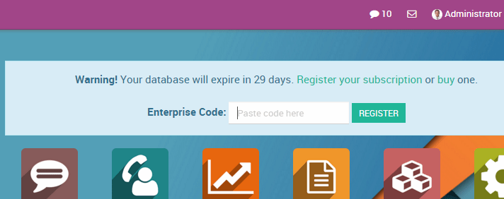

:banner: banners/enterprise.jpg
.. _setup/enterprise:

============================
From Community to Enterprise
============================

Depending on your current installation, there are multiple ways to upgrade
your community version.
In any case the basic guidelines are:

* Backup your community database

  .. image:: enterprise/db_manager.png
    :class: img-responsive

* Shutdown your server

* Install the web_enterprise module

* Restart your server

* Enter your Odoo Enterprise Subscription code

On Linux, using an installer
============================

* Backup your community database

* Stop the odoo service

  .. code-block:: console

    $ sudo service odoo stop

* Install the enterprise .deb (it should install over the community package)

  .. code-block:: console

    $ sudo dpkg -i <path_to_enterprise_deb>
  
* Update your database to the enterprise packages using

  .. code-block:: console

    $ python3 /usr/bin/odoo-bin -d <database_name> -i web_enterprise --stop-after-init

* You should be able to connect to your Odoo Enterprise instance using your usual mean of identification.
  You can then link your database with your Odoo Enterprise Subscription by entering the code you received
  by e-mail in the form input

On Linux, using the source code
===============================

There are many ways to launch your server when using sources, and you probably
have your own favourite. You may need to adapt sections to your usual workflow.

* Shutdown your server
* Backup your community database
* Update the ``--addons-path`` parameter of your launch command (see :ref:`setup/install/source`)
* Install the web_enterprise module by using

  .. code-block:: console

    $ -d <database_name> -i web_enterprise --stop-after-init

  Depending on the size of your database, this may take some time.

* Restart your server with the updated addons path of point 3.
  You should be able to connect to your instance. You can then link your database with your
  Odoo Enterprise Subscription by entering the code you received by e-mail in the form input

On Windows
==========

* Backup your community database

* Uninstall Odoo Community (using the Uninstall executable in the installation folder) -
  PostgreSQL will remain installed

  .. image:: enterprise/windows_uninstall.png
    :class: img-responsive

* Launch the Odoo Enterprise Installer and follow the steps normally. When choosing
  the installation path, you can set the folder of the Community installation
  (this folder still contains the PostgreSQL installation).
  Uncheck ``Start Odoo`` at the end of the installation

  .. image:: enterprise/windows_setup.png
   :class: img-responsive

* Using a command window, update your Odoo Database using this command (from the Odoo
  installation path, in the server subfolder)

  .. code-block:: console

    $ odoo.exe -d <database_name> -i web_enterprise --stop-after-init

* No need to manually launch the server, the service is running.
  You should be able to connect to your Odoo Enterprise instance using your usual
  mean of identification. You can then link your database with your Odoo Enterprise
  Subscription by entering the code you received by e-mail in the form input
