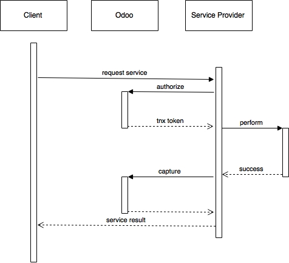

:types: api

:code-column:

.. _webservices/iap:

================
In-App Purchases
================

IAP allow providers of ongoing services through Odoo apps to be compensated
for ongoing service use rather than — and possibly instead of — a sole initial
purchase.

In that context, Odoo acts mostly as a *broker* between the service user
(client) and the service provider (Odoo App developer):

* users purchase service tokens from Odoo
* service providers draw tokens from the user's Odoo account

.. attention::

    This document is intended for *service providers* and presents the latter,
    which can be done either via direct JSON-RPC2_ or if you are using Odoo
    using the convenience helpers it provides.

.. contents::
    :local:

JSON-RPC2_ Transaction API
==========================

* The IAP transaction API does not require using Odoo when implementing your
  server gateway, calls are standard JSON-RPC2_.
* Calls use different *endpoints* but the same *method* on all endpoints
  (``call``).
* Exceptions are returned as JSON-RPC2_ errors, the formal exception name is
  available on ``data.name`` for programmatic manipulation.

.. class:: ServiceKey

    Identifier generated for the provider's service. Each key (and service)
    matches a token of a fixed value, as generated by the service provide.

    Multiple types of tokens correspond to multiple services e.g. SMS and MMS
    could either be the same service (with an MMS being "worth" multiple SMS)
    or could be separate services at separate price points.

    .. danger:: your service key *is a secret*, leaking your service key
                allows other application developers to draw credits bought for
                your service(s)

.. class:: UserToken

    Identifier for a user account.

.. class:: TransactionToken

    Transaction identifier, returned by the authorization process and consumed
    by either capturing or cancelling the transaction

.. exception:: odoo.addons.iap.models.iap.NoCreditError

    Raised during transaction authorization if the credits requested are not
    currently available on the account (either not enough credits or too many
    pending transactions/existing holds).

.. exception:: odoo.addons.iap.models.iap.BadAuthError

    Raised by any operation to which a service token is required, if the
    service token is invalid.

Authorize
---------

.. function:: /iap/1/authorize

    Verifies that the user's account has at least as ``credit`` available
    *and creates a hold (pending transaction) on that amount*.

    Any amount currently on hold by a pending transaction is considered
    unavailable to further authorize calls.

    Returns a :class:`TransactionToken` identifying the pending transaction
    which can be used to capture (confirm) or cancel said transaction.

    :param ServiceKey key:
    :param UserToken account_token:
    :param int credit:
    :param str description: optional, helps users identify the reason for
                            charges on their accounts.
    :returns: :class:`TransactionToken` if the authorization succeeded.
    :raises: :class:`~odoo.addons.iap.models.iap.BadAuthError` if the service token is invalid
    :raises: :class:`~odoo.addons.iap.models.iap.NoCreditError` if the account does
    :raises: ``TypeError`` if the ``credit`` value is not an integer

.. rst-class:: doc-aside

.. code-block:: python

    r = requests.post(ODOO + '/iap/1/authorize', json={
        'jsonrpc': '2.0',
        'id': None,
        'method': 'call',
        'params': {
            'account_token': user_account,
            'key': SERVICE_KEY,
            'credit': 25,
            'description': "Why this is being charged",
        }
    }).json()
    if 'error' in r:
        # handle authorize error
    tx = r['result']

    # provide your service here

Capture
-------

.. function:: /iap/1/capture

    Confirms the specified transaction, transferring the reserved credits from
    the user's account to the service provider's.

    Capture calls are idempotent: performing capture calls on an already
    captured transaction has no further effect.

    :param TransactionToken token:
    :param ServiceKey key:
    :raises: :class:`~odoo.addons.iap.models.iap.BadAuthError`

.. rst-class:: doc-aside

.. code-block:: python

    r2 = requests.post(ODOO + '/iap/1/capture', json={
        'jsonrpc': '2.0',
        'id': None,
        'method': 'call',
        'params': {
            'token': tx,
            'key': SERVICE_KEY,
        }
    }).json()
    if 'error' in r:
        # handle capture error
    # otherwise transaction is captured

Cancel
------

.. function:: /iap/1/cancel

    Cancels the specified transaction, releasing the hold on the user's
    credits.

    Cancel calls are idempotent: performing capture calls on an already
    cancelled transaction has no further effect.

    :param TransactionToken token:
    :param ServiceKey key:
    :raises: :class:`~odoo.addons.iap.models.iap.BadAuthError`

.. rst-class:: doc-aside

.. code-block:: python

    r2 = requests.post(ODOO + '/iap/1/cancel', json={
        'jsonrpc': '2.0',
        'id': None,
        'method': 'call',
        'params': {
            'token': tx,
            'key': SERVICE_KEY,
        }
    }).json()
    if 'error' in r:
        # handle cancel error
    # otherwise transaction is cancelled

Odoo Helpers
============

For convenience, if you are implementing your service using Odoo the ``iap``
module provides a few helpers to make IAP flow even simpler:

Charging
--------

.. class:: odoo.addons.iap.models.iap.charge(env, key, account_token, credit[, description])

    A *context manager* for authorizing and automatically capturing or
    cancelling transactions for use in the backend/proxy.

    Works much like e.g. a cursor context manager:

    * immediately authorizes a transaction with the specified parameters
    * executes the ``with`` body
    * if the body executes in full without error, captures the transaction
    * otherwise cancels it

    :param odoo.api.Environment env: used to retrieve the ``iap.endpoint``
                                     configuration key
    :param ServiceKey key:
    :param UserToken token:
    :param int credit:
    :param str description:

.. rst-class:: doc-aside

.. code-block:: python

    @route('/deathstar/superlaser', type='json')
    def superlaser(self, user_account,
                   coordinates, target,
                   factor=1.0):
        """
        :param factor: superlaser power factor,
                       0.0 is none, 1.0 is full power
        """
        credits = int(MAXIMUM_POWER * factor)
        with charge(request.env, SERVICE_KEY, user_account, credits):
            # TODO: allow other targets
            self.env['systems.planets'].search([
                ('grid', '=', 'M-10'),
                ('name', '=', 'Alderaan'),
            ]).unlink()

.. _JSON-RPC2: http://www.jsonrpc.org/specification
