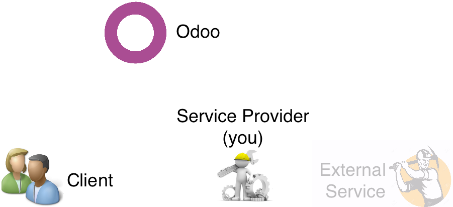
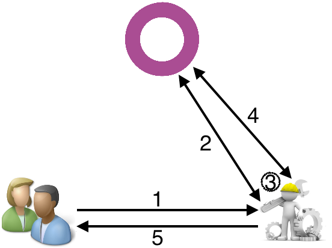
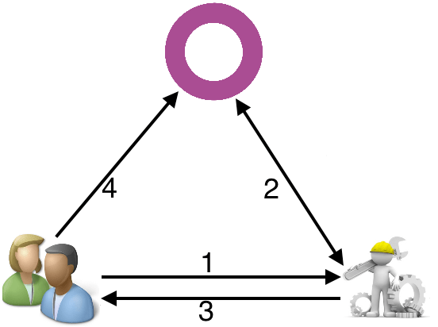
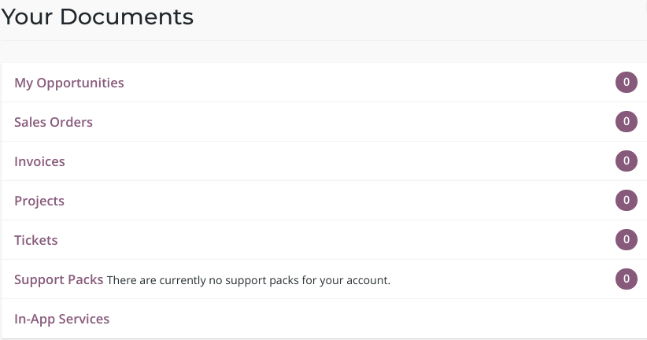
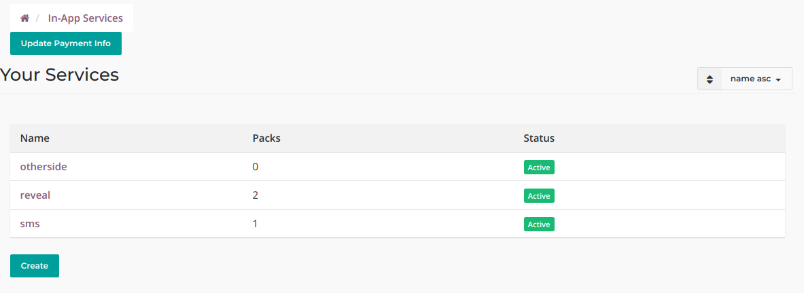
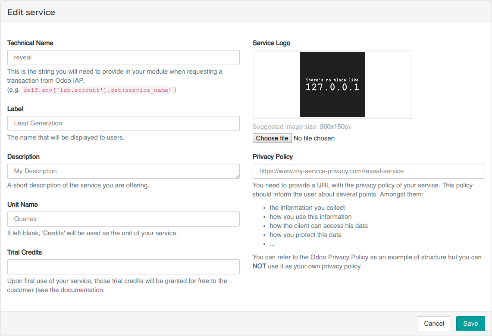
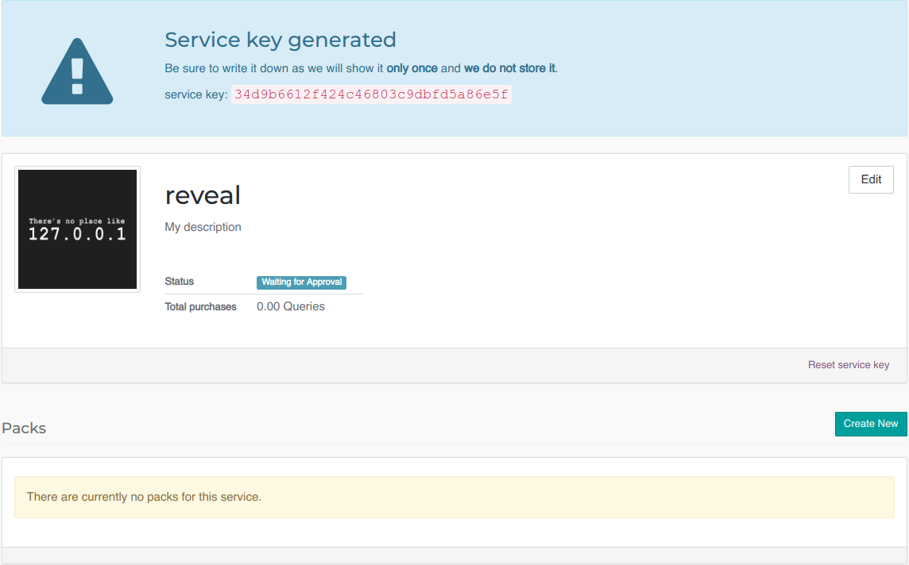
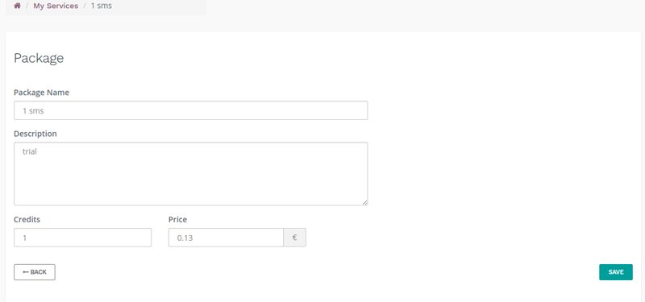
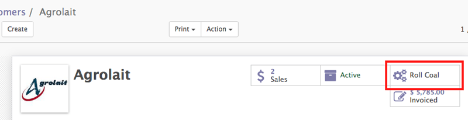

:banner: banners/iap.jpg
:types: api

.. _webservices/iap:

.. using sphinx-patchqueue:
    * the "queue" directive selects a *series* file which lists the patches in
      the patch queue, in order of application (from top to bottom). The
      corresponding patch files should be in the same directory.
    * the "patch" directive steps to the next patch in the queue, applies it
      and reifies its content (depending on the extension's configuration, by
      default it shows the changed files post-diff application, slicing to
      only display sections affecte by the file)

.. while it's technically possible to apply and update patches by hand, it's
   finnicky work and easy to break.

.. the easiest way is to install quilt (http://savannah.nongnu.org/projects/quilt),
   go to the directory where you want to reify the addon, then create a
   "patches" symlink to the patches directory (the iap/ folder next to this
   file) or set QUILT_PATCHES to that folder.

.. at that point you have a "primed" queue with no patch applied, and you can
   move within the queue with "quilt push" and "quilt pop".
    * "quilt new" creates a new empty patch at the top of the stack
    * "quilt add" tells quilt to start tracking the file, quilt add *works per
      patch*, it must be called *every time you want to alter a file within a
      patch*: quilt is not a full VCS (since it's intended to sit on top of
      an existing source) and does not do permanent tracking of files
    * "quilt edit" is a shorthand to "quilt add" then open the file in your
      editor, I suggest you use that rather than open the edited module
      normally, it avoids forgetting to "quilt add" before doing your
      modifications (at which point your modifications are untracked,
      invisible and depending on your editor may be a PITA to revert & redo)
    * "quilt refresh" updates the current patch to include pending changes

.. see "man quilt" for the rest of the subcommands. FWIW I could not get
   "quilt setup" to do anything useful.

===============
In-App Purchase
===============

In-App Purchase (IAP) allows providers of ongoing services through Odoo apps to
be compensated for ongoing service use rather than — and possibly instead of
— a sole initial purchase.

In that context, Odoo acts mostly as a *broker* between a client and an Odoo
App Developer:

* Users purchase service tokens from Odoo.
* Service providers draw tokens from the user's Odoo account when service
  is requested.

.. attention::

    This document is intended for *service providers* and presents the latter,
    which can be done either via direct JSON-RPC2_ or if you are using Odoo
    using the convenience helpers it provides.

Overview
========

    The Players

    * The Service Provider is (probably) you the reader, you will be providing
      value to the client in the form of a service paid per-use.
    * The Client installed your Odoo App, and from there will request services.
    * Odoo brokers crediting, the Client adds credit to their account, and you
      can draw credits from there to provide services.
    * The External Service is an optional player: *you* can either provide a
      service directly, or you can delegate the actual service acting as a
      bridge/translator between an Odoo system and the actual service.

    The Credits

.. note:: The credits went from integer to float value starting **October 2018**.
    Integer values are still supported.

    Every service provided through the IAP platform can be used by the
    clients with tokens or *credits*. The credits are an float unit and
    their monetary value depends on the service and is decided by the
    provider. This could be:

    * for an sms service: 1 credit = 1 sms;
    * for an ad service: 1 credit = 1 ad; or
    * for a postage service: 1 credit = 1 post stamp.

    A credit can also simply be associated with a fixed amount of money
    to palliate the variations of price (e.g. the prices of sms and stamps
    may vary following the countries).

    The value of the credits is fixed with the help of prepaid credit packs
    that the clients can buy on https://iap.odoo.com (see :ref:`Packs <iap-packages>`).

.. note:: In the following explanations we will ignore the External Service,
          they are just a detail of the service you provide.

    'Normal' service flow

    If everything goes well, the normal flow is the following:

    1. The Client requests a service of some sort.
    2. The Service Provider asks Odoo if there are enough credits for the
       service in the Client's account, and creates a transaction over that
       amount.
    3. The Service Provider provides the service (either on their own or
       calling to External Services).
    4. The Service Provider goes back to Odoo to capture (if the service could
       be provided) or cancel (if the service could not be provided) the
       transaction created at step 2.
    5. Finally, the Service Provider notifies the Client that the service has
       been rendered, possibly (depending on the service) displaying or
       storing its results in the client's system.

    Insufficient credits

    However, if the Client's account lacks credits for the service, the flow will be as follows:

    1. The Client requests a service as previously.
    2. The Service Provider asks Odoo if there are enough credits on the
       Client's account and gets a negative reply.
    3. This is signaled back to the Client.
    4. Who is redirected to their Odoo account to credit it and re-try.

Building your service
=====================

For this example, the service we will provide is ~~mining dogecoins~~ burning
10 seconds of CPU for a credit. For your own services, you could, for example:

* provide an online service yourself (e.g. convert quotations to faxes for
  business in Japan);
* provide an *offline* service yourself (e.g. provide accountancy service); or
* act as intermediary to an other service provider (e.g. bridge to an MMS
  gateway).

.. _register-service:

Register the service on Odoo
----------------------------

.. queue:: iap_service/series

.. todo:: complete this part with screenshots

The first step is to register your service on the IAP endpoint (production
and/or test) before you can actually query user accounts. To create a service,
go to your *Portal Account* on the IAP endpoint (https://iap.odoo.com for
production, https://iap-sandbox.odoo.com for testing, the endpoints are
*independent* and *not synchronized*). Alternatively, you can go to your portal
on Odoo (https://iap.odoo.com/my/home) and select *In-App Services*.

.. note::

    On production, there is a manual validation step before the service
    can be used to manage real transactions. This step is automatically passed when
    on sandbox to ease the tests.

Log in then go to :menuselection:`My Account --> Your In-App Services`, click
Create and provide the informations of your service.

The service has *seven* important fields:

* :samp:`name` - :class:`ServiceName`: This is the string you will need to provide inside
  the client's :ref:`app <iap-odoo-app>` when requesting a transaction from Odoo. (e.g.
  :class:`self.env['iap.account].get(name)`). As good practice, this should match the
  technical name of your app.

* :samp:`label` - :class:`Label`: The name displayed on the shopping portal for the
  client.

.. warning::
   Both the :class:`ServiceName` and :class:`Label` are unique. As good practice, the
   :class:`ServiceName` should usually match the name of your Odoo Client App.

* :samp:`icon` - :class:`Icon`: A generic icon that will serve as default for your
  :ref:`packs <iap-packages>`.

* :samp:`key` - :class:`ServiceKey`: The developer key that identifies you in
  IAP (see :ref:`your service <iap-service>`) and allows to draw credits from
  the client's account. It will be shown only once upon creation of the service
  and can be regenerated at will.

.. danger::
    Your :class:`ServiceKey` *is a secret*, leaking your service key
    allows other application developers to draw credits bought for
    your service(s).

* :samp:`trial credits` - :class:`Float`: This corresponds to the credits you are ready to offer
  upon first use to your app users. Note that such service will only be available to clients that
  have an active enterprise contract.

* :samp:`privacy policy` - :class:`PrivacyPolicy`: This is an url to the privacy
  policy of your service. This should explicitly mention the **information you collect**,
  how you **use it, its relevance** to make your service work and inform the
  client on how they can **access, update or delete their personal information**.

You can then create *credit packs* which clients can purchase in order to
use your service.

.. _iap-packages:

Packs
-----

A credit pack is essentially a product with five characteristics:

* Name: name of the pack,
* Icon: specific icon for the pack (if not provided, it will fallback on the service icon),
* Description: details on the pack that will appear on the shop page as
  well as the invoice,
* Amount: amount of credits the client is entitled to when buying the pack,
* Price: price in EUR (for the time being, USD support is planned).

.. note::

    Odoo takes a 25% commission on all pack sales. Adjust your selling price accordingly.

.. note::

    Depending on the strategy, the price per credit may vary from one
    pack to another.

.. _iap-odoo-app:

Odoo App
--------

.. queue:: iap/series

.. todo:: does this actually require apps?

The second step is to develop an `Odoo App`_ which clients can install in their
Odoo instance and through which they can *request* the services you provide.
Our app will just add a button to the Partners form which lets a user request
burning some CPU time on the server.

First, we will create an *odoo module* depending on ``iap``. IAP is a standard
V11 module and the dependency ensures a local account is properly set up and
we will have access to some necessary views and useful helpers.

.. patch::

Second, the "local" side of the integration. Here we will only be adding an
action button to the partners view, but you can of course provide significant
local value via your application and additional parts via a remote service.

.. patch::

We can now implement the action method/callback. This will *call our own
server*.

There are no requirements when it comes to the server or the communication
protocol between the app and our server, but ``iap`` provides a
:func:`~odoo.addons.iap.tools.iap_tools.iap_jsonrpc` helper to call a JSON-RPC2_ endpoint on an
other Odoo instance and transparently re-raise relevant Odoo exceptions
(:class:`~odoo.addons.iap.tools.iap_tools.InsufficientCreditError`,
:class:`odoo.exceptions.AccessError` and :class:`odoo.exceptions.UserError`).

In that call, we will need to provide:

* any relevant client parameter (none here),
* the :class:`token <UserToken>` of the current client that is provided by
  the ``iap.account`` model's ``account_token`` field. You can retrieve the
  account for your service by calling :samp:`env['iap.account'].get({service_name})`
  where :class:`service_name <ServiceName>` is the name of the service registered
  on IAP endpoint.

.. patch::

.. note::

    ``iap`` automatically handles
    :class:`~odoo.addons.iap.tools.iap_tools.InsufficientCreditError` coming from the action
    and prompts the user to add credits to their account.

    :func:`~odoo.addons.iap.tools.iap_tools.iap_jsonrpc` takes care of re-raising
    :class:`~odoo.addons.iap.models.iap.InsufficientCreditError` for you.

.. danger::

    If you are not using :func:`~odoo.addons.iap.tools.iap_tools.iap_jsonrpc` you *must* be
    careful to re-raise
    :class:`~odoo.addons.iap.tools.iap_tools.InsufficientCreditError` in your handler
    otherwise the user will not be prompted to credit their account, and the
    next call will fail the same way.

.. _iap-service:

Service
-------

.. queue:: iap_service/series

Though that is not *required*, since ``iap`` provides both a client helper
for JSON-RPC2_ calls (:func:`~odoo.addons.iap.tools.iap_tools.iap_jsonrpc`) and a service helper
for transactions (:class:`~odoo.addons.iap.tools.iap_tools.iap_charge`) we will also be
implementing the service side as an Odoo module:

.. patch::

Since the query from the client comes as JSON-RPC2_ we will need the
corresponding controller which can call :class:`~odoo.addons.iap.tools.iap_tools.iap_charge` and
perform the service within:

.. patch::

.. todo:: for the actual IAP will the "portal" page be on odoo.com or iap.odoo.com?

.. todo:: "My Account" > "Your InApp Services"?

The :class:`~odoo.addons.iap.tools.iap_tools.iap_charge` helper will:

1. authorize (create) a transaction with the specified number of credits,
   if the account does not have enough credits it will raise the relevant
   error
2. execute the body of the ``with`` statement
3. if the body of the ``with`` executes successfully, update the price
   of the transaction if needed
4. capture (confirm) the transaction
5. otherwise, if an error is raised from the body of the ``with``, cancel the
   transaction (and release the hold on the credits)

.. danger::

    By default, :class:`~odoo.addons.iap.tools.iap_tools.iap_charge` contacts the *production*
    IAP endpoint, https://iap.odoo.com. While developing and testing your
    service you may want to point it towards the *development* IAP endpoint
    https://iap-sandbox.odoo.com.

    To do so, set the ``iap.endpoint`` config parameter in your service
    Odoo: in debug/developer mode, :menuselection:`Setting --> Technical -->
    Parameters --> System Parameters`, just define an entry for the key
    ``iap.endpoint`` if none already exists).

The :class:`~odoo.addons.iap.tools.iap_tools.iap_charge` helper has two additional optional
parameters we can use to make things clearer to the end-user.

``description``
    is a message which will be associated with the transaction and will be
    displayed in the user's dashboard, it is useful to remind the user why
    the charge exists.
``credit_template``
    is the name of a :ref:`reference/qweb` template which will be rendered
    and shown to the user if their account has less credit available than the
    service provider is requesting, its purpose is to tell your users why
    they should be interested in your IAP offers.

.. patch::

.. TODO:: how do you test your service?

JSON-RPC2_ Transaction API
==========================

.. image:: images/flow.png
    :align: center

* The IAP transaction API does not require using Odoo when implementing your
  server gateway, calls are standard JSON-RPC2_.
* Calls use different *endpoints* but the same *method* on all endpoints
  (``call``).
* Exceptions are returned as JSON-RPC2_ errors, the formal exception name is
  available on ``data.name`` for programmatic manipulation.

.. seealso:: `iap.odoo.com documentation`_ for additional information.

Authorize
---------

.. function:: /iap/1/authorize

    Verifies that the user's account has at least as ``credit`` available
    *and creates a hold (pending transaction) on that amount*.

    Any amount currently on hold by a pending transaction is considered
    unavailable to further authorize calls.

    Returns a :class:`TransactionToken` identifying the pending transaction
    which can be used to capture (confirm) or cancel said transaction (`iap.odoo.com documentation`_).

    :param ServiceKey key:
    :param UserToken account_token:
    :param float credit:
    :param str description: optional, helps users identify the reason for
                            charges on their account
    :param str dbuuid: optional, allows the user to benefit from trial
                       credits if his database is eligible (see :ref:`Service registration <register-service>`)
    :returns: :class:`TransactionToken` if the authorization succeeded
    :raises: :class:`~odoo.exceptions.AccessError` if the service token is invalid
    :raises: :class:`~odoo.addons.iap.models.iap.InsufficientCreditError` if the account does not have enough credits
    :raises: ``TypeError`` if the ``credit`` value is not an integer or a float

.. code-block:: python

    r = requests.post(ODOO + '/iap/1/authorize', json={
        'jsonrpc': '2.0',
        'id': None,
        'method': 'call',
        'params': {
            'account_token': user_account,
            'key': SERVICE_KEY,
            'credit': 25,
            'description': "Why this is being charged",
        }
    }).json()
    if 'error' in r:
        # handle authorize error
    tx = r['result']

    # provide your service here

Capture
-------

.. function:: /iap/1/capture

    Confirms the specified transaction, transferring the reserved credits from
    the user's account to the service provider's.

    Capture calls are idempotent: performing capture calls on an already
    captured transaction has no further effect.

    :param TransactionToken token:
    :param ServiceKey key:
    :param float credit_to_capture: optional parameter to capture a smaller amount of credits than authorized
    :raises: :class:`~odoo.exceptions.AccessError`

.. code-block:: python
  :emphasize-lines: 8

    r2 = requests.post(ODOO + '/iap/1/capture', json={
        'jsonrpc': '2.0',
        'id': None,
        'method': 'call',
        'params': {
            'token': tx,
            'key': SERVICE_KEY,
            'credit_to_capture': credit or False,
        }
    }).json()
    if 'error' in r:
        # handle capture error
    # otherwise transaction is captured

Cancel
------

.. function:: /iap/1/cancel

    Cancels the specified transaction, releasing the hold on the user's
    credits.

    Cancel calls are idempotent: performing capture calls on an already
    cancelled transaction has no further effect.

    :param TransactionToken token:
    :param ServiceKey key:
    :raises: :class:`~odoo.exceptions.AccessError`

.. code-block:: python

    r2 = requests.post(ODOO + '/iap/1/cancel', json={
        'jsonrpc': '2.0',
        'id': None,
        'method': 'call',
        'params': {
            'token': tx,
            'key': SERVICE_KEY,
        }
    }).json()
    if 'error' in r:
        # handle cancel error
    # otherwise transaction is cancelled

Types
-----

Exceptions aside, these are *abstract types* used for clarity, you should not
care how they are implemented.

.. class:: ServiceName

    String identifying your service on https://iap.odoo.com (production) as well
    as the account related to your service in the client's database.

.. class:: ServiceKey

    Identifier generated for the provider's service. Each key (and service)
    matches a token of a fixed value, as generated by the service provide.

    Multiple types of tokens correspond to multiple services. As an exampe, SMS and MMS
    could either be the same service (with an MMS being 'worth' multiple SMS)
    or could be separate services at separate price points.

    .. danger:: Your service key *is a secret*, leaking your service key
                allows other application developers to draw credits bought for
                your service(s).

.. class:: UserToken

    Identifier for a user account.

.. class:: TransactionToken

    Transaction identifier, returned by the authorization process and consumed
    by either capturing or cancelling the transaction.

.. exception:: odoo.addons.iap.tools.iap_tools.InsufficientCreditError

    Raised during transaction authorization if the credits requested are not
    currently available on the account (either not enough credits or too many
    pending transactions/existing holds).

.. exception:: odoo.exceptions.AccessError
    :noindex:

    Raised by:

    * any operation to which a service token is required, if the service token is invalid; or
    * any failure in an inter-server call. (typically, in :func:`~odoo.addons.iap.tools.iap_tools.iap_jsonrpc`).

.. exception:: odoo.exceptions.UserError
    :noindex:

    Raised by any unexpected behaviour at the discretion of the App developer (*you*).

Test the API
------------

In order to test the developped app, we propose a sandbox platform that allows you to:

1. Test the whole flow from the client's point of view - Actual services and transactions
   that can be consulted. (again this requires to change the endpoint, see the danger note
   in :ref:`Service <iap-service>`).
2. Test the API.

The latter consists in specific tokens that will work on **IAP-Sandbox only**.

* Token ``000000``: Represents a non-existing account. Returns
  an :class:`~odoo.addons.iap.tools.iap_tools.InsufficientCreditError` on authorize attempt.
* Token ``000111``: Represents an account without sufficient credits to perform any service.
  Returns an :class:`~odoo.addons.iap.tools.iap_tools.InsufficientCreditError` on authorize attempt.
* Token ``111111``: Represents an account with enough credits to perform any service.
  An authorize attempt will return a dummy transacion token that is processed by the capture
  and cancel routes.

.. note::

    * Those tokens are only active on the IAP-Sanbox server.
    * The service key is completely ignored with this flow, If you want to run a robust test
      of your service, you should ignore these tokens.

Odoo Helpers
============

For convenience, if you are implementing your service using Odoo the ``iap``
module provides a few helpers to make IAP flow even simpler.

.. _iap-charging:

Charging
--------

.. class:: odoo.addons.iap.tools.iap_tools.iap_charge(env, key, account_token, credit[, dbuuid, description, credit_template])

    A *context manager* for authorizing and automatically capturing or
    cancelling transactions for use in the backend/proxy.

    Works much like e.g. a cursor context manager:

    * immediately authorizes a transaction with the specified parameters;
    * executes the ``with`` body;
    * if the body executes in full without error, captures the transaction;
    * otherwise cancels it.

    :param odoo.api.Environment env: used to retrieve the ``iap.endpoint``
                                     configuration key
    :param ServiceKey key:
    :param UserToken token:
    :param float credit:
    :param str description:
    :param Qweb template credit_template:

.. code-block:: python
  :emphasize-lines: 11,13,14,15

    @route('/deathstar/superlaser', type='json')
    def superlaser(self, user_account,
                   coordinates, target,
                   factor=1.0):
        """
        :param factor: superlaser power factor,
                       0.0 is none, 1.0 is full power
        """
        credits = int(MAXIMUM_POWER * factor)
        description = "We will demonstrate the power of this station on your home planet of Alderaan."
        with iap_charge(request.env, SERVICE_KEY, user_account, credits, description) as transaction:
            # TODO: allow other targets
            transaction.credit = max(credits, 2)
            # Sales ongoing one the energy price,
            # a maximum of 2 credits will be charged/captured.
            self.env['systems.planets'].search([
                ('grid', '=', 'M-10'),
                ('name', '=', 'Alderaan'),
            ]).unlink()

Authorize
---------

.. class:: odoo.addons.iap.tools.iap_tools.iap_authorize(env, key, account_token, credit[, dbuuid, description, credit_template])

    Will authorize everything.

    :param odoo.api.Environment env: used to retrieve the ``iap.endpoint``
                                     configuration key
    :param ServiceKey key:
    :param UserToken token:
    :param float credit:
    :param str description:
    :param Qweb template credit_template:

.. code-block:: python
  :emphasize-lines: 12

    @route('/deathstar/superlaser', type='json')
    def superlaser(self, user_account,
                   coordinates, target,
                   factor=1.0):
        """
        :param factor: superlaser power factor,
                       0.0 is none, 1.0 is full power
        """
        credits = int(MAXIMUM_POWER * factor)
        description = "We will demonstrate the power of this station on your home planet of Alderaan."
        #actual IAP stuff
        transaction_token = authorize(request.env, SERVICE_KEY, user_account, credits, description=description)
        try:
            # Beware the power of this laser
            self.put_galactical_princess_in_sorrow()
        except Exception as e:
            # Nevermind ...
            r = cancel(env,transaction_token, key)
            raise e
        else:
            # We shall rule over the galaxy!
            capture(env,transaction_token, key, min(credits, 2))

Cancel
------

.. class:: odoo.addons.iap.tools.iap_tools.iap_cancel(env, transaction_token, key)

    Will cancel an authorized transaction.

    :param odoo.api.Environment env: used to retrieve the ``iap.endpoint``
                                     configuration key
    :param str transaction_token:
    :param ServiceKey key:

.. code-block:: python
  :emphasize-lines: 16,17,18,19

    @route('/deathstar/superlaser', type='json')
    def superlaser(self, user_account,
                   coordinates, target,
                   factor=1.0):
        """
        :param factor: superlaser power factor,
                       0.0 is none, 1.0 is full power
        """
        credits = int(MAXIMUM_POWER * factor)
        description = "We will demonstrate the power of this station on your home planet of Alderaan."
        #actual IAP stuff
        transaction_token = authorize(request.env, SERVICE_KEY, user_account, credits, description=description)
        try:
            # Beware the power of this laser
            self.put_galactical_princess_in_sorrow()
        except Exception as e:
            # Nevermind ...
            r = cancel(env,transaction_token, key)
            raise e
        else:
            # We shall rule over the galaxy!
            capture(env,transaction_token, key, min(credits, 2))

Capture
-------

.. class:: odoo.addons.iap.tools.iap_tools.iap_capture(env, transaction_token, key, credit)

    Will capture the amount ``credit`` on the given transaction.

    :param odoo.api.Environment env: used to retrieve the ``iap.endpoint``
                                     configuration key
    :param str transaction_token:
    :param ServiceKey key:
    :param credit:

.. code-block:: python
  :emphasize-lines: 20,21,22

    @route('/deathstar/superlaser', type='json')
    def superlaser(self, user_account,
                   coordinates, target,
                   factor=1.0):
        """
        :param factor: superlaser power factor,
                       0.0 is none, 1.0 is full power
        """
        credits = int(MAXIMUM_POWER * factor)
        description = "We will demonstrate the power of this station on your home planet of Alderaan."
        #actual IAP stuff
        transaction_token = authorize(request.env, SERVICE_KEY, user_account, credits, description=description)
        try:
            # Beware the power of this laser
            self.put_galactical_princess_in_sorrow()
        except Exception as e:
            # Nevermind ...
            r = cancel(env,transaction_token, key)
            raise e
        else:
            # We shall rule over the galaxy!
            capture(env,transaction_token, key, min(credits, 2))

.. _JSON-RPC2: https://www.jsonrpc.org/specification
.. _Odoo App: https://www.odoo.com/apps
.. _iap.odoo.com documentation: https://iap.odoo.com/iap/1/documentation
