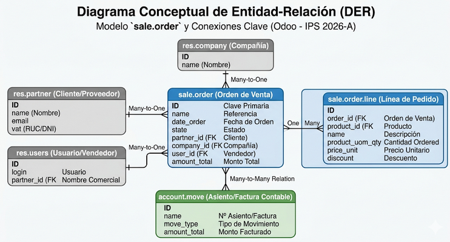
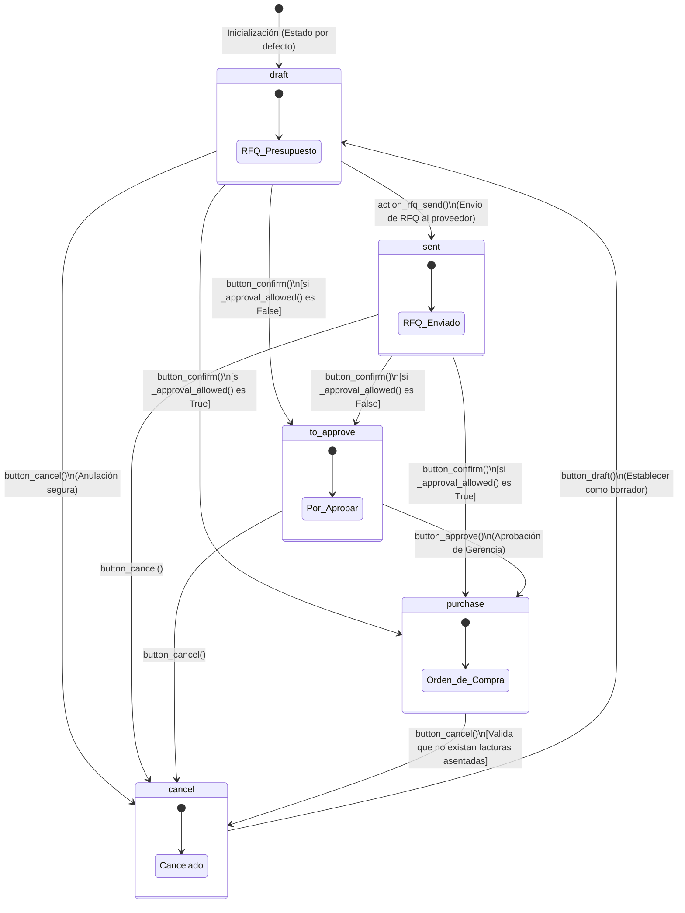
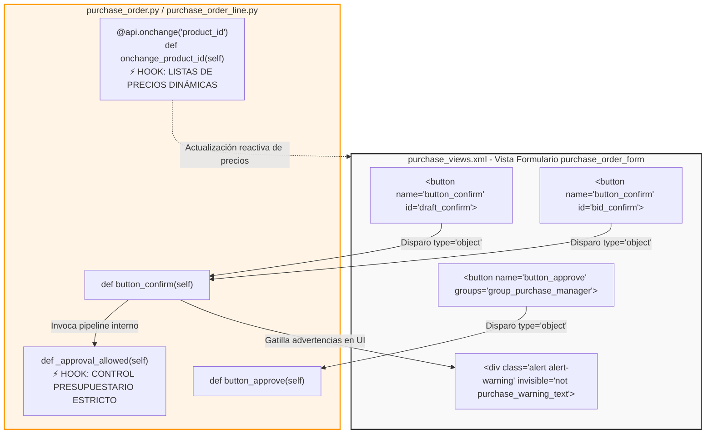

# Documentación de Arquitectura: Análisis de Dependencias (Sprint 1)

> **Hito 2 – Sprint 1:** Análisis, backlog y configuración inicial.  
> Auditoría técnica del módulo `purchase` de Odoo: dependencias, modelo de datos, máquina de estados, métodos core y capa de presentación XML.

---

## 1. Análisis de Dependencias (`__manifest__.py`)

### Dependencias declaradas

```python
'depends': [
    'account', # Núcleo de Contabilidad: facturas, asientos y motor fiscal
]
```

### Dependencias directas

| Módulo | Rol |
|---|---|
| `account` | Núcleo de Contabilidad: genera facturas de proveedor (*Vendor Bills*), gestiona diarios financieros, cuentas de gastos por pagar y el motor fiscal para el cálculo de tasas de adquisición |

### Mapa de dependencias


> **Nota arquitectónica:** A diferencia del módulo `sale`, la arquitectura de `purchase` adopta un acoplamiento minimalista declarando únicamente `account` como dependencia base. Las capacidades de portal de proveedor (*Vendor Portal*) y motor de impuestos (*Tax Engine*) son habilitadas de forma transitiva por el núcleo contable.

---

## 2. Arquitectura del Modelo `purchase.order`

### Pilar 1 – Estructura de Persistencia y Relaciones

La persistencia del proceso de abastecimiento en PostgreSQL se encuentra gobernada por dos estructuras jerárquicas e interconectadas definidas en `purchase_order.py` y `purchase_order_line.py`.

#### A. El Modelo Central de Cabecera (`purchase.order`)

Actúa como el **orquestador principal** de la transacción con la entidad proveedora. Sus campos relacionales clave:

| Campo | Tipo | Destino | Propósito |
|---|---|---|---|
| `partner_id` | `Many2one` | `res.partner` | Enlace mandatorio indexado al maestro de entidades; restringe el origen al perfil formal del **Proveedor (Vendor)** |
| `order_line` | `One2many` | `purchase.order.line` | Relación estructural inversa de composición: amarra la cabecera con el desglose masivo de ítems solicitados |
| `invoice_ids` | `Many2many` | `account.move` | Relación calculada y almacenada físicamente en disco (`store=True`) que enlaza el pedido con las facturas de proveedor (*Vendor Bills*) |

#### B. El Modelo de Detalle de Línea (`purchase.order.line`)

Gobernado por la granularidad de los productos adquiridos, introduce las siguientes llaves foráneas y restricciones de integridad:

| Campo | Tipo | Destino | Propósito |
|---|---|---|---|
| `order_id` | `Many2one` | `purchase.order` | Llave foránea de composición con eliminación en cascada (`ondelete='cascade'`): la supresión de una cabecera limpia síncronamente sus líneas dependientes |
| `product_id` | `Many2one` | `product.product` | Vinculación al catálogo de variantes filtrado estrictamente por `[('purchase_ok', '=', True)]`; solo productos parametrizados para compra pueden ser transaccionados |
| `tax_ids` | `Many2many` | `account.tax` | Colección de impuestos fiscales aplicados a la adquisición (v.g., IVA Crédito Fiscal) |

#### C. Variables de Control de Triple Concordancia (3-Way Matching)

A nivel de línea, la arquitectura implementa un esquema de control logístico-financiero mediante variables síncronas calculadas y almacenadas:

| Variable | Descripción |
|---|---|
| `product_qty` | Volumen originalmente solicitado al proveedor |
| `qty_received` | Volumen de mercancía físicamente ingresado a los almacenes. Su cálculo se delega dinámicamente según `qty_received_method`, interactuando con los albaranes del módulo de inventario (`stock.move`) |
| `qty_invoiced` | Volumen reflejado e imputado en las facturas de proveedor confirmadas |
| `qty_to_invoice` | Saldo calculado pendiente de conciliación financiera |

### Diagrama Entidad-Relación (DER)



---

### Pilar 2 – Máquina de Estados del Flujo de Abastecimiento

El campo `state` opera como una máquina de estados determinista que evalúa de forma restrictiva las operaciones del backend:

| Código | Etiqueta | Comportamiento |
|---|---|---|
| `draft` | RFQ (Solicitud de Presupuesto) | Estado inicial editable. No genera afectación de inventarios ni obligaciones financieras de pasivos |
| `sent` | RFQ Sent (Solicitud Enviada) | El documento ha sido enviado formalmente al proveedor. Bloquea preventivamente ciertos campos de edición menor |
| `to_approve` | To Approve (Por Aprobación) | Fase de control crítico. El documento es retenido en espera de doble validación directiva por exceder umbrales presupuestarios |
| `purchase` | Purchase Order (Orden de Compra) | Estado transaccional definitivo. Pedido confirmado en firme; habilita síncronamente la recepción de inventarios y la generación de facturas |
| `cancel` | Cancelled (Cancelado) | Fase de anulación. Libera los flujos y bloquea transacciones posteriores sobre el registro |



> **Diferenciador clave respecto a `sale`:** El flujo de compras introduce el estado intermedio `to_approve`, ausente en ventas. Este estado implementa un mecanismo de doble validación directiva activado cuando el monto del pedido supera umbrales presupuestarios configurables, representando un control de riesgo financiero nativo de la arquitectura.

---

### Pilar 3 – Métodos Core de Orquestación

#### A. Validación y Control del Proceso de Confirmación (`button_confirm` y `button_approve`)

El método `button_confirm` actúa como el pipeline inicial de verificación del pedido. Itera sobre los registros evaluando mensajes de error de confirmación y validando las distribuciones analíticas fiscales de las líneas. Posteriormente invoca el método de control `_approval_allowed()`:

- Si la doble validación es aprobada → ejecuta `button_approve()` mutando el estado a `'purchase'`.
- De lo contrario → desvía el registro hacia la fase de retención bajo el estado `'to_approve'`.

#### B. Control de Integridad en Anulaciones (`button_cancel`)

Garantiza que una orden de compra no pueda ser dada de baja de forma arbitraria si existen transacciones dependientes activas:

1. Evalúa si el documento está bloqueado (`po.locked`), lanzando una excepción de seguridad en caso positivo.
2. Filtra las facturas contables enlazadas (`po.invoice_ids`) verificando que ninguna se encuentre en un estado diferente a borrador o cancelado.
3. Interrumpe síncronamente la cancelación si existen obligaciones financieras asentadas.

#### C. Pipeline de Transformación Documental: Motor de Facturación (`action_create_invoice`)

Orquesta la construcción masiva de documentos financieros de cuentas por pagar (`account.move` con contexto `default_move_type='in_invoice'`) en un pipeline de fases:

1. **Preparación de Cabecera** — Invoca `_prepare_invoice` para estructurar los metadatos del documento contable.
2. **Recorrido Secuencial de Líneas** — Itera sobre cada línea del pedido de compra para mapear sus propiedades al dominio contable.
3. **Agrupamiento Transaccional** — Agrupa las facturas generadas dinámicamente mediante `groupby` basándose en tres criterios: `company_id`, `partner_id` (Proveedor) y `currency_id` (Moneda), fusionando múltiples órdenes en un único borrador para optimizar operaciones de tesorería.

#### D. El Mapeador de Líneas — Data Factory (`_prepare_account_move_line`)

Invocado durante el pipeline de facturación desde `purchase.order.line`, traduce las propiedades comerciales de la grilla al dominio contable:

- Genera un mapa de datos estructurado con el identificador del producto, descripciones unificadas y la colección de impuestos (`tax_ids`).
- **Lógica de reembolso:** Si la factura de destino corresponde a un `'in_refund'`, el valor de `qty_to_invoice` es invertido matemáticamente mediante signo negativo para asegurar el correcto balance de saldos en el libro diario.

---

### Pilar 4 – Hooks de Extensión de Arquitectura

#### Hook A: Reactividad de Costos e Inicialización (`onchange_product_id`)

```python
@api.onchange('product_id')
def onchange_product_id(self):
    # Inicializa montos a cero y pobla valores por defecto del catálogo
    # ... subrutinas core para precio, descripción e impuestos
```

> **Punto de extensión:** Disparado en el cliente web inmediatamente cuando el comprador altera el producto de la línea. Representa la ventana óptima para inyectar la **automatización de listas de precios dinámicas** o alertas por variación de costos históricos frente a lo cotizado por el proveedor.

#### Hook B: Intercepción del Proceso de Doble Aprobación (`_approval_allowed`)

```python
def _approval_allowed(self):
    # Evalúa si el pedido cuenta con autorización para confirmación directa
    # o si debe ser desviado al estado 'to_approve'
```

> **Punto de extensión:** Evaluado síncronamente dentro de `button_confirm`. Constituye el punto de anclaje ideal para inyectar un **Dashboard de Control Presupuestario** estricto, auditando si el centro de costos posee fondos suficientes antes de permitir la confirmación del pedido.

---

## 3. Capa de Presentación – Vistas XML (`purchase_views.xml`)

### Ecosistema de Multi-Vistas

| Vista | Propósito |
|---|---|
| `form` | Edición detallada y orquestación del flujo de trabajo del pedido de compra |
| `list` | Registros tabulares con soporte de agregaciones numéricas y acción masiva de facturación |
| `kanban` | Tarjetas visuales adaptadas para visualización de totales monetarios en dispositivos móviles |
| `search` | Filtros de dominio predefinidos y agrupamiento operacional por criterios de negocio |

### Anatomía de la Vista Formulario Principal (`purchase_order_form`)

#### A. Encabezado de Control de Flujo (`<header>`)

```xml
<header>
    <button name="action_rfq_send"
        invisible="state != 'draft'"
        string="Send RFQ" type="object" class="oe_highlight"/>
    <button name="button_confirm" type="object"
        invisible="state != 'sent'"
        string="Confirm Order" class="oe_highlight" id="bid_confirm"/>
    <button name="button_approve" type="object"
        invisible="state != 'to approve'"
        string="Approve Order" class="oe_highlight"
        groups="purchase.group_purchase_manager"/>
    <button name="button_cancel"
        invisible="state not in ('draft', 'to approve', 'sent', 'purchase') or locked"
        string="Cancel" type="object"/>
    <field name="state" widget="statusbar"
        statusbar_visible="draft,sent,purchase" readonly="1"/>
</header>
```

#### B. Sistema de Alertas Dinámicas (Banners Reactivos)

| Alerta | Campo evaluado | Condición |
|---|---|---|
| Bloqueos de proveedor | `purchase_warning_text` | Notas internas o restricciones asociadas al proveedor seleccionado |
| Integridad documental | `duplicated_order_ids` | Posible duplicado de solicitud de cotización hacia un mismo proveedor (activo solo en estado `draft`) |

#### C. Tabla de Detalle (`order_line`)

- **Modo edición:** `editable="bottom"` — inserción rápida en grilla sin ventanas emergentes.
- **Inserción guiada:** La etiqueta `<control>` estructura accesos directos para agregar variantes de producto, notas internas, líneas de sección organizativa o abrir el catálogo unificado (`action_add_from_catalog`).
- **Soporte móvil:** La declaración paralela `<kanban>` asegura adaptabilidad visual y visualización de totales monetarios en pantallas reducidas.

### Matriz de Trazabilidad: XML ↔ Backend Python

| Componente XML | `name` (Destino) | Tipo | Visibilidad | Propósito |
|---|---|---|---|---|
| Botón "Send RFQ" | `action_rfq_send` | `object` | `state != 'draft'` | Envía formalmente la solicitud de cotización al proveedor |
| Botón "Confirm Order" | `button_confirm` | `object` | `state != 'sent'` o `!= 'draft'` | Gatilla el pipeline de validación comercial para asentar el pedido |
| Botón "Approve Order" | `button_approve` | `object` | `state != 'to approve'` / restringido a `group_purchase_manager` | Desbloquea de forma autorizada los pedidos retenidos por presupuesto |
| Botón "Cancel" | `button_cancel` | `object` | Fuera de estados válidos o si `locked` | Dispara la validación de consistencia contable previa a la baja |
| Botón "Create Bills" | `action_create_invoice` | `object` | Disponible en cabecera de vista lista | Inicia el pipeline transaccional de transformación hacia facturas de proveedor |
| Campo de Progresión | `state` | `statusbar` | Siempre visible | Despliega visualmente la fase actual de la máquina de estados |

### Mapa de Trazabilidad: Interfaz XML ↔ Código Python



---

*Documentación generada como parte del Hito 2 – Sprint 1 | IPS 2026-A*
