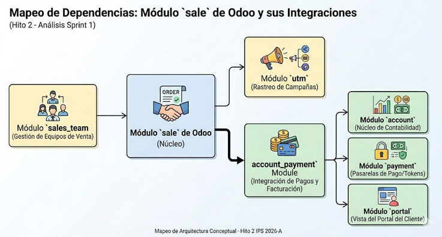
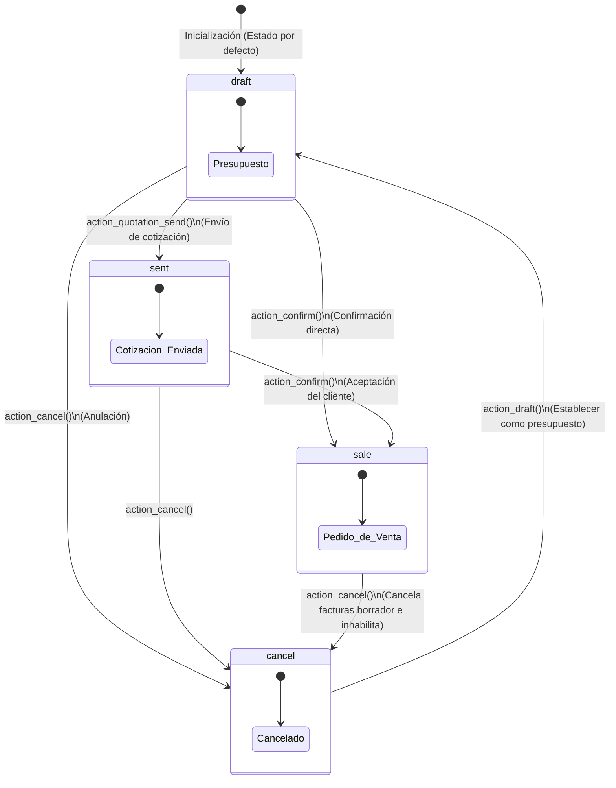
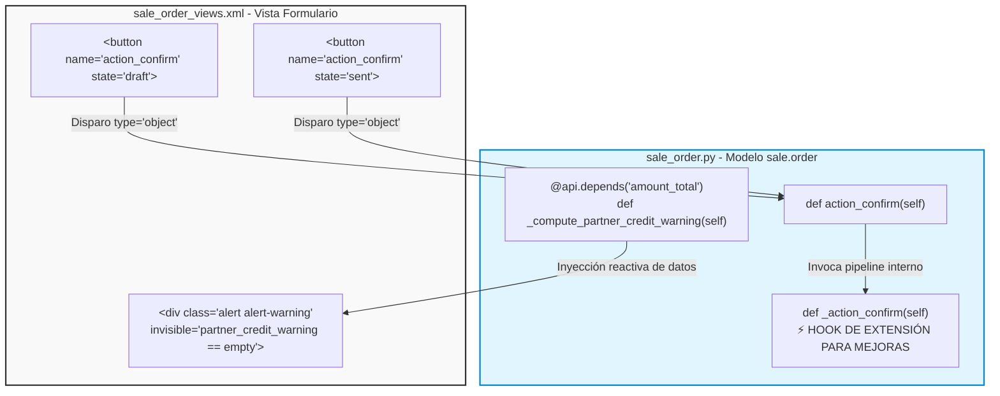

# Documentación de Arquitectura: Análisis de Dependencias (Sprint 1)

> **Hito 2 – Sprint 1:** Análisis, backlog y configuración inicial.  
> Auditoría técnica del módulo `sale` de Odoo: dependencias, modelo de datos, máquina de estados, métodos core y capa de presentación XML.

---

## 1. Análisis de Dependencias (`__manifest__.py`)

### Dependencias declaradas

```python
'depends': [
    'sales_team',      # Gestión de equipos de ventas
    'account_payment', # -> account, payment, portal
    'utm',             # Rastreo de campañas de marketing
]
```

### Dependencias directas

| Módulo | Rol |
|---|---|
| `sales_team` | Organiza vendedores en equipos, jerarquías y cuotas dentro de las órdenes |
| `account_payment` | Integración con el motor financiero para registro de cobros desde la orden o factura |
| `utm` | Asocia cotizaciones/ventas a fuentes de marketing (origen, medio, campaña) |

### Dependencias transitivas (vía `account_payment`)

`account_payment` actúa como puente e introduce automáticamente tres módulos adicionales:

| Módulo | Rol |
|---|---|
| `account` | Núcleo de Contabilidad: genera facturas y registra asientos contables |
| `payment` | Gestiona pasarelas de pago externas (tarjetas, PayPal) y tokens de transacción |
| `portal` | Interfaz web del portal del cliente para visualizar cotizaciones y pagar facturas |

### Mapa de dependencias



---

## 2. Arquitectura del Modelo `sale.order`

### Pilar 1 – Estructura de Persistencia y Relaciones

El modelo `sale.order` es el **orquestador central** de la transacción comercial. Sus relaciones clave:

| Campo | Tipo | Destino | Propósito |
|---|---|---|---|
| `name` | `Char` | — | Identificador único (PK lógica), indexado con *trigram* |
| `company_id` | `Many2one` | `res.company` | Aislamiento de datos multi-compañía |
| `partner_id` | `Many2one` | `res.partner` | Llave foránea al maestro de clientes |
| `order_line` | `One2many` | `sale.order.line` | Líneas de productos, precios y cantidades |
| `invoice_ids` | `Many2many` | `account.move` | Trazabilidad bidireccional ventas ↔ contabilidad |
| `invoice_status` | `Selection` | — | Campo calculado (`store=True`): estado de facturación |

### Diagrama Entidad-Relación (DER)


---

### Pilar 2 – Máquina de Estados del Flujo Comercial

El campo `state` opera como una máquina de estados determinista controlada por `SALE_ORDER_STATE`:

| Código | Etiqueta | Comportamiento |
|---|---|---|
| `draft` | Quotation (Presupuesto) | Estado inicial. Documento editable. No afecta inventarios ni genera pasivos |
| `sent` | Quotation Sent (Enviado) | Propuesta compartida con el cliente. Bloquea ciertas propiedades de edición |
| `sale` | Sales Order (Pedido Firme) | Cotización aceptada. Bloquea edición y dispara reserva en el módulo `stock` |
| `cancel` | Cancelled (Cancelado) | Revierte flujos y libera documentos borrador enlazados |



---

### Pilar 3 – Métodos Core de Orquestación

#### A. Cancelación Síncrona (`_action_cancel`)

Garantiza integridad referencial antes de dar de baja un pedido: cancela primero las facturas en borrador enlazadas y luego muta el estado.

```python
def _action_cancel(self):
    inv = self.invoice_ids.filtered(lambda inv: inv.state == 'draft')
    inv.button_cancel()
    return self.write({'state': 'cancel'})
```

#### B. Motor de Facturación (`_create_invoices`)

Transforma datos del dominio de Ventas al dominio Contable (`account.move`) en un pipeline de 4 fases:

1. **Validación y Preparación** — Verifica permisos (`has_access('create')`), ajusta contexto de idioma y compañía, y extrae líneas aptas con `_get_invoiceable_lines`.
2. **Gestión de Anticipos** — Detecta líneas con `is_downpayment` e inyecta secciones especiales, revirtiendo bases impositivas si es la factura final.
3. **Agrupamiento Transaccional** — Si `grouped=False`, unifica múltiples órdenes del mismo cliente/dirección/moneda en una única factura consolidada.
4. **Resecuenciación y Conversión Final** — Reordena líneas agrupadas y convierte automáticamente a nota de crédito si `amount_total < 0`.

---

### Pilar 4 – Hooks de Extensión de Arquitectura

#### Hook A: Intercepción del Flujo de Confirmación

```python
def action_confirm(self):
    # ... validaciones iniciales
    for order in self:
        error_msg = order._confirmation_error_message()
        if error_msg: raise UserError(error_msg)
    # ... actualización de valores de confirmación
    self.with_context(context)._action_confirm()
    # ... bloqueo de orden y envío de correos
```

> **Punto de extensión:** `_action_confirm()` es el lugar indicado para inyectar validaciones adicionales mediante herencia (control de stock estricto, aprobaciones directivas, etc.).  
> Odoo lo documenta explícitamente: *"This method should be extended when the confirmation should generate other documents."*

#### Hook B: Control de Riesgo Comercial (`_compute_partner_credit_warning`)

```python
@api.depends('company_id', 'partner_id', 'amount_total')
def _compute_partner_credit_warning(self):
    # ... lógica para evaluar el límite de crédito del cliente
```

> **Punto de extensión:** Se dispara reactivamente ante cambios en `company_id`, `partner_id` o `amount_total` cuando el documento está en estado `draft` o `sent`. Ideal para inyectar reglas de descuento automatizadas o bloquear la pantalla si el monto supera el límite financiero del cliente.

---

## 3. Capa de Presentación – Vistas XML (`sale_order_views.xml`)

### Ecosistema de Multi-Vistas

| Vista | Propósito |
|---|---|
| `form` | Edición detallada y orquestación del flujo de trabajo de la orden |
| `list` | Registros tabulares con soporte de agregaciones numéricas (`sum`) |
| `kanban` | Tarjetas visuales optimizadas para flujos móviles y pipelines comerciales |
| `pivot` / `graph` | Business Intelligence nativo: agrupación de `amount_total` por tiempo o cliente |
| `calendar` / `activity` | Vinculación de documentos a fechas límite y actividades pendientes |

### Anatomía de la Vista Formulario Principal (`view_order_form`)

#### A. Encabezado de Control de Flujo (`<header>`)

```xml
<header>
    <button string="Create Invoice" id="create_invoice"
        name="%(sale.action_view_sale_advance_payment_inv)d"
        type="action" class="btn-primary"
        invisible="invoice_status != 'to invoice'"/>
    <button string="Confirm" id="action_confirm"
        name="action_confirm" type="object" class="btn-primary"
        invisible="state != 'sent'"/>
    <button string="Cancel" name="action_cancel" type="object"
        confirm="Are you sure..."
        invisible="state not in ['draft', 'sent', 'sale'] or not id or locked"/>
    <field name="state" widget="statusbar"
        statusbar_visible="draft,sent,sale"/>
</header>
```

#### B. Sistema de Alertas Dinámicas

| Alerta | Campo evaluado | Condición |
|---|---|---|
| Riesgo financiero | `partner_credit_warning` | Cliente excede límite de crédito |
| Consistencia de catálogo | `has_archived_products` | Productos archivados en la cotización |
| Integridad documental | `duplicated_order_ids` | Posible duplicado de transacción previa |

#### C. Tabla de Detalle (`order_line`)

- **Modo edición:** `editable="bottom"` — inserción rápida en grilla sin ventanas emergentes.
- **Lógica modular:** `display_type` controla si la fila es producto estándar, sección organizativa o nota de texto.
- **Hook para descuentos:** El botón *Discount* invoca `action_open_discount_wizard` — punto de anclaje visual para automatización de reglas de precios.

### Matriz de Trazabilidad: XML ↔ Backend Python

| Componente XML | `name` (Destino) | Tipo | Visibilidad | Propósito |
|---|---|---|---|---|
| Botón "Confirm" | `action_confirm` | `object` | `state != 'sent'/'draft'` | Confirma el pedido comercial en firme |
| Botón "Cancel" | `action_cancel` | `object` | Fuera de `draft`, `sent`, `sale` | Dispara reversión contable y cancelación |
| Botón "Create Invoice" | `sale.action_view_sale_advance_payment_inv` | `action` | `invoice_status != 'to invoice'` | Abre asistente de creación de facturas |
| Botón "Discount" | `action_open_discount_wizard` | `object` | Pedido bloqueado o cancelado | Invoca wizard de descuentos masivos |
| Botón "Update Prices" | `action_update_prices` | `object` | Sin cambios en tarifa o confirmado | Recalcula precios de productos en grilla |

### Mapa de Trazabilidad: Interfaz XML ↔ Código Python



### Arquitectura de Búsqueda y Filtros (`<search>`)

La vista `view_sales_order_filter` administra el motor de búsqueda:

- **Filtros de dominio predefinidos:** Traducen reglas de negocio a cláusulas SQL directas.  
  Ejemplo: `domain="[('invoice_status','=','to invoice')]"` aísla órdenes listas para proceso contable.
- **Optimización de carga:** Agrupa registros por criterios operacionales (Vendedor, Cliente, Mes de Orden) usando contextos nativos `{'group_by': 'field_name'}`, reduciendo el costo computacional en el cliente web.

---

*Documentación generada como parte del Hito 2 – Sprint 1 | IPS 2026-A*
