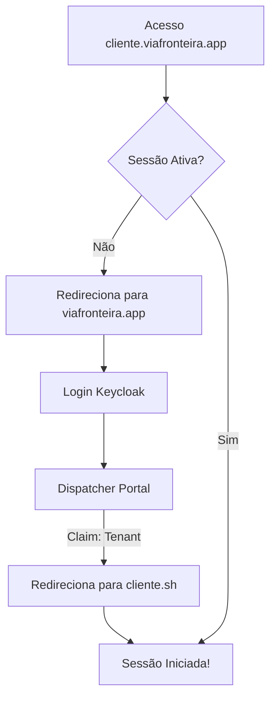

# ViaSuite Base Module

Este é o módulo fundamental do ecossistema **ViaSuite**. Ele deve ser instalado em **todos** os bancos de dados (tenants) para prover a base de autenticação, segurança e identidade visual.

## Funcionalidades Principais

*   **Autenticação SSO com Keycloak**: Integração nativa de login único via OAuth2/Implicit Flow.
*   **Validação de Tenant**: Garante segurança ao validar se o usuário autenticado via Keycloak realmente pertence ao banco de dados que está tentando acessar (através do claim `tenant`).
*   **Redirecionamento Centralizado**: Usuários não autenticados que acessam um subdomínio de tenant são redirecionados automaticamente para o portal central (`viafronteira.app`) para processamento de login.
*   **Bypass de Administrador/Suporte**: Suporte a acessos transversais. Usuários com roles `via-suite-administrator` ou `via-support` no Keycloak podem acessar qualquer tenant sem validação de vínculo específico.
*   **Branding ViaSuite (Odoo 19+)**: Interface de login totalmente customizada, removendo referências nativas e aplicando a identidade visual e logo da Via.
*   **UX de Erro Refinada**: Telas de erro específicas e amigáveis para cenários de:
    *   Tenant Mismatch (Ambiente incorreto)
    *   Usuário não cadastrado no Odoo
    *   Conta desativada
    *   Ambiente suspenso
*   **Suporte Multi-idioma**: Traduções completas para `pt_BR`, `es_PY`, `en_US`, `ar_SA`, `zh_CN`.

## Variáveis de Ambiente (Configuração)

O módulo é configurado dinamicamente via variáveis de ambiente, facilitando o deploy em Kubernetes.

### Integração Keycloak
| Variável | Descrição | Exemplo |
| :--- | :--- | :--- |
| `VIA_KEYCLOAK_BASE_URL` | URL base do servidor Keycloak | `https://auth.viafronteira.com` |
| `VIA_KEYCLOAK_REALM` | Realm utilizado no Keycloak | `via-suite` |
| `VIA_KEYCLOAK_CLIENT_ID` | Client ID registrado no Keycloak | `viasuite-odoo` |
| `VIA_KEYCLOAK_CLIENT_SECRET` | Client Secret do Keycloak | `******` |
| `VIA_KEYCLOAK_ENABLED` | Ativa/Desativa o SSO (Default: true) | `true` |

### Orquestração e Domínio
| Variável | Descrição | Exemplo |
| :--- | :--- | :--- |
| `VIA_SUITE_GLOBAL_DOMAIN` | Domínio raiz para redirecionamentos e dispatcher | `viafronteira.app` |

## Arquitetura de Login



## Como Instalar (Novo Tenant)

Para inicializar um novo tenant manualmente via linha de comando:

```bash
python3 odoo-bin -c odoo.conf \
  -d nome_do_cliente \
  --without-demo=True \
  -i via_suite_base \
  --stop-after-init
```

---
© 2026 ViaFronteira, LLC.