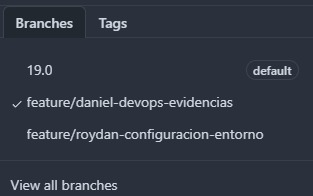
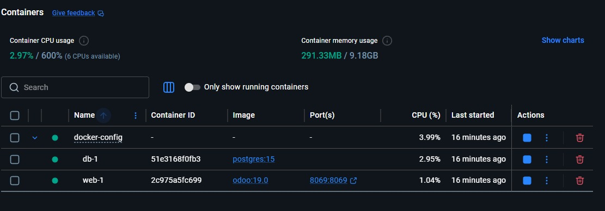
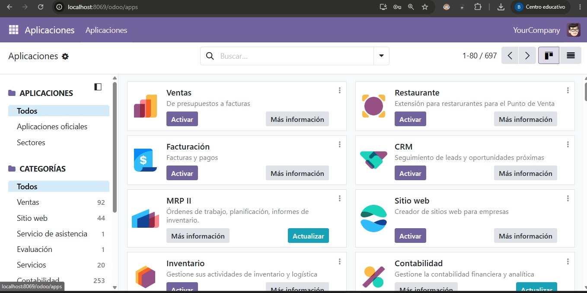
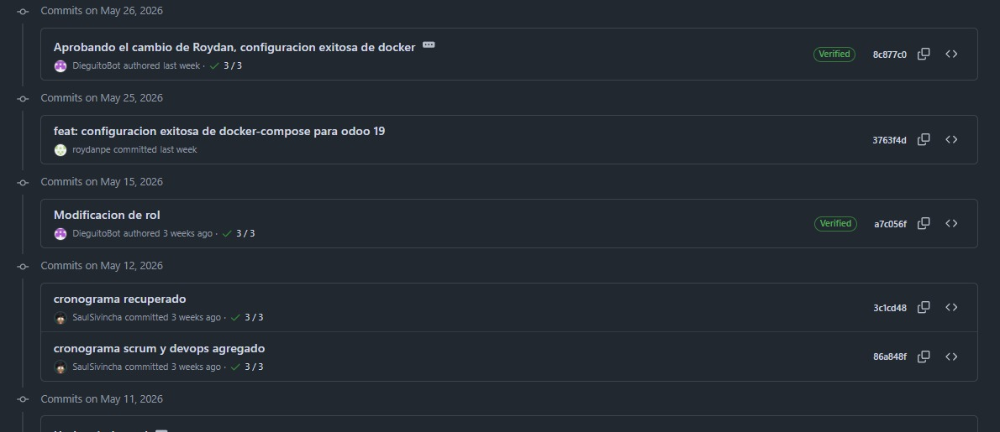

# Evidencias Sprint 1 — Integración DevOps (Daniel)

---

## 1. Configuración de Ramas de Trabajo

**Objetivo:** Verificar que cada integrante trabaja en su propia rama separada de la rama principal `19.0`.

**Ramas creadas en el repositorio:**
- `19.0` — rama principal (protegida)
- `feature/roydan-configuracion-entorno` — Persona 2 (Roydan)
- `feature/daniel-devops-evidencias` — Persona 5 (Daniel)

**Evidencia:**


---

## 2. Levantamiento del Entorno con Docker

**Objetivo:** Verificar que Odoo 19 y PostgreSQL 15 corren correctamente mediante Docker Compose en Windows.

**Comando ejecutado:**
```bash
docker compose up -d
```

**Resultado:** Contenedores `docker-config-db-1` y `docker-config-web-1` en estado **Started**.

**Evidencia:**


---

## 3. Verificación de Odoo en el Navegador

**Objetivo:** Confirmar acceso al sistema ERP desde el navegador local.

**URL accedida:** `http://localhost:8069`

**Base de datos creada:** `odoo_ventas`

**Evidencia:**


---

## 4. Registro de Commits del Equipo

**Objetivo:** Documentar la actividad de cada integrante en GitHub.

**Evidencia:**


---

## 5. Conclusión

El entorno fue levantado exitosamente en Windows usando Docker Desktop, verificando compatibilidad multiplataforma respecto al entorno Linux usado por el resto del equipo. Las ramas de trabajo están correctamente configuradas siguiendo la convención `feature/nombre-tarea`.