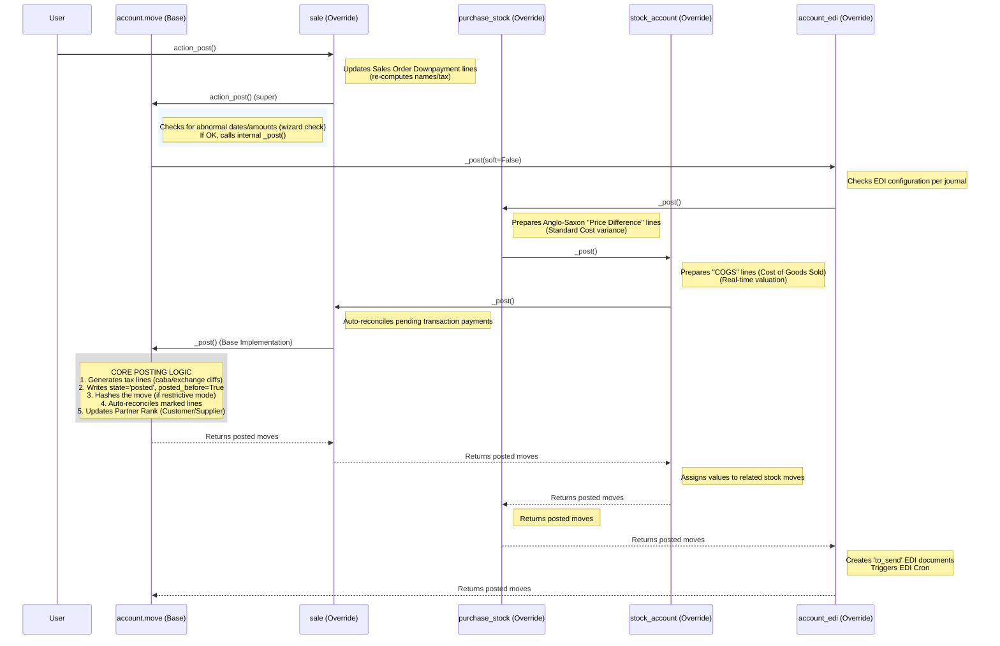

# Invoice Posting Flow (`account.move`)

This document traces the technical flow of **posting an Invoice** or **Vendor Bill** in Odoo 19.0. It specifically analyzes the `action_post` method on the `account.move` model, highlighting how multiple modules extend this core transactional event.

## 1. Flow Overview [📘 Ref: Odoo Accounting](https://www.odoo.com/documentation/19.0/applications/finance/accounting.html)

The "Post" action is the pivotal moment in Odoo accounting where a Draft entry becomes a Posted entry, generating immutable Journal Items, tax records, and potentially triggering stock valuation or EDI transmissions.

### Key Trigger
*   **Method**: `action_post()`
*   **Model**: `account.move`
*   **Trigger**: UI Button "Confirm" (Invoice) or "Post" (Journal Entry).

## 2. Sequence Diagram

This diagram visualizes the propagation of the `_post()` call through the module dependency chain (MRO).

## 3. Key Methods & Modules

### Core Method: `action_post`
**Defined in**: [`../addons/account/models/account_move.py`](../addons/account/models/account_move.py)

This is the public entry point. It performs validation checks (like "Abnormal Amount" warnings) before delegating to the internal `_post` method.

### The `_post` Chain (Method Call Stack)

Odoo uses Python's `super()` (Method Resolution Order) to chain validation and logic.

| Module | File | Responsibility |
| :--- | :--- | :--- |
| **`l10n_xx_edi`** | *Various* (e.g., `l10n_it_edi`, `l10n_es_edi_tbai`) | **Localization-Specific**: Many localization modules override `_post` to trigger government-specific reporting (e.g., sending FatturaPA in Italy, TicketBAI in Spain). |
| **`account_edi`** | [`addons/account_edi/models/account_move.py`](../addons/account_edi/models/account_move.py) | **Top Layer**: Generates `account.edi.document` records (e.g., e-invoicing XMLs) and triggers their transmission cron. |
| **`purchase_stock`** | [`addons/purchase_stock/models/account_invoice.py`](../addons/purchase_stock/models/account_invoice.py) | **Valuation**: For Vendor Bills, computes **Price Difference** entries (Anglosaxon Accounting) if the PO price differs from the Standard Cost. |
| **`stock_account`** | [`addons/stock_account/models/account_move.py`](../addons/stock_account/models/account_move.py) | **Valuation**: For Customer Invoices, computes **COGS** (Cost of Goods Sold) entries (Expense vs. Stock Output) for "Real-Time" valuation products. |
| **`sale`** | [`addons/sale/models/account_move.py`](../addons/sale/models/account_move.py) | **Automation**: Auto-reconciles the invoice if a payment transaction (e.g., Stripe/PayPal) is already linked to the Sales Order. |
| **`account`** | [`addons/account/models/account_move.py`](../addons/account/models/account_move.py) | **Base Logic**:  1. Fixes/Generates Tax lines. 2. Sets `state='posted'`. 3. Computes hashes (audit log). 4. Reconciles Reverse entries. |

## 4. Extension Points (Hooks)

If you are developing a custom module, these are the standard places to inject logic:

*   **To validate data before posting**: Override `action_post` before calling super.
*   **To add extra Journal Items (JLs)**: Override `_post`. Create your lines (e.g., `self.env['account.move.line'].create(...)`) **before** calling `super()._post()`.
    *   *Reference*: See `stock_account` implementation of `_stock_account_prepare_realtime_out_lines_vals` or `purchase_stock`.
*   **To trigger actions after posting**: Override `_post` and add logic **after** calling `super()._post()`.
    *   *Reference*: See `account_edi` triggering the cron job.

