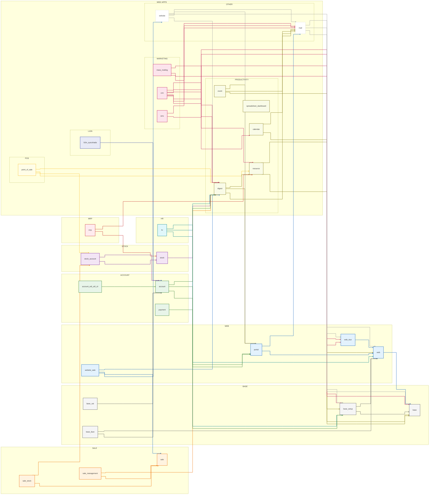

# Module Dependency Analysis

## Top 30 Modules with Most Dependents

| Module | Dependents |
|---|---|
| [`account`](../addons/account) | 149 |
| [`base`](../../addons/base) | 44 |
| [`mail`](../addons/mail) | 43 |
| [`account_edi_ubl_cii`](../addons/account_edi_ubl_cii) | 42 |
| [`base_vat`](../addons/base_vat) | 40 |
| [`web`](../addons/web) | 37 |
| [`point_of_sale`](../addons/point_of_sale) | 36 |
| [`base_iban`](../addons/base_iban) | 25 |
| [`payment`](../addons/payment) | 21 |
| [`sale`](../addons/sale) | 21 |
| [`website`](../addons/website) | 20 |
| [`base_setup`](../addons/base_setup) | 19 |
| [`hr`](../addons/hr) | 18 |
| [`portal`](../addons/portal) | 17 |
| [`sms`](../addons/sms) | 17 |
| [`l10n_syscohada`](../addons/l10n_syscohada) | 17 |
| [`website_sale`](../addons/website_sale) | 16 |
| [`crm`](../addons/crm) | 15 |
| [`digest`](../addons/digest) | 13 |
| [`spreadsheet_dashboard`](../addons/spreadsheet_dashboard) | 13 |
| [`mass_mailing`](../addons/mass_mailing) | 13 |
| [`stock`](../addons/stock) | 11 |
| [`web_tour`](../addons/web_tour) | 10 |
| [`stock_account`](../addons/stock_account) | 10 |
| [`sale_stock`](../addons/sale_stock) | 10 |
| [`mrp`](../addons/mrp) | 10 |
| [`resource`](../addons/resource) | 9 |
| [`calendar`](../addons/calendar) | 9 |
| [`event`](../addons/event) | 9 |
| [`sale_management`](../addons/sale_management) | 9 |

## Likely Base Layers
Modules with many dependents but few dependencies (<= 3).

| Module | Dependents | Dependencies |
|---|---|---|
| [`base`](../../addons/base) | 44 | None |
| [`account_edi_ubl_cii`](../addons/account_edi_ubl_cii) | 42 | [`account`](../addons/account) |
| [`base_vat`](../addons/base_vat) | 40 | [`account`](../addons/account) |
| [`web`](../addons/web) | 37 | [`base`](../../addons/base) |
| [`base_iban`](../addons/base_iban) | 25 | [`account`](../addons/account), [`web`](../addons/web) |
| [`payment`](../addons/payment) | 21 | [`onboarding`](../addons/onboarding), [`portal`](../addons/portal) |
| [`sale`](../addons/sale) | 21 | [`sales_team`](../addons/sales_team), [`account_payment`](../addons/account_payment), [`utm`](../addons/utm) |
| [`base_setup`](../addons/base_setup) | 19 | [`base`](../../addons/base), [`web`](../addons/web) |
| [`l10n_syscohada`](../addons/l10n_syscohada) | 17 | [`account`](../addons/account) |
| [`digest`](../addons/digest) | 13 | [`mail`](../addons/mail), [`portal`](../addons/portal), [`resource`](../addons/resource) |
| [`spreadsheet_dashboard`](../addons/spreadsheet_dashboard) | 13 | [`spreadsheet`](../addons/spreadsheet) |
| [`stock`](../addons/stock) | 11 | [`product`](../addons/product), [`barcodes_gs1_nomenclature`](../addons/barcodes_gs1_nomenclature), [`digest`](../addons/digest) |
| [`web_tour`](../addons/web_tour) | 10 | [`web`](../addons/web) |
| [`stock_account`](../addons/stock_account) | 10 | [`stock`](../addons/stock), [`account`](../addons/account) |
| [`sale_stock`](../addons/sale_stock) | 10 | [`sale`](../addons/sale), [`stock_account`](../addons/stock_account) |
| [`mrp`](../addons/mrp) | 10 | [`product`](../addons/product), [`stock`](../addons/stock), [`resource`](../addons/resource) |
| [`resource`](../addons/resource) | 9 | [`base`](../../addons/base), [`web`](../addons/web) |
| [`calendar`](../addons/calendar) | 9 | [`base`](../../addons/base), [`mail`](../addons/mail) |
| [`sale_management`](../addons/sale_management) | 9 | [`sale`](../addons/sale), [`digest`](../addons/digest) |
| [`utm`](../addons/utm) | 8 | [`base`](../../addons/base), [`web`](../addons/web) |
| [`hr_holidays`](../addons/hr_holidays) | 8 | [`hr`](../addons/hr), [`calendar`](../addons/calendar), [`resource`](../addons/resource) |
| [`html_editor`](../addons/html_editor) | 8 | [`base`](../../addons/base), [`bus`](../addons/bus), [`web`](../addons/web) |
| [`l10n_gcc_invoice`](../addons/l10n_gcc_invoice) | 8 | [`account`](../addons/account) |
| [`l10n_din5008`](../addons/l10n_din5008) | 8 | [`account`](../addons/account) |
| [`account_debit_note`](../addons/account_debit_note) | 8 | [`account`](../addons/account) |
| [`contacts`](../addons/contacts) | 7 | [`base`](../../addons/base), [`mail`](../addons/mail) |
| [`iap_mail`](../addons/iap_mail) | 7 | [`iap`](../addons/iap), [`mail`](../addons/mail) |
| [`l10n_latam_base`](../addons/l10n_latam_base) | 7 | [`contacts`](../addons/contacts), [`base_vat`](../addons/base_vat) |
| [`pos_restaurant`](../addons/pos_restaurant) | 7 | [`point_of_sale`](../addons/point_of_sale) |
| [`purchase`](../addons/purchase) | 7 | [`account`](../addons/account) |
| [`purchase_stock`](../addons/purchase_stock) | 7 | [`stock_account`](../addons/stock_account), [`purchase`](../addons/purchase) |
| [`mass_mailing_sms`](../addons/mass_mailing_sms) | 7 | [`portal`](../addons/portal), [`mass_mailing`](../addons/mass_mailing), [`sms`](../addons/sms) |
| [`pos_self_order`](../addons/pos_self_order) | 7 | [`pos_restaurant`](../addons/pos_restaurant), [`http_routing`](../addons/http_routing), [`link_tracker`](../addons/link_tracker) |
| [`auth_signup`](../addons/auth_signup) | 6 | [`base_setup`](../addons/base_setup), [`mail`](../addons/mail), [`web`](../addons/web) |
| [`phone_validation`](../addons/phone_validation) | 6 | [`base`](../../addons/base), [`mail`](../addons/mail) |
| [`event_sale`](../addons/event_sale) | 6 | [`event_product`](../addons/event_product), [`sale_management`](../addons/sale_management) |

## Core Dependency Backbone (Mermaid)

