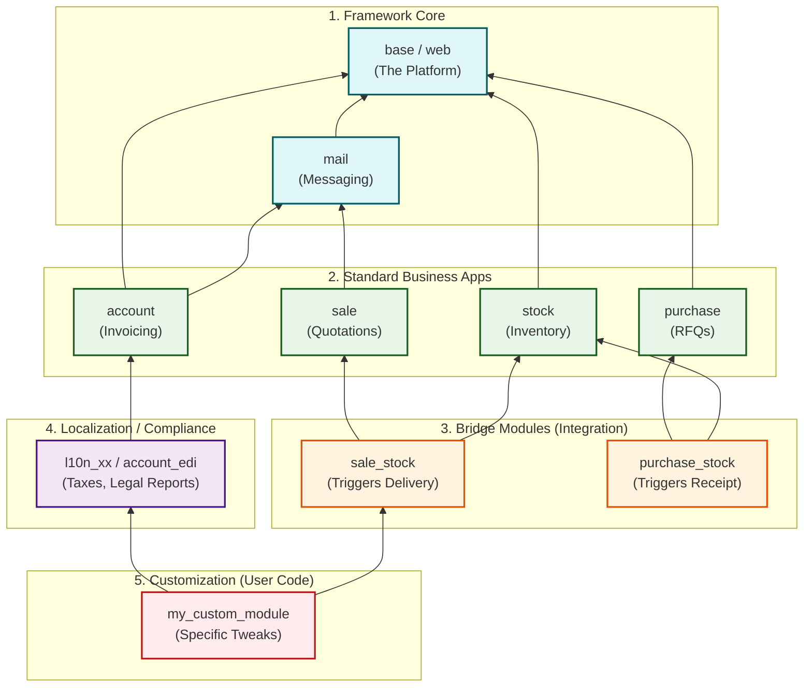

# Odoo Addons Layering Narrative

Odoo's modular architecture is designed like a layer cake. Every installation starts with a shared technical foundation and builds up to highly specific business logic. This layering is enforced by strictly defined **module dependencies** in the `__manifest__.py` file.

This document explains how Odoo loads modules in tiers, from the generic framework to country-specific localizations and finally custom overrides.

## The Layering Hierarchy

### 1. The Framework Core (Low-Level Plumbing)
At the bottom lies the Odoo Framework itself. These modules provide the technical engine but no business logic.
*   **Examples**: [`base`](../../addons/base) (ORM, Users, Views), [`web`](../addons/web) (The Javascript Web Client), [`mail`](../addons/mail) (Chatter & Activities).
*   **Role**: They define "How Odoo works" (Models, Fields, XML parsing).

### 2. Standard Business Apps (Departmental Logic)
On top of the framework, Odoo adds generic business concepts. These are the "Apps" you install.
*   **Examples**: [`sale`](../addons/sale), [`account`](../addons/account), [`stock`](../addons/stock), [`purchase`](../addons/purchase).
*   **Role**: They define "What Odoo does" (Orders, Invoices, Pickings). At this level, the logic is universally applicable globally (e.g., "An invoice has lines and a total").

### 3. The "Bridge" Layer (Integration)
Odoo is famous for being "integrated". This doesn't happen by magic; it happens via specific *Bridge Modules*.
*   **Examples**:
    *   [`sale_stock`](../addons/sale_stock): Connects Sales to Inventory. (Without this, confirming a Sales Order creates no Delivery Order).
    *   [`purchase_stock`](../addons/purchase_stock): Connects Purchase to Inventory.
    *   [`sale_management`](../addons/sale_management): Adds optional Sales features like Upselling.
*   **Role**: These modules are *auto-installed* when both dependencies are present. They contain the glue code (overriding `action_confirm` to trigger both apps).

### 4. Localization (L10n) & Enterprise
Business rules vary by country. The "Localization" layer adapts the generic apps to local laws.
*   **Examples**: [`l10n_us`](../addons/l10n_us), [`l10n_syscohada`](../addons/l10n_syscohada), [`account_edi`](../addons/account_edi).
*   **Role**: They install Chart of Accounts, Taxes, and legal Reports. They often override core methods (like `_post`) to enforce compliance (e.g., real-time government reporting).

### 5. Customization (The "Last Mile")
This is where your custom code lives.
*   **Examples**: `my_company_sales`, `manufacturing_connector`.
*   **Role**: Precise tweaks for a specific company's workflow. Because they depend on all layers below, they are loaded last, giving them the final say in any override.

---

## Visualizing the Load Order

Odoo loads the graph from the bottom up. When a module is loaded, its XML data changes the database, and its Python classes extend the Registry.

## How Overrides Work (`_inherit`)
Because of this strict ordering:
1.  **Python**: When `my_custom_module` overrides `def action_confirm`, it is placed at the end of the [MRO (Method Resolution Order)](odoo_inheritance_patterns.md). Calling `super()` calls the layer immediately below (e.g., `l10n` or `sale_stock`).
2.  **XML Views**: When `my_custom_module` inherits a view (`inherit_id="sale.view_order_form"`), its changes (XPath) are applied *after* all underlying modules have rendered their view. This ensures your custom button always appears, regardless of what the base modules did.
