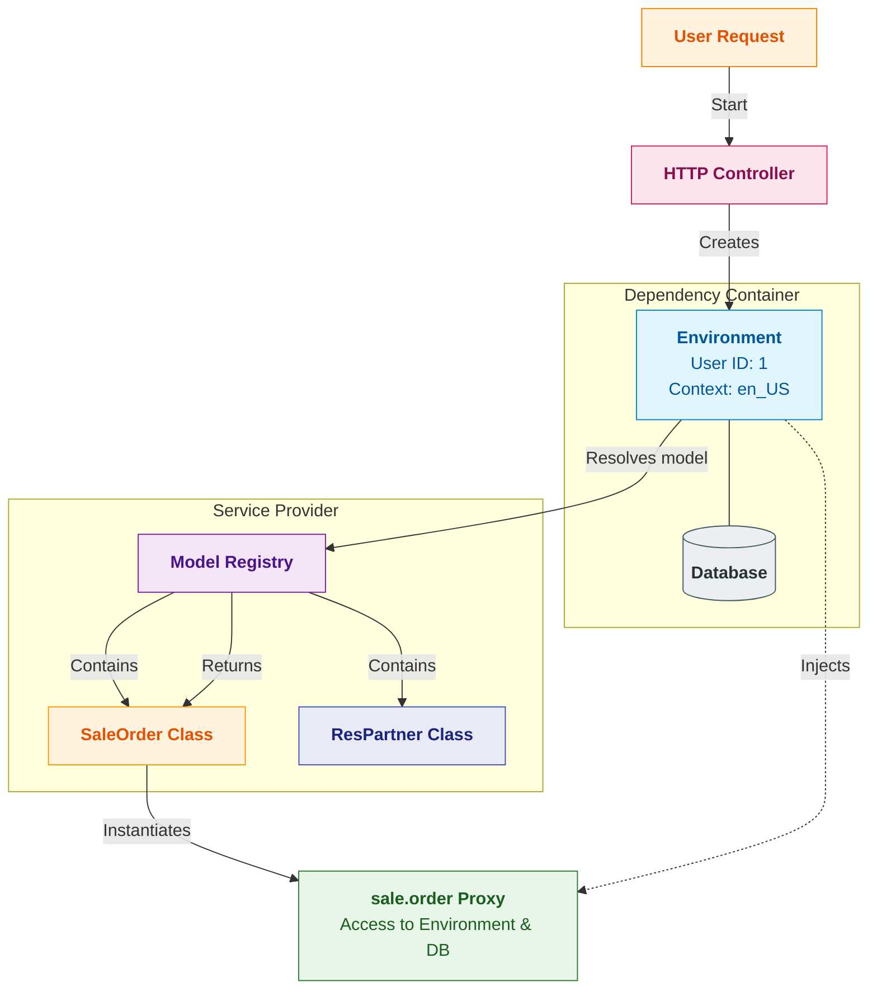
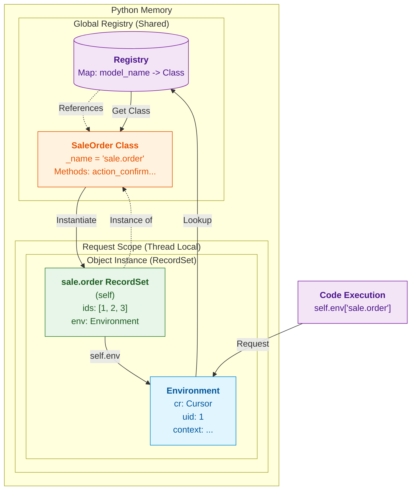

# Odoo Dependency Injection: Environment & Registry

In Odoo, **Dependency Injection (DI)** is implemented through the `Environment` (`self.env`) and the **Model Registry**. Instead of manually passing database cursors, user IDs, or configuration to every method, Odoo bundles these into a single context object—the `Environment`—which acts as both a **Service Locator** and a **Dependency Container**.

## 1. The Environment (`env`)
**File:** [`../../orm/environments.py`](../../orm/environments.py)

The `Environment` is immutable (mostly) and accompanies every recordset. It creates a scope for interaction with the database.

*   **`env.cr`**: The **Database Cursor**. All queries run through this, ensuring transactional integrity.
*   **`env.uid`**: The **User ID**. Used for access control (ACLs, Record Rules).
*   **`env.su`**: **Superuser Flag** (Boolean). If `True`, ACLs and Record Rules are bypassed (similar to `sudo()` in Linux).
*   **`env.context`**: A dictionary of arbitrary metadata (e.g., `lang='fr_FR'`, `tz='UTC'`). This influences how fields are read (translation) or how business logic behaves.
*   **`env.user`**: The actual `res.users` record for the current user. It is **lazy loaded** and allows access to user preferences properties.
*   **`env.company`** / **`env.companies`**: The active company and allowed companies for the current request context.

## 2. The Model Registry
**File:** [`../../orm/registry.py`](../../orm/registry.py)

The `Registry` is a singleton (per database) that holds the definitions of all model **Classes** (e.g., `SaleOrder`, `ResPartner`). It maps model names (strings like `"sale.order"`) to Python classes.

## 3. The "Injection" Mechanism (Model Resolution)

When you write `self.env['sale.order']`, the following happens:
1.  **Lookup**: The environment looks up `"sale.order"` in the **Registry**.
2.  **Binding**: The Registry returns the **Model Class**.
3.  **Instantiation (Injection)**: The Environment instantiates this class, **injecting itself (`self`)** into the new instance.

This is why `self.env['sale.order']` is not just a class; it is an *empty recordset* bound to the current environment. Any method called on it has immediate access to `self.env.cr` and `self.env.uid`.

### Code Reference
In [`../../orm/environments.py`](../../orm/environments.py):
```python
def __getitem__(self, model_name):
    """ Return an empty recordset from the given model. """
    return self.registry[model_name](self, (), ())
```
*   `self.registry[model_name]` gets the class.
*   `(...) (self, (), ())` calls the constructor, passing `self` (the environment).

## 4. Visual Overview: The Dependency Injection Flow

This diagram combines the request flow with the detailed interactions between the Environment, Database, and Model Registry.

### Key Steps in the Flow:
1.  **User Request**: Authentication happens, and the `HTTP_Controller` receives the call.
2.  **Environment Construction**: The controller initializes the `Environment`.
    *   It connects to the **Database** (`cr`).
    *   It sets the **User ID** (`uid: 1`) and **Context** (`lang=en_US`).
    *   This object (`env`) now acts as the *Dependency Container*.
3.  **Model Resolution**: When code asks for `self.env['sale.order']`, the environment queries the **Registry**.
4.  **Injection**: The Registry finds the `SaleOrder` class, and the Environment instantiates it, passing *itself* as a parameter structure. The result is a generic `Proxy` object bound to that specific request.



## 5. Detailed Internal Structure (RecordSet)

This diagram breaks down the **RecordSet** object, which is what `self` actually is in Odoo code. It clarifies the difference between the **Model Class** (static, in Registry) and the **RecordSet Instance** (dynamic, bound to Environment).
### Mental Model: Class vs. Instance
*   **Global Registry (Shared)**: This is "Python Memory". The class `SaleOrder` exists only once. It defines the methods (`def action_confirm`) and fields. It is thread-safe and stateless.
*   **Request Scope (Thread Local)**: This is "The Current Transaction".
    *   **Environment**: Holds the cursor `cr` and user `1`.
    *   **RecordSet (`self`)**: This is the object you actually work with. It is a lightweight wrapper that contains:
        *   A list of IDs (`[1, 2, 3]`).
        *   A reference to the **Environment**.
        *   A reference to the **Class**.

When you call `self.action_confirm()`, Python executes the method from the **Class**, but `self` provides the data (IDs) and the database connection (Env).



## 6. References
*   [Odoo 19.0 Developer Documentation: ORM / Environment](https://www.odoo.com/documentation/19.0/developer/reference/backend/orm.html#environment)
*   [Odoo 19.0 Developer Documentation: Registry (Internal)](https://github.com/../../blob/19.0/../modules/registry.py)