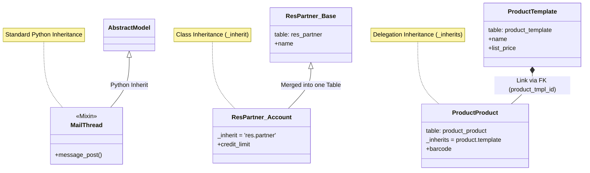

# Odoo Inheritance Patterns

Odoo provides three distinct inheritance mechanisms, each serving a specific architectural purpose. Understanding the difference between `_inherit` (Extension), `_inherits` (Delegation), and standard Python inheritance (Mixins) is crucial for modular development.

Official Documentation: [Chapter 12: Inheritance](https://www.odoo.com/documentation/19.0/developer/tutorials/server_framework_101/12_inheritance.html)

## 1. Class Inheritance (Extension)
*Also referred to as "Classical Python Inheritance" or "Model Extension" in official docs.*

**Key:** `_inherit = 'model.name'`
**Purpose:** Modify an existing model in place. Adding fields, overriding methods, or adding constraints to an existing table.
**Database Effect:** No new table. Columns are added to the existing table.

### Example: Extending Partners
In [`../addons/account/models/partner.py`](../addons/account/models/partner.py), the `account` module adds accounting fields to the standard `res.partner` model.

```python
class ResPartner(models.Model):
    _inherit = 'res.partner'

    # New columns added to 'res_partner' table
    credit_limit = fields.Float(string='Credit Limit')
```

## 2. Delegation Inheritance
**Key:** `_inherits = {'parent.model': 'field_id'}`
**Purpose:** "Is-a" relationship where the child model stores its own data in a separate table but "sees" all fields from the parent model transparently.
**Database Effect:** Separate table. A foreign key links to the parent table.

### Example: Product Variants
In [`../addons/product/models/product_product.py`](../addons/product/models/product_product.py), a specific Variant (`product.product`) delegates to a Template (`product.template`).

```python
class ProductProduct(models.Model):
    _name = 'product.product'
    _inherits = {'product.template': 'product_tmpl_id'}

    # 'product_product' table stores variant specifics
    # 'product_template' table stores shared data (name, type)
```

## 3. Mixin / Abstract Inheritance (Python)
**Key:** Inheriting from `models.AbstractModel` (or purely Python classes)
**Purpose:** Reusable behavior shared across many models. These are not meant to be instantiated directly.
**Database Effect:** No table for the mixin itself. Fields are copied into the child model's table.

### Example: Mail Thread
In [`../addons/mail/models/mail_thread.py`](../addons/mail/models/mail_thread.py), `MailThread` provides messaging capabilities.

```python
class MailThread(models.AbstractModel):
    _name = 'mail.thread'
    
    message_ids = fields.One2many(...)
```

## 4. Visual Comparison



## 5. Comparison Table

| Feature           | Class Extension (`_inherit`)   | Delegation (`_inherits`)       | Mixin (Python Class)   |
| :---------------- | :----------------------------- | :----------------------------- | :--------------------- |
| **Python Syntax** | `_inherit = 'cls'`             | `_inherits = {'parent': 'fk'}` | `class X(Parent):`     |
| **Database**      | Same Table (Modified)          | New Table (Linked)             | Fields copied to Child |
| **Model Name**    | Same (`_name` undefined)       | New Name (`_name` defined)     | New or Abstract        |
| **Use Case**      | Add fields/logic to core       | "Is-a" variants/interfaces     | Reusable features      |
| **Example**       | `res.partner` (Account)        | `product.product`              | `mail.thread`          |

## 6. Advanced Tips

### Method Overriding (`super()`)
When you inherit a model, you often want to modify a method (like `create` or `write`) without breaking its original behavior. Use `super()` to call the parent implementation.

**Example:**
```python
def create(self, vals):
    # Custom logic BEFORE creation
    vals['name'] = vals.get('name', 'New').upper()
    
    # Call parent implementation
    record = super(ResPartner, self).create(vals)
    
    # Custom logic AFTER creation
    return record
```

### Pro Tip: Safe Delete (`@api.ondelete`)
Instead of overriding `unlink()` directly (which can be risky during module uninstallation), use the `@api.ondelete` decorator.

```python
@api.ondelete(at_uninstall=False)
def _check_if_can_delete(self):
    if self.state not in ['new', 'cancel']:
        raise UserError("You cannot delete a record that is not new or cancelled!")
```

### Extending Selection Fields
To add a new option to an existing selection field (e.g., adding a status), use `selection_add`.

**Example:**
```python
state = fields.Selection(selection_add=[('refurbished', 'Refurbished')])
```

## 7. Glossary

*   **FK (Foreign Key)**: A database concept where a field in one table points to the ID of a record in another table (creating a link). Odoo handles this with `Many2one` fields.
*   **Mixin**: A helper class that provides features (like messaging or activities) to other models but doesn't exist as a standalone record itself.
*   **AbstractModel**: The technical Odoo class type used for Mixins. It has no database table.
*   **TransientModel**: A model used for temporary data (like "Wizards" or pop-up dialogs). Its data is automatically deleted after a short time.
