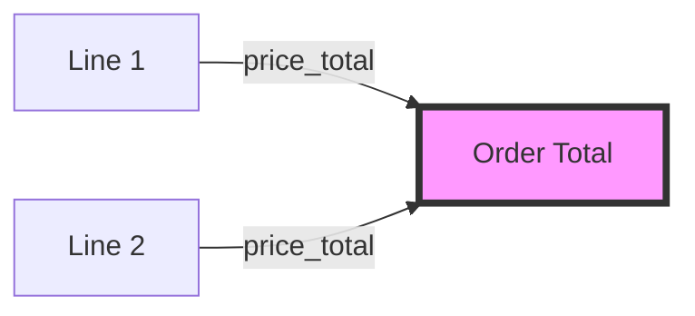
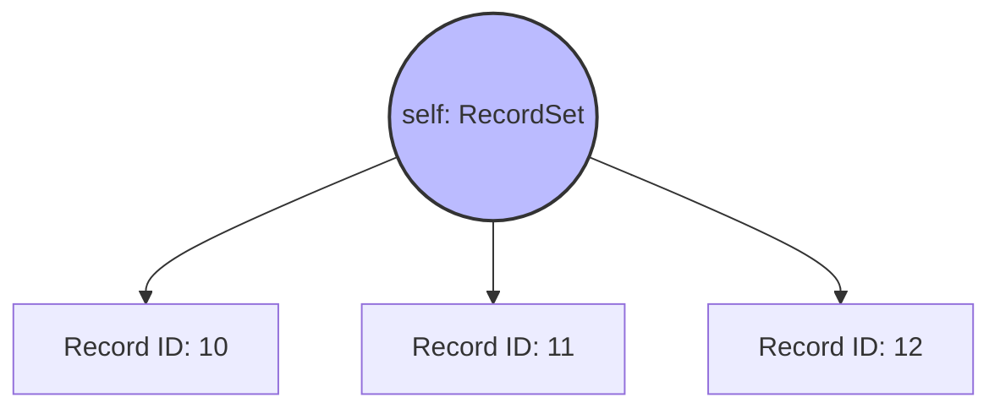
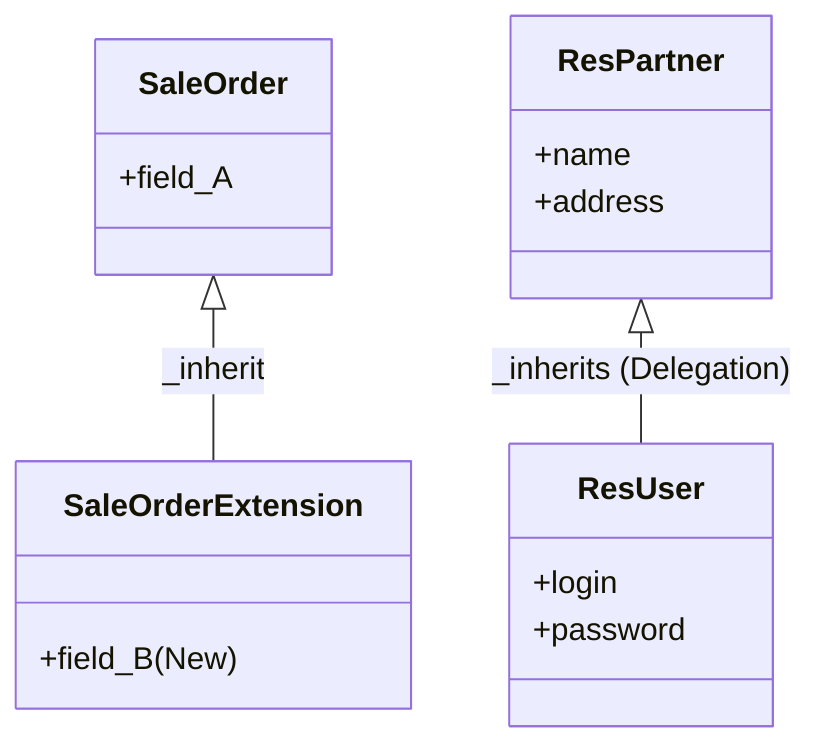
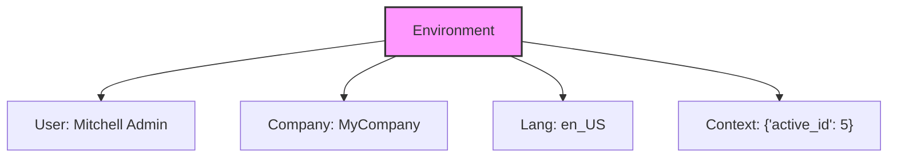

# Odoo ORM Architecture Deep Dive

The **Odoo ORM (Object-Relational Mapping)** is the heart of the framework. It abstracts database interactions, allowing you to work with Python objects (`RecordSets`) entirely, completely avoiding raw SQL.

## 1. Model Definition
Every Odoo model is a Python class inheriting from `models.Model`.

```python
from odoo import models, fields, api, Command

class SaleOrder(models.Model):
    _name = 'sale.order'               # Table name: sale_order
    _description = 'Sales Order'
    _inherit = ['mail.thread', 'mail.activity.mixin'] # Mixin inheritance
    _order = 'date_order desc, id desc' # Default sorting
    _rec_name = 'name'                 # Field used for record labels (default: name)
```

## 2. Fields API
### Basic Fields
```python
name = fields.Char(string='Order Reference', required=True, copy=False, readonly=True)
state = fields.Selection([
    ('draft', 'Quotation'),
    ('sale', 'Sales Order'),
    ('cancel', 'Cancelled'),
], string='Status', default='draft', tracking=True) # tracking=True logs changes in chatter
date_order = fields.Datetime(string='Order Date', default=fields.Datetime.now)
amount_total = fields.Monetary(string='Total', currency_field='currency_id')
active = fields.Boolean(default=True) # built-in archiving mechanism
note = fields.Html(string='Terms and Conditions')
attachment = fields.Binary(string='Attachment')
```

### Relational Fields
*   **Many2one**: Link to parent. Stores foreign key.
    ```python
    partner_id = fields.Many2one('res.partner', string='Customer', index=True)
    ```
*   **One2many**: Link to children. Virtual field (no column).
    ```python
    order_line = fields.One2many('sale.order.line', 'order_id', string='Order Lines')
    ```
*   **Many2many**: Bidirectional link. Creates a pivot table.
    ```python
    tag_ids = fields.Many2many('crm.tag', string='Tags')
    ```

### Advanced Field Options
*   `related='partner_id.country_id'`: Mirror a value from a related record (readonly by default).
*   `store=True`: Store a computed value in the database (mandatory for searching).
*   `index=True`: Add a DB index for faster searching.
*   `tracking=True`: Log value changes in the chatter (requires `mail.thread`).
*   `copy=False`: Do not copy this value when duplicating the record.

### Computed Fields
Fields calculated on the fly.
```python
@api.depends('order_line.price_total')
def _compute_amount_total(self):
    for order in self:
        order.amount_total = sum(order.order_line.mapped('price_total'))
```



## 3. The RecordSet (`self`)
In Odoo, the variable `self` is **always** a collection of records.
*   **Iteration**: `for record in self:` is standard practice.
*   **Singleton**: `self.ensure_one()` verifies `len(self) == 1`.
*   **Set Operations**: `records = recordsA | recordsB` (Union), `recordsA & recordsB` (Intersection).



## 4. Common Overrides
Methods often overridden to customize behavior.

### A. Default Values (`default_get`)
Compute dynamic default values based on context.
```python
@api.model
def default_get(self, fields):
    res = super().default_get(fields)
    res['note'] = "Default Terms: " + self.env.user.company_id.name
    return res
```

### B. Naming (`_compute_display_name`)
Customize how records are shown in Many2one dropdowns.
```python
# In Odoo 17+, override _compute_display_name instead of name_get
@api.depends('name', 'partner_id')
def _compute_display_name(self):
    for order in self:
        order.display_name = f"{order.name} - {order.partner_id.name}"
```

## 5. CRUD Operations
### A. Create
Create a new record. Returns the new record (singleton).
```python
new_order = self.env['sale.order'].create({
    'partner_id': 10,
    'order_line': [
        Command.create({'product_id': 5, 'qty': 1}), # New API
    ]
})
```

### B. Write
Update existing records. Returns `True`.
```python
self.write({'state': 'draft'})
```

### C. Search
Find records matching specific criteria.
```python
# Standard Search (Implicit AND)
# Logic: stat IS 'sale' AND user_id IS current user
orders = self.env['sale.order'].search([
    ('state', '=', 'sale'),
    ('user_id', '=', self.env.user.id)
])
```

### D. Unlink
Delete records.
```python
self.unlink()
```

## 6. Aggregation (`_read_group`)
Powerful analytics engine (SQL `GROUP BY`) for generating reports and dashboards.
Returns a list of tuples (not RecordSets).

```python
# Compute average amount by customer
data = self.env['sale.order']._read_group(
    domain=[('state', '=', 'sale')],
    groupby=['partner_id'],
    aggregates=['amount_total:avg']
)
# Result: [(partner_record, 150.0), (other_partner, 200.0)]
```

## 7. Relational Commands (`Command`)
Use the `Command` namespace for x2many fields. Avoid the legacy "(0, 0, ...)" tuples.

| method | Legacy Tuple | Description |
| :--- | :--- | :--- |
| `Command.create({values})` | `(0, 0, {values})` | Create a new record and link it. |
| `Command.update(id, {values})` | `(1, id, {values})` | Update values of an existing linked record. |
| `Command.delete(id)` | `(2, id)` | Remove link AND delete the record (durable). |
| `Command.unlink(id)` | `(3, id)` | Remove link only (orphans the record). |
| `Command.link(id)` | `(4, id)` | Add link to existing record. |
| `Command.clear()` | `(5, 0, 0)` | Unlink all records (orphans them). |
| `Command.set([ids])` | `(6, 0, [ids])` | Replace all links with this list of IDs. |

```python
# Example: Clear all lines and add two new ones
order.write({
    'order_line': [
        Command.clear(),
        Command.create({'product_id': 1, 'qty': 5}),
        Command.create({'product_id': 2, 'qty': 3}),
    ]
})
```

## 8. Decorators
*   `@api.depends(*fields)`: Triggers compute method when fields change.
*   `@api.onchange(*fields)`: UI-only! Updates form view when user types.
*   `@api.constrains(*fields)`: Validation hook. Raises error on save.
*   `@api.model`: Method that doesn't use `self` (static method).

## 9. Data Integrity (`_sql_constraints`)
Hard database constraints for uniqueness and checks. Prefer these over Python constraints for data consistency.
```python
_sql_constraints = [
    ('name_uniq', 'unique (name)', "The order reference must be unique!"),
    ('qty_positive', 'CHECK(amount_total >= 0)', "Total amount cannot be negative."),
]
```

## 10. Transient Models (Wizards)
Data that is temporarily stored in the database but automatically vacuumed. Used for Wizards and Reports.
```python
class SaleDelayWizard(models.TransientModel):
    _name = 'sale.delay.wizard'
    _description = 'Ask for delay reason'
    
    reason = fields.Char(required=True)
    
    def action_apply(self):
        # Logic to update the active_id
        order = self.env['sale.order'].browse(self.env.context.get('active_id'))
        order.write({'note': self.reason})
        return {'type': 'ir.actions.act_window_close'}
```

## 11. Inheritance Mechanisms
*   **Class Inheritance (`_inherit`)**: Extend an existing model (add fields/methods).
    ```python
    class SaleOrder(models.Model):
        _inherit = 'sale.order'
        new_field = fields.Char()
    ```
*   **Delegation Inheritance (`_inherits`)**: Store data in a separate table but view it as one.
    ```python
    class User(models.Model):
        _name = 'res.users'
        _inherits = {'res.partner': 'partner_id'}
    ```



## 12. The Environment (`self.env`)
The execution context that rides along with every RecordSet.
*   **User**: `self.env.user` (Current user record)
*   **Company**: `self.env.company` (Current company record)
*   **Language**: `self.env.lang` (Current language code, e.g., 'en_US')
*   **Context**: `self.env.context` (Immutable dictionary of metadata)



### Superuser Mode (`sudo()`)
Returns a new version of the RecordSet that bypasses **Record Rules** and **Access Rights**.
```python
# Read a record even if the current user doesn't have permission
secure_records = self.env['secret.model'].sudo().search([])
```

## 13. Context Manipulation
You cannot modify `self.env.context` directly. Use helpers to return *new* RecordSets with updated context.
*   `with_context(**kwargs)`: Add/Merge keys.
    ```python
    # Pass a flag to suppress automatic emails
    order.with_context(mail_create_nosubscribe=True).action_confirm()
    ```
*   `with_company(company)`: Switch active company (crucial for Multi-Company loops).

## 14. Advanced Traversal ("Pythonic" Odoo)
*   `mapped(path)`: Extract fields from a set. Returns List or RecordSet.
*   `filtered(func)`: Filter the set in Python (memory).
*   `sorted(key, reverse=False)`: Sort in memory.

## 15. Advanced Search Logic (Complex Domains)
> [!NOTE]
> **Last Resort**: For simple queries, use the standard list format shown in Section 5. Only use prefix operators (`|`, `!`) when you absolutely need OR/NOT logic that cannot be handled by Pythonic `filtered()`.

Odoo uses a prefix notation (Polish Notation) for database queries.
Operators: `&` (AND), `|` (OR), `!` (NOT).
**Implicit AND**: If no operator is specified, AND is assumed.

```python
# Logic: (partner_id = 10 AND state = 'sale') OR (user_id = 1)
[
    '|', 
    '&', ('partner_id', '=', 10), ('state', '=', 'sale'),
         ('user_id', '=', 1)
]
```

## 16. Best Practices (ORM vs SQL)
> [!WARNING]
> **Anti-Pattern**: Avoid `self.env.cr.execute()`.

Using Raw SQL bypasses:
1.  **Security**: Record Rules and Access Rights are ignored.
2.  **Cache**: The ORM cache is not updated, leading to data inconsistency.
3.  **Prefetching**: You lose the automatic optimization of `mapped`/`search`.
4.  **Constraints**: Python constraints (`@api.constrains`) are not triggered.

**Always use the ORM methods (`search`, `write`, `create`, `unlink`) to ensure data integrity and security.**

> [!TIP]
> **If you MUST use SQL**: Always call `self.flush_model()` before executing raw SQL to ensure the DB is up-to-date with the ORM cache.

---

## 17. Glossary

| Term | Definition |
| :--- | :--- |
| **RecordSet** | A collection of database records from the same Model. Can contain 0, 1, or N records. Behaves like a Python Set. |
| **Singleton** | A RecordSet containing exactly **one** record. Required for reading/writing fields. |
| **Environment (`env`)** | The context wrapper containing the implementation needed to interact with the DB (User, Company, Cursor). |
| **Context** | A frozen dictionary carrying metadata (e.g., `lang`, `timezone`, `active_id`). Passed during API calls. |
| **Domain** | A list of tuples defining a filter for records, using Polish Notation (e.g., `[('field', '=', 'value')]`). |
| **Mixin** | An abstract model (e.g., `mail.thread`) inherited by other models to provide features like messaging without a DB table of its own. |
| **Mapped** | A method to extract values or related records from a RecordSet. |
| **Filtered** | A method to filter a RecordSet in Python memory using a lambda function. |
| **TransientModel** | A model where records are automatically deleted after a short time. Used for Wizards. |
| **Aggregation** | Using `_read_group` to compute statistics (sum, avg) directly in the database. |
