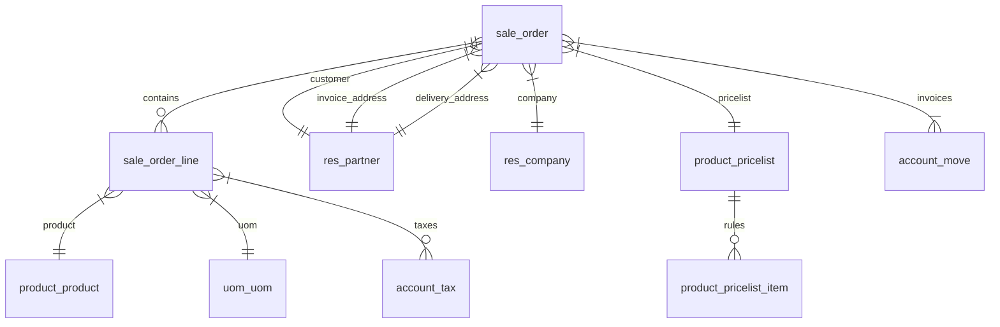
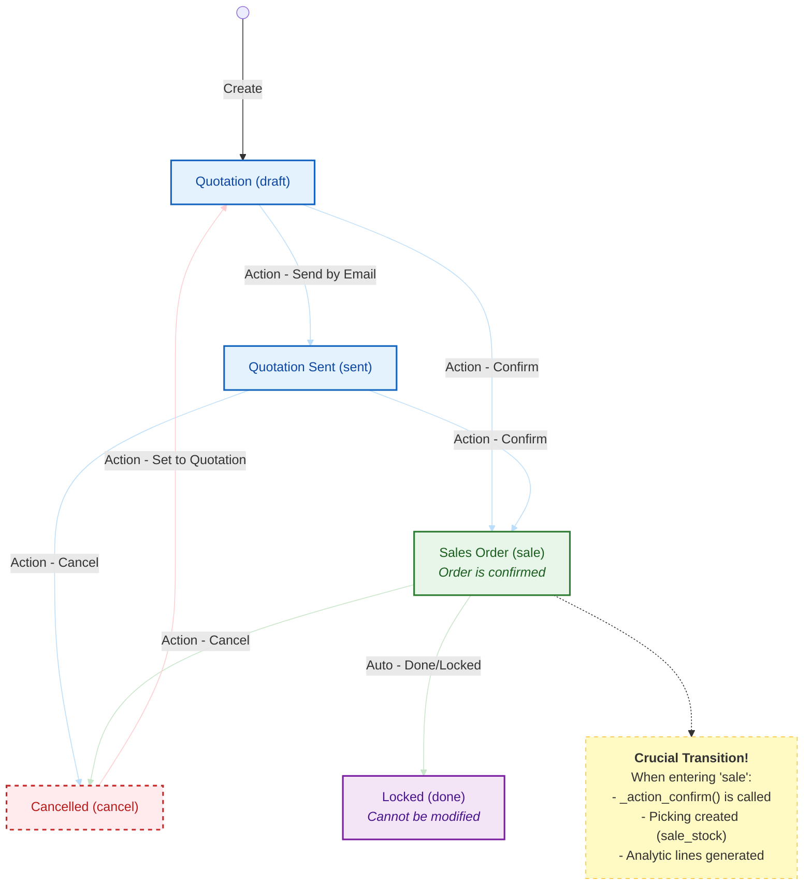
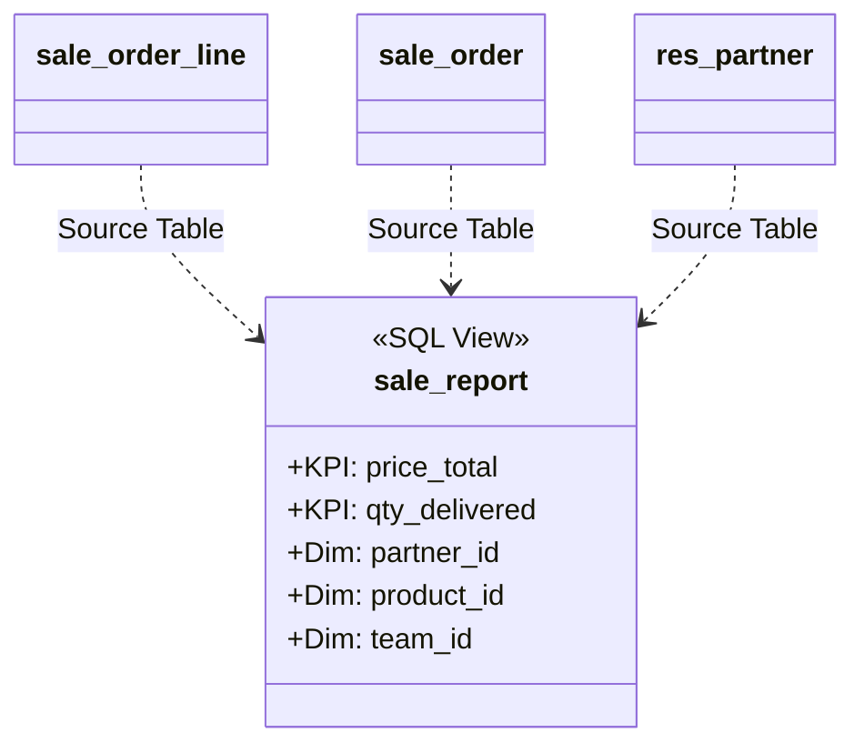

# Odoo Sales Module Architecture

This document provides a technical deep dive into the **Sales** module (`sale`), the core of Odoo's Order-to-Cash process.

## 1. Core Data Model (ERD)

The Sales module centers around the `sale.order` (Header) and `sale.order.line` (Lines).




### Key Models

*   **[`sale.order`](../addons/sale/models/sale_order.py)**: The tactical root. Manages status (`state`), partner references, and totals (`amount_total`, `tax_totals`).
*   **[`sale.order.line`](../addons/sale/models/sale_order_line.py)**: The itemization. complex logic for:
    *   **Pricing**: Computes `price_unit` from Pricelists.
    *   **Taxes**: Computes `tax_ids` based on Fiscal Positions.
    *   **Description**: Auto-generates descriptions based on product variants.
*   **[`product.pricelist`](../addons/product/models/product_pricelist.py)**: Engine for price rules (discounts, formulas) based on customer, quantity, and date.

---

## 2. Order Lifecycle (State Machine)

The `state` field on `sale.order` drives the process.



### Transition Logic
*   **Draft to Sale (`action_confirm`)**: This is the most critical method. It freezes the terms and triggers downstream flows (Inventory, Manufacturing, Projects).
*   **Invoice Status (`invoice_status`)**: Computed separately from `state`.
    *   `no`: Nothing to invoice.
    *   `to invoice`: Ready to be billed (based on Ordered or Delivered qty).
    *   `invoiced`: Fully billed.
    *   `upselling`: Delivered > Ordered (rare).

---

## 3. Pricing & Pricelist Logic

Pricing is calculated on the **Line** level (`sale.order.line`) but governed by the **Order's** Pricelist (`product.pricelist`).

### The Flow: `_compute_price_unit`

1.  **Trigger**: User selects a `product_id` and `product_uom_qty`.
2.  **Pricelist Lookup**: The system calls `pricelist_id._get_product_price_rule`.
3.  **Rule Application**:
    *   **Fixed Price**: Simple lookup.
    *   **Percentage**: Discount off standard price.
    *   **Formula**: `(Base Price - Discount) + Surcharge`.
4.  **Result**: `price_unit` is updated on the line.

**Key Definition:**
> The `price_unit` is always tax-exclusive in the database, even if the Pricelist is set to "Show Tax Included". Visual conversion happens at the UI level.

---

## 4. Key Computed Fields

| Model | Field | Description | Dependencies |
| :--- | :--- | :--- | :--- |
| `sale.order` | `amount_total` | Final total. | `order_line.price_total`, `currency_id` |
| `sale.order` | `invoice_status` | Are we ready to bill? | `state`, `order_line.invoice_status` |
| `sale.order` | `partner_shipping_id`| Where goods go. | `partner_id` |
| `sale.order.line` | `price_subtotal` | Line total w/o tax. | `price_unit`, `product_uom_qty`, `discount` |
| `sale.order.line` | `qty_delivered` | Qty shipped to date. | `stock.move` (via `sale_stock`), `analytic.line` |
| `sale.order.line` | `qty_to_invoice` | Qty ready for billing.| `product_uom_qty` (ordered policy) OR `qty_delivered` (delivered policy) |

---

## 5. Extension Points (Hooks)

The Sales module is designed to be extended. Common patterns:

### A. Adding Lines on Confirmation
Override `_action_confirm` to generate additional records when an order becomes official.
```python
def _action_confirm(self):
    res = super()._action_confirm()
    self._create_my_custom_records()
    return res
```

### B. Modifying Pricing
Extend `product.pricelist` or `sale.order.line._get_pricelist_price` to inject custom API-based pricing.

### C. Delivery Logic (`sale_stock`)
The `sale_stock` module bridges Sales and Inventory.

#### 1. Procurement Trigger
The method `_action_launch_stock_rule` in **[`sale.order`](../addons/sale_stock/models/sale_order.py)** is the entry point. It iterates over lines and triggers the **Procurement Engine** (**[`stock.rule`](../addons/stock/models/stock_rule.py)**):
*   It creates a `procurement.group` to link all generated moves to the SO.
*   It calls `stock.rule.run()`, which finds the appropriate rule (e.g., "Pull from Stock", "Buy", "Manufacture") based on the Product Route.

#### 2. Qty Delivered Computation
The field `qty_delivered` on **[`sale.order.line`](../addons/sale_stock/models/sale_order_line.py)** is a computed field with a complex dependency chain:
*   **Storable Products**: Computed from `stock.move` records linked to the line. It sums up moves in `state='done'` (outgoing - return).
*   **Service Products**: Computed from `account.analytic.line` (Timesheets) or manually set (Milestones).

### D. Invoicing Logic (`sale_management` / `account`)
Invoicing is driven by the `invoice_status` field (Up for Billing) and executed by the **Create Invoices** wizard (**[`sale.advance.payment.inv`](../addons/sale/wizard/sale_make_invoice_advance.py)**).

#### 1. Regular Invoicing
The wizard calls `_create_invoices(final=True)`.
*   It filters lines where `qty_to_invoice > 0`.
*   Groups lines by Partner/Currency to create `account.move` (Draft Invoice).

#### 2. Down Payments (Percentage/Fixed)
*   The wizard creates a special "Down Payment" service product line on the SO.
*   It immediately invoices this line for the specified amount.
*   Later, when "Regular Invoicing" occurs, the down payment amount is deducted (if "Deduct Down Payments" is selected), updating the `qty_invoiced` of the down payment line effectively "consuming" the credit.

---

## 6. Reporting Architecture (SQL Views)

Odoo's reporting engine relies on **SQL Views** to flatten complex data structures into a single, analyzable table.

### The "Data Warehouse" Pattern
The model **[`sale.report`](../addons/sale/report/sale_report.py)** is a read-only model (`_auto = False`) backed by a PostgreSQL View instead of a physical table.

1.  **Flattening**: It joins `sale.order.line`, `sale.order`, `res.partner`, `product.product`, and `product.template`.
2.  **Aggregation**: It pre-calculates totals (e.g., `price_total`, `qty_delivered`) to allow fast grouping in Pivot Tables.
3.  **Performance**: By offloading the Join logic to the Database via `init()` (or `_table_query`), Odoo avoids the "N+1 query" problem during analysis.



### Key Technical Implementation
The SQL view is constructed dynamically via string manipulation in Python:
*   `_select_sale()`: Defines columns.
*   `_from_sale()`: Defines Joins.
*   `_group_by_sale()`: Defines aggregation keys.

---

## 7. Glossary

| Term | Definition |
| :--- | :--- |
| **Quotation** | The draft/proposal stage of a Sales Order (`state='draft'`). Sent to customer for approval. |
| **Sales Order (SO)** | A confirmed contract to sell goods/services (`state='sale'`). Triggers delivery and billing. |
| **Partner** | The central entity (`res.partner`) representing Customers, Vendors, and Employees. |
| **Invoice Address** | The partner address where the **Bill/Invoice** is sent. Can be different from the Customer. |
| **Delivery Address** | The partner address where the **Goods** are shipped. Can be different from the Invoice Address. |
| **Account Move** | The technical name for an **Invoice** or **Journal Entry** (`account.move`). |
| **Product Variant** | A specific version of a product (e.g., "T-Shirt Size M, Red") stored in `product.product`. |
| **UoM (Unit of Measure)** | The unit used to handle the product (e.g., "Dozen", "kg"). Prices are per UoM. |
| **Tax** | Government charges (`account.tax`) applied to the line amount (e.g., VAT, GST, Sales Tax). |
| **Company** | The internal legal entity (`res.company`) issuing the order. Odoo supports Multi-Company environments. |
| **Lead Time** | The delay (in days) between order confirmation and expected delivery. |
| **Pricelist** | A collection of rules (discounts, formulas) determining the `price_unit` for a specific customer or currency. |
| **Fiscal Position** | Logic that maps taxes and accounts (e.g., swapping "21% Tax" for "0% Export Tax") based on customer location. |
| **Procurement** | The internal request to "get" a product. Triggers rules to either Buy, Manufacture, or Pull from Stock. |
| **Route** | A path a product takes (e.g., "Buy", "Make To Order"). Configured on the Product or Category. |
| **MTO (Make to Order)** | A route where a Sales Order directly triggers a Purchase Order or Manufacturing Order, bypassing stock. |
| **Incoterm** | Standardized international commercial terms (e.g., FOB, EXW) defining delivery responsibilities. |
| **Analytic Account** | A parallel accounting dimension used for tracking costs/revenues by project, department, or contract (Cost Accounting). |
| **Down Payment** | A classic deposit. In Odoo, handled as a service product that is invoiced immediately and deducted later. |
| **Locked State** | A state (`done`) where the Sales Order cannot be modified by ordinary users, preserving the audit trail. |
