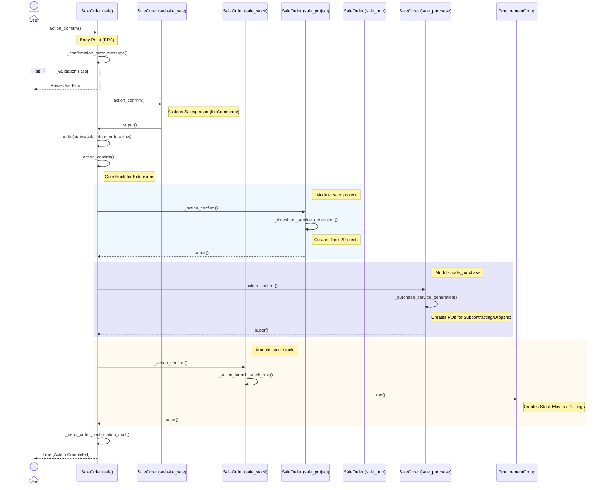

# Sales Order Confirmation Flow

## 1. Sequence Diagram
This diagram traces the execution path when a user clicks "Confirm" on a Sales Order.

## 2. Behind the Scenes: The "Super" Chain [📘 Ref: Inheritance](https://www.odoo.com/documentation/19.0/developer/tutorials/server_framework_101/12_inheritance.html)

You might wonder how Odoo calls logic from `sale_stock`, `sale_project`, and `sale_purchase` all at once without explicitly listing them.

This works through **Python's Method Resolution Order (MRO)**, essentially a "Chain of Responsibility".
1.  All these modules inherit from `sale.order`.
2.  Each module defines `def _action_confirm(self):`.
3.  Inside, they do their specific work (e.g., create a task) and then call `super()._action_confirm()`.
4.  Odoo chains them together. When `sale.order` calls `self._action_confirm()`, it triggers the first module in the chain (e.g., `sale_stock`), which calls the next (`sale_project`), and so on.

## 3. Deep Dive: What Actually Happens?

### A. Stock Logic (`sale_stock`)
**Goal**: Move physical goods.
*   **Trigger**: `_action_launch_stock_rule()`
*   **Process**:
    1.  Odoo looks at each Sales Order Line.
    2.  It checks the **Route** on the product (e.g., "Deliver from Stock", "Dropship").
    3.  It runs **Procurement Rules** associated with that route.
    4.  **Result**: If the rule is "Pull from Stock", it creates a `stock.picking` (Delivery Order). If the rule is "Buy", it might trigger a Purchase Request.

### B. Project Logic (`sale_project`)
**Goal**: Manage service delivery.
*   **Trigger**: `_timesheet_service_generation()`
*   **Process**:
    1.  Odoo filters for lines with **Service** products.
    2.  It checks the **Service Tracking** setting on the Product form:
        *   *Create a Task in an existing Project*: Adds a task to the project linked in the SO.
        *   *Create a Task in a new Project*: Creates a brand new Project and adds the task.
        *   *Create a new Project but no Task*: Pure project management.
    3.  **Result**: A link is created between the SO Line and the generated Task/Project.

### C. Purchase Logic (`sale_purchase`)
**Goal**: Outsource work or buy goods to fulfill the order.
*   **Trigger**: `_purchase_service_generation()`
*   **Process**:
    1.  Used primarily for **Subcontracting** or **Dropshipping**.
    2.  If a product is configured to be "Expensed" or "Subcontracted", this generates a Request for Quotation (RFQ) to the vendor.

## 4. Key Methods Summary [📘 Ref: Models](https://www.odoo.com/documentation/19.0/developer/tutorials/server_framework_101/03_basicmodel.html)

| Method | Defined In | Purpose |
| :--- | :--- | :--- |
| `action_confirm()` | [`addons/sale`](../addons/sale) | **Public Entry Point**. Validates state, locks order, sends email. |
| `_action_confirm()` | [`addons/sale`](../addons/sale) | **The Hook**. Empty in base, but extended by everyone else. |
| `_action_launch_stock_rule()` | [`addons/sale_stock`](../addons/sale_stock) | Runs procurement rules to create_Delivery Orders. |
| `_timesheet_service_generation()` | [`addons/sale_project`](../addons/sale_project) | Creates Tasks/Projects for service products. |

